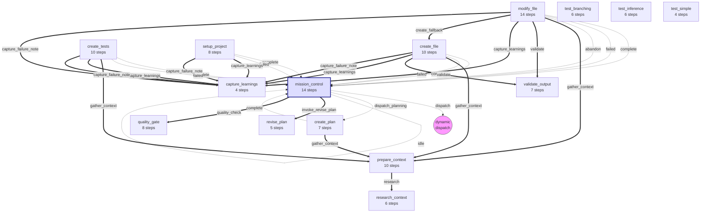

# Ouroboros Flow Diagrams

## System View

```mermaid
flowchart TD
    %% Ouroboros — Cross-Flow System View

    capture_learnings["capture_learnings\n4 steps"]
    create_file["create_file\n10 steps"]
    create_plan["create_plan\n7 steps"]
    create_tests["create_tests\n10 steps"]
    mission_control["mission_control\n14 steps"]
    modify_file["modify_file\n14 steps"]
    prepare_context["prepare_context\n10 steps"]
    quality_gate["quality_gate\n8 steps"]
    research_context["research_context\n6 steps"]
    revise_plan["revise_plan\n5 steps"]
    setup_project["setup_project\n8 steps"]
    test_branching["test_branching\n6 steps"]
    test_inference["test_inference\n6 steps"]
    test_simple["test_simple\n4 steps"]
    validate_output["validate_output\n7 steps"]

    %% Tail-call edges
    create_file -.->|complete| mission_control
    create_file -.->|failed| mission_control
    create_plan -.->|complete| mission_control
    create_tests -.->|complete| mission_control
    create_tests -.->|failed| mission_control
    dynamic_dispatch(("dynamic\ndispatch"))
    style dynamic_dispatch fill:#f9f,stroke:#333
    mission_control -.->|dispatch| dynamic_dispatch
    mission_control -.->|dispatch_planning| create_plan
    mission_control -.->|idle| mission_control
    modify_file -.->|complete| mission_control
    modify_file -.->|failed| mission_control
    modify_file -.->|abandon| mission_control
    setup_project -.->|complete| mission_control
    setup_project -.->|failed| mission_control

    %% Sub-flow invocation edges
    create_file ==>|gather_context| prepare_context
    create_file ==>|validate| validate_output
    create_file ==>|capture_learnings| capture_learnings
    create_file ==>|capture_failure_note| capture_learnings
    create_plan ==>|gather_context| prepare_context
    create_tests ==>|gather_context| prepare_context
    create_tests ==>|capture_learnings| capture_learnings
    create_tests ==>|capture_failure_note| capture_learnings
    mission_control ==>|invoke_revise_plan| revise_plan
    mission_control ==>|quality_check| quality_gate
    modify_file ==>|gather_context| prepare_context
    modify_file ==>|validate| validate_output
    modify_file ==>|capture_learnings| capture_learnings
    modify_file ==>|create_fallback| create_file
    modify_file ==>|capture_failure_note| capture_learnings
    prepare_context ==>|research| research_context
    setup_project ==>|capture_learnings| capture_learnings
    setup_project ==>|capture_failure_note| capture_learnings

    style mission_control fill:#ddf,stroke:#339,stroke-width:3px
```
