# Ouroboros Blueprint

Generated: 2026-03-23T16:59:28.376581+00:00
Source Hash: `799a06d52935…`
Flows: **27** | Actions: **57** | Context Keys: **101**

## Legend

### Data Flow Symbols
| Symbol | Name | Meaning |
|--------|------|---------|
| ○ | Required Input | Data the flow cannot execute without |
| ◑ | Optional Input | Data that enriches but isn't required |
| ● | Published Output | Context key added to accumulator |
| ◆ | Terminal Status | Terminal outcome of a flow |

### Step Type Symbols
| Symbol | Name | Meaning |
|--------|------|---------|
| ▷ | Inference Step | Step that invokes LLM inference |
| □ | Action Step | Generic computation (registered callable) |
| ↳ | Sub-flow Invocation | Delegates to a child flow |
| ⟲ | Tail-call | Continues execution in another flow |
| ∅ | Noop Step | Pass-through for routing logic only |

### Resolver Symbols
| Symbol | Name | Meaning |
|--------|------|---------|
| ⑂ | Rule Resolver | Deterministic condition evaluation, no inference cost |
| ☰ | LLM Menu Resolver | Constrained LLM choice, one inference call |

### Effect & System Symbols
| Symbol | Name | Meaning |
|--------|------|---------|
| 𓉗 | File System | File read/write operations |
| 𓇴→ | Persistence Write | Save to persistent state |
| →𓇴 | Persistence Read | Load from persistent state |
| 𓇆 | Notes/Learnings | Accumulated observations and learnings |
| 𓁿 | Frustration | Emotional weight of accumulated failure |
| ⌘ | Subprocess | Terminal/shell execution |
| ⟶ | Inference Call | Token flow to/from model |

### Gate Symbols
| Symbol | Name | Meaning |
|--------|------|---------|
| 𓉫 | Gate Open | Checkpoint passed, path available |
| 𓉪 | Gate Closed | Checkpoint failed, path blocked |

## System Diagrams

### mission_control — Agent Orchestration Hub

```mermaid
flowchart TD
    %% mission_control v2

    subgraph Legend[" "]
        L1["▷ Inference  □ Action  ↳ Sub-flow  ∅ Noop"]
        L2["⑂ Rule resolver  ☰ LLM menu  ◆ Terminal  ⟲ Tail-call"]
    end
    style Legend fill:#f5f5f5,stroke:#ccc,stroke-width:1px
    style L1 fill:#f5f5f5,stroke:none,color:#555
    style L2 fill:#f5f5f5,stroke:none,color:#555

    load_state["□ load_state ⑂\nLoad mission state, event queue, and frustratio..."]
    apply_last_result["□ apply_last_result ⑂\nApply the returning flow's outcome to mission s..."]
    check_retrospective(["∅ check_retrospective ⑂\nCheck if a learning retrospective is warranted ..."])
    dispatch_retrospective[/"⟲ ∅ dispatch_retrospective\nDispatch to retrospective for learning capture"\]
    process_events["□ process_events ⑂\nProcess user messages, abort/pause signals"]
    reason{{"▷ reason ⑂\nAnalyze mission state and reason about the best..."}}
    decide{{"▷ decide ☰\nSelect the best action based on the director's ..."}}
    dispatch_create_file["□ dispatch_create_file ⑂\nConfigure and dispatch to create_file flow"]
    dispatch_modify_file["□ dispatch_modify_file ⑂\nConfigure and dispatch to modify_file flow"]
    dispatch_integrate_modules["□ dispatch_integrate_modules ⑂\nConfigure and dispatch to integrate_modules flow"]
    dispatch_diagnose_issue["□ dispatch_diagnose_issue ⑂\nConfigure and dispatch to diagnose_issue flow"]
    dispatch_create_tests["□ dispatch_create_tests ⑂\nConfigure and dispatch to create_tests flow"]
    dispatch_validate_behavior["□ dispatch_validate_behavior ⑂\nConfigure and dispatch to validate_behavior flow"]
    dispatch_setup_project["□ dispatch_setup_project ⑂\nConfigure and dispatch to setup_project flow"]
    dispatch_design_architecture["□ dispatch_design_architecture ⑂\nConfigure and dispatch to design_architecture flow"]
    dispatch_explore_spike["□ dispatch_explore_spike ⑂\nConfigure and dispatch to explore_spike flow"]
    dispatch_refactor["□ dispatch_refactor ⑂\nConfigure and dispatch to refactor flow"]
    dispatch_document_project["□ dispatch_document_project ⑂\nConfigure and dispatch to document_project flow"]
    dispatch_manage_packages["□ dispatch_manage_packages ⑂\nConfigure and dispatch to manage_packages flow"]
    dispatch_request_review["□ dispatch_request_review ⑂\nConfigure and dispatch to request_review flow"]
    dispatch_revise_plan[/"⟲ ∅ dispatch_revise_plan\nExtend or revise the mission plan based on dire..."\]
    dispatch[/"⟲ ∅ dispatch\nTail-call to the selected task flow with config..."\]
    quality_checkpoint[["↳ quality_checkpoint ⑂\nRun quality inspection on current state, then e..."]]
    quality_completion[["↳ quality_completion ⑂\nFinal quality gate for mission completion"]]
    invoke_quality_fix[/"⟲ ∅ invoke_quality_fix\nQuality gate failed — tail-call to reload state..."\]
    dispatch_planning[/"⟲ ∅ dispatch_planning\nNo plan exists — dispatch to create_plan flow"\]
    completed(["◆ □ completed\nMark mission complete"])
    idle[/"⟲ □ idle\nNothing to do — wait for events"\]
    mission_deadlocked(["◆ □ mission_deadlocked\nMission deadlocked — no viable path forward"])
    aborted(["◆ □ aborted\nMission aborted"])

    style load_state stroke-width:3px,stroke:#2d5a27

    load_state -->|⑂ result.mission.status == 'active'| apply_last_result
    load_state -->|⑂ result.mission.status == 'paused'| idle
    load_state -->|⑂ result.mission.status == 'completed'| completed
    load_state -->|⑂ result.mission.status == 'aborted'| aborted
    load_state -->|⑂ always| aborted
    apply_last_result -->|⑂ result.events_pending == true| process_events
    apply_last_result -->|⑂ result.needs_plan == true| dispatch_planning
    apply_last_result -->|⑂ context.get⟮'last_result', ''⟯ and 'Retros...| reason
    apply_last_result -->|⑂ result.task_completed == true| check_retrospective
    apply_last_result -->|⑂ always| reason
    check_retrospective -->|⑂ context.get⟮'last_status'⟯ == 'success' an...| dispatch_retrospective
    check_retrospective -->|⑂ len⟮⟦t for t in context.get⟮'mission', ⦃⦄⟯...| dispatch_retrospective
    check_retrospective -->|⑂ always| reason
    tc_dispatch_retrospective(("⟲ retrospective"))
    style tc_dispatch_retrospective fill:#f0e6f6,stroke:#663399
    dispatch_retrospective -.->|tail-call| tc_dispatch_retrospective
    process_events -->|⑂ result.abort_requested == true| aborted
    process_events -->|⑂ result.pause_requested == true| idle
    process_events -->|⑂ always| reason
    reason -->|⑂ always| decide
    decide -.->|☰ Create one or more new sour...| dispatch_create_file
    decide -.->|☰ Fix or enhance existing fil...| dispatch_modify_file
    decide -.->|☰ Inspect project cohesion — ...| dispatch_integrate_modules
    decide -.->|☰ Investigate a code issue me...| dispatch_diagnose_issue
    decide -.->|☰ Create test files to verify...| dispatch_create_tests
    decide -.->|☰ Run the project and verify ...| dispatch_validate_behavior
    decide -.->|☰ Initialize or configure pro...| dispatch_setup_project
    decide -.->|☰ Design project structure — ...| dispatch_design_architecture
    decide -.->|☰ Investigate a pattern, libr...| dispatch_explore_spike
    decide -.->|☰ Improve code structure with...| dispatch_refactor
    decide -.->|☰ Write or update project doc...| dispatch_document_project
    decide -.->|☰ Install, remove, or update ...| dispatch_manage_packages
    decide -.->|☰ Submit completed work for s...| dispatch_request_review
    decide -.->|☰ Extend or revise the missio...| dispatch_revise_plan
    decide -.->|☰ Run a quality inspection on...| quality_checkpoint
    decide -.->|☰ All planned work is done — ...| quality_completion
    decide -.->|☰ No viable path forward — re...| mission_deadlocked
    dispatch_create_file -->|⑂ always| dispatch
    dispatch_modify_file -->|⑂ always| dispatch
    dispatch_integrate_modules -->|⑂ always| dispatch
    dispatch_diagnose_issue -->|⑂ always| dispatch
    dispatch_create_tests -->|⑂ always| dispatch
    dispatch_validate_behavior -->|⑂ always| dispatch
    dispatch_setup_project -->|⑂ always| dispatch
    dispatch_design_architecture -->|⑂ always| dispatch
    dispatch_explore_spike -->|⑂ always| dispatch
    dispatch_refactor -->|⑂ always| dispatch
    dispatch_document_project -->|⑂ always| dispatch
    dispatch_manage_packages -->|⑂ always| dispatch
    dispatch_request_review -->|⑂ always| dispatch
    tc_dispatch_revise_plan(("⟲ revise_plan"))
    style tc_dispatch_revise_plan fill:#f0e6f6,stroke:#663399
    dispatch_revise_plan -.->|tail-call| tc_dispatch_revise_plan
    tc_dispatch(("⟲ dynamic"))
    style tc_dispatch fill:#f0e6f6,stroke:#663399
    dispatch -.->|tail-call| tc_dispatch
    quality_checkpoint -->|⑂ result.status == 'success'| reason
    quality_checkpoint -->|⑂ result.status == 'failed'| dispatch_revise_plan
    quality_checkpoint -->|⑂ always| reason
    quality_completion -->|⑂ result.status == 'success'| completed
    quality_completion -->|⑂ result.status == 'failed' and input.get⟮'q...| invoke_quality_fix
    quality_completion -->|⑂ always| completed
    tc_invoke_quality_fix(("⟲ mission_control"))
    style tc_invoke_quality_fix fill:#f0e6f6,stroke:#663399
    invoke_quality_fix -.->|tail-call| tc_invoke_quality_fix
    tc_dispatch_planning(("⟲ create_plan"))
    style tc_dispatch_planning fill:#f0e6f6,stroke:#663399
    dispatch_planning -.->|tail-call| tc_dispatch_planning
    tc_idle(("⟲ mission_control"))
    style tc_idle fill:#f0e6f6,stroke:#663399
    idle -.->|tail-call| tc_idle

    style completed fill:#c8e6c9,stroke:#2d5a27
    style aborted fill:#ffcdd2,stroke:#b71c1c
```

### All Flows — System Architecture View

```mermaid
flowchart TD
    %% Ouroboros System View — All Architectural Flows

    subgraph Legend[" "]
        L1["▷ Inference  □ Action  ↳ Sub-flow  ∅ Noop"]
        L2["⑂ Rule resolver  ☰ LLM menu  ◆ Terminal  ⟲ Tail-call"]
    end
    style Legend fill:#f5f5f5,stroke:#ccc,stroke-width:1px
    style L1 fill:#f5f5f5,stroke:none,color:#555
    style L2 fill:#f5f5f5,stroke:none,color:#555

    ast_edit_session[["ast_edit_session\nMemoryful AST-aware editing session. ...\n8 steps"]]
    capture_learnings[["capture_learnings\nReflect on completed work and persist...\n5 steps ▷1"]]
    create_file["create_file\nCreate one or more new source files i...\n11 steps ▷3"]
    create_plan["create_plan\nGenerate a task plan from mission obj...\n7 steps ▷2"]
    create_tests["create_tests\nCreate test files for existing projec...\n12 steps ▷3"]
    design_architecture["design_architecture\nModel-led holistic project design flo...\n7 steps ▷1"]
    diagnose_issue["diagnose_issue\nMethodical diagnosis of a code issue....\n13 steps ▷3"]
    document_project["document_project\nProduce or update project documentati...\n16 steps ▷4"]
    explore_spike["explore_spike\nTime-boxed investigation of a codebas...\n9 steps ▷4"]
    integrate_modules["integrate_modules\nProject cohesion inspector. Scans all...\n10 steps ▷1"]
    manage_packages["manage_packages\nDetect, create, and manage project vi...\n7 steps ▷1"]
    mission_control["mission_control\nCore director flow. Loads mission sta...\n30 steps ▷2"]
    modify_file["modify_file\nModify one or more existing files via...\n12 steps ▷1"]
    prepare_context[["prepare_context\nSub-flow that scans the workspace, as...\n11 steps ▷2"]]
    quality_gate[["quality_gate\nProject-wide quality validation. Runs...\n9 steps ▷2"]]
    refactor["refactor\nDeliberate structural improvement of ...\n19 steps ▷3"]
    request_review["request_review\nProactively submit completed work for...\n8 steps ▷2"]
    research_codebase_history[["research_codebase_history\nInvestigate the history of code chang...\n4 steps ▷2"]]
    research_context[["research_context\nResearch dispatcher — classifies a re...\n12 steps ▷4"]]
    research_repomap[["research_repomap\nBuild an AST-based repository map usi...\n3 steps ▷1"]]
    research_technical[["research_technical\nResearch technical concepts from auth...\n4 steps ▷1"]]
    retrospective["retrospective\nPeriodic self-assessment of agent per...\n11 steps ▷2"]
    revise_plan[["revise_plan\nRevise the mission plan based on new ...\n6 steps ▷1"]]
    run_in_terminal[["run_in_terminal\nMulti-turn persistent terminal sessio...\n7 steps ▷2"]]
    setup_project["setup_project\nProject management flow for initializ...\n8 steps ▷2"]
    validate_behavior["validate_behavior\nRun the project code and verify actua...\n10 steps ▷2"]
    validate_output[["validate_output\nValidate a created or modified file w...\n8 steps ▷1"]]

    create_plan -.->|⟲ complete| mission_control
    create_plan ==>|↳ gather_context| prepare_context
    mission_control -.->|⟲ dispatch_retrospe...| retrospective
    mission_control -.->|⟲ dispatch_revise_plan| revise_plan
    mission_control -.->|⟲ invoke_quality_fix| mission_control
    mission_control -.->|⟲ dispatch_planning| create_plan
    mission_control ==>|↳ quality_checkpoint| quality_gate
    prepare_context ==>|↳ research| research_context
    research_context ==>|↳ route_repomap| research_repomap
    research_context ==>|↳ route_history| research_codebase_history
    research_context ==>|↳ route_technical| research_technical
    create_file -.->|⟲ complete| mission_control
    create_file ==>|↳ gather_context| prepare_context
    create_file ==>|↳ capture_learnings| capture_learnings
    create_tests -.->|⟲ complete| mission_control
    create_tests ==>|↳ gather_context| prepare_context
    create_tests ==>|↳ capture_learnings| capture_learnings
    design_architecture -.->|⟲ complete| mission_control
    diagnose_issue -.->|⟲ complete| mission_control
    diagnose_issue ==>|↳ gather_context| prepare_context
    diagnose_issue ==>|↳ capture_diagnosis...| capture_learnings
    document_project -.->|⟲ complete| mission_control
    document_project ==>|↳ gather_context| prepare_context
    document_project ==>|↳ verify_no_behavio...| validate_output
    document_project ==>|↳ capture_learnings| capture_learnings
    explore_spike -.->|⟲ complete| mission_control
    explore_spike ==>|↳ scan_structure| prepare_context
    explore_spike ==>|↳ external_research| research_context
    explore_spike ==>|↳ capture_findings| capture_learnings
    integrate_modules -.->|⟲ complete| mission_control
    integrate_modules ==>|↳ gather_context| prepare_context
    integrate_modules ==>|↳ capture_learnings| capture_learnings
    manage_packages -.->|⟲ complete| mission_control
    manage_packages ==>|↳ gather_context| prepare_context
    manage_packages ==>|↳ run_setup| run_in_terminal
    manage_packages ==>|↳ capture_learnings| capture_learnings
    modify_file -.->|⟲ complete| mission_control
    modify_file ==>|↳ gather_context| prepare_context
    modify_file ==>|↳ ast_edit| ast_edit_session
    modify_file ==>|↳ capture_learnings| capture_learnings
    modify_file ==>|↳ create_fallback| create_file
    refactor -.->|⟲ complete| mission_control
    refactor ==>|↳ gather_context| prepare_context
    refactor ==>|↳ capture_learnings| capture_learnings
    request_review -.->|⟲ changes_needed| mission_control
    request_review ==>|↳ gather_review_con...| prepare_context
    request_review ==>|↳ approved| capture_learnings
    retrospective -.->|⟲ complete| mission_control
    retrospective ==>|↳ capture_learnings| capture_learnings
    setup_project -.->|⟲ complete| mission_control
    setup_project ==>|↳ capture_learnings| capture_learnings
    validate_behavior -.->|⟲ skip_not_ready| mission_control
    validate_behavior ==>|↳ gather_context| prepare_context
    validate_behavior ==>|↳ run_tests| run_in_terminal
    validate_behavior ==>|↳ capture_learnings| capture_learnings

    style mission_control fill:#e8f0e6,stroke:#2d5a27,stroke-width:3px
    style create_plan fill:#e8f0e6,stroke:#2d5a27,stroke-width:2px
```

## System Context

**Ouroboros** is a flow-driven autonomous coding agent backed by LLMVP local inference.
It operates as a pure GraphQL client — all inference flows through `localhost:8000/graphql`.

### Actors
- **Shop Director (User)** — Sets missions, checks in periodically via CLI.
- **Junior Developer (Local Model)** — Runs continuously via LLMVP, follows structured flows.
- **Senior Developer (External API)** — Consulted on escalation (design pending).

### Subsystem Boundaries
- **Flow Engine** — Declarative YAML graphs with typed I/O and explicit transitions.
- **Effects Interface** — Swappable protocol for all side effects (file I/O, subprocess, inference, persistence).
- **Persistence** — File-backed JSON in `.agent/` with atomic writes.
- **LLMVP** — External GraphQL inference server (separate project).

### Flow Inventory
| Category | Count |
|----------|-------|
| Task flows | 14 |
| Shared sub-flows | 11 |
| Control flows | 2 |
| Test flows | 3 |
| **Total** | **30** |

## Mission Lifecycle

`mission_control` is the hub flow orchestrating the entire agent lifecycle.
Child task flows tail-call back to `mission_control` on completion, creating a continuous cycle.

### mission_control Steps

- □ **load_state** ⑂ — Load mission state, event queue, and frustration map from persistence
- □ **apply_last_result** ⑂ — Apply the returning flow's outcome to mission state and update frustration
- ∅ **check_retrospective** ⑂ — Check if a learning retrospective is warranted after task completion
- ∅ **dispatch_retrospective**  — Dispatch to retrospective for learning capture ⟲ → `retrospective`
- □ **process_events** ⑂ — Process user messages, abort/pause signals
- ▷ **reason** ⑂ — Analyze mission state and reason about the best next action
- ▷ **decide** ☰ — Select the best action based on the director's analysis
- □ **dispatch_create_file** ⑂ — Configure and dispatch to create_file flow
- □ **dispatch_modify_file** ⑂ — Configure and dispatch to modify_file flow
- □ **dispatch_integrate_modules** ⑂ — Configure and dispatch to integrate_modules flow
- □ **dispatch_diagnose_issue** ⑂ — Configure and dispatch to diagnose_issue flow
- □ **dispatch_create_tests** ⑂ — Configure and dispatch to create_tests flow
- □ **dispatch_validate_behavior** ⑂ — Configure and dispatch to validate_behavior flow
- □ **dispatch_setup_project** ⑂ — Configure and dispatch to setup_project flow
- □ **dispatch_design_architecture** ⑂ — Configure and dispatch to design_architecture flow
- □ **dispatch_explore_spike** ⑂ — Configure and dispatch to explore_spike flow
- □ **dispatch_refactor** ⑂ — Configure and dispatch to refactor flow
- □ **dispatch_document_project** ⑂ — Configure and dispatch to document_project flow
- □ **dispatch_manage_packages** ⑂ — Configure and dispatch to manage_packages flow
- □ **dispatch_request_review** ⑂ — Configure and dispatch to request_review flow
- ∅ **dispatch_revise_plan**  — Extend or revise the mission plan based on director analysis ⟲ → `revise_plan`
- ∅ **dispatch**  — Tail-call to the selected task flow with configured inputs ⟲ → `{{ context.dispatch_config.flow }}`
- ↳ **quality_checkpoint** ⑂ — Run quality inspection on current state, then expand tasks if issues found
- ↳ **quality_completion** ⑂ — Final quality gate for mission completion
- ∅ **invoke_quality_fix**  — Quality gate failed — tail-call to reload state with new fix tasks ⟲ → `mission_control`
- ∅ **dispatch_planning**  — No plan exists — dispatch to create_plan flow ⟲ → `create_plan`
- □ **completed**  — Mark mission complete ◆ `completed`
- □ **idle**  — Nothing to do — wait for events ⟲ → `mission_control`
- □ **mission_deadlocked**  — Mission deadlocked — no viable path forward ◆ `deadlocked`
- □ **aborted**  — Mission aborted ◆ `aborted`

### Tail-Call Targets (flows that return to mission_control)

- `create_file` → `mission_control` (from step `complete`)
- `create_file` → `mission_control` (from step `failed`)
- `create_plan` → `mission_control` (from step `complete`)
- `create_tests` → `mission_control` (from step `complete`)
- `create_tests` → `mission_control` (from step `failed`)
- `design_architecture` → `mission_control` (from step `complete`)
- `design_architecture` → `mission_control` (from step `failed`)
- `diagnose_issue` → `mission_control` (from step `complete`)
- `diagnose_issue` → `mission_control` (from step `diagnosis_failed`)
- `document_project` → `mission_control` (from step `complete`)
- `document_project` → `mission_control` (from step `documentation_adequate`)
- `document_project` → `mission_control` (from step `failed`)
- `explore_spike` → `mission_control` (from step `complete`)
- `integrate_modules` → `mission_control` (from step `complete`)
- `integrate_modules` → `mission_control` (from step `nothing_to_inspect`)
- `integrate_modules` → `mission_control` (from step `failed`)
- `manage_packages` → `mission_control` (from step `complete`)
- `manage_packages` → `mission_control` (from step `failed`)
- `mission_control` → `mission_control` (from step `invoke_quality_fix`)
- `mission_control` → `mission_control` (from step `idle`)
- `modify_file` → `mission_control` (from step `complete`)
- `modify_file` → `mission_control` (from step `failed`)
- `refactor` → `mission_control` (from step `complete`)
- `refactor` → `mission_control` (from step `code_is_clean`)
- `refactor` → `mission_control` (from step `too_risky`)
- `refactor` → `mission_control` (from step `needs_tests_first`)
- `refactor` → `mission_control` (from step `cannot_refactor`)
- `refactor` → `mission_control` (from step `failed`)
- `request_review` → `mission_control` (from step `changes_needed`)
- `request_review` → `mission_control` (from step `major_rework`)
- `request_review` → `mission_control` (from step `review_unavailable`)
- `retrospective` → `mission_control` (from step `complete`)
- `retrospective` → `mission_control` (from step `too_early`)
- `retrospective` → `mission_control` (from step `return_to_mission`)
- `setup_project` → `mission_control` (from step `complete`)
- `setup_project` → `mission_control` (from step `failed`)
- `validate_behavior` → `mission_control` (from step `skip_not_ready`)
- `validate_behavior` → `mission_control` (from step `complete`)
- `validate_behavior` → `mission_control` (from step `failed`)

## Flow Catalog

### Task Flows

#### create_file (v3)
*Create one or more new source files in a single inference pass. White-box contract: receives the task description, architecture context, and relevant existing files. Produces complete file contents. How the LLM structures the code is its decision. Multi-file output uses === FILE: path === fenced block format. Validates all created files, corrects issues, captures learnings.*

**Inputs:** ○ mission_id · ○ task_id · ◑ task_description · ◑ mission_objective · ◑ working_directory · ◑ target_file_path · ◑ relevant_notes
**Publishes:** ● context_bundle · ● project_manifest · ● repo_map_formatted · ● related_files · ● inference_response · ● files_changed · ● validation_results · ● correction_history · ● learnings_saved
**Sub-flows:** ↳ prepare_context · ↳ capture_learnings · ↳ capture_learnings
**Tail-calls:** ⟲ mission_control
**Effects:** ⟶ inference · ⌘ command · 𓉗 file write
**Stats:** 11 steps · ▷ 3 inference · 9 ⑂ rule

**Prompts:**
- **generate_content** ▷ (0.7): Generate file content with project awareness
  Injects: {← input.task_description}, {← input.target_file_path}, {← input.mission_objective}, {← context.repo_map_formatted}, {← file.path} (+2 more)
- **correct_issues** ▷ (0.2): Fix issues flagged by validation
  Injects: {← loop.index}, {← attempt.error}, {← attempt.fix_summary}, {← check.name}, {← check.stdout} (+2 more)
- **regenerate** ▷ (0.2): Re-generate file content after syntax validation failure
  Injects: {← check.name}, {← "PASS" if check.passed else "FAIL"}, {← check.stdout}, {← check.stderr}, {← input.task_description}

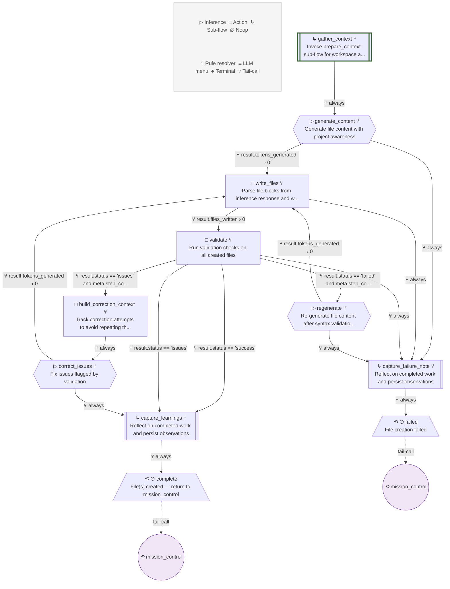
```mermaid
flowchart TD
    %% create_file v3

    subgraph Legend[" "]
        L1["▷ Inference  □ Action  ↳ Sub-flow  ∅ Noop"]
        L2["⑂ Rule resolver  ☰ LLM menu  ◆ Terminal  ⟲ Tail-call"]
    end
    style Legend fill:#f5f5f5,stroke:#ccc,stroke-width:1px
    style L1 fill:#f5f5f5,stroke:none,color:#555
    style L2 fill:#f5f5f5,stroke:none,color:#555

    gather_context[["↳ gather_context ⑂\nInvoke prepare_context sub-flow for workspace a..."]]
    generate_content{{"▷ generate_content ⑂\nGenerate file content with project awareness"}}
    write_files["□ write_files ⑂\nParse file blocks from inference response and w..."]
    validate["□ validate ⑂\nRun validation checks on all created files"]
    build_correction_context["□ build_correction_context ⑂\nTrack correction attempts to avoid repeating th..."]
    correct_issues{{"▷ correct_issues ⑂\nFix issues flagged by validation"}}
    regenerate{{"▷ regenerate ⑂\nRe-generate file content after syntax validatio..."}}
    capture_learnings[["↳ capture_learnings ⑂\nReflect on completed work and persist observations"]]
    complete[/"⟲ ∅ complete\nFile⟮s⟯ created — return to mission_control"\]
    capture_failure_note[["↳ capture_failure_note ⑂\nReflect on completed work and persist observations"]]
    failed[/"⟲ ∅ failed\nFile creation failed"\]

    style gather_context stroke-width:3px,stroke:#2d5a27

    gather_context -->|⑂ always| generate_content
    generate_content -->|⑂ result.tokens_generated › 0| write_files
    generate_content -->|⑂ always| capture_failure_note
    write_files -->|⑂ result.files_written › 0| validate
    write_files -->|⑂ always| capture_failure_note
    validate -->|⑂ result.status == 'success'| capture_learnings
    validate -->|⑂ result.status == 'issues' and meta.step_co...| build_correction_context
    validate -->|⑂ result.status == 'issues'| capture_learnings
    validate -->|⑂ result.status == 'failed' and meta.step_co...| regenerate
    validate -->|⑂ always| capture_failure_note
    build_correction_context -->|⑂ always| correct_issues
    correct_issues -->|⑂ result.tokens_generated › 0| write_files
    correct_issues -->|⑂ always| capture_learnings
    regenerate -->|⑂ result.tokens_generated › 0| write_files
    regenerate -->|⑂ always| capture_failure_note
    capture_learnings -->|⑂ always| complete
    tc_complete(("⟲ mission_control"))
    style tc_complete fill:#f0e6f6,stroke:#663399
    complete -.->|tail-call| tc_complete
    capture_failure_note -->|⑂ always| failed
    tc_failed(("⟲ mission_control"))
    style tc_failed fill:#f0e6f6,stroke:#663399
    failed -.->|tail-call| tc_failed

```

#### create_tests (v1)
*Create test files for existing project modules. Reads the target module, generates pytest-style tests, writes the test file, and validates by running the tests. Available but not enforced — the planner may include test tasks when appropriate.*

**Inputs:** ○ mission_id · ○ task_id · ◑ target_file_path · ◑ task_description · ◑ mission_objective · ◑ working_directory · ◑ test_file_path · ◑ reason · ◑ temperature_multiplier · ◑ frustration_level · ◑ frustration_history · ◑ relevant_notes
**Publishes:** ● context_bundle · ● project_manifest · ● repo_map_formatted · ● related_files · ● selected_file_response · ● target_file · ● inference_response · ● created_file · ● test_results · ● learnings_saved
**Sub-flows:** ↳ prepare_context · ↳ capture_learnings · ↳ capture_learnings
**Tail-calls:** ⟲ mission_control
**Effects:** file_exists · ⟶ inference · makedirs · 𓉗 file read · ⌘ command · 𓉗 file write
**Stats:** 12 steps · ▷ 3 inference · 10 ⑂ rule

**Prompts:**
- **select_target** ▷ (0.0): No target_file_path provided — select the best file to test from project context
  Injects: {← input.task_description}, {← filepath}
- **generate_tests** ▷ (0.3): Generate test code for the target module
  Injects: {← context.target_file.path}, {← context.target_file.content}, {← context.repo_map_formatted}, {← context.context_bundle.import_graph}, {← context.related_files | join(', ')} (+5 more)
- **fix_tests** ▷ (0.2): Fix failing tests based on error output
  Injects: {← context.target_file.path}, {← context.test_results.stdout[:1500]}, {← context.test_results.stderr[:500]}, {← context.target_file.content}

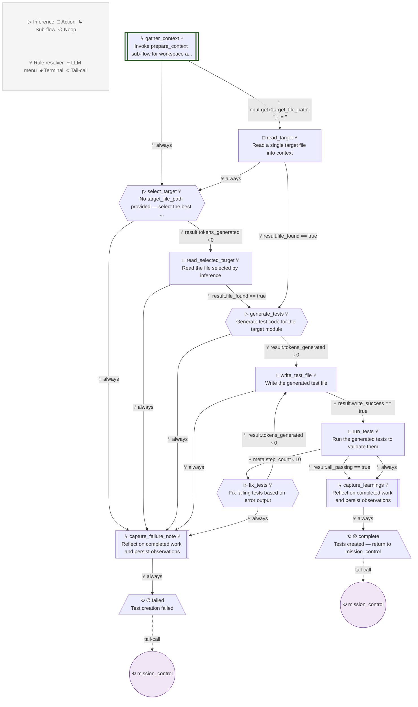
```mermaid
flowchart TD
    %% create_tests v1

    subgraph Legend[" "]
        L1["▷ Inference  □ Action  ↳ Sub-flow  ∅ Noop"]
        L2["⑂ Rule resolver  ☰ LLM menu  ◆ Terminal  ⟲ Tail-call"]
    end
    style Legend fill:#f5f5f5,stroke:#ccc,stroke-width:1px
    style L1 fill:#f5f5f5,stroke:none,color:#555
    style L2 fill:#f5f5f5,stroke:none,color:#555

    gather_context[["↳ gather_context ⑂\nInvoke prepare_context sub-flow for workspace a..."]]
    select_target{{"▷ select_target ⑂\nNo target_file_path provided — select the best ..."}}
    read_selected_target["□ read_selected_target ⑂\nRead the file selected by inference"]
    read_target["□ read_target ⑂\nRead a single target file into context"]
    generate_tests{{"▷ generate_tests ⑂\nGenerate test code for the target module"}}
    write_test_file["□ write_test_file ⑂\nWrite the generated test file"]
    run_tests["□ run_tests ⑂\nRun the generated tests to validate them"]
    fix_tests{{"▷ fix_tests ⑂\nFix failing tests based on error output"}}
    capture_learnings[["↳ capture_learnings ⑂\nReflect on completed work and persist observations"]]
    complete[/"⟲ ∅ complete\nTests created — return to mission_control"\]
    capture_failure_note[["↳ capture_failure_note ⑂\nReflect on completed work and persist observations"]]
    failed[/"⟲ ∅ failed\nTest creation failed"\]

    style gather_context stroke-width:3px,stroke:#2d5a27

    gather_context -->|⑂ input.get⟮'target_file_path', ''⟯ != ''| read_target
    gather_context -->|⑂ always| select_target
    select_target -->|⑂ result.tokens_generated › 0| read_selected_target
    select_target -->|⑂ always| capture_failure_note
    read_selected_target -->|⑂ result.file_found == true| generate_tests
    read_selected_target -->|⑂ always| capture_failure_note
    read_target -->|⑂ result.file_found == true| generate_tests
    read_target -->|⑂ always| select_target
    generate_tests -->|⑂ result.tokens_generated › 0| write_test_file
    generate_tests -->|⑂ always| capture_failure_note
    write_test_file -->|⑂ result.write_success == true| run_tests
    write_test_file -->|⑂ always| capture_failure_note
    run_tests -->|⑂ result.all_passing == true| capture_learnings
    run_tests -->|⑂ meta.step_count ‹ 10| fix_tests
    run_tests -->|⑂ always| capture_learnings
    fix_tests -->|⑂ result.tokens_generated › 0| write_test_file
    fix_tests -->|⑂ always| capture_failure_note
    capture_learnings -->|⑂ always| complete
    tc_complete(("⟲ mission_control"))
    style tc_complete fill:#f0e6f6,stroke:#663399
    complete -.->|tail-call| tc_complete
    capture_failure_note -->|⑂ always| failed
    tc_failed(("⟲ mission_control"))
    style tc_failed fill:#f0e6f6,stroke:#663399
    failed -.->|tail-call| tc_failed

```

#### design_architecture (v2)
*Model-led holistic project design flow. Scans the current workspace, builds an AST-based dependency map, and produces a structured blueprint defining: directory layout, module responsibilities, cross-module interfaces, execution conventions, and creation order. The blueprint is persisted as a mission note so all subsequent flows can reference it. This flow should run early — after create_plan but before file creation.*

**Inputs:** ○ mission_id · ○ task_id · ◑ task_description · ◑ mission_objective · ◑ working_directory · ◑ relevant_notes
**Publishes:** ● mission · ● project_manifest · ● repo_map_formatted · ● inference_response · ● note_saved
**Tail-calls:** ⟲ mission_control
**Effects:** ⟶ inference · 𓉗 list dir · →𓇴 load mission · →𓇴 read events · 𓉗 file read · 𓇴→ save mission
**Stats:** 7 steps · ▷ 1 inference · 5 ⑂ rule

**Prompts:**
- **design_structure** ▷ (0.4): Design holistic project structure — layout, modules, interfaces, execution conventions
  Injects: {← context.mission.objective}, {← task.status}, {← task.description}, {← context.repo_map_formatted}, {← filepath} (+2 more)

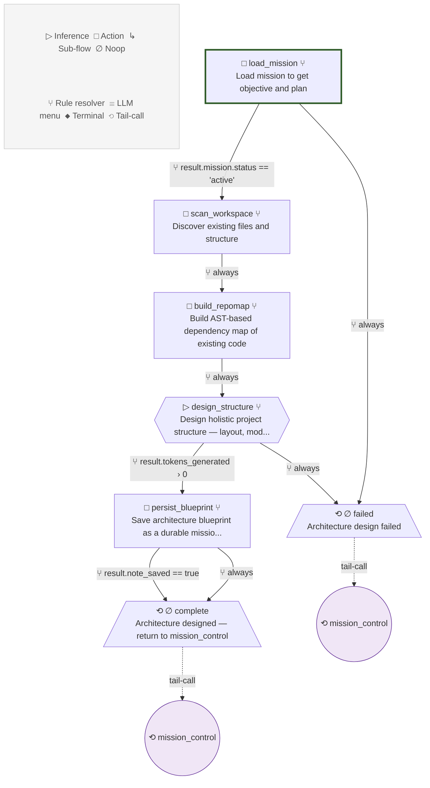
```mermaid
flowchart TD
    %% design_architecture v2

    subgraph Legend[" "]
        L1["▷ Inference  □ Action  ↳ Sub-flow  ∅ Noop"]
        L2["⑂ Rule resolver  ☰ LLM menu  ◆ Terminal  ⟲ Tail-call"]
    end
    style Legend fill:#f5f5f5,stroke:#ccc,stroke-width:1px
    style L1 fill:#f5f5f5,stroke:none,color:#555
    style L2 fill:#f5f5f5,stroke:none,color:#555

    load_mission["□ load_mission ⑂\nLoad mission to get objective and plan"]
    scan_workspace["□ scan_workspace ⑂\nDiscover existing files and structure"]
    build_repomap["□ build_repomap ⑂\nBuild AST-based dependency map of existing code"]
    design_structure{{"▷ design_structure ⑂\nDesign holistic project structure — layout, mod..."}}
    persist_blueprint["□ persist_blueprint ⑂\nSave architecture blueprint as a durable missio..."]
    complete[/"⟲ ∅ complete\nArchitecture designed — return to mission_control"\]
    failed[/"⟲ ∅ failed\nArchitecture design failed"\]

    style load_mission stroke-width:3px,stroke:#2d5a27

    load_mission -->|⑂ result.mission.status == 'active'| scan_workspace
    load_mission -->|⑂ always| failed
    scan_workspace -->|⑂ always| build_repomap
    build_repomap -->|⑂ always| design_structure
    design_structure -->|⑂ result.tokens_generated › 0| persist_blueprint
    design_structure -->|⑂ always| failed
    persist_blueprint -->|⑂ result.note_saved == true| complete
    persist_blueprint -->|⑂ always| complete
    tc_complete(("⟲ mission_control"))
    style tc_complete fill:#f0e6f6,stroke:#663399
    complete -.->|tail-call| tc_complete
    tc_failed(("⟲ mission_control"))
    style tc_failed fill:#f0e6f6,stroke:#663399
    failed -.->|tail-call| tc_failed

```

#### diagnose_issue (v1)
*Methodical diagnosis of a code issue. Reads error output, gathers context, forms hypotheses, evaluates them against the code, and produces a structured diagnosis with root cause analysis and fix recommendations. Does NOT modify code. Can be invoked as a task (tail-calls to mission_control) or as a sub-flow (parent reads terminal status and diagnosis from context).*

**Inputs:** ○ target_file_path · ◑ error_description · ◑ mission_id · ◑ task_id · ◑ task_description · ◑ mission_objective · ◑ error_output · ◑ previous_attempt · ◑ working_directory · ◑ frustration_level · ◑ frustration_history · ◑ relevant_notes
**Publishes:** ● context_bundle · ● project_manifest · ● repo_map_formatted · ● related_files · ● target_file · ● error_analysis · ● hypotheses · ● evaluation · ● diagnosis · ● fix_task_created (+1 more)
**Sub-flows:** ↳ prepare_context · ↳ prepare_context · ↳ capture_learnings · ↳ capture_learnings
**Tail-calls:** ⟲ mission_control
**Effects:** ⟶ inference · →𓇴 load mission · 𓉗 file read · 𓇴→ save mission
**Stats:** 13 steps · ▷ 3-4 inference · 10 ⑂ rule · 1 ☰ menu

**Prompts:**
- **reproduce_mentally** ▷ (t*0.4): Trace the error execution path mentally — understand before fixing
  Injects: {← input.error_description}, {← input.error_output}, {← context.target_file.path}, {← context.target_file.content}, {← file.path} (+2 more)
- **form_hypotheses** ▷ (t*0.8): Generate 2-3 distinct fix hypotheses based on the error analysis
  Injects: {← context.error_analysis}, {← context.target_file.path}, {← context.target_file.content}, {← input.previous_attempt}
- **evaluate_hypotheses** ▷ (t*0.3): Evaluate hypotheses against the code and select the best approach
  Injects: {← context.error_analysis}, {← context.hypotheses}, {← context.target_file.path}, {← context.target_file.content}, {← file.path} (+1 more)

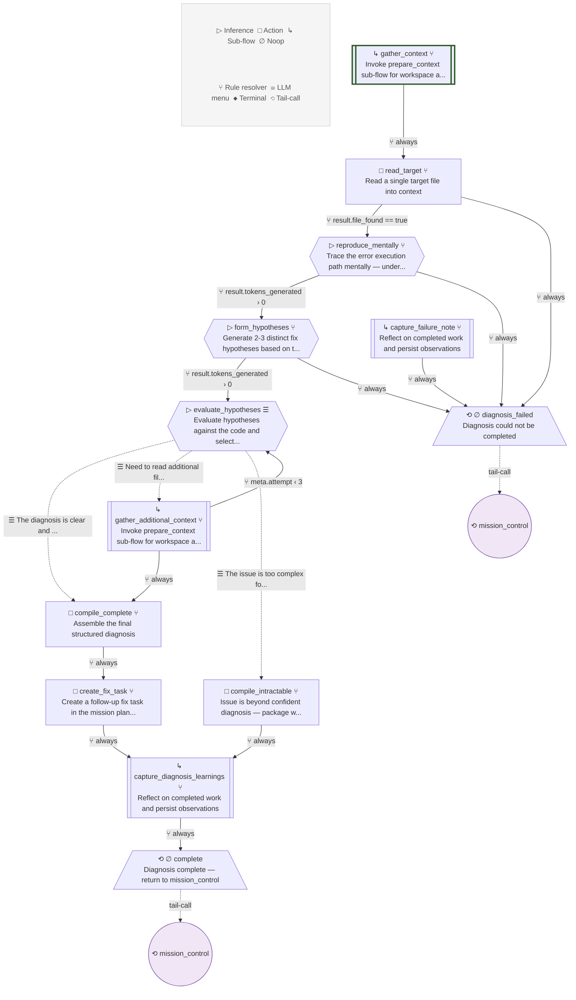
```mermaid
flowchart TD
    %% diagnose_issue v1

    subgraph Legend[" "]
        L1["▷ Inference  □ Action  ↳ Sub-flow  ∅ Noop"]
        L2["⑂ Rule resolver  ☰ LLM menu  ◆ Terminal  ⟲ Tail-call"]
    end
    style Legend fill:#f5f5f5,stroke:#ccc,stroke-width:1px
    style L1 fill:#f5f5f5,stroke:none,color:#555
    style L2 fill:#f5f5f5,stroke:none,color:#555

    gather_context[["↳ gather_context ⑂\nInvoke prepare_context sub-flow for workspace a..."]]
    read_target["□ read_target ⑂\nRead a single target file into context"]
    reproduce_mentally{{"▷ reproduce_mentally ⑂\nTrace the error execution path mentally — under..."}}
    form_hypotheses{{"▷ form_hypotheses ⑂\nGenerate 2-3 distinct fix hypotheses based on t..."}}
    evaluate_hypotheses{{"▷ evaluate_hypotheses ☰\nEvaluate hypotheses against the code and select..."}}
    gather_additional_context[["↳ gather_additional_context ⑂\nInvoke prepare_context sub-flow for workspace a..."]]
    compile_complete["□ compile_complete ⑂\nAssemble the final structured diagnosis"]
    create_fix_task["□ create_fix_task ⑂\nCreate a follow-up fix task in the mission plan..."]
    compile_intractable["□ compile_intractable ⑂\nIssue is beyond confident diagnosis — package w..."]
    capture_diagnosis_learnings[["↳ capture_diagnosis_learnings ⑂\nReflect on completed work and persist observations"]]
    complete[/"⟲ ∅ complete\nDiagnosis complete — return to mission_control"\]
    capture_failure_note[["↳ capture_failure_note ⑂\nReflect on completed work and persist observations"]]
    diagnosis_failed[/"⟲ ∅ diagnosis_failed\nDiagnosis could not be completed"\]

    style gather_context stroke-width:3px,stroke:#2d5a27

    gather_context -->|⑂ always| read_target
    read_target -->|⑂ result.file_found == true| reproduce_mentally
    read_target -->|⑂ always| diagnosis_failed
    reproduce_mentally -->|⑂ result.tokens_generated › 0| form_hypotheses
    reproduce_mentally -->|⑂ always| diagnosis_failed
    form_hypotheses -->|⑂ result.tokens_generated › 0| evaluate_hypotheses
    form_hypotheses -->|⑂ always| diagnosis_failed
    evaluate_hypotheses -.->|☰ The diagnosis is clear and ...| compile_complete
    evaluate_hypotheses -.->|☰ Need to read additional fil...| gather_additional_context
    evaluate_hypotheses -.->|☰ The issue is too complex fo...| compile_intractable
    gather_additional_context -->|⑂ meta.attempt ‹ 3| evaluate_hypotheses
    gather_additional_context -->|⑂ always| compile_complete
    compile_complete -->|⑂ always| create_fix_task
    create_fix_task -->|⑂ always| capture_diagnosis_learnings
    compile_intractable -->|⑂ always| capture_diagnosis_learnings
    capture_diagnosis_learnings -->|⑂ always| complete
    tc_complete(("⟲ mission_control"))
    style tc_complete fill:#f0e6f6,stroke:#663399
    complete -.->|tail-call| tc_complete
    capture_failure_note -->|⑂ always| diagnosis_failed
    tc_diagnosis_failed(("⟲ mission_control"))
    style tc_diagnosis_failed fill:#f0e6f6,stroke:#663399
    diagnosis_failed -.->|tail-call| tc_diagnosis_failed

```

#### document_project (v1)
*Produce or update project documentation: README, module docstrings, architecture notes. Reads actual code and produces documentation that accurately reflects the current state of the project.*

**Inputs:** ○ mission_id · ○ task_id · ◑ task_description · ◑ mission_objective · ◑ working_directory · ◑ target_file_path · ◑ reason · ◑ doc_scope · ◑ findings · ◑ frustration_level · ◑ frustration_history · ◑ relevant_notes
**Publishes:** ● context_bundle · ● project_manifest · ● repo_map_formatted · ● related_files · ● doc_assessment · ● inference_response · ● readme_written · ● docstring_changes · ● files_changed · ● validation_results (+3 more)
**Sub-flows:** ↳ prepare_context · ↳ validate_output · ↳ capture_learnings · ↳ capture_learnings
**Tail-calls:** ⟲ mission_control
**Effects:** ⟶ inference · 𓉗 list dir · 𓉗 file read · 𓉗 file write
**Stats:** 16 steps · ▷ 4-5 inference · 12 ⑂ rule · 1 ☰ menu

**Prompts:**
- **assess_documentation_state** ▷ (t*0.3): Survey existing documentation and identify gaps
  Injects: {← input.mission_objective}, {← filepath}, {← sig[:100]}, {← file.path}, {← file.content[:500]} (+1 more)
- **write_readme** ▷ (t*0.5): Produce a comprehensive README for the project
  Injects: {← input.mission_objective}, {← filepath}, {← file.path}, {← file.content[:1000]}
- **update_docstrings** ▷ (t*0.3): Add or improve docstrings across the project
  Injects: {← context.doc_assessment}, {← file.path}, {← file.content}
- **write_architecture** ▷ (t*0.5): Produce architecture documentation
  Injects: {← input.mission_objective}, {← file.path}, {← file.content[:800]}

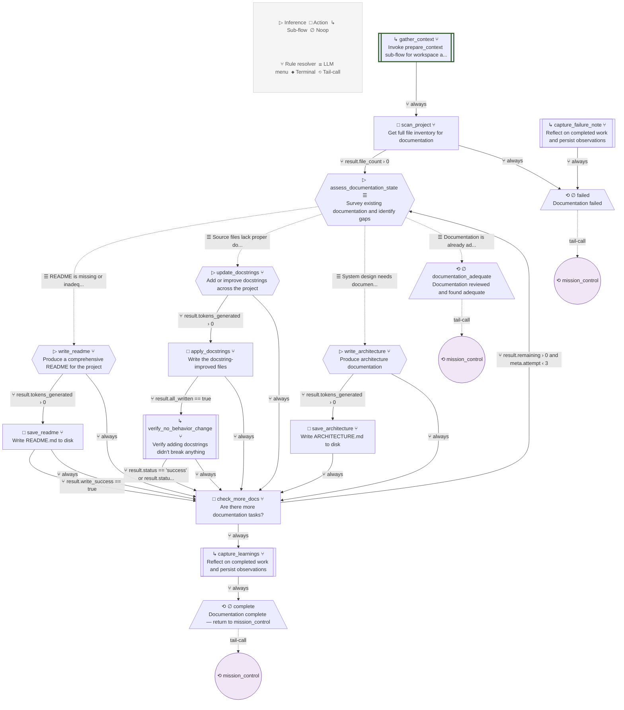
```mermaid
flowchart TD
    %% document_project v1

    subgraph Legend[" "]
        L1["▷ Inference  □ Action  ↳ Sub-flow  ∅ Noop"]
        L2["⑂ Rule resolver  ☰ LLM menu  ◆ Terminal  ⟲ Tail-call"]
    end
    style Legend fill:#f5f5f5,stroke:#ccc,stroke-width:1px
    style L1 fill:#f5f5f5,stroke:none,color:#555
    style L2 fill:#f5f5f5,stroke:none,color:#555

    gather_context[["↳ gather_context ⑂\nInvoke prepare_context sub-flow for workspace a..."]]
    scan_project["□ scan_project ⑂\nGet full file inventory for documentation"]
    assess_documentation_state{{"▷ assess_documentation_state ☰\nSurvey existing documentation and identify gaps"}}
    write_readme{{"▷ write_readme ⑂\nProduce a comprehensive README for the project"}}
    save_readme["□ save_readme ⑂\nWrite README.md to disk"]
    update_docstrings{{"▷ update_docstrings ⑂\nAdd or improve docstrings across the project"}}
    apply_docstrings["□ apply_docstrings ⑂\nWrite the docstring-improved files"]
    verify_no_behavior_change[["↳ verify_no_behavior_change ⑂\nVerify adding docstrings didn't break anything"]]
    write_architecture{{"▷ write_architecture ⑂\nProduce architecture documentation"}}
    save_architecture["□ save_architecture ⑂\nWrite ARCHITECTURE.md to disk"]
    check_more_docs["□ check_more_docs ⑂\nAre there more documentation tasks?"]
    capture_learnings[["↳ capture_learnings ⑂\nReflect on completed work and persist observations"]]
    complete[/"⟲ ∅ complete\nDocumentation complete — return to mission_control"\]
    documentation_adequate[/"⟲ ∅ documentation_adequate\nDocumentation reviewed and found adequate"\]
    capture_failure_note[["↳ capture_failure_note ⑂\nReflect on completed work and persist observations"]]
    failed[/"⟲ ∅ failed\nDocumentation failed"\]

    style gather_context stroke-width:3px,stroke:#2d5a27

    gather_context -->|⑂ always| scan_project
    scan_project -->|⑂ result.file_count › 0| assess_documentation_state
    scan_project -->|⑂ always| failed
    assess_documentation_state -.->|☰ README is missing or inadeq...| write_readme
    assess_documentation_state -.->|☰ Source files lack proper do...| update_docstrings
    assess_documentation_state -.->|☰ System design needs documen...| write_architecture
    assess_documentation_state -.->|☰ Documentation is already ad...| documentation_adequate
    write_readme -->|⑂ result.tokens_generated › 0| save_readme
    write_readme -->|⑂ always| check_more_docs
    save_readme -->|⑂ result.write_success == true| check_more_docs
    save_readme -->|⑂ always| check_more_docs
    update_docstrings -->|⑂ result.tokens_generated › 0| apply_docstrings
    update_docstrings -->|⑂ always| check_more_docs
    apply_docstrings -->|⑂ result.all_written == true| verify_no_behavior_change
    apply_docstrings -->|⑂ always| check_more_docs
    verify_no_behavior_change -->|⑂ result.status == 'success' or result.statu...| check_more_docs
    verify_no_behavior_change -->|⑂ always| check_more_docs
    write_architecture -->|⑂ result.tokens_generated › 0| save_architecture
    write_architecture -->|⑂ always| check_more_docs
    save_architecture -->|⑂ always| check_more_docs
    check_more_docs -->|⑂ result.remaining › 0 and meta.attempt ‹ 3| assess_documentation_state
    check_more_docs -->|⑂ always| capture_learnings
    capture_learnings -->|⑂ always| complete
    tc_complete(("⟲ mission_control"))
    style tc_complete fill:#f0e6f6,stroke:#663399
    complete -.->|tail-call| tc_complete
    tc_documentation_adequate(("⟲ mission_control"))
    style tc_documentation_adequate fill:#f0e6f6,stroke:#663399
    documentation_adequate -.->|tail-call| tc_documentation_adequate
    capture_failure_note -->|⑂ always| failed
    tc_failed(("⟲ mission_control"))
    style tc_failed fill:#f0e6f6,stroke:#663399
    failed -.->|tail-call| tc_failed

```

#### explore_spike (v1)
*Time-boxed investigation of a codebase, module, pattern, or technology. Produces a structured findings document without modifying any code. Used to build understanding before planning or implementation.*

**Inputs:** ○ investigation_goal · ◑ mission_id · ◑ task_id · ◑ task_description · ◑ mission_objective · ◑ scope_hint · ◑ working_directory · ◑ specific_questions · ◑ frustration_level · ◑ frustration_history · ◑ relevant_notes
**Publishes:** ● investigation_plan · ● context_bundle · ● project_manifest · ● repo_map_formatted · ● related_files · ● deep_context · ● analysis · ● research_findings · ● findings · ● learnings_saved
**Sub-flows:** ↳ prepare_context · ↳ research_context · ↳ capture_learnings
**Tail-calls:** ⟲ mission_control
**Effects:** ⟶ inference · 𓉗 file read
**Stats:** 9 steps · ▷ 4-5 inference · 7 ⑂ rule · 1 ☰ menu

**Prompts:**
- **plan_investigation** ▷ (t*0.6): Produce a focused investigation plan: what to look at, in what order
  Injects: {← input.investigation_goal}, {← input.scope_hint}, {← input.specific_questions}, {← input.relevant_notes}
- **analyze** ▷ (t*0.4): Analyze code patterns, architecture, conventions, and risks
  Injects: {← input.investigation_goal}, {← context.investigation_plan}, {← filepath}, {← content}, {← sig[:100]} (+1 more)
- **deeper_look** ▷ (t*0.3): Identify what specific area needs closer examination
  Injects: {← input.investigation_goal}, {← context.analysis}
- **synthesize** ▷ (t*0.3): Produce the structured findings document
  Injects: {← input.investigation_goal}, {← context.analysis}, {← context.research_findings}, {← input.specific_questions}

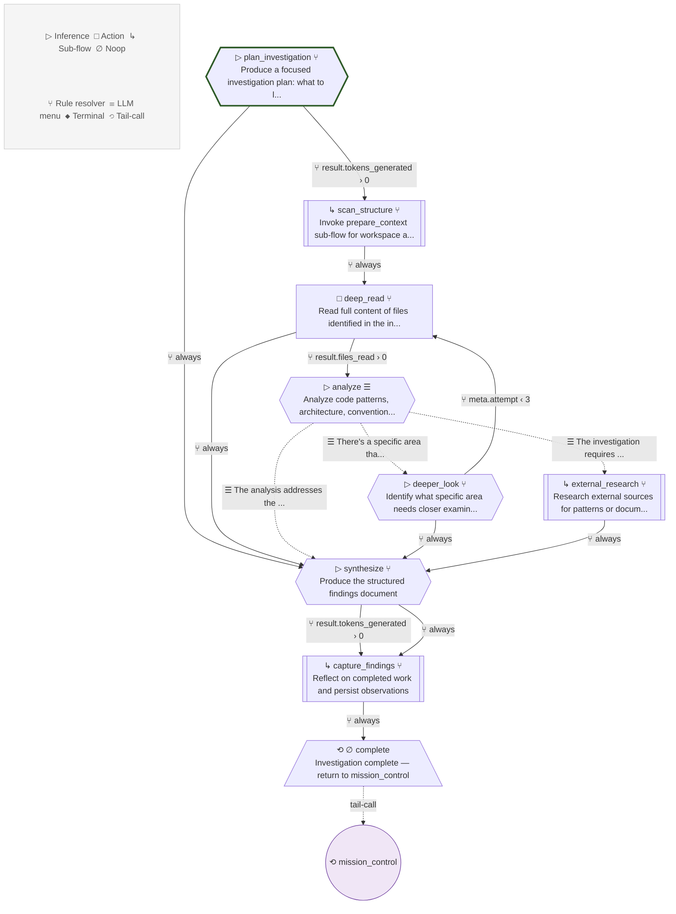
```mermaid
flowchart TD
    %% explore_spike v1

    subgraph Legend[" "]
        L1["▷ Inference  □ Action  ↳ Sub-flow  ∅ Noop"]
        L2["⑂ Rule resolver  ☰ LLM menu  ◆ Terminal  ⟲ Tail-call"]
    end
    style Legend fill:#f5f5f5,stroke:#ccc,stroke-width:1px
    style L1 fill:#f5f5f5,stroke:none,color:#555
    style L2 fill:#f5f5f5,stroke:none,color:#555

    plan_investigation{{"▷ plan_investigation ⑂\nProduce a focused investigation plan: what to l..."}}
    scan_structure[["↳ scan_structure ⑂\nInvoke prepare_context sub-flow for workspace a..."]]
    deep_read["□ deep_read ⑂\nRead full content of files identified in the in..."]
    analyze{{"▷ analyze ☰\nAnalyze code patterns, architecture, convention..."}}
    deeper_look{{"▷ deeper_look ⑂\nIdentify what specific area needs closer examin..."}}
    external_research[["↳ external_research ⑂\nResearch external sources for patterns or docum..."]]
    synthesize{{"▷ synthesize ⑂\nProduce the structured findings document"}}
    capture_findings[["↳ capture_findings ⑂\nReflect on completed work and persist observations"]]
    complete[/"⟲ ∅ complete\nInvestigation complete — return to mission_control"\]

    style plan_investigation stroke-width:3px,stroke:#2d5a27

    plan_investigation -->|⑂ result.tokens_generated › 0| scan_structure
    plan_investigation -->|⑂ always| synthesize
    scan_structure -->|⑂ always| deep_read
    deep_read -->|⑂ result.files_read › 0| analyze
    deep_read -->|⑂ always| synthesize
    analyze -.->|☰ The analysis addresses the ...| synthesize
    analyze -.->|☰ There's a specific area tha...| deeper_look
    analyze -.->|☰ The investigation requires ...| external_research
    deeper_look -->|⑂ meta.attempt ‹ 3| deep_read
    deeper_look -->|⑂ always| synthesize
    external_research -->|⑂ always| synthesize
    synthesize -->|⑂ result.tokens_generated › 0| capture_findings
    synthesize -->|⑂ always| capture_findings
    capture_findings -->|⑂ always| complete
    tc_complete(("⟲ mission_control"))
    style tc_complete fill:#f0e6f6,stroke:#663399
    complete -.->|tail-call| tc_complete

```

#### integrate_modules (v2)
*Project cohesion inspector. Scans all project files, checks cross-file imports, reports name discrepancies (mismatches, duplicates), missing modules, and interface contract violations. Produces a structured integration report that mission_control uses to dispatch targeted fix actions (modify_file, create_file, manage_packages). This flow does NOT modify code — it inspects and reports.*

**Inputs:** ○ mission_id · ○ task_id · ◑ task_description · ◑ mission_objective · ◑ working_directory · ◑ relevant_notes · ◑ integration_hints
**Publishes:** ● context_bundle · ● project_manifest · ● repo_map_formatted · ● related_files · ● cross_file_results · ● cross_file_summary · ● inference_response · ● integration_report · ● learnings_saved
**Sub-flows:** ↳ prepare_context · ↳ capture_learnings · ↳ capture_learnings
**Tail-calls:** ⟲ mission_control
**Effects:** ⟶ inference · 𓉗 list dir · →𓇴 load mission · 𓉗 file read · 𓇴→ save mission
**Stats:** 10 steps · ▷ 1 inference · 7 ⑂ rule

**Prompts:**
- **analyze_cohesion** ▷ (t*0.3): Analyze project cohesion and produce integration report
  Injects: {← input.mission_objective}, {← context.repo_map_formatted}, {← context.cross_file_summary}, {← issue.severity}, {← issue.type} (+6 more)

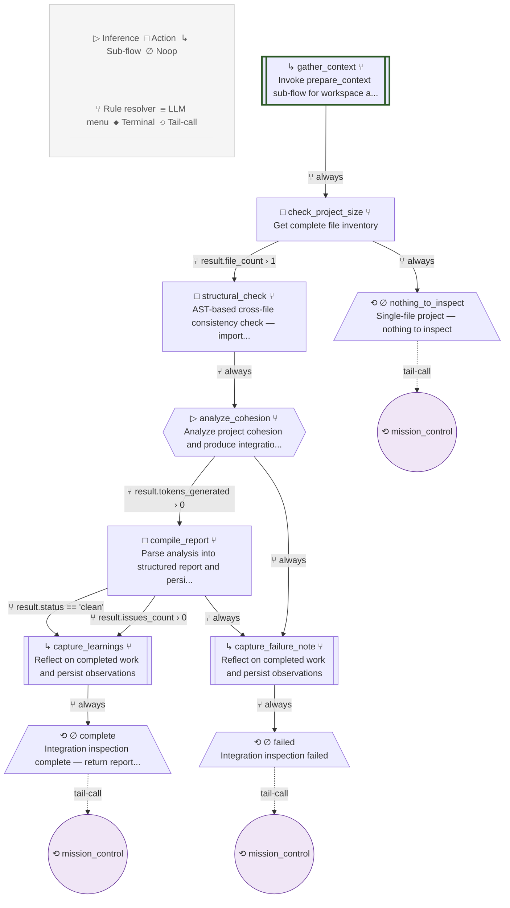
```mermaid
flowchart TD
    %% integrate_modules v2

    subgraph Legend[" "]
        L1["▷ Inference  □ Action  ↳ Sub-flow  ∅ Noop"]
        L2["⑂ Rule resolver  ☰ LLM menu  ◆ Terminal  ⟲ Tail-call"]
    end
    style Legend fill:#f5f5f5,stroke:#ccc,stroke-width:1px
    style L1 fill:#f5f5f5,stroke:none,color:#555
    style L2 fill:#f5f5f5,stroke:none,color:#555

    gather_context[["↳ gather_context ⑂\nInvoke prepare_context sub-flow for workspace a..."]]
    check_project_size["□ check_project_size ⑂\nGet complete file inventory"]
    structural_check["□ structural_check ⑂\nAST-based cross-file consistency check — import..."]
    analyze_cohesion{{"▷ analyze_cohesion ⑂\nAnalyze project cohesion and produce integratio..."}}
    compile_report["□ compile_report ⑂\nParse analysis into structured report and persi..."]
    capture_learnings[["↳ capture_learnings ⑂\nReflect on completed work and persist observations"]]
    complete[/"⟲ ∅ complete\nIntegration inspection complete — return report..."\]
    nothing_to_inspect[/"⟲ ∅ nothing_to_inspect\nSingle-file project — nothing to inspect"\]
    capture_failure_note[["↳ capture_failure_note ⑂\nReflect on completed work and persist observations"]]
    failed[/"⟲ ∅ failed\nIntegration inspection failed"\]

    style gather_context stroke-width:3px,stroke:#2d5a27

    gather_context -->|⑂ always| check_project_size
    check_project_size -->|⑂ result.file_count › 1| structural_check
    check_project_size -->|⑂ always| nothing_to_inspect
    structural_check -->|⑂ always| analyze_cohesion
    analyze_cohesion -->|⑂ result.tokens_generated › 0| compile_report
    analyze_cohesion -->|⑂ always| capture_failure_note
    compile_report -->|⑂ result.status == 'clean'| capture_learnings
    compile_report -->|⑂ result.issues_count › 0| capture_learnings
    compile_report -->|⑂ always| capture_failure_note
    capture_learnings -->|⑂ always| complete
    tc_complete(("⟲ mission_control"))
    style tc_complete fill:#f0e6f6,stroke:#663399
    complete -.->|tail-call| tc_complete
    tc_nothing_to_inspect(("⟲ mission_control"))
    style tc_nothing_to_inspect fill:#f0e6f6,stroke:#663399
    nothing_to_inspect -.->|tail-call| tc_nothing_to_inspect
    capture_failure_note -->|⑂ always| failed
    tc_failed(("⟲ mission_control"))
    style tc_failed fill:#f0e6f6,stroke:#663399
    failed -.->|tail-call| tc_failed

```

#### manage_packages (v1)
*Detect, create, and manage project virtual environment and packages. Analyzes the project for dependency management tools and required packages, then uses run_in_terminal for multi-turn package operations.*

**Inputs:** ○ mission_id · ○ task_id · ◑ task_description · ◑ mission_objective · ◑ working_directory · ◑ packages_to_install · ◑ target_file_path · ◑ reason · ◑ temperature_multiplier · ◑ frustration_level · ◑ frustration_history · ◑ relevant_notes
**Publishes:** ● context_bundle · ● project_manifest · ● repo_map_formatted · ● related_files · ● inference_response · ● session_history · ● session_summary · ● learnings_saved
**Sub-flows:** ↳ prepare_context · ↳ run_in_terminal · ↳ capture_learnings · ↳ capture_learnings
**Tail-calls:** ⟲ mission_control
**Effects:** ⟶ inference
**Stats:** 7 steps · ▷ 1 inference · 5 ⑂ rule

**Prompts:**
- **analyze_environment** ▷ (0.1): Analyze project for package manager, venv, and required dependencies
  Injects: {← input.task_description}, {← input.working_directory}, {← input.packages_to_install}, {← filepath}, {← sig[:80]} (+2 more)

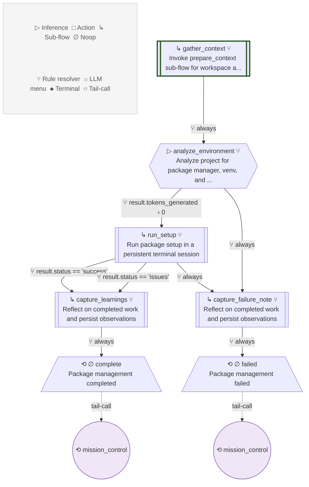
```mermaid
flowchart TD
    %% manage_packages v1

    subgraph Legend[" "]
        L1["▷ Inference  □ Action  ↳ Sub-flow  ∅ Noop"]
        L2["⑂ Rule resolver  ☰ LLM menu  ◆ Terminal  ⟲ Tail-call"]
    end
    style Legend fill:#f5f5f5,stroke:#ccc,stroke-width:1px
    style L1 fill:#f5f5f5,stroke:none,color:#555
    style L2 fill:#f5f5f5,stroke:none,color:#555

    gather_context[["↳ gather_context ⑂\nInvoke prepare_context sub-flow for workspace a..."]]
    analyze_environment{{"▷ analyze_environment ⑂\nAnalyze project for package manager, venv, and ..."}}
    run_setup[["↳ run_setup ⑂\nRun package setup in a persistent terminal session"]]
    capture_learnings[["↳ capture_learnings ⑂\nReflect on completed work and persist observations"]]
    complete[/"⟲ ∅ complete\nPackage management completed"\]
    capture_failure_note[["↳ capture_failure_note ⑂\nReflect on completed work and persist observations"]]
    failed[/"⟲ ∅ failed\nPackage management failed"\]

    style gather_context stroke-width:3px,stroke:#2d5a27

    gather_context -->|⑂ always| analyze_environment
    analyze_environment -->|⑂ result.tokens_generated › 0| run_setup
    analyze_environment -->|⑂ always| capture_failure_note
    run_setup -->|⑂ result.status == 'success'| capture_learnings
    run_setup -->|⑂ result.status == 'issues'| capture_learnings
    run_setup -->|⑂ always| capture_failure_note
    capture_learnings -->|⑂ always| complete
    tc_complete(("⟲ mission_control"))
    style tc_complete fill:#f0e6f6,stroke:#663399
    complete -.->|tail-call| tc_complete
    capture_failure_note -->|⑂ always| failed
    tc_failed(("⟲ mission_control"))
    style tc_failed fill:#f0e6f6,stroke:#663399
    failed -.->|tail-call| tc_failed

```

#### modify_file (v3)
*Modify one or more existing files via AST-aware symbol-level editing. Operates in two modes set by the caller: - "fix": Correct a known issue. Diagnosis context drives symbol selection. - "refactor": Improve structure. Model browses symbols and selects targets. Uses tree-sitter to extract symbols, presents them as a constrained menu for selection, then rewrites each selected symbol sequentially in a memoryful session. Falls back to full-file rewrite when AST extraction is unavailable or the model requests it.*

**Inputs:** ○ mission_id · ○ task_id · ○ target_file_path · ◑ task_description · ◑ mission_objective · ◑ working_directory · ◑ reason · ◑ relevant_notes · ◑ mode
**Publishes:** ● context_bundle · ● project_manifest · ● repo_map_formatted · ● related_files · ● target_file · ● symbol_table · ● symbol_menu_options · ● files_changed · ● edit_summary · ● inference_response (+2 more)
**Sub-flows:** ↳ prepare_context · ↳ ast_edit_session · ↳ capture_learnings · ↳ create_file · ↳ capture_learnings
**Tail-calls:** ⟲ mission_control
**Effects:** ⟶ inference · 𓉗 file read · ⌘ command · 𓉗 file write
**Stats:** 12 steps · ▷ 1 inference · 10 ⑂ rule

**Prompts:**
- **full_rewrite** ▷ (0.3): Full file rewrite — when AST editing unavailable or structural change needed
  Injects: {← input.task_description}, {← input.reason}, {← input.target_file_path}, {← context.target_file.content}, {← file.path} (+2 more)

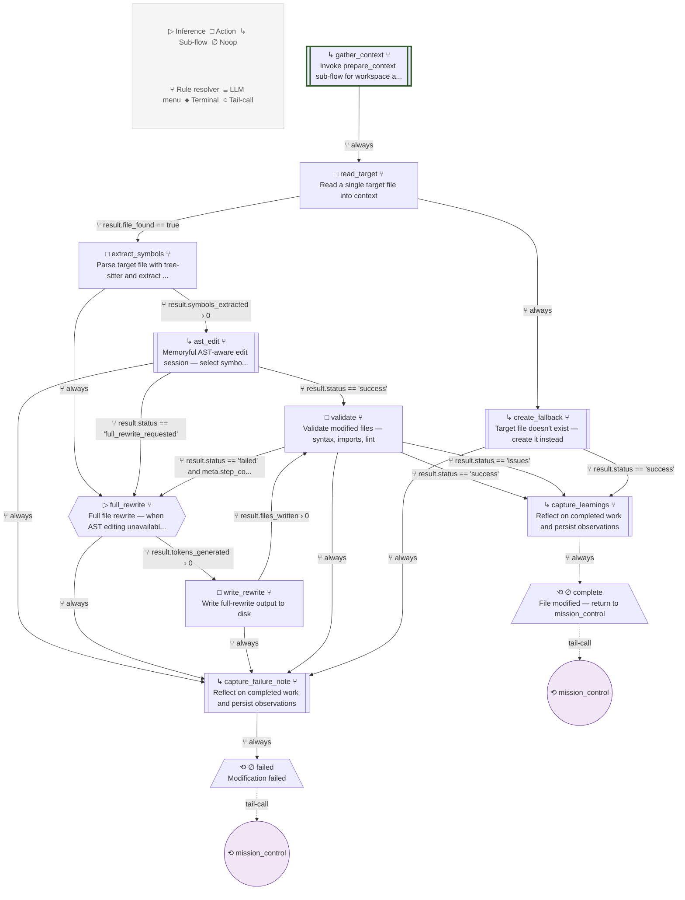
```mermaid
flowchart TD
    %% modify_file v3

    subgraph Legend[" "]
        L1["▷ Inference  □ Action  ↳ Sub-flow  ∅ Noop"]
        L2["⑂ Rule resolver  ☰ LLM menu  ◆ Terminal  ⟲ Tail-call"]
    end
    style Legend fill:#f5f5f5,stroke:#ccc,stroke-width:1px
    style L1 fill:#f5f5f5,stroke:none,color:#555
    style L2 fill:#f5f5f5,stroke:none,color:#555

    gather_context[["↳ gather_context ⑂\nInvoke prepare_context sub-flow for workspace a..."]]
    read_target["□ read_target ⑂\nRead a single target file into context"]
    extract_symbols["□ extract_symbols ⑂\nParse target file with tree-sitter and extract ..."]
    ast_edit[["↳ ast_edit ⑂\nMemoryful AST-aware edit session — select symbo..."]]
    full_rewrite{{"▷ full_rewrite ⑂\nFull file rewrite — when AST editing unavailabl..."}}
    write_rewrite["□ write_rewrite ⑂\nWrite full-rewrite output to disk"]
    validate["□ validate ⑂\nValidate modified files — syntax, imports, lint"]
    capture_learnings[["↳ capture_learnings ⑂\nReflect on completed work and persist observations"]]
    complete[/"⟲ ∅ complete\nFile modified — return to mission_control"\]
    create_fallback[["↳ create_fallback ⑂\nTarget file doesn't exist — create it instead"]]
    capture_failure_note[["↳ capture_failure_note ⑂\nReflect on completed work and persist observations"]]
    failed[/"⟲ ∅ failed\nModification failed"\]

    style gather_context stroke-width:3px,stroke:#2d5a27

    gather_context -->|⑂ always| read_target
    read_target -->|⑂ result.file_found == true| extract_symbols
    read_target -->|⑂ always| create_fallback
    extract_symbols -->|⑂ result.symbols_extracted › 0| ast_edit
    extract_symbols -->|⑂ always| full_rewrite
    ast_edit -->|⑂ result.status == 'success'| validate
    ast_edit -->|⑂ result.status == 'full_rewrite_requested'| full_rewrite
    ast_edit -->|⑂ always| capture_failure_note
    full_rewrite -->|⑂ result.tokens_generated › 0| write_rewrite
    full_rewrite -->|⑂ always| capture_failure_note
    write_rewrite -->|⑂ result.files_written › 0| validate
    write_rewrite -->|⑂ always| capture_failure_note
    validate -->|⑂ result.status == 'success'| capture_learnings
    validate -->|⑂ result.status == 'issues'| capture_learnings
    validate -->|⑂ result.status == 'failed' and meta.step_co...| full_rewrite
    validate -->|⑂ always| capture_failure_note
    capture_learnings -->|⑂ always| complete
    tc_complete(("⟲ mission_control"))
    style tc_complete fill:#f0e6f6,stroke:#663399
    complete -.->|tail-call| tc_complete
    create_fallback -->|⑂ result.status == 'success'| capture_learnings
    create_fallback -->|⑂ always| capture_failure_note
    capture_failure_note -->|⑂ always| failed
    tc_failed(("⟲ mission_control"))
    style tc_failed fill:#f0e6f6,stroke:#663399
    failed -.->|tail-call| tc_failed

```

#### refactor (v1)
*Deliberate structural improvement of existing code without changing behavior. Identifies code smells using Fowler's vocabulary, applies named refactorings one at a time, and verifies tests pass after each change. Rolls back on failure.*

**Inputs:** ○ mission_id · ○ task_id · ○ target_file_path · ◑ task_description · ◑ mission_objective · ◑ working_directory · ◑ reason · ◑ specific_smells · ◑ refactoring_budget · ◑ findings · ◑ frustration_level · ◑ frustration_history · ◑ relevant_notes
**Publishes:** ● context_bundle · ● project_manifest · ● repo_map_formatted · ● related_files · ● target_file · ● baseline_results · ● smell_analysis · ● refactoring_applied · ● inference_response · ● created_file (+4 more)
**Sub-flows:** ↳ prepare_context · ↳ capture_learnings · ↳ capture_learnings
**Tail-calls:** ⟲ mission_control
**Effects:** file_exists · ⟶ inference · 𓉗 list dir · makedirs · 𓉗 file read · ⌘ command · 𓉗 file write
**Stats:** 19 steps · ▷ 3-5 inference · 11 ⑂ rule · 2 ☰ menu

**Prompts:**
- **identify_smells** ▷ (t*0.5): Analyze code for structural issues using Fowler's vocabulary
  Injects: {← context.target_file.path}, {← context.target_file.content}, {← input.specific_smells}, {← input.findings}
- **identify_smells_no_tests** ▷ (t*0.3): Safe-only smell analysis — no test safety net
  Injects: {← context.target_file.path}, {← context.target_file.content}
- **apply_refactoring** ▷ (t*0.2): Apply ONE named refactoring from the smell analysis
  Injects: {← context.smell_analysis}, {← r}, {← context.target_file.path}, {← context.target_file.content}

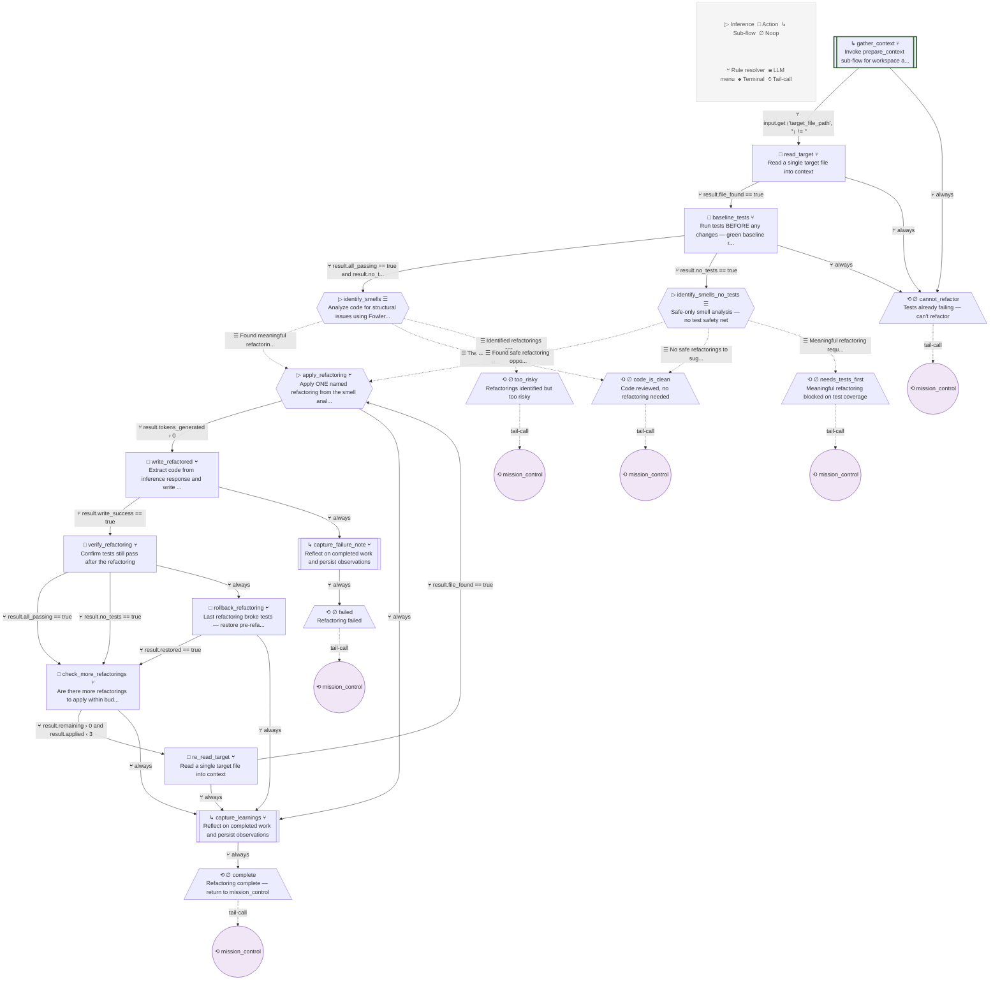
```mermaid
flowchart TD
    %% refactor v1

    subgraph Legend[" "]
        L1["▷ Inference  □ Action  ↳ Sub-flow  ∅ Noop"]
        L2["⑂ Rule resolver  ☰ LLM menu  ◆ Terminal  ⟲ Tail-call"]
    end
    style Legend fill:#f5f5f5,stroke:#ccc,stroke-width:1px
    style L1 fill:#f5f5f5,stroke:none,color:#555
    style L2 fill:#f5f5f5,stroke:none,color:#555

    gather_context[["↳ gather_context ⑂\nInvoke prepare_context sub-flow for workspace a..."]]
    read_target["□ read_target ⑂\nRead a single target file into context"]
    baseline_tests["□ baseline_tests ⑂\nRun tests BEFORE any changes — green baseline r..."]
    identify_smells{{"▷ identify_smells ☰\nAnalyze code for structural issues using Fowler..."}}
    identify_smells_no_tests{{"▷ identify_smells_no_tests ☰\nSafe-only smell analysis — no test safety net"}}
    apply_refactoring{{"▷ apply_refactoring ⑂\nApply ONE named refactoring from the smell anal..."}}
    write_refactored["□ write_refactored ⑂\nExtract code from inference response and write ..."]
    verify_refactoring["□ verify_refactoring ⑂\nConfirm tests still pass after the refactoring"]
    check_more_refactorings["□ check_more_refactorings ⑂\nAre there more refactorings to apply within bud..."]
    re_read_target["□ re_read_target ⑂\nRead a single target file into context"]
    rollback_refactoring["□ rollback_refactoring ⑂\nLast refactoring broke tests — restore pre-refa..."]
    capture_learnings[["↳ capture_learnings ⑂\nReflect on completed work and persist observations"]]
    complete[/"⟲ ∅ complete\nRefactoring complete — return to mission_control"\]
    code_is_clean[/"⟲ ∅ code_is_clean\nCode reviewed, no refactoring needed"\]
    too_risky[/"⟲ ∅ too_risky\nRefactorings identified but too risky"\]
    needs_tests_first[/"⟲ ∅ needs_tests_first\nMeaningful refactoring blocked on test coverage"\]
    cannot_refactor[/"⟲ ∅ cannot_refactor\nTests already failing — can't refactor"\]
    capture_failure_note[["↳ capture_failure_note ⑂\nReflect on completed work and persist observations"]]
    failed[/"⟲ ∅ failed\nRefactoring failed"\]

    style gather_context stroke-width:3px,stroke:#2d5a27

    gather_context -->|⑂ input.get⟮'target_file_path', ''⟯ != ''| read_target
    gather_context -->|⑂ always| cannot_refactor
    read_target -->|⑂ result.file_found == true| baseline_tests
    read_target -->|⑂ always| cannot_refactor
    baseline_tests -->|⑂ result.all_passing == true and result.no_t...| identify_smells
    baseline_tests -->|⑂ result.no_tests == true| identify_smells_no_tests
    baseline_tests -->|⑂ always| cannot_refactor
    identify_smells -.->|☰ Found meaningful refactorin...| apply_refactoring
    identify_smells -.->|☰ The code is already well-st...| code_is_clean
    identify_smells -.->|☰ Identified refactorings are...| too_risky
    identify_smells_no_tests -.->|☰ Found safe refactoring oppo...| apply_refactoring
    identify_smells_no_tests -.->|☰ No safe refactorings to sug...| code_is_clean
    identify_smells_no_tests -.->|☰ Meaningful refactoring requ...| needs_tests_first
    apply_refactoring -->|⑂ result.tokens_generated › 0| write_refactored
    apply_refactoring -->|⑂ always| capture_learnings
    write_refactored -->|⑂ result.write_success == true| verify_refactoring
    write_refactored -->|⑂ always| capture_failure_note
    verify_refactoring -->|⑂ result.all_passing == true| check_more_refactorings
    verify_refactoring -->|⑂ result.no_tests == true| check_more_refactorings
    verify_refactoring -->|⑂ always| rollback_refactoring
    check_more_refactorings -->|⑂ result.remaining › 0 and result.applied ‹ 3| re_read_target
    check_more_refactorings -->|⑂ always| capture_learnings
    re_read_target -->|⑂ result.file_found == true| apply_refactoring
    re_read_target -->|⑂ always| capture_learnings
    rollback_refactoring -->|⑂ result.restored == true| check_more_refactorings
    rollback_refactoring -->|⑂ always| capture_learnings
    capture_learnings -->|⑂ always| complete
    tc_complete(("⟲ mission_control"))
    style tc_complete fill:#f0e6f6,stroke:#663399
    complete -.->|tail-call| tc_complete
    tc_code_is_clean(("⟲ mission_control"))
    style tc_code_is_clean fill:#f0e6f6,stroke:#663399
    code_is_clean -.->|tail-call| tc_code_is_clean
    tc_too_risky(("⟲ mission_control"))
    style tc_too_risky fill:#f0e6f6,stroke:#663399
    too_risky -.->|tail-call| tc_too_risky
    tc_needs_tests_first(("⟲ mission_control"))
    style tc_needs_tests_first fill:#f0e6f6,stroke:#663399
    needs_tests_first -.->|tail-call| tc_needs_tests_first
    tc_cannot_refactor(("⟲ mission_control"))
    style tc_cannot_refactor fill:#f0e6f6,stroke:#663399
    cannot_refactor -.->|tail-call| tc_cannot_refactor
    capture_failure_note -->|⑂ always| failed
    tc_failed(("⟲ mission_control"))
    style tc_failed fill:#f0e6f6,stroke:#663399
    failed -.->|tail-call| tc_failed

```

#### request_review (v1)
*Proactively submit completed work for senior dev review. The agent is confident in the work but seeks verification, feedback, and learning. Stub: review submission returns unavailable until Phase 6 escalation.*

**Inputs:** ○ mission_id · ○ task_id · ◑ task_description · ◑ mission_objective · ◑ working_directory · ◑ work_summary · ◑ files_to_review · ◑ design_decisions · ◑ specific_concerns · ◑ quality_gate_observations · ◑ frustration_level · ◑ frustration_history · ◑ relevant_notes
**Terminal:** ◆ success
**Publishes:** ● context_bundle · ● project_manifest · ● repo_map_formatted · ● related_files · ● review_request · ● review_response · ● feedback_analysis · ● required_changes · ● learnings_from_review
**Sub-flows:** ↳ prepare_context · ↳ capture_learnings
**Tail-calls:** ⟲ mission_control
**Effects:** escalate_to_api · ⟶ inference
**Stats:** 8 steps · ▷ 2-3 inference · 3 ⑂ rule · 1 ☰ menu

**Prompts:**
- **compose_review_request** ▷ (t*0.4): Compose a clear, focused review request
  Injects: {← input.work_summary or input.task_description}, {← input.design_decisions}, {← input.specific_concerns}, {← input.quality_gate_observations}, {← file.path} (+1 more)
- **process_review_feedback** ▷ (t*0.3): Analyze the senior dev's review feedback
  Injects: {← context.review_response}

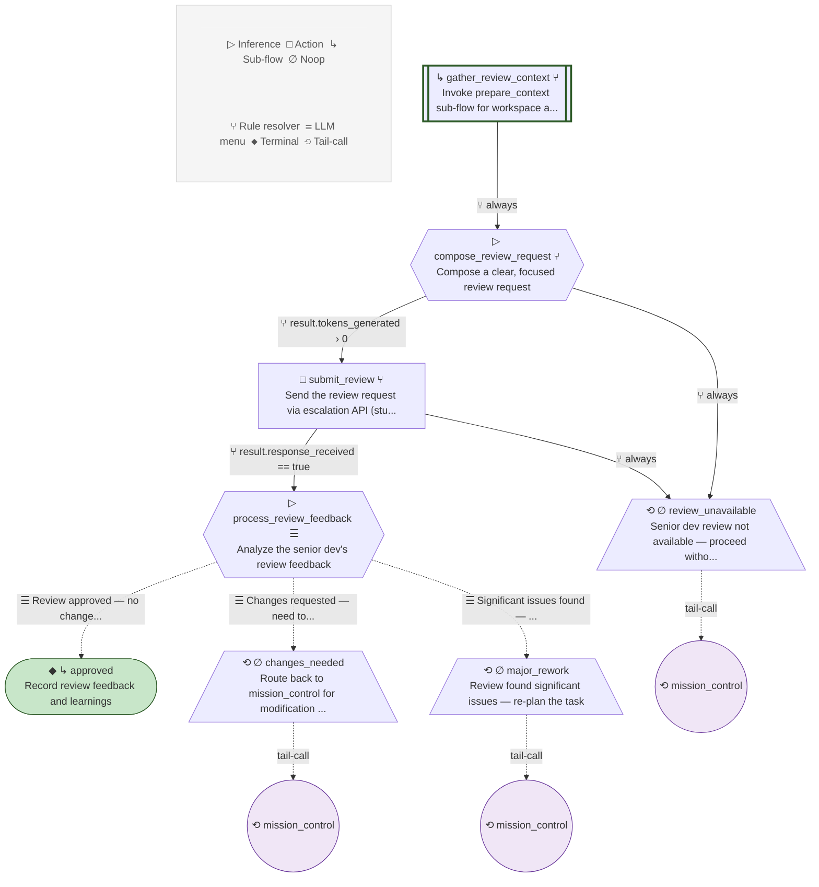
```mermaid
flowchart TD
    %% request_review v1

    subgraph Legend[" "]
        L1["▷ Inference  □ Action  ↳ Sub-flow  ∅ Noop"]
        L2["⑂ Rule resolver  ☰ LLM menu  ◆ Terminal  ⟲ Tail-call"]
    end
    style Legend fill:#f5f5f5,stroke:#ccc,stroke-width:1px
    style L1 fill:#f5f5f5,stroke:none,color:#555
    style L2 fill:#f5f5f5,stroke:none,color:#555

    gather_review_context[["↳ gather_review_context ⑂\nInvoke prepare_context sub-flow for workspace a..."]]
    compose_review_request{{"▷ compose_review_request ⑂\nCompose a clear, focused review request"}}
    submit_review["□ submit_review ⑂\nSend the review request via escalation API ⟮stu..."]
    process_review_feedback{{"▷ process_review_feedback ☰\nAnalyze the senior dev's review feedback"}}
    approved(["◆ ↳ approved\nRecord review feedback and learnings"])
    changes_needed[/"⟲ ∅ changes_needed\nRoute back to mission_control for modification ..."\]
    major_rework[/"⟲ ∅ major_rework\nReview found significant issues — re-plan the task"\]
    review_unavailable[/"⟲ ∅ review_unavailable\nSenior dev review not available — proceed witho..."\]

    style gather_review_context stroke-width:3px,stroke:#2d5a27

    gather_review_context -->|⑂ always| compose_review_request
    compose_review_request -->|⑂ result.tokens_generated › 0| submit_review
    compose_review_request -->|⑂ always| review_unavailable
    submit_review -->|⑂ result.response_received == true| process_review_feedback
    submit_review -->|⑂ always| review_unavailable
    process_review_feedback -.->|☰ Review approved — no change...| approved
    process_review_feedback -.->|☰ Changes requested — need to...| changes_needed
    process_review_feedback -.->|☰ Significant issues found — ...| major_rework
    tc_changes_needed(("⟲ mission_control"))
    style tc_changes_needed fill:#f0e6f6,stroke:#663399
    changes_needed -.->|tail-call| tc_changes_needed
    tc_major_rework(("⟲ mission_control"))
    style tc_major_rework fill:#f0e6f6,stroke:#663399
    major_rework -.->|tail-call| tc_major_rework
    tc_review_unavailable(("⟲ mission_control"))
    style tc_review_unavailable fill:#f0e6f6,stroke:#663399
    review_unavailable -.->|tail-call| tc_review_unavailable

    style approved fill:#c8e6c9,stroke:#2d5a27
```

#### retrospective (v1)
*Periodic self-assessment of agent performance. Reviews completed work, analyzes patterns in successes and failures, evaluates effort distribution, and produces actionable recommendations that modify mission state.*

**Inputs:** ○ mission_id · ◑ task_id · ◑ task_description · ◑ working_directory · ◑ trigger_reason · ◑ scope
**Publishes:** ● mission_history · ● task_outcomes · ● learnings_archive · ● timing_data · ● inference_response · ● performance_analysis · ● changes_applied · ● director_report
**Sub-flows:** ↳ capture_learnings · ↳ capture_learnings
**Tail-calls:** ⟲ mission_control
**Effects:** ⟶ inference · list_artifacts · load_artifact · →𓇴 load mission · 𓇴→ push event · 𓇴→ save mission
**Stats:** 11 steps · ▷ 2-3 inference · 7 ⑂ rule · 1 ☰ menu

**Prompts:**
- **analyze_patterns** ▷ (t*0.6): Review performance record and identify patterns
  Injects: {← context.mission_history.objective}, {← task.id}, {← task.flow}, {← task.status}, {← task.attempts} (+9 more)
- **generate_recommendations** ▷ (t*0.5): Produce specific, actionable recommendations
  Injects: {← context.performance_analysis}, {← task.id}, {← task.description}

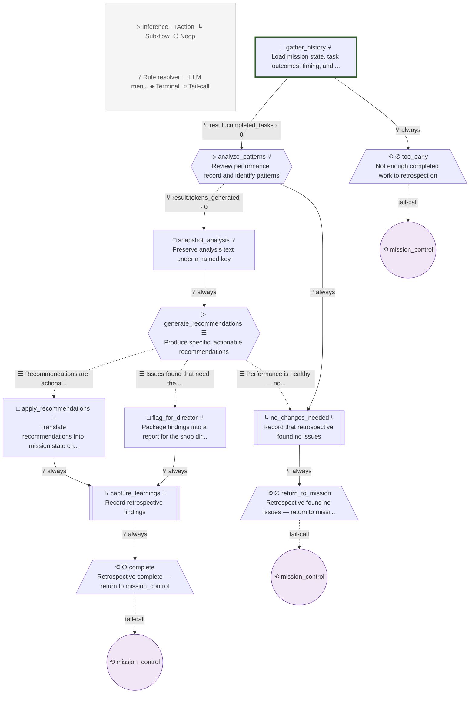
```mermaid
flowchart TD
    %% retrospective v1

    subgraph Legend[" "]
        L1["▷ Inference  □ Action  ↳ Sub-flow  ∅ Noop"]
        L2["⑂ Rule resolver  ☰ LLM menu  ◆ Terminal  ⟲ Tail-call"]
    end
    style Legend fill:#f5f5f5,stroke:#ccc,stroke-width:1px
    style L1 fill:#f5f5f5,stroke:none,color:#555
    style L2 fill:#f5f5f5,stroke:none,color:#555

    gather_history["□ gather_history ⑂\nLoad mission state, task outcomes, timing, and ..."]
    analyze_patterns{{"▷ analyze_patterns ⑂\nReview performance record and identify patterns"}}
    snapshot_analysis["□ snapshot_analysis ⑂\nPreserve analysis text under a named key"]
    generate_recommendations{{"▷ generate_recommendations ☰\nProduce specific, actionable recommendations"}}
    apply_recommendations["□ apply_recommendations ⑂\nTranslate recommendations into mission state ch..."]
    flag_for_director["□ flag_for_director ⑂\nPackage findings into a report for the shop dir..."]
    capture_learnings[["↳ capture_learnings ⑂\nRecord retrospective findings"]]
    complete[/"⟲ ∅ complete\nRetrospective complete — return to mission_control"\]
    too_early[/"⟲ ∅ too_early\nNot enough completed work to retrospect on"\]
    no_changes_needed[["↳ no_changes_needed ⑂\nRecord that retrospective found no issues"]]
    return_to_mission[/"⟲ ∅ return_to_mission\nRetrospective found no issues — return to missi..."\]

    style gather_history stroke-width:3px,stroke:#2d5a27

    gather_history -->|⑂ result.completed_tasks › 0| analyze_patterns
    gather_history -->|⑂ always| too_early
    analyze_patterns -->|⑂ result.tokens_generated › 0| snapshot_analysis
    analyze_patterns -->|⑂ always| no_changes_needed
    snapshot_analysis -->|⑂ always| generate_recommendations
    generate_recommendations -.->|☰ Recommendations are actiona...| apply_recommendations
    generate_recommendations -.->|☰ Issues found that need the ...| flag_for_director
    generate_recommendations -.->|☰ Performance is healthy — no...| no_changes_needed
    apply_recommendations -->|⑂ always| capture_learnings
    flag_for_director -->|⑂ always| capture_learnings
    capture_learnings -->|⑂ always| complete
    tc_complete(("⟲ mission_control"))
    style tc_complete fill:#f0e6f6,stroke:#663399
    complete -.->|tail-call| tc_complete
    tc_too_early(("⟲ mission_control"))
    style tc_too_early fill:#f0e6f6,stroke:#663399
    too_early -.->|tail-call| tc_too_early
    no_changes_needed -->|⑂ always| return_to_mission
    tc_return_to_mission(("⟲ mission_control"))
    style tc_return_to_mission fill:#f0e6f6,stroke:#663399
    return_to_mission -.->|tail-call| tc_return_to_mission

```

#### setup_project (v1)
*Project management flow for initializing and configuring a target project. Scans the project to determine language/framework, then sets up appropriate tooling: package managers, linters, formatters, test frameworks, config files. The LLM decides what's needed based on the project — language agnostic.*

**Inputs:** ○ mission_id · ○ task_id · ◑ task_description · ◑ mission_objective · ◑ working_directory · ◑ setup_focus · ◑ relevant_notes · ◑ frustration_level · ◑ frustration_history
**Publishes:** ● project_manifest · ● inference_response · ● setup_results · ● learnings_saved
**Sub-flows:** ↳ capture_learnings · ↳ capture_learnings
**Tail-calls:** ⟲ mission_control
**Effects:** file_exists · ⟶ inference · 𓉗 list dir · 𓉗 file read · ⌘ command · 𓉗 file write
**Stats:** 8 steps · ▷ 2 inference · 6 ⑂ rule

**Prompts:**
- **analyze_needs** ▷ (0.2): LLM analyzes project and determines what setup is needed
  Injects: {← input.setup_focus}, {← input.mission_objective}, {← filepath}, {← sig}
- **init_empty_project** ▷ (0.2): No files found — generate project scaffold
  Injects: {← input.mission_objective}, {← input.setup_focus}

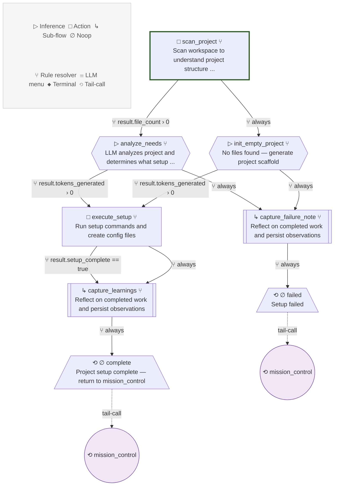
```mermaid
flowchart TD
    %% setup_project v1

    subgraph Legend[" "]
        L1["▷ Inference  □ Action  ↳ Sub-flow  ∅ Noop"]
        L2["⑂ Rule resolver  ☰ LLM menu  ◆ Terminal  ⟲ Tail-call"]
    end
    style Legend fill:#f5f5f5,stroke:#ccc,stroke-width:1px
    style L1 fill:#f5f5f5,stroke:none,color:#555
    style L2 fill:#f5f5f5,stroke:none,color:#555

    scan_project["□ scan_project ⑂\nScan workspace to understand project structure ..."]
    analyze_needs{{"▷ analyze_needs ⑂\nLLM analyzes project and determines what setup ..."}}
    execute_setup["□ execute_setup ⑂\nRun setup commands and create config files"]
    init_empty_project{{"▷ init_empty_project ⑂\nNo files found — generate project scaffold"}}
    capture_learnings[["↳ capture_learnings ⑂\nReflect on completed work and persist observations"]]
    complete[/"⟲ ∅ complete\nProject setup complete — return to mission_control"\]
    capture_failure_note[["↳ capture_failure_note ⑂\nReflect on completed work and persist observations"]]
    failed[/"⟲ ∅ failed\nSetup failed"\]

    style scan_project stroke-width:3px,stroke:#2d5a27

    scan_project -->|⑂ result.file_count › 0| analyze_needs
    scan_project -->|⑂ always| init_empty_project
    analyze_needs -->|⑂ result.tokens_generated › 0| execute_setup
    analyze_needs -->|⑂ always| capture_failure_note
    execute_setup -->|⑂ result.setup_complete == true| capture_learnings
    execute_setup -->|⑂ always| capture_learnings
    init_empty_project -->|⑂ result.tokens_generated › 0| execute_setup
    init_empty_project -->|⑂ always| capture_failure_note
    capture_learnings -->|⑂ always| complete
    tc_complete(("⟲ mission_control"))
    style tc_complete fill:#f0e6f6,stroke:#663399
    complete -.->|tail-call| tc_complete
    capture_failure_note -->|⑂ always| failed
    tc_failed(("⟲ mission_control"))
    style tc_failed fill:#f0e6f6,stroke:#663399
    failed -.->|tail-call| tc_failed

```

#### validate_behavior (v1)
*Run the project code and verify actual behavior matches expectations. Uses run_in_terminal for multi-turn interactive CLI testing. Produces a behavioral assessment with pass/fail and issue descriptions.*

**Inputs:** ○ mission_id · ○ task_id · ◑ task_description · ◑ mission_objective · ◑ working_directory · ◑ target_file_path · ◑ entry_point · ◑ test_scenarios · ◑ reason · ◑ temperature_multiplier · ◑ frustration_level · ◑ frustration_history · ◑ relevant_notes
**Publishes:** ● context_bundle · ● project_manifest · ● repo_map_formatted · ● related_files · ● inference_response · ● session_history · ● session_summary · ● learnings_saved
**Sub-flows:** ↳ prepare_context · ↳ run_in_terminal · ↳ capture_learnings · ↳ capture_learnings
**Tail-calls:** ⟲ mission_control
**Effects:** ⟶ inference
**Stats:** 10 steps · ▷ 2 inference · 7 ⑂ rule

**Prompts:**
- **plan_test_scenarios** ▷ (0.2): LLM reads project code and plans interactive test scenarios
  Injects: {← input.mission_objective}, {← input.task_description}, {← input.entry_point}, {← input.target_file_path}, {← file.path} (+2 more)
- **analyze_results** ▷ (0.1): LLM reviews test session and produces behavioral assessment
  Injects: {← entry.turn}, {← entry.command}, {← entry.output}, {← entry.return_code}

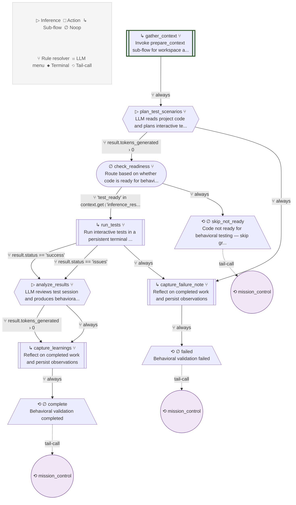
```mermaid
flowchart TD
    %% validate_behavior v1

    subgraph Legend[" "]
        L1["▷ Inference  □ Action  ↳ Sub-flow  ∅ Noop"]
        L2["⑂ Rule resolver  ☰ LLM menu  ◆ Terminal  ⟲ Tail-call"]
    end
    style Legend fill:#f5f5f5,stroke:#ccc,stroke-width:1px
    style L1 fill:#f5f5f5,stroke:none,color:#555
    style L2 fill:#f5f5f5,stroke:none,color:#555

    gather_context[["↳ gather_context ⑂\nInvoke prepare_context sub-flow for workspace a..."]]
    plan_test_scenarios{{"▷ plan_test_scenarios ⑂\nLLM reads project code and plans interactive te..."}}
    check_readiness(["∅ check_readiness ⑂\nRoute based on whether code is ready for behavi..."])
    run_tests[["↳ run_tests ⑂\nRun interactive tests in a persistent terminal ..."]]
    analyze_results{{"▷ analyze_results ⑂\nLLM reviews test session and produces behaviora..."}}
    skip_not_ready[/"⟲ ∅ skip_not_ready\nCode not ready for behavioral testing — skip gr..."\]
    capture_learnings[["↳ capture_learnings ⑂\nReflect on completed work and persist observations"]]
    complete[/"⟲ ∅ complete\nBehavioral validation completed"\]
    capture_failure_note[["↳ capture_failure_note ⑂\nReflect on completed work and persist observations"]]
    failed[/"⟲ ∅ failed\nBehavioral validation failed"\]

    style gather_context stroke-width:3px,stroke:#2d5a27

    gather_context -->|⑂ always| plan_test_scenarios
    plan_test_scenarios -->|⑂ result.tokens_generated › 0| check_readiness
    plan_test_scenarios -->|⑂ always| capture_failure_note
    check_readiness -->|⑂ 'test_ready' in context.get⟮'inference_res...| run_tests
    check_readiness -->|⑂ always| skip_not_ready
    run_tests -->|⑂ result.status == 'success'| analyze_results
    run_tests -->|⑂ result.status == 'issues'| analyze_results
    run_tests -->|⑂ always| capture_failure_note
    analyze_results -->|⑂ result.tokens_generated › 0| capture_learnings
    analyze_results -->|⑂ always| capture_learnings
    tc_skip_not_ready(("⟲ mission_control"))
    style tc_skip_not_ready fill:#f0e6f6,stroke:#663399
    skip_not_ready -.->|tail-call| tc_skip_not_ready
    capture_learnings -->|⑂ always| complete
    tc_complete(("⟲ mission_control"))
    style tc_complete fill:#f0e6f6,stroke:#663399
    complete -.->|tail-call| tc_complete
    capture_failure_note -->|⑂ always| failed
    tc_failed(("⟲ mission_control"))
    style tc_failed fill:#f0e6f6,stroke:#663399
    failed -.->|tail-call| tc_failed

```

### Shared Sub-flows

#### ast_edit_session (v1)
*Memoryful AST-aware editing session. Receives a parsed symbol table and file content, presents symbols as a constrained menu for progressive selection, then rewrites each selected symbol sequentially in a memoryful inference session. Each rewrite sees the result of prior rewrites. Returns the modified file written to disk.*

**Inputs:** ○ file_path · ○ file_content · ○ symbol_table · ○ symbol_menu_options · ○ task_description · ◑ reason · ◑ mode · ◑ relevant_notes · ◑ working_directory
**Terminal:** ◆ success · ◆ full_rewrite_requested · ◆ failed
**Publishes:** ● edit_session_id · ● file_content · ● file_path · ● mode · ● selected_symbols · ● selection_turn · ● rewrite_queue · ● current_symbol · ● file_content_updated · ● files_changed (+1 more)
**Effects:** end_inference_session · session_inference · start_inference_session · 𓉗 file write
**Stats:** 8 steps · 4 ⑂ rule

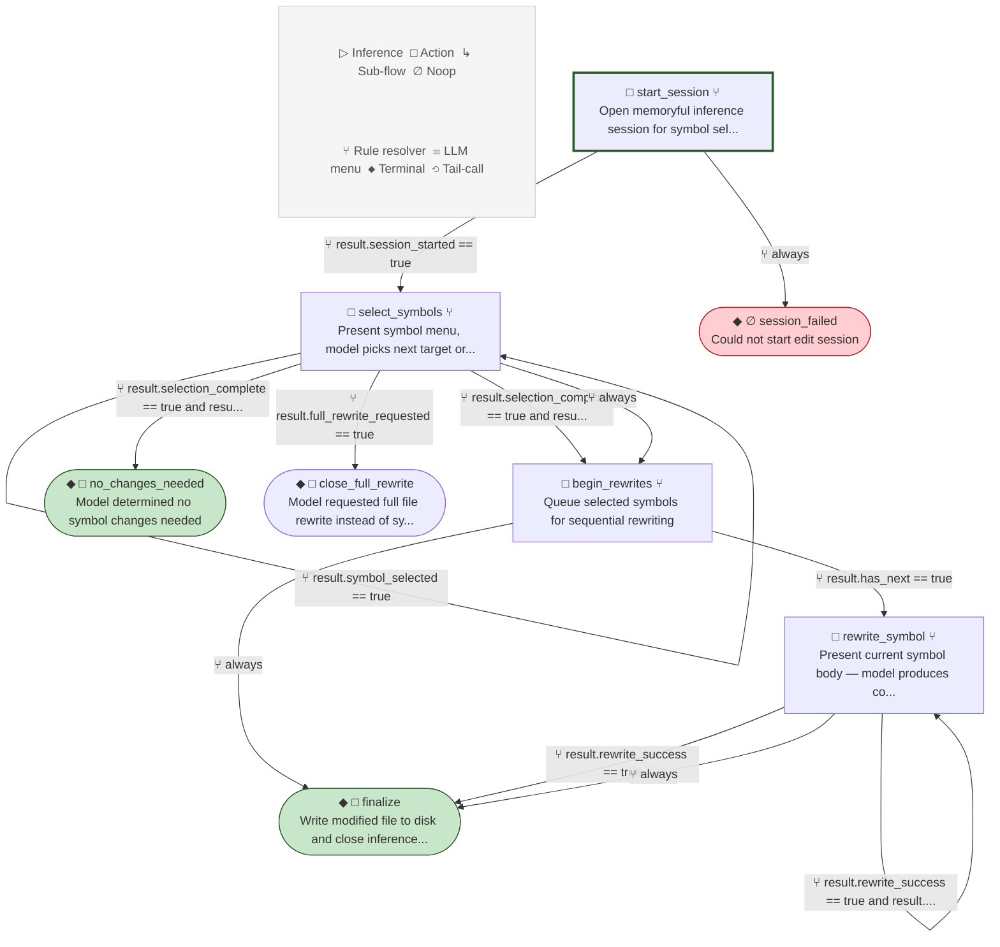
```mermaid
flowchart TD
    %% ast_edit_session v1

    subgraph Legend[" "]
        L1["▷ Inference  □ Action  ↳ Sub-flow  ∅ Noop"]
        L2["⑂ Rule resolver  ☰ LLM menu  ◆ Terminal  ⟲ Tail-call"]
    end
    style Legend fill:#f5f5f5,stroke:#ccc,stroke-width:1px
    style L1 fill:#f5f5f5,stroke:none,color:#555
    style L2 fill:#f5f5f5,stroke:none,color:#555

    start_session["□ start_session ⑂\nOpen memoryful inference session for symbol sel..."]
    select_symbols["□ select_symbols ⑂\nPresent symbol menu, model picks next target or..."]
    begin_rewrites["□ begin_rewrites ⑂\nQueue selected symbols for sequential rewriting"]
    rewrite_symbol["□ rewrite_symbol ⑂\nPresent current symbol body — model produces co..."]
    finalize(["◆ □ finalize\nWrite modified file to disk and close inference..."])
    no_changes_needed(["◆ □ no_changes_needed\nModel determined no symbol changes needed"])
    close_full_rewrite(["◆ □ close_full_rewrite\nModel requested full file rewrite instead of sy..."])
    session_failed(["◆ ∅ session_failed\nCould not start edit session"])

    style start_session stroke-width:3px,stroke:#2d5a27

    start_session -->|⑂ result.session_started == true| select_symbols
    start_session -->|⑂ always| session_failed
    select_symbols -->|⑂ result.selection_complete == true and resu...| begin_rewrites
    select_symbols -->|⑂ result.selection_complete == true and resu...| no_changes_needed
    select_symbols -->|⑂ result.full_rewrite_requested == true| close_full_rewrite
    select_symbols -->|⑂ result.symbol_selected == true| select_symbols
    select_symbols -->|⑂ always| begin_rewrites
    begin_rewrites -->|⑂ result.has_next == true| rewrite_symbol
    begin_rewrites -->|⑂ always| finalize
    rewrite_symbol -->|⑂ result.rewrite_success == true and result....| rewrite_symbol
    rewrite_symbol -->|⑂ result.rewrite_success == true| finalize
    rewrite_symbol -->|⑂ always| finalize

    style finalize fill:#c8e6c9,stroke:#2d5a27
    style no_changes_needed fill:#c8e6c9,stroke:#2d5a27
    style session_failed fill:#ffcdd2,stroke:#b71c1c
```

#### capture_learnings (v1)
*Reflect on completed work and persist observations as notes. Adjusts reflection prompt based on learning_focus parameter.*

**Inputs:** ○ task_description · ◑ target_file_path · ◑ task_outcome · ◑ learning_focus · ◑ category · ◑ tags
**Terminal:** ◆ success
**Publishes:** ● target_file · ● inference_response · ● note_saved
**Effects:** ⟶ inference · →𓇴 load mission · 𓉗 file read · 𓇴→ save mission
**Stats:** 5 steps · ▷ 1 inference · 3 ⑂ rule

**Prompts:**
- **reflect** ▷ (0.2): Generate a reflection on what was learned
  Injects: {← input.task_description}, {← input.target_file_path}, {← input.task_outcome}, {← context.target_file.content[:2000]}

```mermaid
flowchart TD
    %% capture_learnings v1

    subgraph Legend[" "]
        L1["▷ Inference  □ Action  ↳ Sub-flow  ∅ Noop"]
        L2["⑂ Rule resolver  ☰ LLM menu  ◆ Terminal  ⟲ Tail-call"]
    end
    style Legend fill:#f5f5f5,stroke:#ccc,stroke-width:1px
    style L1 fill:#f5f5f5,stroke:none,color:#555
    style L2 fill:#f5f5f5,stroke:none,color:#555

    read_source["□ read_source ⑂\nRead the actual file content for grounded refle..."]
    reflect{{"▷ reflect ⑂\nGenerate a reflection on what was learned"}}
    save_note["□ save_note ⑂\nPersist the reflection as a note"]
    skip(["◆ ∅ skip\nNo reflection generated — skip note"])
    complete(["◆ ∅ complete\nLearning captured"])

    style read_source stroke-width:3px,stroke:#2d5a27

    read_source -->|⑂ result.file_found == true| reflect
    read_source -->|⑂ always| reflect
    reflect -->|⑂ result.tokens_generated › 0| save_note
    reflect -->|⑂ always| skip
    save_note -->|⑂ always| complete

    style skip fill:#c8e6c9,stroke:#2d5a27
    style complete fill:#c8e6c9,stroke:#2d5a27
```

#### prepare_context (v1)
*Sub-flow that scans the workspace, asks the model which files are relevant to a given task, and returns a curated context bundle. Integrates web research when frustration indicates repeated failures.*

**Inputs:** ○ working_directory · ○ task_description · ◑ mission_objective · ◑ target_file_path · ◑ frustration_history · ◑ frustration_level · ◑ context_budget · ◑ relevant_notes
**Terminal:** ◆ success
**Publishes:** ● project_manifest · ● repo_map_formatted · ● related_files · ● research_findings · ● selected_files · ● context_bundle
**Sub-flows:** ↳ research_context
**Effects:** ⟶ inference · 𓉗 list dir · 𓉗 file read
**Stats:** 11 steps · ▷ 2-4 inference · 8 ⑂ rule · 2 ☰ menu

**Prompts:**
- **decide_research_recommended** ▷ (): LLM decides whether to research — frustration elevated
  Injects: {← input.task_description}, {← input.frustration_history}
- **decide_research_optional** ▷ (): LLM decides whether to research — first attempt, optional
  Injects: {← input.task_description}, {← input.mission_objective}

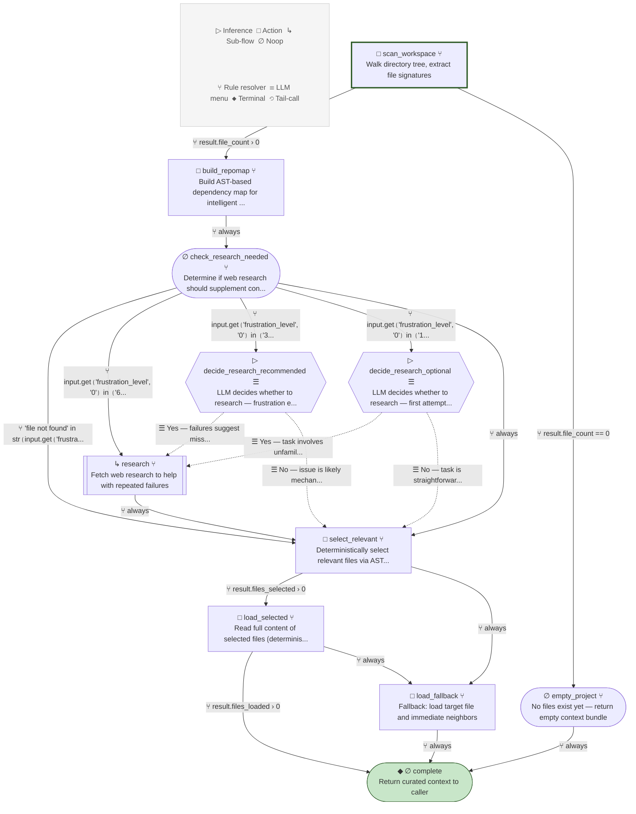
```mermaid
flowchart TD
    %% prepare_context v1

    subgraph Legend[" "]
        L1["▷ Inference  □ Action  ↳ Sub-flow  ∅ Noop"]
        L2["⑂ Rule resolver  ☰ LLM menu  ◆ Terminal  ⟲ Tail-call"]
    end
    style Legend fill:#f5f5f5,stroke:#ccc,stroke-width:1px
    style L1 fill:#f5f5f5,stroke:none,color:#555
    style L2 fill:#f5f5f5,stroke:none,color:#555

    scan_workspace["□ scan_workspace ⑂\nWalk directory tree, extract file signatures"]
    build_repomap["□ build_repomap ⑂\nBuild AST-based dependency map for intelligent ..."]
    check_research_needed(["∅ check_research_needed ⑂\nDetermine if web research should supplement con..."])
    decide_research_recommended{{"▷ decide_research_recommended ☰\nLLM decides whether to research — frustration e..."}}
    decide_research_optional{{"▷ decide_research_optional ☰\nLLM decides whether to research — first attempt..."}}
    research[["↳ research ⑂\nFetch web research to help with repeated failures"]]
    select_relevant["□ select_relevant ⑂\nDeterministically select relevant files via AST..."]
    load_selected["□ load_selected ⑂\nRead full content of selected files ⟮determinis..."]
    load_fallback["□ load_fallback ⑂\nFallback: load target file and immediate neighbors"]
    empty_project(["∅ empty_project ⑂\nNo files exist yet — return empty context bundle"])
    complete(["◆ ∅ complete\nReturn curated context to caller"])

    style scan_workspace stroke-width:3px,stroke:#2d5a27

    scan_workspace -->|⑂ result.file_count › 0| build_repomap
    scan_workspace -->|⑂ result.file_count == 0| empty_project
    build_repomap -->|⑂ always| check_research_needed
    check_research_needed -->|⑂ 'file not found' in str⟮input.get⟮'frustra...| select_relevant
    check_research_needed -->|⑂ input.get⟮'frustration_level', '0'⟯ in ⟮'6...| research
    check_research_needed -->|⑂ input.get⟮'frustration_level', '0'⟯ in ⟮'3...| decide_research_recommended
    check_research_needed -->|⑂ input.get⟮'frustration_level', '0'⟯ in ⟮'1...| decide_research_optional
    check_research_needed -->|⑂ always| select_relevant
    decide_research_recommended -.->|☰ Yes — failures suggest miss...| research
    decide_research_recommended -.->|☰ No — issue is likely mechan...| select_relevant
    decide_research_optional -.->|☰ Yes — task involves unfamil...| research
    decide_research_optional -.->|☰ No — task is straightforwar...| select_relevant
    research -->|⑂ always| select_relevant
    select_relevant -->|⑂ result.files_selected › 0| load_selected
    select_relevant -->|⑂ always| load_fallback
    load_selected -->|⑂ result.files_loaded › 0| complete
    load_selected -->|⑂ always| load_fallback
    load_fallback -->|⑂ always| complete
    empty_project -->|⑂ always| complete

    style complete fill:#c8e6c9,stroke:#2d5a27
```

#### quality_gate (v2)
*Project-wide quality validation. Runs in two modes: - "completion" (default): Final gate before declaring mission complete. - "checkpoint": Mid-mission quality inspection to assess current state
  and identify issues worth expanding the plan for.
Scans the project, uses LLM to plan comprehensive validation checks (imports, tests, integration), executes them, and reports results.*

**Inputs:** ○ working_directory · ○ mission_id · ◑ mission_objective · ◑ relevant_notes · ◑ mode
**Terminal:** ◆ success · ◆ failed
**Publishes:** ● project_manifest · ● cross_file_results · ● cross_file_summary · ● inference_response · ● validation_results · ● quality_results
**Effects:** ⟶ inference · 𓉗 list dir · →𓇴 load mission · 𓉗 file read · ⌘ command · 𓇴→ save mission
**Stats:** 9 steps · ▷ 2 inference · 6 ⑂ rule

**Prompts:**
- **plan_checks** ▷ (0.0): LLM plans comprehensive project-wide validation
  Injects: {← input.working_directory}, {← filepath}, {← sig[:120]}
- **summarize** ▷ (0.1): Summarize quality gate results into actionable findings
  Injects: {← filepath}, {← context.cross_file_summary}, {← check.name}, {← "PASS" if check.passed else "FAIL"}, {← check.stdout[:200]} (+1 more)

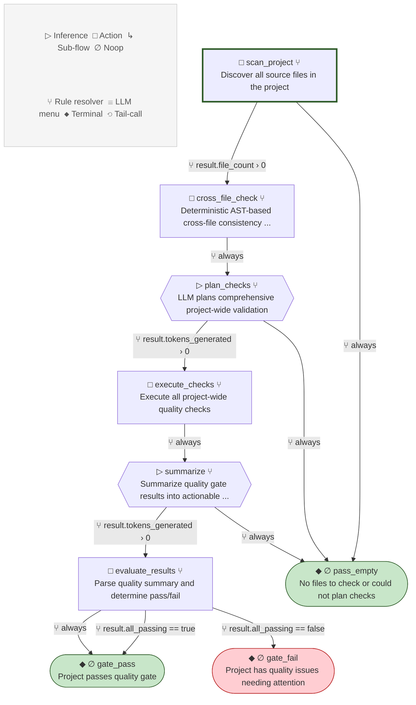
```mermaid
flowchart TD
    %% quality_gate v2

    subgraph Legend[" "]
        L1["▷ Inference  □ Action  ↳ Sub-flow  ∅ Noop"]
        L2["⑂ Rule resolver  ☰ LLM menu  ◆ Terminal  ⟲ Tail-call"]
    end
    style Legend fill:#f5f5f5,stroke:#ccc,stroke-width:1px
    style L1 fill:#f5f5f5,stroke:none,color:#555
    style L2 fill:#f5f5f5,stroke:none,color:#555

    scan_project["□ scan_project ⑂\nDiscover all source files in the project"]
    cross_file_check["□ cross_file_check ⑂\nDeterministic AST-based cross-file consistency ..."]
    plan_checks{{"▷ plan_checks ⑂\nLLM plans comprehensive project-wide validation"}}
    execute_checks["□ execute_checks ⑂\nExecute all project-wide quality checks"]
    summarize{{"▷ summarize ⑂\nSummarize quality gate results into actionable ..."}}
    evaluate_results["□ evaluate_results ⑂\nParse quality summary and determine pass/fail"]
    gate_pass(["◆ ∅ gate_pass\nProject passes quality gate"])
    gate_fail(["◆ ∅ gate_fail\nProject has quality issues needing attention"])
    pass_empty(["◆ ∅ pass_empty\nNo files to check or could not plan checks"])

    style scan_project stroke-width:3px,stroke:#2d5a27

    scan_project -->|⑂ result.file_count › 0| cross_file_check
    scan_project -->|⑂ always| pass_empty
    cross_file_check -->|⑂ always| plan_checks
    plan_checks -->|⑂ result.tokens_generated › 0| execute_checks
    plan_checks -->|⑂ always| pass_empty
    execute_checks -->|⑂ always| summarize
    summarize -->|⑂ result.tokens_generated › 0| evaluate_results
    summarize -->|⑂ always| pass_empty
    evaluate_results -->|⑂ result.all_passing == true| gate_pass
    evaluate_results -->|⑂ result.all_passing == false| gate_fail
    evaluate_results -->|⑂ always| gate_pass

    style gate_pass fill:#c8e6c9,stroke:#2d5a27
    style gate_fail fill:#ffcdd2,stroke:#b71c1c
    style pass_empty fill:#c8e6c9,stroke:#2d5a27
```

#### research_codebase_history (v1)
*Investigate the history of code changes using git. Plans git commands based on a research question, executes them, and synthesizes the history into an actionable answer.*

**Inputs:** ○ research_query · ◑ working_directory · ◑ target_file · ◑ time_range
**Terminal:** ◆ success · ◆ failed
**Publishes:** ● git_commands · ● git_output · ● raw_results
**Effects:** ⟶ inference · ⌘ command
**Stats:** 4 steps · ▷ 2 inference · 2 ⑂ rule

**Prompts:**
- **determine_git_commands** ▷ (t*0.2): Determine which git commands will answer the question
  Injects: {← context.research_query}, {← context.target_file}, {← context.time_range}
- **analyze_history** ▷ (t*0.3): Synthesize git output into an answer
  Injects: {← context.research_query}, {← context.git_output}

```mermaid
flowchart TD
    %% research_codebase_history v1

    subgraph Legend[" "]
        L1["▷ Inference  □ Action  ↳ Sub-flow  ∅ Noop"]
        L2["⑂ Rule resolver  ☰ LLM menu  ◆ Terminal  ⟲ Tail-call"]
    end
    style Legend fill:#f5f5f5,stroke:#ccc,stroke-width:1px
    style L1 fill:#f5f5f5,stroke:none,color:#555
    style L2 fill:#f5f5f5,stroke:none,color:#555

    determine_git_commands{{"▷ determine_git_commands ⑂\nDetermine which git commands will answer the qu..."}}
    execute_git_commands["□ execute_git_commands ⑂\nExecute the planned git commands and collect ou..."]
    analyze_history(["◆ ▷ analyze_history\nSynthesize git output into an answer"])
    no_history(["◆ ∅ no_history\nNo git history available or no useful output"])

    style determine_git_commands stroke-width:3px,stroke:#2d5a27

    determine_git_commands -->|⑂ result.tokens_generated › 0| execute_git_commands
    determine_git_commands -->|⑂ always| no_history
    execute_git_commands -->|⑂ result.any_output == true| analyze_history
    execute_git_commands -->|⑂ always| no_history

    style analyze_history fill:#c8e6c9,stroke:#2d5a27
    style no_history fill:#ffcdd2,stroke:#b71c1c
```

#### research_context (v2)
*Research dispatcher — classifies a research query and routes to the most appropriate research strategy. Supports web search (default), codebase structure analysis (repomap), git history investigation, and technical literature search. Interface to callers is unchanged from v1 — same inputs, same published outputs.*

**Inputs:** ○ problem_description · ◑ error_output · ◑ search_hints · ◑ max_queries · ◑ working_directory · ◑ target_file_path · ◑ research_type_hint
**Terminal:** ◆ success
**Publishes:** ● query_classification · ● inference_response · ● search_queries · ● raw_search_results · ● research_findings · ● raw_results
**Sub-flows:** ↳ research_repomap · ↳ research_codebase_history · ↳ research_technical
**Effects:** ⟶ inference · ⌘ command
**Stats:** 12 steps · ▷ 4-5 inference · 9 ⑂ rule · 1 ☰ menu

**Prompts:**
- **classify_query_menu** ▷ (): LLM classifies research query
  Injects: {← input.problem_description}, {← input.error_output[:500]}
- **formulate_query** ▷ (0.2): Turn the problem into effective search queries
  Injects: {← input.problem_description}, {← input.error_output}, {← input.search_hints}
- **extract_relevant** ▷ (0.1): Extract actionable information from search results
  Injects: {← input.problem_description}, {← result.url}, {← result.content[:2000]}
- **synthesize_subflow** ▷ (t*0.3): Synthesize sub-flow research results into actionable findings
  Injects: {← input.problem_description}, {← context.raw_results}

```mermaid
flowchart TD
    %% research_context v2

    subgraph Legend[" "]
        L1["▷ Inference  □ Action  ↳ Sub-flow  ∅ Noop"]
        L2["⑂ Rule resolver  ☰ LLM menu  ◆ Terminal  ⟲ Tail-call"]
    end
    style Legend fill:#f5f5f5,stroke:#ccc,stroke-width:1px
    style L1 fill:#f5f5f5,stroke:none,color:#555
    style L2 fill:#f5f5f5,stroke:none,color:#555

    classify_query(["∅ classify_query ⑂\nFast-path when research type is already known"])
    classify_query_menu{{"▷ classify_query_menu ☰\nLLM classifies research query"}}
    formulate_query{{"▷ formulate_query ⑂\nTurn the problem into effective search queries"}}
    parse_queries["□ parse_queries ⑂\nParse JSON array from inference response into s..."]
    execute_search["□ execute_search ⑂\nExecute search queries via curl"]
    extract_relevant{{"▷ extract_relevant ⑂\nExtract actionable information from search results"}}
    route_repomap[["↳ route_repomap ⑂\nAnalyze codebase structure via AST-based repo map"]]
    route_history[["↳ route_history ⑂\nInvestigate code history via git"]]
    route_technical[["↳ route_technical ⑂\nSearch authoritative technical sources"]]
    synthesize_subflow{{"▷ synthesize_subflow ⑂\nSynthesize sub-flow research results into actio..."}}
    empty_result(["◆ ∅ empty_result\nNo useful research results"])
    complete(["◆ ∅ complete\nResearch complete"])

    style classify_query stroke-width:3px,stroke:#2d5a27

    classify_query -->|⑂ input.get⟮'research_type_hint', ''⟯ == 'we...| formulate_query
    classify_query -->|⑂ input.get⟮'research_type_hint', ''⟯ == 'co...| route_repomap
    classify_query -->|⑂ input.get⟮'research_type_hint', ''⟯ == 'co...| route_history
    classify_query -->|⑂ input.get⟮'research_type_hint', ''⟯ == 'te...| route_technical
    classify_query -->|⑂ always| classify_query_menu
    classify_query_menu -.->|☰ Web search — documentation,...| formulate_query
    classify_query_menu -.->|☰ Codebase structure — file r...| route_repomap
    classify_query_menu -.->|☰ Code history — git history ...| route_history
    classify_query_menu -.->|☰ Technical docs — authoritat...| route_technical
    formulate_query -->|⑂ result.tokens_generated › 0| parse_queries
    formulate_query -->|⑂ always| empty_result
    parse_queries -->|⑂ result.query_count › 0| execute_search
    parse_queries -->|⑂ always| empty_result
    execute_search -->|⑂ result.results_found › 0| extract_relevant
    execute_search -->|⑂ always| empty_result
    extract_relevant -->|⑂ result.tokens_generated › 0| complete
    extract_relevant -->|⑂ always| empty_result
    route_repomap -->|⑂ result.status == 'success'| synthesize_subflow
    route_repomap -->|⑂ always| formulate_query
    route_history -->|⑂ result.status == 'success'| synthesize_subflow
    route_history -->|⑂ always| formulate_query
    route_technical -->|⑂ result.status == 'success'| synthesize_subflow
    route_technical -->|⑂ always| formulate_query
    synthesize_subflow -->|⑂ result.tokens_generated › 0| complete
    synthesize_subflow -->|⑂ always| empty_result

    style empty_result fill:#c8e6c9,stroke:#2d5a27
    style complete fill:#c8e6c9,stroke:#2d5a27
```

#### research_repomap (v1)
*Build an AST-based repository map using tree-sitter and PageRank, then query it for structural context relevant to a research question. Returns symbol definitions, file rankings, and related file lists.*

**Inputs:** ○ research_query · ◑ working_directory · ◑ target_file_path · ◑ focus_files
**Terminal:** ◆ success · ◆ failed
**Publishes:** ● repo_map_formatted · ● related_files · ● raw_results
**Effects:** ⟶ inference · 𓉗 list dir · 𓉗 file read
**Stats:** 3 steps · ▷ 1 inference · 1 ⑂ rule

**Prompts:**
- **analyze_structure** ▷ (t*0.3): Analyze the repo map to answer the research query
  Injects: {← context.research_query}, {← context.repo_map_formatted}, {← context.related_files | join(', ')}

```mermaid
flowchart TD
    %% research_repomap v1

    subgraph Legend[" "]
        L1["▷ Inference  □ Action  ↳ Sub-flow  ∅ Noop"]
        L2["⑂ Rule resolver  ☰ LLM menu  ◆ Terminal  ⟲ Tail-call"]
    end
    style Legend fill:#f5f5f5,stroke:#ccc,stroke-width:1px
    style L1 fill:#f5f5f5,stroke:none,color:#555
    style L2 fill:#f5f5f5,stroke:none,color:#555

    build_map["□ build_map ⑂\nBuild repo map from workspace files using tree-..."]
    analyze_structure(["◆ ▷ analyze_structure\nAnalyze the repo map to answer the research query"])
    no_results(["◆ ∅ no_results\nNo source files found to build repo map"])

    style build_map stroke-width:3px,stroke:#2d5a27

    build_map -->|⑂ result.files_mapped › 0| analyze_structure
    build_map -->|⑂ always| no_results

    style analyze_structure fill:#c8e6c9,stroke:#2d5a27
    style no_results fill:#ffcdd2,stroke:#b71c1c
```

#### research_technical (v1)
*Research technical concepts from authoritative sources. Adds site-specific filters to search queries targeting official documentation, academic papers, and authoritative tutorials. Reuses existing curl_search infrastructure.*

**Inputs:** ○ research_query · ◑ domain_hint
**Terminal:** ◆ success · ◆ failed
**Publishes:** ● search_queries · ● raw_search_results · ● raw_results
**Effects:** ⟶ inference · ⌘ command
**Stats:** 4 steps · ▷ 1 inference · 2 ⑂ rule

**Prompts:**
- **filter_and_format** ▷ (t*0.2): Filter search results for technical quality and relevance
  Injects: {← context.research_query}, {← context.domain_hint}, {← result.url}, {← result.content[:2000]}

```mermaid
flowchart TD
    %% research_technical v1

    subgraph Legend[" "]
        L1["▷ Inference  □ Action  ↳ Sub-flow  ∅ Noop"]
        L2["⑂ Rule resolver  ☰ LLM menu  ◆ Terminal  ⟲ Tail-call"]
    end
    style Legend fill:#f5f5f5,stroke:#ccc,stroke-width:1px
    style L1 fill:#f5f5f5,stroke:none,color:#555
    style L2 fill:#f5f5f5,stroke:none,color:#555

    format_query["□ format_query ⑂\nAdd technical site filters to the search query"]
    execute_search["□ execute_search ⑂\nExecute site-filtered search queries via curl"]
    filter_and_format(["◆ ▷ filter_and_format\nFilter search results for technical quality and..."])
    no_results(["◆ ∅ no_results\nNo technical search results found"])

    style format_query stroke-width:3px,stroke:#2d5a27

    format_query -->|⑂ result.query_count › 0| execute_search
    format_query -->|⑂ always| no_results
    execute_search -->|⑂ result.results_found › 0| filter_and_format
    execute_search -->|⑂ always| no_results

    style filter_and_format fill:#c8e6c9,stroke:#2d5a27
    style no_results fill:#ffcdd2,stroke:#b71c1c
```

#### revise_plan (v1)
*Revise the mission plan based on new observations. Can add tasks, reorder priorities, or mark tasks obsoleted. Writes changes to persistence; mission_control picks them up.*

**Inputs:** ○ mission_id · ○ observation · ◑ discovered_requirement · ◑ affected_task_id
**Terminal:** ◆ success
**Publishes:** ● mission · ● repo_map_formatted · ● related_files · ● inference_response
**Effects:** ⟶ inference · 𓉗 list dir · →𓇴 load mission · →𓇴 read events · 𓉗 file read · 𓇴→ save mission
**Stats:** 6 steps · ▷ 1 inference · 4 ⑂ rule

**Prompts:**
- **evaluate_revision** ▷ (0.3): Determine what plan changes are needed
  Injects: {← context.mission.objective}, {← task.status}, {← task.id}, {← task.description}, {← task.flow} (+5 more)

```mermaid
flowchart TD
    %% revise_plan v1

    subgraph Legend[" "]
        L1["▷ Inference  □ Action  ↳ Sub-flow  ∅ Noop"]
        L2["⑂ Rule resolver  ☰ LLM menu  ◆ Terminal  ⟲ Tail-call"]
    end
    style Legend fill:#f5f5f5,stroke:#ccc,stroke-width:1px
    style L1 fill:#f5f5f5,stroke:none,color:#555
    style L2 fill:#f5f5f5,stroke:none,color:#555

    load_current_plan["□ load_current_plan ⑂\nLoad current mission state to see existing plan"]
    scan_workspace["□ scan_workspace ⑂\nBuild AST-based project map so revisions are gr..."]
    evaluate_revision{{"▷ evaluate_revision ⑂\nDetermine what plan changes are needed"}}
    apply_revision["□ apply_revision ⑂\nApply the revision to mission state"]
    skip(["◆ ∅ skip\nNo revision needed or possible"])
    complete(["◆ ∅ complete\nPlan revised successfully"])

    style load_current_plan stroke-width:3px,stroke:#2d5a27

    load_current_plan -->|⑂ result.mission.status == 'active'| scan_workspace
    load_current_plan -->|⑂ always| skip
    scan_workspace -->|⑂ always| evaluate_revision
    evaluate_revision -->|⑂ result.tokens_generated › 0| apply_revision
    evaluate_revision -->|⑂ always| skip
    apply_revision -->|⑂ result.revision_applied == true| complete
    apply_revision -->|⑂ always| skip

    style skip fill:#c8e6c9,stroke:#2d5a27
    style complete fill:#c8e6c9,stroke:#2d5a27
```

#### run_in_terminal (v1)
*Multi-turn persistent terminal session. Starts a shell subprocess, sends commands, observes output, and loops via LLM menu until the session goal is achieved or max turns exhausted. Used as a sub-flow by validate_behavior, manage_packages, etc.*

**Inputs:** ○ session_goal · ○ working_directory · ◑ initial_commands · ◑ max_turns · ◑ session_context · ◑ environment_vars
**Terminal:** ◆ success · ◆ failed · ◆ issues
**Publishes:** ● session_id · ● inference_session_id · ● session_history · ● inference_response · ● session_summary
**Effects:** ⌘ close terminal · end_inference_session · ⟶ inference · ⌘ terminal cmd · session_inference · start_inference_session · ⌘ terminal
**Stats:** 7 steps · ▷ 2-3 inference · 3 ⑂ rule · 1 ☰ menu

**Prompts:**
- **plan_next_command** ▷ (t*0.6): LLM decides what command to run next
  Injects: {← input.session_goal}, {← input.session_context}, {← entry.turn}, {← entry.command}, {← entry.output} (+1 more)
- **evaluate** ▷ (t*0.4): LLM evaluates session progress and decides next action
  Injects: {← input.session_goal}, {← entry.turn}, {← entry.command}, {← entry.output}, {← entry.return_code}

```mermaid
flowchart TD
    %% run_in_terminal v1

    subgraph Legend[" "]
        L1["▷ Inference  □ Action  ↳ Sub-flow  ∅ Noop"]
        L2["⑂ Rule resolver  ☰ LLM menu  ◆ Terminal  ⟲ Tail-call"]
    end
    style Legend fill:#f5f5f5,stroke:#ccc,stroke-width:1px
    style L1 fill:#f5f5f5,stroke:none,color:#555
    style L2 fill:#f5f5f5,stroke:none,color:#555

    start_session["□ start_session ⑂\nStart persistent shell, memoryful inference ses..."]
    plan_next_command{{"▷ plan_next_command ⑂\nLLM decides what command to run next"}}
    execute_command["□ execute_command ⑂\nSend LLM-planned command to the terminal session"]
    evaluate{{"▷ evaluate ☰\nLLM evaluates session progress and decides next..."}}
    close_success(["◆ □ close_success\nClose terminal and inference session — goal ach..."])
    close_failure(["◆ □ close_failure\nClose terminal and inference session — session ..."])
    close_max_turns(["◆ □ close_max_turns\nClose terminal and inference session — max turn..."])

    style start_session stroke-width:3px,stroke:#2d5a27

    start_session -->|⑂ result.session_started == true| plan_next_command
    start_session -->|⑂ always| close_failure
    plan_next_command -->|⑂ result.tokens_generated › 0| execute_command
    plan_next_command -->|⑂ always| close_failure
    execute_command -->|⑂ result.stuck_detected == true| close_success
    execute_command -->|⑂ result.max_turns_exceeded == true| close_max_turns
    execute_command -->|⑂ result.command_sent == true| evaluate
    execute_command -->|⑂ always| close_failure
    evaluate -.->|☰ CLOSE terminal — the sessio...| close_success
    evaluate -.->|☰ KEEP OPEN — the session goa...| plan_next_command
    evaluate -.->|☰ CLOSE terminal — a fundamen...| close_failure

    style close_success fill:#c8e6c9,stroke:#2d5a27
    style close_failure fill:#ffcdd2,stroke:#b71c1c
```

#### validate_output (v3)
*Validate a created or modified file with three tiers: 1. Syntax/compile check (required — blocks on failure) 2. Execution/import check (non-blocking — flags issues for correction) 3. Lint check (non-blocking — warnings logged as notes for fixing) The LLM determines language-appropriate commands for each tier.
Three possible outcomes: - success: all checks pass - issues: syntax passes but execution/lint checks have problems (file is usable, needs fixing) - failed: syntax check fails (file is broken)*

**Inputs:** ○ file_path · ○ working_directory · ◑ project_manifest · ◑ validation_hint · ◑ relevant_notes · ◑ test_path · ◑ max_attempts
**Terminal:** ◆ success · ◆ issues · ◆ failed
**Publishes:** ● validation_results · ● inference_response · ● lint_notes_saved
**Effects:** file_exists · ⟶ inference · →𓇴 load mission · ⌘ command · 𓇴→ save mission
**Stats:** 8 steps · ▷ 1 inference · 5 ⑂ rule

**Prompts:**
- **determine_strategy** ▷ (0.0): LLM decides what validation to run across all three tiers
  Injects: {← input.file_path}, {← input.working_directory}, {← input.validation_hint}, {← filepath}, {← input.relevant_notes}

```mermaid
flowchart TD
    %% validate_output v3

    subgraph Legend[" "]
        L1["▷ Inference  □ Action  ↳ Sub-flow  ∅ Noop"]
        L2["⑂ Rule resolver  ☰ LLM menu  ◆ Terminal  ⟲ Tail-call"]
    end
    style Legend fill:#f5f5f5,stroke:#ccc,stroke-width:1px
    style L1 fill:#f5f5f5,stroke:none,color:#555
    style L2 fill:#f5f5f5,stroke:none,color:#555

    check_file_type(["∅ check_file_type ⑂\nQuick file type check — skip LLM validation for..."])
    determine_strategy{{"▷ determine_strategy ⑂\nLLM decides what validation to run across all t..."}}
    execute_checks["□ execute_checks ⑂\nExecute all validation tiers — syntax, executio..."]
    log_lint_warnings["□ log_lint_warnings ⑂\nCapture execution/lint warnings as mission note..."]
    fallback_check["□ fallback_check ⑂\nFallback: syntax + import check without LLM str..."]
    complete_pass(["◆ ∅ complete_pass\nValidation passed — all checks clean"])
    complete_with_issues(["◆ ∅ complete_with_issues\nSyntax passed but execution/lint issues need co..."])
    complete_fail(["◆ ∅ complete_fail\nValidation failed — syntax errors"])

    style check_file_type stroke-width:3px,stroke:#2d5a27

    check_file_type -->|⑂ input.get⟮'file_path', ''⟯.endswith⟮'.md'⟯...| complete_pass
    check_file_type -->|⑂ always| determine_strategy
    determine_strategy -->|⑂ result.tokens_generated › 0| execute_checks
    determine_strategy -->|⑂ always| fallback_check
    execute_checks -->|⑂ result.all_required_passing == true| log_lint_warnings
    execute_checks -->|⑂ result.all_required_passing == false| complete_fail
    log_lint_warnings -->|⑂ result.notes_logged › 0| complete_with_issues
    log_lint_warnings -->|⑂ always| complete_pass
    fallback_check -->|⑂ result.all_required_passing == true| complete_pass
    fallback_check -->|⑂ always| complete_fail

    style complete_pass fill:#c8e6c9,stroke:#2d5a27
    style complete_fail fill:#ffcdd2,stroke:#b71c1c
```

### Control Flows

#### create_plan (v2)
*Generate a task plan from mission objective with quality validation. Uses prepare_context to see existing project state. Tasks describe intent and outcomes, not flow names — mission_control selects the appropriate flow at dispatch time. Retries up to 2 times if the plan is inadequate.*

**Inputs:** ○ mission_id · ◑ existing_progress
**Terminal:** ◆ failed
**Publishes:** ● mission · ● context_bundle · ● project_manifest · ● repo_map_formatted · ● related_files · ● inference_response
**Sub-flows:** ↳ prepare_context
**Tail-calls:** ⟲ mission_control
**Effects:** ⟶ inference · →𓇴 load mission · →𓇴 read events · 𓇴→ save mission
**Stats:** 7 steps · ▷ 2 inference · 5 ⑂ rule

**Prompts:**
- **generate_plan** ▷ (0.4): Generate task plan from objective
  Injects: {← context.mission.objective}, {← context.mission.config.working_directory}, {← input.existing_progress}, {← context.repo_map_formatted}, {← filepath} (+3 more)
- **retry_plan** ▷ (0.5): Re-prompt with explicit feedback on format
  Injects: {← context.inference_response[:500]}, {← context.mission.objective}

```mermaid
flowchart TD
    %% create_plan v2

    subgraph Legend[" "]
        L1["▷ Inference  □ Action  ↳ Sub-flow  ∅ Noop"]
        L2["⑂ Rule resolver  ☰ LLM menu  ◆ Terminal  ⟲ Tail-call"]
    end
    style Legend fill:#f5f5f5,stroke:#ccc,stroke-width:1px
    style L1 fill:#f5f5f5,stroke:none,color:#555
    style L2 fill:#f5f5f5,stroke:none,color:#555

    load_mission["□ load_mission ⑂\nLoad mission to get objective and working direc..."]
    gather_context[["↳ gather_context ⑂\nInvoke prepare_context sub-flow for workspace a..."]]
    generate_plan{{"▷ generate_plan ⑂\nGenerate task plan from objective"}}
    parse_plan["□ parse_plan ⑂\nParse LLM response into task records"]
    retry_plan{{"▷ retry_plan ⑂\nRe-prompt with explicit feedback on format"}}
    complete[/"⟲ ∅ complete\nPlan created — return to mission_control"\]
    failed(["◆ □ failed\nPlanning failed"])

    style load_mission stroke-width:3px,stroke:#2d5a27

    load_mission -->|⑂ result.mission.status == 'active'| gather_context
    load_mission -->|⑂ always| failed
    gather_context -->|⑂ always| generate_plan
    generate_plan -->|⑂ result.tokens_generated › 0| parse_plan
    generate_plan -->|⑂ always| failed
    parse_plan -->|⑂ result.plan_created == true and result.tas...| complete
    parse_plan -->|⑂ result.plan_created == true| complete
    parse_plan -->|⑂ always| retry_plan
    retry_plan -->|⑂ result.tokens_generated › 0| parse_plan
    retry_plan -->|⑂ always| failed
    tc_complete(("⟲ mission_control"))
    style tc_complete fill:#f0e6f6,stroke:#663399
    complete -.->|tail-call| tc_complete

    style failed fill:#ffcdd2,stroke:#b71c1c
```

#### mission_control (v2)
*Core director flow. Loads mission state, integrates results from the previous cycle, then uses inference to reason about the full project picture and select the best next action via LLM menu. All child flows tail-call back here on completion.*

**Inputs:** ○ mission_id · ◑ last_result · ◑ last_status · ◑ last_task_id · ◑ quality_gate_retries
**Terminal:** ◆ completed · ◆ deadlocked · ◆ aborted
**Publishes:** ● mission · ● events · ● frustration · ● unblocked_tasks · ● director_analysis · ● dispatch_config · ● quality_results
**Sub-flows:** ↳ quality_gate · ↳ quality_gate
**Tail-calls:** ⟲ create_plan · ⟲ mission_control · ⟲ retrospective · ⟲ revise_plan · ⟲ {{ context.dispatch_config.flow }}
**Effects:** clear_events · file_exists · ⟶ inference · →𓇴 load mission · →𓇴 read events · 𓇴→ save mission
**Stats:** 30 steps · ▷ 2-3 inference · 20 ⑂ rule · 1 ☰ menu

**Prompts:**
- **reason** ▷ (t*0.8): Analyze mission state and reason about the best next action
  Injects: {← context.mission.objective}, {← context.mission.config.working_directory}, {← task.status}, {← task.description}, {← task.summary} (+7 more)
- **decide** ▷ (): Select the best action based on the director's analysis
  Injects: {← context.director_analysis}, {← context.mission.plan | selectattr('status', 'equalto', 'complete') | list | length}, {← context.mission.plan | selectattr('status', 'equalto', 'pending') | list | length}, {← context.mission.plan | selectattr('status', 'equalto', 'failed') | list | length}, {← context.mission.plan | selectattr('status', 'equalto', 'blocked') | list | length}

```mermaid
flowchart TD
    %% mission_control v2

    subgraph Legend[" "]
        L1["▷ Inference  □ Action  ↳ Sub-flow  ∅ Noop"]
        L2["⑂ Rule resolver  ☰ LLM menu  ◆ Terminal  ⟲ Tail-call"]
    end
    style Legend fill:#f5f5f5,stroke:#ccc,stroke-width:1px
    style L1 fill:#f5f5f5,stroke:none,color:#555
    style L2 fill:#f5f5f5,stroke:none,color:#555

    load_state["□ load_state ⑂\nLoad mission state, event queue, and frustratio..."]
    apply_last_result["□ apply_last_result ⑂\nApply the returning flow's outcome to mission s..."]
    check_retrospective(["∅ check_retrospective ⑂\nCheck if a learning retrospective is warranted ..."])
    dispatch_retrospective[/"⟲ ∅ dispatch_retrospective\nDispatch to retrospective for learning capture"\]
    process_events["□ process_events ⑂\nProcess user messages, abort/pause signals"]
    reason{{"▷ reason ⑂\nAnalyze mission state and reason about the best..."}}
    decide{{"▷ decide ☰\nSelect the best action based on the director's ..."}}
    dispatch_create_file["□ dispatch_create_file ⑂\nConfigure and dispatch to create_file flow"]
    dispatch_modify_file["□ dispatch_modify_file ⑂\nConfigure and dispatch to modify_file flow"]
    dispatch_integrate_modules["□ dispatch_integrate_modules ⑂\nConfigure and dispatch to integrate_modules flow"]
    dispatch_diagnose_issue["□ dispatch_diagnose_issue ⑂\nConfigure and dispatch to diagnose_issue flow"]
    dispatch_create_tests["□ dispatch_create_tests ⑂\nConfigure and dispatch to create_tests flow"]
    dispatch_validate_behavior["□ dispatch_validate_behavior ⑂\nConfigure and dispatch to validate_behavior flow"]
    dispatch_setup_project["□ dispatch_setup_project ⑂\nConfigure and dispatch to setup_project flow"]
    dispatch_design_architecture["□ dispatch_design_architecture ⑂\nConfigure and dispatch to design_architecture flow"]
    dispatch_explore_spike["□ dispatch_explore_spike ⑂\nConfigure and dispatch to explore_spike flow"]
    dispatch_refactor["□ dispatch_refactor ⑂\nConfigure and dispatch to refactor flow"]
    dispatch_document_project["□ dispatch_document_project ⑂\nConfigure and dispatch to document_project flow"]
    dispatch_manage_packages["□ dispatch_manage_packages ⑂\nConfigure and dispatch to manage_packages flow"]
    dispatch_request_review["□ dispatch_request_review ⑂\nConfigure and dispatch to request_review flow"]
    dispatch_revise_plan[/"⟲ ∅ dispatch_revise_plan\nExtend or revise the mission plan based on dire..."\]
    dispatch[/"⟲ ∅ dispatch\nTail-call to the selected task flow with config..."\]
    quality_checkpoint[["↳ quality_checkpoint ⑂\nRun quality inspection on current state, then e..."]]
    quality_completion[["↳ quality_completion ⑂\nFinal quality gate for mission completion"]]
    invoke_quality_fix[/"⟲ ∅ invoke_quality_fix\nQuality gate failed — tail-call to reload state..."\]
    dispatch_planning[/"⟲ ∅ dispatch_planning\nNo plan exists — dispatch to create_plan flow"\]
    completed(["◆ □ completed\nMark mission complete"])
    idle[/"⟲ □ idle\nNothing to do — wait for events"\]
    mission_deadlocked(["◆ □ mission_deadlocked\nMission deadlocked — no viable path forward"])
    aborted(["◆ □ aborted\nMission aborted"])

    style load_state stroke-width:3px,stroke:#2d5a27

    load_state -->|⑂ result.mission.status == 'active'| apply_last_result
    load_state -->|⑂ result.mission.status == 'paused'| idle
    load_state -->|⑂ result.mission.status == 'completed'| completed
    load_state -->|⑂ result.mission.status == 'aborted'| aborted
    load_state -->|⑂ always| aborted
    apply_last_result -->|⑂ result.events_pending == true| process_events
    apply_last_result -->|⑂ result.needs_plan == true| dispatch_planning
    apply_last_result -->|⑂ context.get⟮'last_result', ''⟯ and 'Retros...| reason
    apply_last_result -->|⑂ result.task_completed == true| check_retrospective
    apply_last_result -->|⑂ always| reason
    check_retrospective -->|⑂ context.get⟮'last_status'⟯ == 'success' an...| dispatch_retrospective
    check_retrospective -->|⑂ len⟮⟦t for t in context.get⟮'mission', ⦃⦄⟯...| dispatch_retrospective
    check_retrospective -->|⑂ always| reason
    tc_dispatch_retrospective(("⟲ retrospective"))
    style tc_dispatch_retrospective fill:#f0e6f6,stroke:#663399
    dispatch_retrospective -.->|tail-call| tc_dispatch_retrospective
    process_events -->|⑂ result.abort_requested == true| aborted
    process_events -->|⑂ result.pause_requested == true| idle
    process_events -->|⑂ always| reason
    reason -->|⑂ always| decide
    decide -.->|☰ Create one or more new sour...| dispatch_create_file
    decide -.->|☰ Fix or enhance existing fil...| dispatch_modify_file
    decide -.->|☰ Inspect project cohesion — ...| dispatch_integrate_modules
    decide -.->|☰ Investigate a code issue me...| dispatch_diagnose_issue
    decide -.->|☰ Create test files to verify...| dispatch_create_tests
    decide -.->|☰ Run the project and verify ...| dispatch_validate_behavior
    decide -.->|☰ Initialize or configure pro...| dispatch_setup_project
    decide -.->|☰ Design project structure — ...| dispatch_design_architecture
    decide -.->|☰ Investigate a pattern, libr...| dispatch_explore_spike
    decide -.->|☰ Improve code structure with...| dispatch_refactor
    decide -.->|☰ Write or update project doc...| dispatch_document_project
    decide -.->|☰ Install, remove, or update ...| dispatch_manage_packages
    decide -.->|☰ Submit completed work for s...| dispatch_request_review
    decide -.->|☰ Extend or revise the missio...| dispatch_revise_plan
    decide -.->|☰ Run a quality inspection on...| quality_checkpoint
    decide -.->|☰ All planned work is done — ...| quality_completion
    decide -.->|☰ No viable path forward — re...| mission_deadlocked
    dispatch_create_file -->|⑂ always| dispatch
    dispatch_modify_file -->|⑂ always| dispatch
    dispatch_integrate_modules -->|⑂ always| dispatch
    dispatch_diagnose_issue -->|⑂ always| dispatch
    dispatch_create_tests -->|⑂ always| dispatch
    dispatch_validate_behavior -->|⑂ always| dispatch
    dispatch_setup_project -->|⑂ always| dispatch
    dispatch_design_architecture -->|⑂ always| dispatch
    dispatch_explore_spike -->|⑂ always| dispatch
    dispatch_refactor -->|⑂ always| dispatch
    dispatch_document_project -->|⑂ always| dispatch
    dispatch_manage_packages -->|⑂ always| dispatch
    dispatch_request_review -->|⑂ always| dispatch
    tc_dispatch_revise_plan(("⟲ revise_plan"))
    style tc_dispatch_revise_plan fill:#f0e6f6,stroke:#663399
    dispatch_revise_plan -.->|tail-call| tc_dispatch_revise_plan
    tc_dispatch(("⟲ dynamic"))
    style tc_dispatch fill:#f0e6f6,stroke:#663399
    dispatch -.->|tail-call| tc_dispatch
    quality_checkpoint -->|⑂ result.status == 'success'| reason
    quality_checkpoint -->|⑂ result.status == 'failed'| dispatch_revise_plan
    quality_checkpoint -->|⑂ always| reason
    quality_completion -->|⑂ result.status == 'success'| completed
    quality_completion -->|⑂ result.status == 'failed' and input.get⟮'q...| invoke_quality_fix
    quality_completion -->|⑂ always| completed
    tc_invoke_quality_fix(("⟲ mission_control"))
    style tc_invoke_quality_fix fill:#f0e6f6,stroke:#663399
    invoke_quality_fix -.->|tail-call| tc_invoke_quality_fix
    tc_dispatch_planning(("⟲ create_plan"))
    style tc_dispatch_planning fill:#f0e6f6,stroke:#663399
    dispatch_planning -.->|tail-call| tc_dispatch_planning
    tc_idle(("⟲ mission_control"))
    style tc_idle fill:#f0e6f6,stroke:#663399
    idle -.->|tail-call| tc_idle

    style completed fill:#c8e6c9,stroke:#2d5a27
    style aborted fill:#ffcdd2,stroke:#b71c1c
```

### Test Flows

#### test_branching (v1)
*Test flow with multiple branch paths and context accumulation*

**Inputs:** ○ mode · ◑ extra_data
**Terminal:** ◆ success
**Publishes:** ● route_taken · ● result_data · ● intermediate · ● summary
**Stats:** 6 steps · 5 ⑂ rule

```mermaid
flowchart TD
    %% test_branching v1

    subgraph Legend[" "]
        L1["▷ Inference  □ Action  ↳ Sub-flow  ∅ Noop"]
        L2["⑂ Rule resolver  ☰ LLM menu  ◆ Terminal  ⟲ Tail-call"]
    end
    style Legend fill:#f5f5f5,stroke:#ccc,stroke-width:1px
    style L1 fill:#f5f5f5,stroke:none,color:#555
    style L2 fill:#f5f5f5,stroke:none,color:#555

    check_mode(["∅ check_mode ⑂\nEntry point — routes based on input mode"])
    fast_path["□ fast_path ⑂\nFast path — minimal processing"]
    slow_path["□ slow_path ⑂\nSlow path — step 1 of 2"]
    slow_path_2["□ slow_path_2 ⑂\nSlow path — step 2 of 2"]
    default_path["□ default_path ⑂\nDefault path — unknown mode"]
    finalize(["◆ □ finalize\nFinalize and report the route taken"])

    style check_mode stroke-width:3px,stroke:#2d5a27

    check_mode -->|⑂ context.mode == 'fast'| fast_path
    check_mode -->|⑂ context.mode == 'slow'| slow_path
    check_mode -->|⑂ always| default_path
    fast_path -->|⑂ result.transformed == true| finalize
    slow_path -->|⑂ result.transformed == true| slow_path_2
    slow_path_2 -->|⑂ result.transformed == true| finalize
    default_path -->|⑂ always| finalize

    style finalize fill:#c8e6c9,stroke:#2d5a27
```

#### test_inference (v1)
*Test flow for Phase 3 — exercises inference action and LLM menu resolver*

**Inputs:** ○ target_file_path · ◑ question
**Terminal:** ◆ success · ◆ failed
**Publishes:** ● target_file · ● inference_response · ● summary
**Effects:** ⟶ inference · 𓉗 file read
**Stats:** 6 steps · ▷ 2-3 inference · 2 ⑂ rule · 1 ☰ menu

**Prompts:**
- **summarize** ▷ (0.1): Ask the model to summarize the file
  Injects: {← context.target_file.path}, {← context.target_file.content}
- **analyze_deeper** ▷ (0.3): Perform deeper analysis
  Injects: {← context.target_file.path}, {← context.inference_response}, {← context.target_file.content}

```mermaid
flowchart TD
    %% test_inference v1

    subgraph Legend[" "]
        L1["▷ Inference  □ Action  ↳ Sub-flow  ∅ Noop"]
        L2["⑂ Rule resolver  ☰ LLM menu  ◆ Terminal  ⟲ Tail-call"]
    end
    style Legend fill:#f5f5f5,stroke:#ccc,stroke-width:1px
    style L1 fill:#f5f5f5,stroke:none,color:#555
    style L2 fill:#f5f5f5,stroke:none,color:#555

    read_file["□ read_file ⑂\nRead the target file"]
    summarize{{"▷ summarize ☰\nAsk the model to summarize the file"}}
    complete(["◆ □ complete\nSummary complete"])
    analyze_deeper{{"▷ analyze_deeper ⑂\nPerform deeper analysis"}}
    complete_deep(["◆ □ complete_deep\nDeep analysis complete"])
    file_not_found(["◆ □ file_not_found\nFile not found"])

    style read_file stroke-width:3px,stroke:#2d5a27

    read_file -->|⑂ result.file_found == true| summarize
    read_file -->|⑂ result.file_found == false| file_not_found
    summarize -.->|☰ The summary is satisfactory...| complete
    summarize -.->|☰ The file needs deeper analysis| analyze_deeper
    analyze_deeper -->|⑂ always| complete_deep

    style complete fill:#c8e6c9,stroke:#2d5a27
    style complete_deep fill:#c8e6c9,stroke:#2d5a27
    style file_not_found fill:#ffcdd2,stroke:#b71c1c
```

#### test_simple (v1)
*A simple test flow: read a file → check condition → branch → terminal*

**Inputs:** ○ target_file_path · ◑ reason
**Terminal:** ◆ success · ◆ failed
**Publishes:** ● target_file · ● related_files · ● processing_result · ● summary
**Effects:** 𓉗 file read
**Stats:** 4 steps · 2 ⑂ rule

```mermaid
flowchart TD
    %% test_simple v1

    subgraph Legend[" "]
        L1["▷ Inference  □ Action  ↳ Sub-flow  ∅ Noop"]
        L2["⑂ Rule resolver  ☰ LLM menu  ◆ Terminal  ⟲ Tail-call"]
    end
    style Legend fill:#f5f5f5,stroke:#ccc,stroke-width:1px
    style L1 fill:#f5f5f5,stroke:none,color:#555
    style L2 fill:#f5f5f5,stroke:none,color:#555

    read_file["□ read_file ⑂\nRead the target file from disk"]
    process_content["□ process_content ⑂\nProcess the file content ⟮passthrough for now⟯"]
    complete(["◆ □ complete\nLog successful completion"])
    file_not_found(["◆ □ file_not_found\nLog file not found"])

    style read_file stroke-width:3px,stroke:#2d5a27

    read_file -->|⑂ result.file_found == true| process_content
    read_file -->|⑂ result.file_found == false| file_not_found
    process_content -->|⑂ result.transformed == true| complete

    style complete fill:#c8e6c9,stroke:#2d5a27
    style file_not_found fill:#ffcdd2,stroke:#b71c1c
```

## Context Key Dictionary

| Key | Published By | Consumed By | Consumers | Audit Flags |
|-----|-------------|-------------|-----------|-------------|
| `analysis` | `explore_spike.analyze` | `explore_spike.deeper_look`, `explore_spike.synthesize` | 2 | single_consumer, conditionally_published |
| `architecture_written` | `document_project.save_architecture` | `document_project.check_more_docs` | 1 | single_consumer |
| `assessment` |  | `mission_control.completed` | 1 | — |
| `baseline_results` | `refactor.baseline_tests` | `refactor.verify_refactoring` | 1 | single_consumer |
| `changes_applied` | `retrospective.apply_recommendations` |  | 0 | never_consumed |
| `context_bundle` | `create_plan.gather_context`, `prepare_context.load_selected`, `prepare_context.load_fallback` (+13) | `create_plan.generate_plan`, `create_plan.retry_plan`, `create_file.generate_content` (+21) | 24 | — |
| `correction_history` | `create_file.build_correction_context` | `create_file.build_correction_context`, `create_file.correct_issues` | 2 | single_consumer |
| `created_file` | `create_tests.write_test_file`, `refactor.write_refactored` |  | 0 | never_consumed |
| `cross_file_results` | `quality_gate.cross_file_check`, `integrate_modules.structural_check` | `integrate_modules.analyze_cohesion`, `integrate_modules.compile_report` | 2 | single_consumer |
| `cross_file_summary` | `quality_gate.cross_file_check`, `integrate_modules.structural_check` | `quality_gate.plan_checks`, `quality_gate.summarize`, `integrate_modules.analyze_cohesion` | 3 | — |
| `current_symbol` | `ast_edit_session.begin_rewrites`, `ast_edit_session.rewrite_symbol` | `ast_edit_session.rewrite_symbol` | 1 | single_consumer |
| `deep_context` | `explore_spike.deep_read` | `explore_spike.analyze`, `explore_spike.deeper_look`, `explore_spike.synthesize` | 3 | single_consumer |
| `design_decisions` |  | `request_review.compose_review_request` | 1 | — |
| `diagnosis` | `diagnose_issue.compile_complete`, `diagnose_issue.compile_intractable` | `diagnose_issue.create_fix_task` | 1 | single_consumer |
| `director_analysis` | `mission_control.reason` | `mission_control.decide`, `mission_control.dispatch_create_file`, `mission_control.dispatch_modify_file` (+13) | 16 | single_consumer |
| `director_report` | `retrospective.flag_for_director` |  | 0 | never_consumed |
| `dispatch_config` | `mission_control.dispatch_create_file`, `mission_control.dispatch_modify_file`, `mission_control.dispatch_integrate_modules` (+10) | `mission_control.dispatch` | 1 | single_consumer |
| `doc_assessment` | `document_project.assess_documentation_state` | `document_project.write_readme`, `document_project.update_docstrings`, `document_project.write_architecture` (+1) | 4 | single_consumer, conditionally_published |
| `docs_completed` | `document_project.check_more_docs` |  | 0 | never_consumed |
| `docstring_changes` | `document_project.update_docstrings` | `document_project.apply_docstrings`, `document_project.check_more_docs` | 2 | single_consumer |
| `domain_hint` |  | `research_technical.filter_and_format` | 1 | — |
| `edit_session_id` | `ast_edit_session.start_session` | `ast_edit_session.select_symbols`, `ast_edit_session.rewrite_symbol`, `ast_edit_session.finalize` (+2) | 5 | single_consumer |
| `edit_summary` | `ast_edit_session.finalize`, `ast_edit_session.no_changes_needed`, `modify_file.ast_edit` | `modify_file.complete` | 1 | single_consumer |
| `error_analysis` | `diagnose_issue.reproduce_mentally` | `diagnose_issue.form_hypotheses`, `diagnose_issue.evaluate_hypotheses`, `diagnose_issue.compile_complete` (+2) | 5 | single_consumer |
| `evaluation` | `diagnose_issue.evaluate_hypotheses` | `diagnose_issue.compile_complete`, `diagnose_issue.compile_intractable` | 2 | single_consumer, conditionally_published |
| `events` | `mission_control.load_state` | `mission_control.apply_last_result`, `mission_control.process_events` | 2 | single_consumer |
| `extra_data` |  | `test_branching.fast_path`, `test_branching.slow_path` | 2 | — |
| `failed_refactoring` | `refactor.rollback_refactoring` |  | 0 | never_consumed |
| `feedback_analysis` | `request_review.process_review_feedback` |  | 0 | never_consumed, conditionally_published |
| `file_content` | `ast_edit_session.start_session` | `ast_edit_session.rewrite_symbol` | 1 | single_consumer |
| `file_content_updated` | `ast_edit_session.rewrite_symbol` | `ast_edit_session.rewrite_symbol`, `ast_edit_session.finalize` | 2 | single_consumer |
| `file_path` | `ast_edit_session.start_session` | `ast_edit_session.rewrite_symbol`, `ast_edit_session.finalize` | 2 | single_consumer |
| `files_changed` | `ast_edit_session.finalize`, `create_file.write_files`, `document_project.apply_docstrings` (+2) | `create_file.validate`, `create_file.correct_issues`, `create_file.regenerate` (+3) | 6 | — |
| `findings` | `explore_spike.synthesize` |  | 0 | never_consumed |
| `fix_task_created` | `diagnose_issue.create_fix_task` |  | 0 | never_consumed |
| `frustration` | `mission_control.load_state`, `mission_control.apply_last_result` | `mission_control.apply_last_result`, `mission_control.check_retrospective`, `mission_control.process_events` (+15) | 18 | single_consumer |
| `git_commands` | `research_codebase_history.determine_git_commands` | `research_codebase_history.execute_git_commands` | 1 | single_consumer |
| `git_output` | `research_codebase_history.execute_git_commands` | `research_codebase_history.analyze_history` | 1 | single_consumer |
| `hypotheses` | `diagnose_issue.form_hypotheses` | `diagnose_issue.evaluate_hypotheses`, `diagnose_issue.compile_complete`, `diagnose_issue.compile_intractable` | 3 | single_consumer |
| `inference_response` | `create_plan.generate_plan`, `create_plan.retry_plan`, `capture_learnings.reflect` (+27) | `create_plan.parse_plan`, `create_plan.retry_plan`, `capture_learnings.save_note` (+26) | 29 | conditionally_published |
| `inference_session_id` | `run_in_terminal.start_session` | `run_in_terminal.close_success`, `run_in_terminal.close_failure`, `run_in_terminal.close_max_turns` | 3 | single_consumer |
| `integration_report` | `integrate_modules.compile_report` | `integrate_modules.complete` | 1 | single_consumer |
| `intermediate` | `test_branching.slow_path` | `test_branching.slow_path_2` | 1 | single_consumer |
| `investigation_plan` | `explore_spike.plan_investigation`, `explore_spike.deeper_look` | `explore_spike.deep_read`, `explore_spike.analyze`, `explore_spike.deeper_look` (+1) | 4 | single_consumer |
| `last_result` |  | `mission_control.apply_last_result`, `mission_control.reason` | 2 | — |
| `last_status` |  | `mission_control.apply_last_result`, `mission_control.check_retrospective`, `mission_control.reason` | 3 | — |
| `last_task_id` |  | `mission_control.apply_last_result`, `mission_control.check_retrospective` | 2 | — |
| `learnings_archive` | `retrospective.gather_history` | `retrospective.analyze_patterns`, `retrospective.generate_recommendations` | 2 | single_consumer |
| `learnings_from_review` | `request_review.process_review_feedback` |  | 0 | never_consumed, conditionally_published |
| `learnings_saved` | `create_file.capture_learnings`, `create_file.capture_failure_note`, `create_tests.capture_learnings` (+18) |  | 0 | never_consumed |
| `lint_notes_saved` | `validate_output.log_lint_warnings` |  | 0 | never_consumed |
| `mission` | `create_plan.load_mission`, `create_plan.parse_plan`, `mission_control.load_state` (+5) | `create_plan.generate_plan`, `create_plan.parse_plan`, `create_plan.retry_plan` (+31) | 34 | — |
| `mission_history` | `retrospective.gather_history` | `retrospective.analyze_patterns`, `retrospective.generate_recommendations`, `retrospective.apply_recommendations` (+1) | 4 | single_consumer |
| `mode` | `ast_edit_session.start_session` | `ast_edit_session.rewrite_symbol` | 1 | single_consumer |
| `note_saved` | `capture_learnings.save_note`, `design_architecture.persist_blueprint` |  | 0 | never_consumed |
| `performance_analysis` | `retrospective.snapshot_analysis` | `retrospective.generate_recommendations`, `retrospective.apply_recommendations`, `retrospective.flag_for_director` | 3 | single_consumer |
| `post_refactoring_results` | `refactor.verify_refactoring` | `refactor.rollback_refactoring` | 1 | single_consumer |
| `previous_refactorings` | `refactor.check_more_refactorings` | `refactor.apply_refactoring`, `refactor.check_more_refactorings` | 2 | single_consumer |
| `processing_result` | `test_simple.process_content` | `test_simple.complete` | 1 | single_consumer |
| `project_manifest` | `create_plan.gather_context`, `prepare_context.scan_workspace`, `quality_gate.scan_project` (+16) | `create_plan.generate_plan`, `create_plan.retry_plan`, `prepare_context.decide_research_recommended` (+36) | 39 | — |
| `quality_gate_observations` |  | `request_review.compose_review_request` | 1 | — |
| `quality_results` | `mission_control.quality_checkpoint`, `mission_control.quality_completion`, `quality_gate.evaluate_results` | `mission_control.invoke_quality_fix`, `mission_control.completed` | 2 | single_consumer |
| `query_classification` | `research_context.classify_query_menu` | `research_context.synthesize_subflow` | 1 | single_consumer, conditionally_published |
| `raw_results` | `research_codebase_history.analyze_history`, `research_context.route_repomap`, `research_context.route_history` (+4) | `research_context.synthesize_subflow` | 1 | single_consumer |
| `raw_search_results` | `research_context.execute_search`, `research_technical.execute_search` | `research_context.extract_relevant`, `research_technical.filter_and_format` | 2 | — |
| `readme_written` | `document_project.save_readme` | `document_project.check_more_docs` | 1 | single_consumer |
| `refactoring_applied` | `refactor.apply_refactoring` | `refactor.check_more_refactorings`, `refactor.rollback_refactoring` | 2 | single_consumer |
| `related_files` | `create_plan.gather_context`, `prepare_context.build_repomap`, `research_repomap.build_map` (+14) | `prepare_context.select_relevant`, `prepare_context.load_selected`, `research_repomap.analyze_structure` (+3) | 6 | — |
| `repo_map_formatted` | `create_plan.gather_context`, `prepare_context.build_repomap`, `research_repomap.build_map` (+14) | `create_plan.generate_plan`, `prepare_context.decide_research_recommended`, `prepare_context.decide_research_optional` (+8) | 11 | — |
| `required_changes` | `request_review.process_review_feedback` |  | 0 | never_consumed, conditionally_published |
| `research_findings` | `prepare_context.research`, `research_context.extract_relevant`, `research_context.synthesize_subflow` (+1) | `prepare_context.select_relevant`, `prepare_context.load_selected`, `explore_spike.synthesize` | 3 | — |
| `research_query` |  | `research_codebase_history.determine_git_commands`, `research_codebase_history.analyze_history`, `research_repomap.analyze_structure` (+2) | 5 | — |
| `result_data` | `test_branching.fast_path`, `test_branching.slow_path_2`, `test_branching.default_path` | `test_branching.finalize` | 1 | single_consumer |
| `review_request` | `request_review.compose_review_request` | `request_review.submit_review`, `request_review.process_review_feedback` | 2 | single_consumer |
| `review_response` | `request_review.submit_review` | `request_review.process_review_feedback` | 1 | single_consumer |
| `rewrite_queue` | `ast_edit_session.begin_rewrites`, `ast_edit_session.rewrite_symbol` | `ast_edit_session.rewrite_symbol` | 1 | single_consumer |
| `route_taken` | `test_branching.fast_path`, `test_branching.slow_path`, `test_branching.default_path` | `test_branching.finalize` | 1 | single_consumer |
| `search_queries` | `research_context.parse_queries`, `research_technical.format_query` | `research_context.execute_search`, `research_technical.execute_search` | 2 | — |
| `selected_file_response` | `create_tests.select_target` | `create_tests.read_selected_target` | 1 | single_consumer |
| `selected_files` | `prepare_context.select_relevant` | `prepare_context.load_selected` | 1 | single_consumer |
| `selected_symbols` | `ast_edit_session.select_symbols` | `ast_edit_session.select_symbols`, `ast_edit_session.begin_rewrites`, `ast_edit_session.finalize` | 3 | single_consumer |
| `selection_turn` | `ast_edit_session.select_symbols` | `ast_edit_session.select_symbols` | 1 | single_consumer |
| `session_history` | `run_in_terminal.start_session`, `run_in_terminal.execute_command`, `run_in_terminal.close_success` (+4) | `run_in_terminal.plan_next_command`, `run_in_terminal.execute_command`, `run_in_terminal.evaluate` (+4) | 7 | — |
| `session_id` | `run_in_terminal.start_session`, `run_in_terminal.execute_command` | `run_in_terminal.plan_next_command`, `run_in_terminal.execute_command`, `run_in_terminal.evaluate` (+3) | 6 | single_consumer |
| `session_summary` | `run_in_terminal.close_success`, `run_in_terminal.close_failure`, `run_in_terminal.close_max_turns` (+2) | `validate_behavior.analyze_results` | 1 | single_consumer |
| `setup_results` | `setup_project.execute_setup` |  | 0 | never_consumed |
| `smell_analysis` | `refactor.identify_smells`, `refactor.identify_smells_no_tests` | `refactor.apply_refactoring`, `refactor.check_more_refactorings` | 2 | single_consumer, conditionally_published |
| `specific_concerns` |  | `request_review.compose_review_request` | 1 | — |
| `summary` | `test_branching.finalize`, `test_inference.complete`, `test_inference.complete_deep` (+3) |  | 0 | never_consumed |
| `symbol_menu_options` | `modify_file.extract_symbols` | `ast_edit_session.select_symbols` | 1 | single_consumer |
| `symbol_table` | `modify_file.extract_symbols` | `ast_edit_session.begin_rewrites` | 1 | single_consumer |
| `target_file` | `capture_learnings.read_source`, `create_tests.read_selected_target`, `create_tests.read_target` (+7) | `capture_learnings.reflect`, `research_codebase_history.determine_git_commands`, `create_tests.generate_tests` (+20) | 23 | — |
| `target_file_path` |  | `research_repomap.build_map` | 1 | — |
| `task_outcomes` | `retrospective.gather_history` | `retrospective.analyze_patterns`, `retrospective.generate_recommendations` | 2 | single_consumer |
| `test_results` | `create_tests.run_tests` | `create_tests.fix_tests` | 1 | single_consumer |
| `time_range` |  | `research_codebase_history.determine_git_commands` | 1 | — |
| `timing_data` | `retrospective.gather_history` | `retrospective.analyze_patterns` | 1 | single_consumer |
| `trigger_reason` |  | `retrospective.analyze_patterns` | 1 | — |
| `unblocked_tasks` | `mission_control.process_events` | `mission_control.reason` | 1 | single_consumer |
| `validation_results` | `quality_gate.execute_checks`, `validate_output.check_file_type`, `validate_output.execute_checks` (+4) | `quality_gate.summarize`, `quality_gate.evaluate_results`, `validate_output.log_lint_warnings` (+3) | 6 | — |
| `work_summary` |  | `request_review.compose_review_request`, `request_review.process_review_feedback` | 2 | — |

## Action Registry

| Action | Module | Effects Used | Referenced By |
|--------|--------|-------------|---------------|
| `accumulate_correction_history` | `agent.actions.refinement_actions` | — | `create_file.build_correction_context` |
| `apply_multi_file_changes` | `agent.actions.integration_actions` | write_file | `create_file.write_files`, `document_project.apply_docstrings`, `modify_file.write_rewrite` |
| `apply_plan_revision` | `agent.actions.refinement_actions` | save_mission | `revise_plan.apply_revision` |
| `apply_quality_gate_results` | `agent.actions.refinement_actions` | load_mission, save_mission | `quality_gate.evaluate_results` |
| `apply_retrospective_recommendations` | `agent.actions.retrospective_actions` | load_mission, save_mission | `retrospective.apply_recommendations` |
| `assess_mission_progress` | `agent.actions.mission_actions` | save_mission | — |
| `build_and_query_repomap` | `agent.actions.research_actions` | list_directory, read_file | `prepare_context.build_repomap`, `research_repomap.build_map`, `revise_plan.scan_workspace` (+1) |
| `check_condition` | `agent.actions.registry` | — | — |
| `check_remaining_doc_tasks` | `agent.actions.integration_actions` | — | `document_project.check_more_docs` |
| `check_remaining_smells` | `agent.actions.integration_actions` | — | `refactor.check_more_refactorings` |
| `close_edit_session` | `agent.actions.ast_actions` | end_inference_session | `ast_edit_session.no_changes_needed`, `ast_edit_session.close_full_rewrite` |
| `close_terminal_session` | `agent.actions.terminal_actions` | close_terminal, end_inference_session | `run_in_terminal.close_success`, `run_in_terminal.close_failure`, `run_in_terminal.close_max_turns` |
| `compile_diagnosis` | `agent.actions.diagnostic_actions` | — | `diagnose_issue.compile_complete`, `diagnose_issue.compile_intractable` |
| `compile_integration_report` | `agent.actions.integration_actions` | load_mission, save_mission | `integrate_modules.compile_report` |
| `compose_director_report` | `agent.actions.retrospective_actions` | push_event | `retrospective.flag_for_director` |
| `configure_task_dispatch` | `agent.actions.mission_actions` | save_mission, file_exists | `mission_control.dispatch_create_file`, `mission_control.dispatch_modify_file`, `mission_control.dispatch_integrate_modules` (+10) |
| `create_fix_task_from_diagnosis` | `agent.actions.diagnostic_actions` | load_mission, save_mission | `diagnose_issue.create_fix_task` |
| `create_plan_from_objective` | `agent.actions.mission_actions` | save_mission | `create_plan.parse_plan` |
| `curl_search` | `agent.actions.refinement_actions` | run_command | `research_context.execute_search`, `research_technical.execute_search` |
| `enter_idle` | `agent.actions.mission_actions` | — | `mission_control.idle` |
| `execute_file_creation` | `agent.actions.mission_actions` | makedirs, write_file, file_exists | `create_tests.write_test_file`, `refactor.write_refactored` |
| `execute_project_setup` | `agent.actions.refinement_actions` | file_exists, run_command, write_file | `setup_project.execute_setup` |
| `extract_search_queries` | `agent.actions.refinement_actions` | — | `research_context.parse_queries` |
| `extract_symbol_bodies` | `agent.actions.ast_actions` | — | `modify_file.extract_symbols` |
| `finalize_edit_session` | `agent.actions.ast_actions` | write_file, end_inference_session | `ast_edit_session.finalize` |
| `finalize_mission` | `agent.actions.mission_actions` | save_mission | `mission_control.completed`, `mission_control.mission_deadlocked`, `mission_control.aborted` |
| `format_technical_query` | `agent.actions.research_actions` | — | `research_technical.format_query` |
| `handle_events` | `agent.actions.mission_actions` | clear_events, save_mission | `mission_control.process_events` |
| `load_file_contents` | `agent.actions.refinement_actions` | read_file | `prepare_context.load_selected`, `prepare_context.load_fallback` |
| `load_mission_state` | `agent.actions.mission_actions` | load_mission, read_events, save_mission | `create_plan.load_mission`, `mission_control.load_state`, `revise_plan.load_current_plan` (+1) |
| `load_retrospective_data` | `agent.actions.retrospective_actions` | load_mission, list_artifacts, load_artifact | `retrospective.gather_history` |
| `log_completion` | `agent.actions.registry` | — | `create_plan.failed`, `test_branching.finalize`, `test_inference.complete` (+4) |
| `log_validation_notes` | `agent.actions.refinement_actions` | load_mission, save_mission | `validate_output.log_lint_warnings` |
| `noop` | `agent.actions.registry` | — | — |
| `prepare_next_rewrite` | `agent.actions.ast_actions` | — | `ast_edit_session.begin_rewrites` |
| `push_note` | `agent.actions.refinement_actions` | load_mission, save_mission | `capture_learnings.save_note`, `design_architecture.persist_blueprint` |
| `read_files` | `agent.actions.registry` | read_file | `capture_learnings.read_source`, `create_tests.read_selected_target`, `create_tests.read_target` (+6) |
| `read_investigation_targets` | `agent.actions.diagnostic_actions` | read_file | `explore_spike.deep_read` |
| `restore_file_from_context` | `agent.actions.integration_actions` | write_file | `refactor.rollback_refactoring` |
| `rewrite_symbol_turn` | `agent.actions.ast_actions` | session_inference | `ast_edit_session.rewrite_symbol` |
| `run_fallback_validation` | `agent.actions.refinement_actions` | run_command, file_exists | `validate_output.fallback_check` |
| `run_git_investigation` | `agent.actions.research_actions` | run_command | `research_codebase_history.execute_git_commands` |
| `run_project_tests` | `agent.actions.integration_actions` | run_command, list_directory | `refactor.baseline_tests`, `refactor.verify_refactoring` |
| `run_tests` | `agent.actions.mission_actions` | run_command | `create_tests.run_tests` |
| `run_validation_checks` | `agent.actions.refinement_actions` | run_command | `quality_gate.execute_checks`, `validate_output.execute_checks` |
| `scan_project` | `agent.actions.refinement_actions` | list_directory, read_file | `prepare_context.scan_workspace`, `quality_gate.scan_project`, `design_architecture.scan_workspace` (+3) |
| `select_relevant_files` | `agent.actions.research_actions` | — | `prepare_context.select_relevant` |
| `select_symbol_turn` | `agent.actions.ast_actions` | session_inference | `ast_edit_session.select_symbols` |
| `send_terminal_command` | `agent.actions.terminal_actions` | send_to_terminal | `run_in_terminal.execute_command` |
| `start_edit_session` | `agent.actions.ast_actions` | start_inference_session, session_inference | `ast_edit_session.start_session` |
| `start_terminal_session` | `agent.actions.terminal_actions` | start_terminal, start_inference_session, session_inference, send_to_terminal | `run_in_terminal.start_session` |
| `submit_review_to_api` | `agent.actions.retrospective_actions` | escalate_to_api | `request_review.submit_review` |
| `transform` | `agent.actions.registry` | — | `retrospective.snapshot_analysis`, `test_branching.fast_path`, `test_branching.slow_path` (+3) |
| `update_task_status` | `agent.actions.mission_actions` | save_mission | `mission_control.apply_last_result` |
| `validate_created_files` | `agent.actions.refinement_actions` | run_command | `create_file.validate`, `modify_file.validate` |
| `validate_cross_file_consistency` | `agent.actions.research_actions` | list_directory, read_file | `quality_gate.cross_file_check`, `integrate_modules.structural_check` |
| `write_file` | `agent.actions.registry` | write_file | `document_project.save_readme`, `document_project.save_architecture` |

## Step Templates

| Template | Action | Used By |
|----------|--------|---------|
| `capture_learnings` | `flow` | `create_file.capture_learnings`, `create_file.capture_failure_note`, `create_tests.capture_learnings`, `create_tests.capture_failure_note`, `diagnose_issue.capture_diagnosis_learnings` (+16) |
| `gather_project_context` | `flow` | `create_plan.gather_context`, `create_file.gather_context`, `create_tests.gather_context`, `diagnose_issue.gather_context`, `diagnose_issue.gather_additional_context` (+8) |
| `push_note` | `push_note` | — |
| `read_target_file` | `read_files` | `create_tests.read_target`, `diagnose_issue.read_target`, `modify_file.read_target`, `refactor.read_target`, `refactor.re_read_target` |
| `validate_file` | `flow` | — |
| `write_file` | `execute_file_creation` | `refactor.write_refactored` |
| `write_files` | `apply_multi_file_changes` | — |