# Ouroboros Blueprint

Generated: 2026-03-27T20:27:42.508253+00:00
Source Hash: `2d165403b50c…`
Flows: **26** | Actions: **59** | Context Keys: **72**

## Legend

### Data Flow Symbols
| Symbol | Name | Meaning |
|--------|------|---------|
| ○ | Required Input | Data the flow cannot execute without |
| ◑ | Optional Input | Data that enriches but isn't required |
| ● | Published Output | Context key added to accumulator |
| ◆ | Terminal Status | Terminal outcome of a flow |

### Step Type Symbols
| Symbol | Name | Meaning |
|--------|------|---------|
| ▷ | Inference Step | Step that invokes LLM inference |
| □ | Action Step | Generic computation (registered callable) |
| ↳ | Sub-flow Invocation | Delegates to a child flow |
| ⟲ | Tail-call | Continues execution in another flow |
| ∅ | Noop Step | Pass-through for routing logic only |

### Resolver Symbols
| Symbol | Name | Meaning |
|--------|------|---------|
| ⑂ | Rule Resolver | Deterministic condition evaluation, no inference cost |
| ☰ | LLM Menu Resolver | Constrained LLM choice, one inference call |

### Effect & System Symbols
| Symbol | Name | Meaning |
|--------|------|---------|
| 𓉗 | File System | File read/write operations |
| 𓇴→ | Persistence Write | Save to persistent state |
| →𓇴 | Persistence Read | Load from persistent state |
| 𓇆 | Notes/Learnings | Accumulated observations and learnings |
| 𓁿 | Frustration | Emotional weight of accumulated failure |
| ⌘ | Subprocess | Terminal/shell execution |
| ⟶ | Inference Call | Token flow to/from model |

### Gate Symbols
| Symbol | Name | Meaning |
|--------|------|---------|
| 𓉫 | Gate Open | Checkpoint passed, path available |
| 𓉪 | Gate Closed | Checkpoint failed, path blocked |

## System Diagrams

### mission_control — Agent Orchestration Hub

```mermaid
flowchart TD
    %% mission_control v3

    subgraph Legend[" "]
        L1["▷ Inference  □ Action  ↳ Sub-flow  ∅ Noop"]
        L2["⑂ Rule resolver  ☰ LLM menu  ◆ Terminal  ⟲ Tail-call"]
    end
    style Legend fill:#f5f5f5,stroke:#ccc,stroke-width:1px
    style L1 fill:#f5f5f5,stroke:none,color:#555
    style L2 fill:#f5f5f5,stroke:none,color:#555

    load_state["□ load_state ⑂\nLoad mission state, event queue, and frustratio..."]
    apply_last_result["□ apply_last_result ⑂\nApply the returning flow's outcome to mission s..."]
    dispatch_retrospective[/"⟲ ∅ dispatch_retrospective\nDispatch retrospective — task succeeded after f..."\]
    process_events["□ process_events ⑂\nProcess user messages, abort/pause signals"]
    start_session["□ start_session ⑂\nOpen memoryful inference session for the direct..."]
    reason{{"▷ reason ⑂\nAnalyze mission state and reason about next act..."}}
    reason_standalone{{"▷ reason_standalone ⑂\nDirector reasoning without memoryful session ⟮f..."}}
    decide_flow(["∅ decide_flow ☰\nSelect the best action type based on analysis"])
    select_and_dispatch_create["□ select_and_dispatch_create ⑂\nSelect task for create_file"]
    select_and_dispatch_modify["□ select_and_dispatch_modify ⑂\nSelect task for modify_file"]
    select_and_dispatch_integrate["□ select_and_dispatch_integrate ⑂\nSelect task for integrate_modules"]
    select_and_dispatch_diagnose["□ select_and_dispatch_diagnose ⑂\nSelect task for diagnose_issue"]
    select_and_dispatch_tests["□ select_and_dispatch_tests ⑂\nSelect task for create_tests"]
    select_and_dispatch_validate["□ select_and_dispatch_validate ⑂\nSelect task for validate_behavior"]
    select_and_dispatch_setup["□ select_and_dispatch_setup ⑂\nSelect task for setup_project"]
    select_and_dispatch_explore["□ select_and_dispatch_explore ⑂\nSelect task for explore_spike"]
    select_and_dispatch_refactor["□ select_and_dispatch_refactor ⑂\nSelect task for refactor"]
    select_and_dispatch_document["□ select_and_dispatch_document ⑂\nSelect task for document_project"]
    select_and_dispatch_packages["□ select_and_dispatch_packages ⑂\nSelect task for manage_packages"]
    select_and_dispatch_review["□ select_and_dispatch_review ⑂\nSelect task for request_review"]
    resolve_target_file_create["□ resolve_target_file_create ⑂\nResolve target file for create_file"]
    resolve_target_file_create_tests["□ resolve_target_file_create_tests ⑂\nResolve target file for create_tests"]
    resolve_target_file_modify["□ resolve_target_file_modify ⑂\nResolve target file for modify_file ⟮requires e..."]
    resolve_target_file_diagnose["□ resolve_target_file_diagnose ⑂\nResolve target file for diagnose_issue ⟮require..."]
    resolve_target_file_refactor["□ resolve_target_file_refactor ⑂\nResolve target file for refactor ⟮requires exis..."]
    resolve_target_file_integrate["□ resolve_target_file_integrate ⑂\nResolve target for integrate_modules"]
    resolve_target_file_validate["□ resolve_target_file_validate ⑂\nResolve target for validate_behavior"]
    resolve_target_file_setup["□ resolve_target_file_setup ⑂\nResolve target for setup_project"]
    resolve_target_file_explore["□ resolve_target_file_explore ⑂\nResolve target for explore_spike"]
    resolve_target_file_document["□ resolve_target_file_document ⑂\nResolve target for document_project"]
    resolve_target_file_packages["□ resolve_target_file_packages ⑂\nResolve target for manage_packages"]
    resolve_target_file_review["□ resolve_target_file_review ⑂\nResolve target for request_review"]
    resolve_target_file_retrospective["□ resolve_target_file_retrospective ⑂\nResolve target for retrospective"]
    end_session_and_dispatch["□ end_session_and_dispatch ⑂\nClose director session before dispatching to ta..."]
    record_and_dispatch["□ record_and_dispatch ⑂\nRecord dispatch in history for deduplication, t..."]
    dispatch[/"⟲ ∅ dispatch\nTail-call to the selected task flow"\]
    end_session_and_reason["□ end_session_and_reason ⑂\nClose session — task/file selection failed, loo..."]
    end_session_error_no_files["□ end_session_error_no_files ⑂\nClose session — no files exist for modification..."]
    dispatch_revise_plan[/"⟲ ∅ dispatch_revise_plan\nRepeated dispatch detected or plan revision req..."\]
    dispatch_planning[/"⟲ ∅ dispatch_planning\nNo plan exists — dispatch to design_and_plan flow"\]
    quality_checkpoint["□ quality_checkpoint ⑂\nClose director session, then run quality checkp..."]
    quality_checkpoint_run[["↳ quality_checkpoint_run ⑂\nRun quality inspection on current state"]]
    quality_completion["□ quality_completion ⑂\nClose director session, then run final quality ..."]
    quality_completion_run[["↳ quality_completion_run ⑂\nFinal quality gate for mission completion"]]
    quality_failed_restart[/"⟲ ∅ quality_failed_restart\nQuality gate failed — restart mission_control w..."\]
    completed(["◆ □ completed\nMark mission complete"])
    idle[/"⟲ □ idle\nWait for events"\]
    mission_deadlocked(["◆ □ mission_deadlocked\nMission deadlocked"])
    aborted(["◆ □ aborted\nMission aborted"])

    style load_state stroke-width:3px,stroke:#2d5a27

    load_state -->|⑂ result.mission.status == 'active'| apply_last_result
    load_state -->|⑂ result.mission.status == 'paused'| idle
    load_state -->|⑂ result.mission.status == 'completed'| completed
    load_state -->|⑂ always| aborted
    apply_last_result -->|⑂ result.quality_gate_exhausted == true| completed
    apply_last_result -->|⑂ result.events_pending == true| process_events
    apply_last_result -->|⑂ result.needs_plan == true| dispatch_planning
    apply_last_result -->|⑂ result.frustration_reset == true| dispatch_retrospective
    apply_last_result -->|⑂ always| start_session
    tc_dispatch_retrospective(("⟲ retrospective"))
    style tc_dispatch_retrospective fill:#f0e6f6,stroke:#663399
    dispatch_retrospective -.->|tail-call| tc_dispatch_retrospective
    process_events -->|⑂ result.abort_requested == true| aborted
    process_events -->|⑂ result.pause_requested == true| idle
    process_events -->|⑂ always| start_session
    start_session -->|⑂ result.session_started == true| reason
    start_session -->|⑂ always| reason_standalone
    reason -->|⑂ always| decide_flow
    reason_standalone -->|⑂ always| decide_flow
    decide_flow -.->|☰ Create one or more new sour...| select_and_dispatch_create
    decide_flow -.->|☰ Fix or enhance existing fil...| select_and_dispatch_modify
    decide_flow -.->|☰ Inspect project cohesion — ...| select_and_dispatch_integrate
    decide_flow -.->|☰ Investigate a code issue me...| select_and_dispatch_diagnose
    decide_flow -.->|☰ Create test files to verify...| select_and_dispatch_tests
    decide_flow -.->|☰ Run the project and verify ...| select_and_dispatch_validate
    decide_flow -.->|☰ Initialize or configure pro...| select_and_dispatch_setup
    decide_flow -.->|☰ Investigate a pattern or ap...| select_and_dispatch_explore
    decide_flow -.->|☰ Improve code structure with...| select_and_dispatch_refactor
    decide_flow -.->|☰ Write or update project doc...| select_and_dispatch_document
    decide_flow -.->|☰ Install, remove, or update ...| select_and_dispatch_packages
    decide_flow -.->|☰ Submit completed work for r...| select_and_dispatch_review
    decide_flow -.->|☰ Extend or revise the missio...| dispatch_revise_plan
    decide_flow -.->|☰ Run quality inspection on c...| quality_checkpoint
    decide_flow -.->|☰ All planned work done — run...| quality_completion
    decide_flow -.->|☰ No viable path forward — re...| mission_deadlocked
    select_and_dispatch_create -->|⑂ result.task_selected == true| resolve_target_file_create
    select_and_dispatch_create -->|⑂ result.no_actionable_tasks == true| quality_completion
    select_and_dispatch_create -->|⑂ always| quality_completion
    select_and_dispatch_modify -->|⑂ result.task_selected == true| resolve_target_file_modify
    select_and_dispatch_modify -->|⑂ always| quality_completion
    select_and_dispatch_integrate -->|⑂ result.task_selected == true| resolve_target_file_integrate
    select_and_dispatch_integrate -->|⑂ always| quality_completion
    select_and_dispatch_diagnose -->|⑂ result.task_selected == true| resolve_target_file_diagnose
    select_and_dispatch_diagnose -->|⑂ always| quality_completion
    select_and_dispatch_tests -->|⑂ result.task_selected == true| resolve_target_file_create_tests
    select_and_dispatch_tests -->|⑂ always| quality_completion
    select_and_dispatch_validate -->|⑂ result.task_selected == true| resolve_target_file_validate
    select_and_dispatch_validate -->|⑂ always| quality_completion
    select_and_dispatch_setup -->|⑂ result.task_selected == true| resolve_target_file_setup
    select_and_dispatch_setup -->|⑂ always| quality_completion
    select_and_dispatch_explore -->|⑂ result.task_selected == true| resolve_target_file_explore
    select_and_dispatch_explore -->|⑂ always| quality_completion
    select_and_dispatch_refactor -->|⑂ result.task_selected == true| resolve_target_file_refactor
    select_and_dispatch_refactor -->|⑂ always| quality_completion
    select_and_dispatch_document -->|⑂ result.task_selected == true| resolve_target_file_document
    select_and_dispatch_document -->|⑂ always| quality_completion
    select_and_dispatch_packages -->|⑂ result.task_selected == true| resolve_target_file_packages
    select_and_dispatch_packages -->|⑂ always| quality_completion
    select_and_dispatch_review -->|⑂ result.task_selected == true| resolve_target_file_review
    select_and_dispatch_review -->|⑂ always| quality_completion
    resolve_target_file_create -->|⑂ result.file_selected == true| end_session_and_dispatch
    resolve_target_file_create -->|⑂ result.error == 'no_project_files'| end_session_and_dispatch
    resolve_target_file_create -->|⑂ always| end_session_and_reason
    resolve_target_file_create_tests -->|⑂ result.file_selected == true| end_session_and_dispatch
    resolve_target_file_create_tests -->|⑂ always| end_session_and_dispatch
    resolve_target_file_modify -->|⑂ result.file_selected == true| end_session_and_dispatch
    resolve_target_file_modify -->|⑂ result.error == 'no_project_files'| end_session_error_no_files
    resolve_target_file_modify -->|⑂ always| end_session_and_reason
    resolve_target_file_diagnose -->|⑂ result.file_selected == true| end_session_and_dispatch
    resolve_target_file_diagnose -->|⑂ result.error == 'no_project_files'| end_session_error_no_files
    resolve_target_file_diagnose -->|⑂ always| end_session_and_reason
    resolve_target_file_refactor -->|⑂ result.file_selected == true| end_session_and_dispatch
    resolve_target_file_refactor -->|⑂ result.error == 'no_project_files'| end_session_error_no_files
    resolve_target_file_refactor -->|⑂ always| end_session_and_reason
    resolve_target_file_integrate -->|⑂ always| end_session_and_dispatch
    resolve_target_file_validate -->|⑂ always| end_session_and_dispatch
    resolve_target_file_setup -->|⑂ always| end_session_and_dispatch
    resolve_target_file_explore -->|⑂ always| end_session_and_dispatch
    resolve_target_file_document -->|⑂ always| end_session_and_dispatch
    resolve_target_file_packages -->|⑂ always| end_session_and_dispatch
    resolve_target_file_review -->|⑂ always| end_session_and_dispatch
    resolve_target_file_retrospective -->|⑂ always| end_session_and_dispatch
    end_session_and_dispatch -->|⑂ always| record_and_dispatch
    record_and_dispatch -->|⑂ result.repeat_count ›= 3| dispatch_revise_plan
    record_and_dispatch -->|⑂ always| dispatch
    tc_dispatch(("⟲ dynamic"))
    style tc_dispatch fill:#f0e6f6,stroke:#663399
    dispatch -.->|tail-call| tc_dispatch
    end_session_and_reason -->|⑂ always| start_session
    end_session_error_no_files -->|⑂ always| start_session
    tc_dispatch_revise_plan(("⟲ revise_plan"))
    style tc_dispatch_revise_plan fill:#f0e6f6,stroke:#663399
    dispatch_revise_plan -.->|tail-call| tc_dispatch_revise_plan
    tc_dispatch_planning(("⟲ design_and_plan"))
    style tc_dispatch_planning fill:#f0e6f6,stroke:#663399
    dispatch_planning -.->|tail-call| tc_dispatch_planning
    quality_checkpoint -->|⑂ always| quality_checkpoint_run
    quality_checkpoint_run -->|⑂ result.status == 'success'| start_session
    quality_checkpoint_run -->|⑂ always| quality_failed_restart
    quality_completion -->|⑂ always| quality_completion_run
    quality_completion_run -->|⑂ result.status == 'success'| completed
    quality_completion_run -->|⑂ always| quality_failed_restart
    tc_quality_failed_restart(("⟲ mission_control"))
    style tc_quality_failed_restart fill:#f0e6f6,stroke:#663399
    quality_failed_restart -.->|tail-call| tc_quality_failed_restart
    tc_idle(("⟲ mission_control"))
    style tc_idle fill:#f0e6f6,stroke:#663399
    idle -.->|tail-call| tc_idle

    style completed fill:#c8e6c9,stroke:#2d5a27
    style aborted fill:#ffcdd2,stroke:#b71c1c
```

### All Flows — System Architecture View

```mermaid
flowchart TD
    %% Ouroboros System View — All Architectural Flows

    subgraph Legend[" "]
        L1["▷ Inference  □ Action  ↳ Sub-flow  ∅ Noop"]
        L2["⑂ Rule resolver  ☰ LLM menu  ◆ Terminal  ⟲ Tail-call"]
    end
    style Legend fill:#f5f5f5,stroke:#ccc,stroke-width:1px
    style L1 fill:#f5f5f5,stroke:none,color:#555
    style L2 fill:#f5f5f5,stroke:none,color:#555

    ast_edit_session[["ast_edit_session\nMemoryful AST-aware editing session. ...\n10 steps"]]
    capture_learnings[["capture_learnings\nReflect on completed work and persist...\n5 steps ▷1"]]
    create_file["create_file\nCreate a single source file. Gathers ...\n7 steps ▷1"]
    create_tests["create_tests\nCreate test files to verify module be...\n6 steps ▷1"]
    design_and_plan["design_and_plan\nMerged architecture + plan flow. Arch...\n10 steps ▷3"]
    diagnose_issue["diagnose_issue\nMethodical diagnosis of a code issue....\n10 steps ▷2"]
    document_project["document_project\nWrite or update project documentation.\n6 steps ▷1"]
    explore_spike["explore_spike\nInvestigate a pattern, library, or ap...\n6 steps ▷1"]
    integrate_modules["integrate_modules\nInspect project cohesion — check impo...\n4 steps ▷1"]
    manage_packages["manage_packages\nInstall, remove, or update project de...\n6 steps ▷1"]
    mission_control["mission_control\nCore director flow v3. Uses a memoryf...\n49 steps ▷2"]
    modify_file["modify_file\nModify existing files via AST-aware s...\n12 steps ▷1"]
    prepare_context[["prepare_context\nSub-flow that scans the workspace, as...\n11 steps ▷2"]]
    quality_gate[["quality_gate\nProject-wide quality validation. Thre...\n11 steps ▷2"]]
    refactor["refactor\nImprove code structure without changi...\n9 steps ▷1"]
    request_review["request_review\nSubmit completed work for review and ...\n6 steps ▷1"]
    research_codebase_history[["research_codebase_history\nInvestigate the history of code chang...\n4 steps ▷2"]]
    research_context[["research_context\nResearch dispatcher — classifies a re...\n12 steps ▷4"]]
    research_repomap[["research_repomap\nBuild an AST-based repository map usi...\n3 steps ▷1"]]
    research_technical[["research_technical\nResearch technical concepts from auth...\n4 steps ▷1"]]
    retrospective["retrospective\nCapture learnings from frustration re...\n5 steps ▷1"]
    revise_plan[["revise_plan\nRevise the mission plan based on new ...\n6 steps ▷1"]]
    run_in_terminal[["run_in_terminal\nMulti-turn persistent terminal sessio...\n7 steps ▷2"]]
    setup_project["setup_project\nInitialize project tooling and struct...\n7 steps ▷1"]
    validate_behavior["validate_behavior\nRun the project and verify end-to-end...\n6 steps ▷1"]
    validate_output[["validate_output\nValidate a created or modified file w...\n8 steps ▷1"]]

    design_and_plan -.->|⟲ complete| mission_control
    mission_control -.->|⟲ dispatch_retrospe...| retrospective
    mission_control -.->|⟲ dispatch_revise_plan| revise_plan
    mission_control -.->|⟲ dispatch_planning| design_and_plan
    mission_control -.->|⟲ quality_failed_re...| mission_control
    mission_control ==>|↳ quality_checkpoin...| quality_gate
    prepare_context ==>|↳ research| research_context
    quality_gate ==>|↳ run_behavioral_check| run_in_terminal
    research_context ==>|↳ route_repomap| research_repomap
    research_context ==>|↳ route_history| research_codebase_history
    research_context ==>|↳ route_technical| research_technical
    revise_plan -.->|⟲ skip| mission_control
    create_file -.->|⟲ complete| mission_control
    create_file ==>|↳ gather_context| prepare_context
    create_tests -.->|⟲ complete| mission_control
    create_tests ==>|↳ gather_context| prepare_context
    diagnose_issue -.->|⟲ complete| mission_control
    diagnose_issue ==>|↳ gather_context| prepare_context
    document_project -.->|⟲ complete| mission_control
    document_project ==>|↳ gather_context| prepare_context
    explore_spike -.->|⟲ complete| mission_control
    explore_spike ==>|↳ gather_context| prepare_context
    integrate_modules -.->|⟲ complete| mission_control
    integrate_modules ==>|↳ gather_context| prepare_context
    manage_packages -.->|⟲ complete| mission_control
    manage_packages ==>|↳ gather_context| prepare_context
    modify_file -.->|⟲ complete| mission_control
    modify_file ==>|↳ gather_context| prepare_context
    modify_file ==>|↳ ast_edit| ast_edit_session
    refactor -.->|⟲ complete| mission_control
    refactor ==>|↳ gather_context| prepare_context
    refactor ==>|↳ ast_refactor| ast_edit_session
    request_review -.->|⟲ complete| mission_control
    request_review ==>|↳ gather_context| prepare_context
    retrospective -.->|⟲ complete| mission_control
    retrospective ==>|↳ gather_context| prepare_context
    setup_project -.->|⟲ complete| mission_control
    setup_project ==>|↳ gather_context| prepare_context
    validate_behavior -.->|⟲ complete| mission_control
    validate_behavior ==>|↳ gather_context| prepare_context
    validate_behavior ==>|↳ parse_and_run| run_in_terminal

    style mission_control fill:#e8f0e6,stroke:#2d5a27,stroke-width:3px
    style create_plan fill:#e8f0e6,stroke:#2d5a27,stroke-width:2px
```

## System Context

**Ouroboros** is a flow-driven autonomous coding agent backed by LLMVP local inference.
It operates as a pure GraphQL client — all inference flows through `localhost:8000/graphql`.

### Actors
- **Shop Director (User)** — Sets missions, checks in periodically via CLI.
- **Junior Developer (Local Model)** — Runs continuously via LLMVP, follows structured flows.
- **Senior Developer (External API)** — Consulted on escalation (design pending).

### Subsystem Boundaries
- **Flow Engine** — Declarative YAML graphs with typed I/O and explicit transitions.
- **Effects Interface** — Swappable protocol for all side effects (file I/O, subprocess, inference, persistence).
- **Persistence** — File-backed JSON in `.agent/` with atomic writes.
- **LLMVP** — External GraphQL inference server (separate project).

### Flow Inventory
| Category | Count |
|----------|-------|
| Task flows | 13 |
| Shared sub-flows | 11 |
| Control flows | 2 |
| Test flows | 3 |
| **Total** | **29** |

## Mission Lifecycle

`mission_control` is the hub flow orchestrating the entire agent lifecycle.
Child task flows tail-call back to `mission_control` on completion, creating a continuous cycle.

### mission_control Steps

- □ **load_state** ⑂ — Load mission state, event queue, and frustration map
- □ **apply_last_result** ⑂ — Apply the returning flow's outcome to mission state
- ∅ **dispatch_retrospective**  — Dispatch retrospective — task succeeded after frustration ⟲ → `retrospective`
- □ **process_events** ⑂ — Process user messages, abort/pause signals
- □ **start_session** ⑂ — Open memoryful inference session for the director cycle
- ▷ **reason** ⑂ — Analyze mission state and reason about next action (memoryful session)
- ▷ **reason_standalone** ⑂ — Director reasoning without memoryful session (fallback)
- ∅ **decide_flow** ☰ — Select the best action type based on analysis
- □ **select_and_dispatch_create** ⑂ — Select task for create_file
- □ **select_and_dispatch_modify** ⑂ — Select task for modify_file
- □ **select_and_dispatch_integrate** ⑂ — Select task for integrate_modules
- □ **select_and_dispatch_diagnose** ⑂ — Select task for diagnose_issue
- □ **select_and_dispatch_tests** ⑂ — Select task for create_tests
- □ **select_and_dispatch_validate** ⑂ — Select task for validate_behavior
- □ **select_and_dispatch_setup** ⑂ — Select task for setup_project
- □ **select_and_dispatch_explore** ⑂ — Select task for explore_spike
- □ **select_and_dispatch_refactor** ⑂ — Select task for refactor
- □ **select_and_dispatch_document** ⑂ — Select task for document_project
- □ **select_and_dispatch_packages** ⑂ — Select task for manage_packages
- □ **select_and_dispatch_review** ⑂ — Select task for request_review
- □ **resolve_target_file_create** ⑂ — Resolve target file for create_file
- □ **resolve_target_file_create_tests** ⑂ — Resolve target file for create_tests
- □ **resolve_target_file_modify** ⑂ — Resolve target file for modify_file (requires existing file)
- □ **resolve_target_file_diagnose** ⑂ — Resolve target file for diagnose_issue (requires existing file)
- □ **resolve_target_file_refactor** ⑂ — Resolve target file for refactor (requires existing file)
- □ **resolve_target_file_integrate** ⑂ — Resolve target for integrate_modules
- □ **resolve_target_file_validate** ⑂ — Resolve target for validate_behavior
- □ **resolve_target_file_setup** ⑂ — Resolve target for setup_project
- □ **resolve_target_file_explore** ⑂ — Resolve target for explore_spike
- □ **resolve_target_file_document** ⑂ — Resolve target for document_project
- □ **resolve_target_file_packages** ⑂ — Resolve target for manage_packages
- □ **resolve_target_file_review** ⑂ — Resolve target for request_review
- □ **resolve_target_file_retrospective** ⑂ — Resolve target for retrospective
- □ **end_session_and_dispatch** ⑂ — Close director session before dispatching to task flow
- □ **record_and_dispatch** ⑂ — Record dispatch in history for deduplication, then tail-call
- ∅ **dispatch**  — Tail-call to the selected task flow ⟲ → `{{ context.dispatch_config.flow }}`
- □ **end_session_and_reason** ⑂ — Close session — task/file selection failed, loop back to reason
- □ **end_session_error_no_files** ⑂ — Close session — no files exist for modification flow
- ∅ **dispatch_revise_plan**  — Repeated dispatch detected or plan revision requested — revise plan ⟲ → `revise_plan`
- ∅ **dispatch_planning**  — No plan exists — dispatch to design_and_plan flow ⟲ → `design_and_plan`
- □ **quality_checkpoint** ⑂ — Close director session, then run quality checkpoint
- ↳ **quality_checkpoint_run** ⑂ — Run quality inspection on current state
- □ **quality_completion** ⑂ — Close director session, then run final quality gate
- ↳ **quality_completion_run** ⑂ — Final quality gate for mission completion
- ∅ **quality_failed_restart**  — Quality gate failed — restart mission_control with details so director can act ⟲ → `mission_control`
- □ **completed**  — Mark mission complete ◆ `completed`
- □ **idle**  — Wait for events ⟲ → `mission_control`
- □ **mission_deadlocked**  — Mission deadlocked ◆ `deadlocked`
- □ **aborted**  — Mission aborted ◆ `aborted`

### Tail-Call Targets (flows that return to mission_control)

- `create_file` → `mission_control` (from step `complete`)
- `create_file` → `mission_control` (from step `complete_with_issues`)
- `create_file` → `mission_control` (from step `failed`)
- `create_tests` → `mission_control` (from step `complete`)
- `create_tests` → `mission_control` (from step `failed`)
- `design_and_plan` → `mission_control` (from step `complete`)
- `diagnose_issue` → `mission_control` (from step `complete`)
- `diagnose_issue` → `mission_control` (from step `report_file_not_found`)
- `diagnose_issue` → `mission_control` (from step `failed`)
- `document_project` → `mission_control` (from step `complete`)
- `document_project` → `mission_control` (from step `complete_no_files`)
- `document_project` → `mission_control` (from step `failed`)
- `explore_spike` → `mission_control` (from step `complete`)
- `explore_spike` → `mission_control` (from step `complete_no_files`)
- `explore_spike` → `mission_control` (from step `failed`)
- `integrate_modules` → `mission_control` (from step `complete`)
- `manage_packages` → `mission_control` (from step `complete`)
- `manage_packages` → `mission_control` (from step `complete_no_files`)
- `manage_packages` → `mission_control` (from step `failed`)
- `mission_control` → `mission_control` (from step `quality_failed_restart`)
- `mission_control` → `mission_control` (from step `idle`)
- `modify_file` → `mission_control` (from step `complete`)
- `modify_file` → `mission_control` (from step `complete_with_issues`)
- `modify_file` → `mission_control` (from step `error_file_not_found`)
- `modify_file` → `mission_control` (from step `bail`)
- `modify_file` → `mission_control` (from step `failed`)
- `refactor` → `mission_control` (from step `complete`)
- `refactor` → `mission_control` (from step `error_file_not_found`)
- `refactor` → `mission_control` (from step `failed`)
- `request_review` → `mission_control` (from step `complete`)
- `request_review` → `mission_control` (from step `complete_no_files`)
- `request_review` → `mission_control` (from step `failed`)
- `retrospective` → `mission_control` (from step `complete`)
- `retrospective` → `mission_control` (from step `failed`)
- `revise_plan` → `mission_control` (from step `skip`)
- `revise_plan` → `mission_control` (from step `complete`)
- `setup_project` → `mission_control` (from step `complete`)
- `setup_project` → `mission_control` (from step `complete_no_files`)
- `setup_project` → `mission_control` (from step `failed`)
- `validate_behavior` → `mission_control` (from step `complete`)
- `validate_behavior` → `mission_control` (from step `complete_with_issues`)
- `validate_behavior` → `mission_control` (from step `failed`)

## Flow Catalog

### Task Flows

#### create_file (v3)
*Create a single source file. Gathers project context, generates file content via inference, writes to disk, validates, and reports results. The prompt is focused on producing exactly the target file — existing project files are shown as read-only reference with a distinct delimiter to prevent the model from regenerating them.*

**Inputs:** ○ mission_id · ○ task_id · ◑ task_description · ◑ mission_objective · ◑ working_directory · ◑ target_file_path · ◑ reason · ◑ relevant_notes
**Publishes:** ● context_bundle · ● project_manifest · ● repo_map_formatted · ● related_files · ● inference_response · ● files_changed · ● validation_results
**Sub-flows:** ↳ prepare_context
**Tail-calls:** ⟲ mission_control
**Effects:** ⟶ inference · ⌘ command · 𓉗 file write
**Stats:** 7 steps · ▷ 1 inference · 4 ⑂ rule

**Prompts:**
- **generate_content** ▷ (t*0.75): Generate complete file content for the task
  Injects: {← input.task_description}, {← input.target_file_path}, {← input.reason}, {← input.mission_objective}, {← input.relevant_notes} (+4 more)

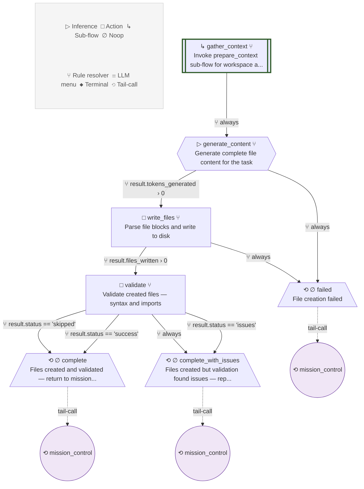
```mermaid
flowchart TD
    %% create_file v3

    subgraph Legend[" "]
        L1["▷ Inference  □ Action  ↳ Sub-flow  ∅ Noop"]
        L2["⑂ Rule resolver  ☰ LLM menu  ◆ Terminal  ⟲ Tail-call"]
    end
    style Legend fill:#f5f5f5,stroke:#ccc,stroke-width:1px
    style L1 fill:#f5f5f5,stroke:none,color:#555
    style L2 fill:#f5f5f5,stroke:none,color:#555

    gather_context[["↳ gather_context ⑂\nInvoke prepare_context sub-flow for workspace a..."]]
    generate_content{{"▷ generate_content ⑂\nGenerate complete file content for the task"}}
    write_files["□ write_files ⑂\nParse file blocks and write to disk"]
    validate["□ validate ⑂\nValidate created files — syntax and imports"]
    complete[/"⟲ ∅ complete\nFiles created and validated — return to mission..."\]
    complete_with_issues[/"⟲ ∅ complete_with_issues\nFiles created but validation found issues — rep..."\]
    failed[/"⟲ ∅ failed\nFile creation failed"\]

    style gather_context stroke-width:3px,stroke:#2d5a27

    gather_context -->|⑂ always| generate_content
    generate_content -->|⑂ result.tokens_generated › 0| write_files
    generate_content -->|⑂ always| failed
    write_files -->|⑂ result.files_written › 0| validate
    write_files -->|⑂ always| failed
    validate -->|⑂ result.status == 'success'| complete
    validate -->|⑂ result.status == 'issues'| complete_with_issues
    validate -->|⑂ result.status == 'skipped'| complete
    validate -->|⑂ always| complete_with_issues
    tc_complete(("⟲ mission_control"))
    style tc_complete fill:#f0e6f6,stroke:#663399
    complete -.->|tail-call| tc_complete
    tc_complete_with_issues(("⟲ mission_control"))
    style tc_complete_with_issues fill:#f0e6f6,stroke:#663399
    complete_with_issues -.->|tail-call| tc_complete_with_issues
    tc_failed(("⟲ mission_control"))
    style tc_failed fill:#f0e6f6,stroke:#663399
    failed -.->|tail-call| tc_failed

```

#### create_tests (v2)
*Create test files to verify module behavior. Reads the target source file(s) to understand the API, then generates comprehensive tests.*

**Inputs:** ○ mission_id · ○ task_id · ◑ task_description · ◑ mission_objective · ◑ working_directory · ◑ target_file_path · ◑ reason · ◑ relevant_notes
**Publishes:** ● context_bundle · ● project_manifest · ● repo_map_formatted · ● related_files · ● inference_response · ● files_changed · ● validation_results
**Sub-flows:** ↳ prepare_context
**Tail-calls:** ⟲ mission_control
**Effects:** ⟶ inference · ⌘ command · 𓉗 file write
**Stats:** 6 steps · ▷ 1 inference · 4 ⑂ rule

**Prompts:**
- **generate_tests** ▷ (0.3): Generate test files based on project source code
  Injects: {← input.task_description}, {← input.target_file_path}, {← input.mission_objective}, {← input.relevant_notes}, {← context.repo_map_formatted} (+2 more)

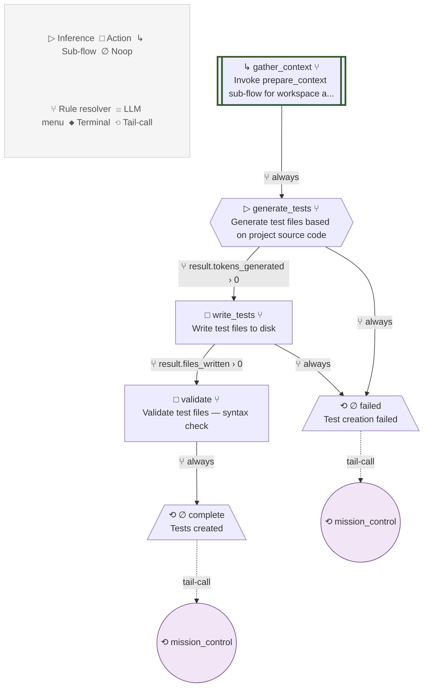
```mermaid
flowchart TD
    %% create_tests v2

    subgraph Legend[" "]
        L1["▷ Inference  □ Action  ↳ Sub-flow  ∅ Noop"]
        L2["⑂ Rule resolver  ☰ LLM menu  ◆ Terminal  ⟲ Tail-call"]
    end
    style Legend fill:#f5f5f5,stroke:#ccc,stroke-width:1px
    style L1 fill:#f5f5f5,stroke:none,color:#555
    style L2 fill:#f5f5f5,stroke:none,color:#555

    gather_context[["↳ gather_context ⑂\nInvoke prepare_context sub-flow for workspace a..."]]
    generate_tests{{"▷ generate_tests ⑂\nGenerate test files based on project source code"}}
    write_tests["□ write_tests ⑂\nWrite test files to disk"]
    validate["□ validate ⑂\nValidate test files — syntax check"]
    complete[/"⟲ ∅ complete\nTests created"\]
    failed[/"⟲ ∅ failed\nTest creation failed"\]

    style gather_context stroke-width:3px,stroke:#2d5a27

    gather_context -->|⑂ always| generate_tests
    generate_tests -->|⑂ result.tokens_generated › 0| write_tests
    generate_tests -->|⑂ always| failed
    write_tests -->|⑂ result.files_written › 0| validate
    write_tests -->|⑂ always| failed
    validate -->|⑂ always| complete
    tc_complete(("⟲ mission_control"))
    style tc_complete fill:#f0e6f6,stroke:#663399
    complete -.->|tail-call| tc_complete
    tc_failed(("⟲ mission_control"))
    style tc_failed fill:#f0e6f6,stroke:#663399
    failed -.->|tail-call| tc_failed

```

#### diagnose_issue (v2)
*Methodical diagnosis of a code issue. If the target file exists, reads it and runs the full hypothesis pipeline. If the file doesn't exist, returns a structured error with the project's actual file list — no instant-fail, no silent bail.*

**Inputs:** ○ mission_id · ○ task_id · ◑ target_file_path · ◑ error_description · ◑ task_description · ◑ mission_objective · ◑ error_output · ◑ working_directory · ◑ relevant_notes
**Publishes:** ● context_bundle · ● project_manifest · ● repo_map_formatted · ● related_files · ● target_file · ● error_analysis · ● hypotheses · ● diagnosis · ● fix_task_created
**Sub-flows:** ↳ prepare_context
**Tail-calls:** ⟲ mission_control
**Effects:** ⟶ inference · 𓉗 list dir · →𓇴 load mission · 𓉗 file read · 𓇴→ save mission
**Stats:** 10 steps · ▷ 2 inference · 7 ⑂ rule

**Prompts:**
- **reproduce_mentally** ▷ (t*0.4): Trace the error execution path mentally
  Injects: {← input.error_description or input.task_description}, {← input.error_output}, {← context.target_file.path}, {← context.target_file.content}, {← file.path} (+1 more)
- **form_hypotheses** ▷ (t*0.8): Generate 2-3 distinct fix hypotheses
  Injects: {← context.error_analysis}, {← context.target_file.path}, {← context.target_file.content}

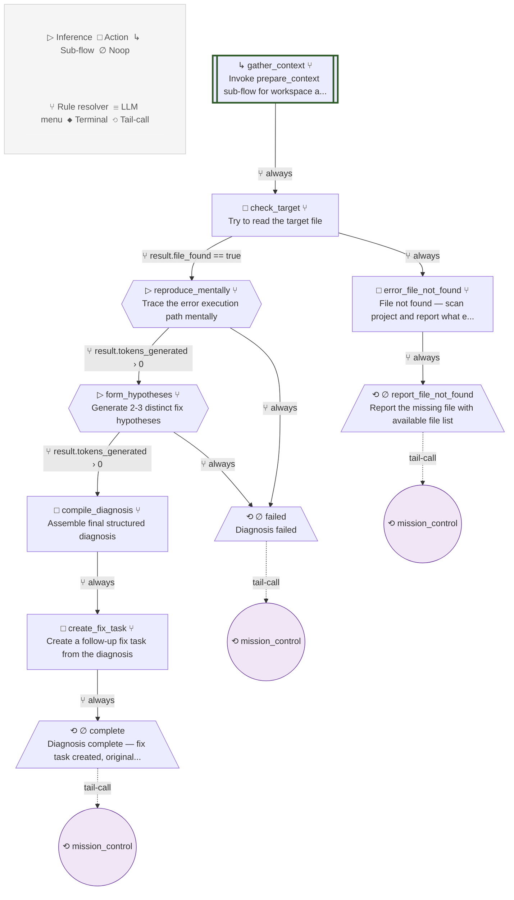
```mermaid
flowchart TD
    %% diagnose_issue v2

    subgraph Legend[" "]
        L1["▷ Inference  □ Action  ↳ Sub-flow  ∅ Noop"]
        L2["⑂ Rule resolver  ☰ LLM menu  ◆ Terminal  ⟲ Tail-call"]
    end
    style Legend fill:#f5f5f5,stroke:#ccc,stroke-width:1px
    style L1 fill:#f5f5f5,stroke:none,color:#555
    style L2 fill:#f5f5f5,stroke:none,color:#555

    gather_context[["↳ gather_context ⑂\nInvoke prepare_context sub-flow for workspace a..."]]
    check_target["□ check_target ⑂\nTry to read the target file"]
    reproduce_mentally{{"▷ reproduce_mentally ⑂\nTrace the error execution path mentally"}}
    form_hypotheses{{"▷ form_hypotheses ⑂\nGenerate 2-3 distinct fix hypotheses"}}
    compile_diagnosis["□ compile_diagnosis ⑂\nAssemble final structured diagnosis"]
    create_fix_task["□ create_fix_task ⑂\nCreate a follow-up fix task from the diagnosis"]
    complete[/"⟲ ∅ complete\nDiagnosis complete — fix task created, original..."\]
    error_file_not_found["□ error_file_not_found ⑂\nFile not found — scan project and report what e..."]
    report_file_not_found[/"⟲ ∅ report_file_not_found\nReport the missing file with available file list"\]
    failed[/"⟲ ∅ failed\nDiagnosis failed"\]

    style gather_context stroke-width:3px,stroke:#2d5a27

    gather_context -->|⑂ always| check_target
    check_target -->|⑂ result.file_found == true| reproduce_mentally
    check_target -->|⑂ always| error_file_not_found
    reproduce_mentally -->|⑂ result.tokens_generated › 0| form_hypotheses
    reproduce_mentally -->|⑂ always| failed
    form_hypotheses -->|⑂ result.tokens_generated › 0| compile_diagnosis
    form_hypotheses -->|⑂ always| failed
    compile_diagnosis -->|⑂ always| create_fix_task
    create_fix_task -->|⑂ always| complete
    tc_complete(("⟲ mission_control"))
    style tc_complete fill:#f0e6f6,stroke:#663399
    complete -.->|tail-call| tc_complete
    error_file_not_found -->|⑂ always| report_file_not_found
    tc_report_file_not_found(("⟲ mission_control"))
    style tc_report_file_not_found fill:#f0e6f6,stroke:#663399
    report_file_not_found -.->|tail-call| tc_report_file_not_found
    tc_failed(("⟲ mission_control"))
    style tc_failed fill:#f0e6f6,stroke:#663399
    failed -.->|tail-call| tc_failed

```

#### document_project (v2)
*Write or update project documentation.*

**Inputs:** ○ mission_id · ○ task_id · ◑ task_description · ◑ mission_objective · ◑ working_directory · ◑ target_file_path · ◑ reason · ◑ relevant_notes
**Publishes:** ● context_bundle · ● project_manifest · ● repo_map_formatted · ● related_files · ● inference_response · ● files_changed
**Sub-flows:** ↳ prepare_context
**Tail-calls:** ⟲ mission_control
**Effects:** ⟶ inference · 𓉗 file write
**Stats:** 6 steps · ▷ 1 inference · 3 ⑂ rule

**Prompts:**
- **execute** ▷ (0.4): Execute the task via inference
  Injects: {← input.task_description}, {← input.reason}, {← input.mission_objective}, {← input.relevant_notes}, {← context.repo_map_formatted} (+2 more)

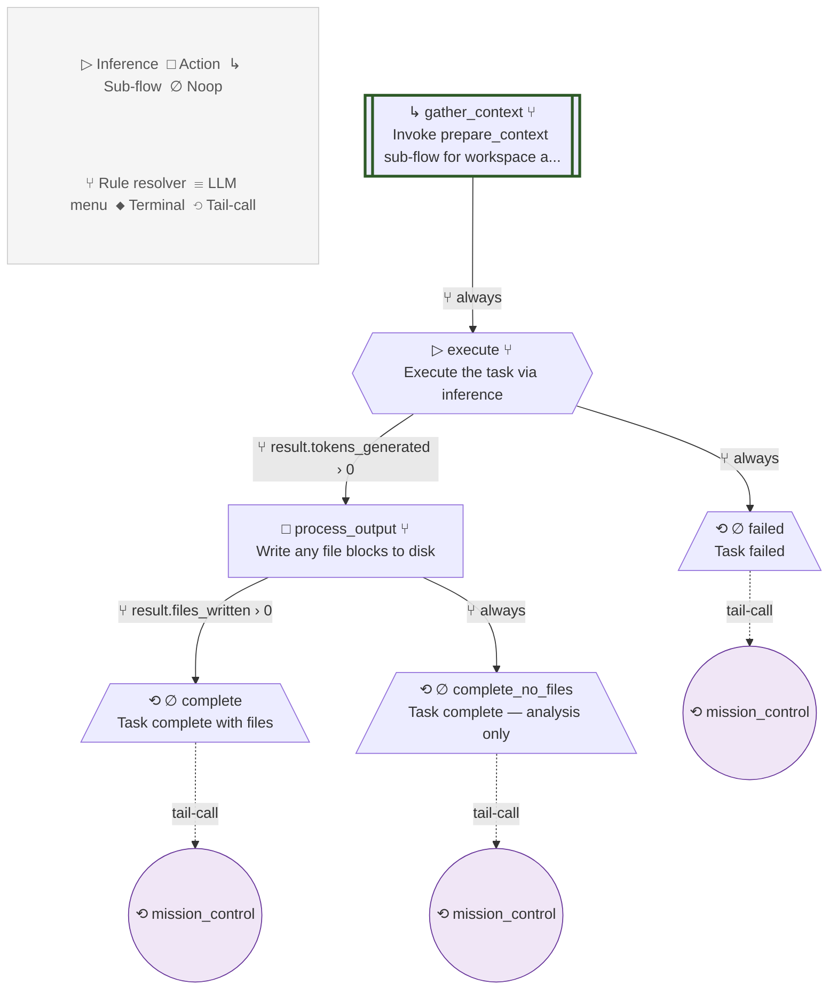
```mermaid
flowchart TD
    %% document_project v2

    subgraph Legend[" "]
        L1["▷ Inference  □ Action  ↳ Sub-flow  ∅ Noop"]
        L2["⑂ Rule resolver  ☰ LLM menu  ◆ Terminal  ⟲ Tail-call"]
    end
    style Legend fill:#f5f5f5,stroke:#ccc,stroke-width:1px
    style L1 fill:#f5f5f5,stroke:none,color:#555
    style L2 fill:#f5f5f5,stroke:none,color:#555

    gather_context[["↳ gather_context ⑂\nInvoke prepare_context sub-flow for workspace a..."]]
    execute{{"▷ execute ⑂\nExecute the task via inference"}}
    process_output["□ process_output ⑂\nWrite any file blocks to disk"]
    complete[/"⟲ ∅ complete\nTask complete with files"\]
    complete_no_files[/"⟲ ∅ complete_no_files\nTask complete — analysis only"\]
    failed[/"⟲ ∅ failed\nTask failed"\]

    style gather_context stroke-width:3px,stroke:#2d5a27

    gather_context -->|⑂ always| execute
    execute -->|⑂ result.tokens_generated › 0| process_output
    execute -->|⑂ always| failed
    process_output -->|⑂ result.files_written › 0| complete
    process_output -->|⑂ always| complete_no_files
    tc_complete(("⟲ mission_control"))
    style tc_complete fill:#f0e6f6,stroke:#663399
    complete -.->|tail-call| tc_complete
    tc_complete_no_files(("⟲ mission_control"))
    style tc_complete_no_files fill:#f0e6f6,stroke:#663399
    complete_no_files -.->|tail-call| tc_complete_no_files
    tc_failed(("⟲ mission_control"))
    style tc_failed fill:#f0e6f6,stroke:#663399
    failed -.->|tail-call| tc_failed

```

#### explore_spike (v2)
*Investigate a pattern, library, or approach before committing.*

**Inputs:** ○ mission_id · ○ task_id · ◑ task_description · ◑ mission_objective · ◑ working_directory · ◑ target_file_path · ◑ reason · ◑ relevant_notes
**Publishes:** ● context_bundle · ● project_manifest · ● repo_map_formatted · ● related_files · ● inference_response · ● files_changed
**Sub-flows:** ↳ prepare_context
**Tail-calls:** ⟲ mission_control
**Effects:** ⟶ inference · 𓉗 file write
**Stats:** 6 steps · ▷ 1 inference · 3 ⑂ rule

**Prompts:**
- **execute** ▷ (0.4): Execute the task via inference
  Injects: {← input.task_description}, {← input.reason}, {← input.mission_objective}, {← input.relevant_notes}, {← context.repo_map_formatted} (+2 more)

```mermaid
flowchart TD
    %% explore_spike v2

    subgraph Legend[" "]
        L1["▷ Inference  □ Action  ↳ Sub-flow  ∅ Noop"]
        L2["⑂ Rule resolver  ☰ LLM menu  ◆ Terminal  ⟲ Tail-call"]
    end
    style Legend fill:#f5f5f5,stroke:#ccc,stroke-width:1px
    style L1 fill:#f5f5f5,stroke:none,color:#555
    style L2 fill:#f5f5f5,stroke:none,color:#555

    gather_context[["↳ gather_context ⑂\nInvoke prepare_context sub-flow for workspace a..."]]
    execute{{"▷ execute ⑂\nExecute the task via inference"}}
    process_output["□ process_output ⑂\nWrite any file blocks to disk"]
    complete[/"⟲ ∅ complete\nTask complete with files"\]
    complete_no_files[/"⟲ ∅ complete_no_files\nTask complete — analysis only"\]
    failed[/"⟲ ∅ failed\nTask failed"\]

    style gather_context stroke-width:3px,stroke:#2d5a27

    gather_context -->|⑂ always| execute
    execute -->|⑂ result.tokens_generated › 0| process_output
    execute -->|⑂ always| failed
    process_output -->|⑂ result.files_written › 0| complete
    process_output -->|⑂ always| complete_no_files
    tc_complete(("⟲ mission_control"))
    style tc_complete fill:#f0e6f6,stroke:#663399
    complete -.->|tail-call| tc_complete
    tc_complete_no_files(("⟲ mission_control"))
    style tc_complete_no_files fill:#f0e6f6,stroke:#663399
    complete_no_files -.->|tail-call| tc_complete_no_files
    tc_failed(("⟲ mission_control"))
    style tc_failed fill:#f0e6f6,stroke:#663399
    failed -.->|tail-call| tc_failed

```

#### integrate_modules (v2)
*Inspect project cohesion — check imports, interfaces, and module connections. Uses structural analysis + inference to identify issues. Reports findings back to mission_control.*

**Inputs:** ○ mission_id · ○ task_id · ◑ task_description · ◑ mission_objective · ◑ working_directory · ◑ relevant_notes
**Publishes:** ● context_bundle · ● project_manifest · ● repo_map_formatted · ● related_files · ● cross_file_results · ● cross_file_summary · ● integration_report
**Sub-flows:** ↳ prepare_context
**Tail-calls:** ⟲ mission_control
**Effects:** ⟶ inference · 𓉗 list dir · 𓉗 file read
**Stats:** 4 steps · ▷ 1 inference · 3 ⑂ rule

**Prompts:**
- **analyze_cohesion** ▷ (t*0.4): Analyze project cohesion and identify integration issues
  Injects: {← input.mission_objective}, {← context.cross_file_summary}, {← context.repo_map_formatted}, {← file.path}, {← file.content[:1200]}

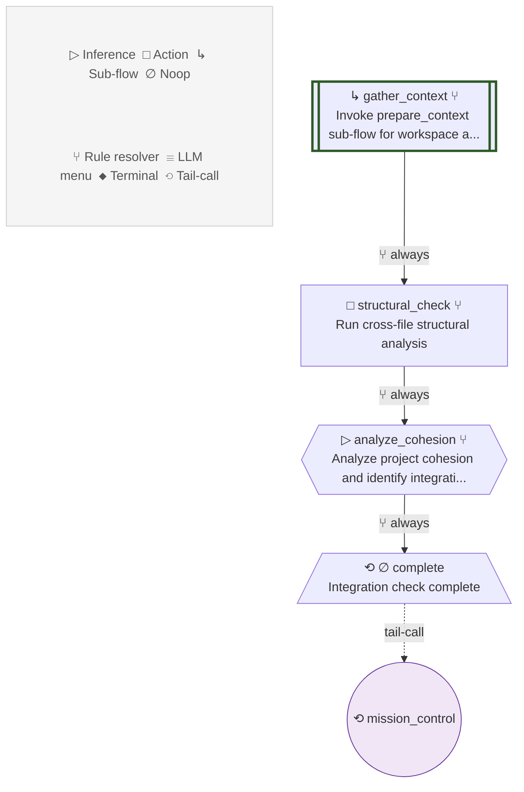
```mermaid
flowchart TD
    %% integrate_modules v2

    subgraph Legend[" "]
        L1["▷ Inference  □ Action  ↳ Sub-flow  ∅ Noop"]
        L2["⑂ Rule resolver  ☰ LLM menu  ◆ Terminal  ⟲ Tail-call"]
    end
    style Legend fill:#f5f5f5,stroke:#ccc,stroke-width:1px
    style L1 fill:#f5f5f5,stroke:none,color:#555
    style L2 fill:#f5f5f5,stroke:none,color:#555

    gather_context[["↳ gather_context ⑂\nInvoke prepare_context sub-flow for workspace a..."]]
    structural_check["□ structural_check ⑂\nRun cross-file structural analysis"]
    analyze_cohesion{{"▷ analyze_cohesion ⑂\nAnalyze project cohesion and identify integrati..."}}
    complete[/"⟲ ∅ complete\nIntegration check complete"\]

    style gather_context stroke-width:3px,stroke:#2d5a27

    gather_context -->|⑂ always| structural_check
    structural_check -->|⑂ always| analyze_cohesion
    analyze_cohesion -->|⑂ always| complete
    tc_complete(("⟲ mission_control"))
    style tc_complete fill:#f0e6f6,stroke:#663399
    complete -.->|tail-call| tc_complete

```

#### manage_packages (v2)
*Install, remove, or update project dependencies.*

**Inputs:** ○ mission_id · ○ task_id · ◑ task_description · ◑ mission_objective · ◑ working_directory · ◑ target_file_path · ◑ reason · ◑ relevant_notes
**Publishes:** ● context_bundle · ● project_manifest · ● repo_map_formatted · ● related_files · ● inference_response · ● files_changed
**Sub-flows:** ↳ prepare_context
**Tail-calls:** ⟲ mission_control
**Effects:** ⟶ inference · 𓉗 file write
**Stats:** 6 steps · ▷ 1 inference · 3 ⑂ rule

**Prompts:**
- **execute** ▷ (0.4): Execute the task via inference
  Injects: {← input.task_description}, {← input.mission_objective}, {← input.relevant_notes}, {← context.repo_map_formatted}, {← file.path} (+1 more)

```mermaid
flowchart TD
    %% manage_packages v2

    subgraph Legend[" "]
        L1["▷ Inference  □ Action  ↳ Sub-flow  ∅ Noop"]
        L2["⑂ Rule resolver  ☰ LLM menu  ◆ Terminal  ⟲ Tail-call"]
    end
    style Legend fill:#f5f5f5,stroke:#ccc,stroke-width:1px
    style L1 fill:#f5f5f5,stroke:none,color:#555
    style L2 fill:#f5f5f5,stroke:none,color:#555

    gather_context[["↳ gather_context ⑂\nInvoke prepare_context sub-flow for workspace a..."]]
    execute{{"▷ execute ⑂\nExecute the task via inference"}}
    process_output["□ process_output ⑂\nWrite any file blocks to disk"]
    complete[/"⟲ ∅ complete\nTask complete with files"\]
    complete_no_files[/"⟲ ∅ complete_no_files\nTask complete — analysis only"\]
    failed[/"⟲ ∅ failed\nTask failed"\]

    style gather_context stroke-width:3px,stroke:#2d5a27

    gather_context -->|⑂ always| execute
    execute -->|⑂ result.tokens_generated › 0| process_output
    execute -->|⑂ always| failed
    process_output -->|⑂ result.files_written › 0| complete
    process_output -->|⑂ always| complete_no_files
    tc_complete(("⟲ mission_control"))
    style tc_complete fill:#f0e6f6,stroke:#663399
    complete -.->|tail-call| tc_complete
    tc_complete_no_files(("⟲ mission_control"))
    style tc_complete_no_files fill:#f0e6f6,stroke:#663399
    complete_no_files -.->|tail-call| tc_complete_no_files
    tc_failed(("⟲ mission_control"))
    style tc_failed fill:#f0e6f6,stroke:#663399
    failed -.->|tail-call| tc_failed

```

#### modify_file (v4)
*Modify existing files via AST-aware symbol-level editing. No create_fallback — if the target file doesn't exist, returns a clear error to mission_control with the project's actual file list. The director can then choose to create the file or re-target.
AST path: extract symbols → select targets → rewrite sequentially. Full-rewrite fallback only when AST extraction is unavailable or the model explicitly requests it.*

**Inputs:** ○ mission_id · ○ task_id · ○ target_file_path · ◑ task_description · ◑ mission_objective · ◑ working_directory · ◑ reason · ◑ relevant_notes · ◑ mode
**Publishes:** ● context_bundle · ● project_manifest · ● repo_map_formatted · ● related_files · ● target_file · ● symbol_table · ● symbol_menu_options · ● files_changed · ● edit_summary · ● bail_reason (+2 more)
**Sub-flows:** ↳ prepare_context · ↳ ast_edit_session
**Tail-calls:** ⟲ mission_control
**Effects:** ⟶ inference · →𓇴 load mission · 𓉗 file read · ⌘ command · 𓇴→ save mission · 𓉗 file write
**Stats:** 12 steps · ▷ 1 inference · 7 ⑂ rule

**Prompts:**
- **full_rewrite** ▷ (0.3): Full file rewrite — when AST editing unavailable or structural change needed
  Injects: {← input.task_description}, {← input.reason}, {← input.target_file_path}, {← context.target_file.content}, {← file.path} (+2 more)

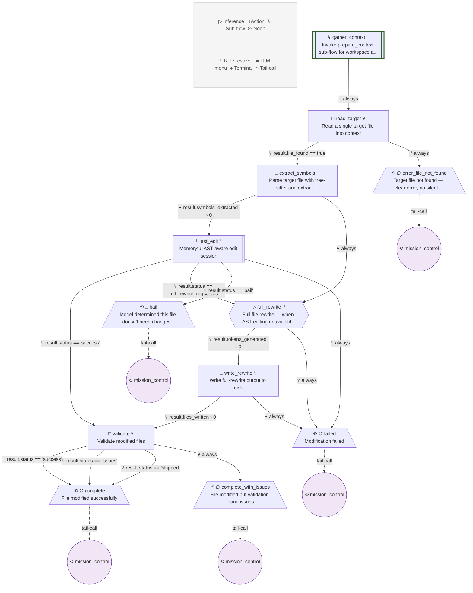
```mermaid
flowchart TD
    %% modify_file v4

    subgraph Legend[" "]
        L1["▷ Inference  □ Action  ↳ Sub-flow  ∅ Noop"]
        L2["⑂ Rule resolver  ☰ LLM menu  ◆ Terminal  ⟲ Tail-call"]
    end
    style Legend fill:#f5f5f5,stroke:#ccc,stroke-width:1px
    style L1 fill:#f5f5f5,stroke:none,color:#555
    style L2 fill:#f5f5f5,stroke:none,color:#555

    gather_context[["↳ gather_context ⑂\nInvoke prepare_context sub-flow for workspace a..."]]
    read_target["□ read_target ⑂\nRead a single target file into context"]
    extract_symbols["□ extract_symbols ⑂\nParse target file with tree-sitter and extract ..."]
    ast_edit[["↳ ast_edit ⑂\nMemoryful AST-aware edit session"]]
    full_rewrite{{"▷ full_rewrite ⑂\nFull file rewrite — when AST editing unavailabl..."}}
    write_rewrite["□ write_rewrite ⑂\nWrite full-rewrite output to disk"]
    validate["□ validate ⑂\nValidate modified files"]
    complete[/"⟲ ∅ complete\nFile modified successfully"\]
    complete_with_issues[/"⟲ ∅ complete_with_issues\nFile modified but validation found issues"\]
    error_file_not_found[/"⟲ ∅ error_file_not_found\nTarget file not found — clear error, no silent ..."\]
    bail[/"⟲ □ bail\nModel determined this file doesn't need changes..."\]
    failed[/"⟲ ∅ failed\nModification failed"\]

    style gather_context stroke-width:3px,stroke:#2d5a27

    gather_context -->|⑂ always| read_target
    read_target -->|⑂ result.file_found == true| extract_symbols
    read_target -->|⑂ always| error_file_not_found
    extract_symbols -->|⑂ result.symbols_extracted › 0| ast_edit
    extract_symbols -->|⑂ always| full_rewrite
    ast_edit -->|⑂ result.status == 'success'| validate
    ast_edit -->|⑂ result.status == 'full_rewrite_requested'| full_rewrite
    ast_edit -->|⑂ result.status == 'bail'| bail
    ast_edit -->|⑂ always| failed
    full_rewrite -->|⑂ result.tokens_generated › 0| write_rewrite
    full_rewrite -->|⑂ always| failed
    write_rewrite -->|⑂ result.files_written › 0| validate
    write_rewrite -->|⑂ always| failed
    validate -->|⑂ result.status == 'success'| complete
    validate -->|⑂ result.status == 'issues'| complete
    validate -->|⑂ result.status == 'skipped'| complete
    validate -->|⑂ always| complete_with_issues
    tc_complete(("⟲ mission_control"))
    style tc_complete fill:#f0e6f6,stroke:#663399
    complete -.->|tail-call| tc_complete
    tc_complete_with_issues(("⟲ mission_control"))
    style tc_complete_with_issues fill:#f0e6f6,stroke:#663399
    complete_with_issues -.->|tail-call| tc_complete_with_issues
    tc_error_file_not_found(("⟲ mission_control"))
    style tc_error_file_not_found fill:#f0e6f6,stroke:#663399
    error_file_not_found -.->|tail-call| tc_error_file_not_found
    tc_bail(("⟲ mission_control"))
    style tc_bail fill:#f0e6f6,stroke:#663399
    bail -.->|tail-call| tc_bail
    tc_failed(("⟲ mission_control"))
    style tc_failed fill:#f0e6f6,stroke:#663399
    failed -.->|tail-call| tc_failed

```

#### refactor (v2)
*Improve code structure without changing behavior. Reads the target file, uses AST-aware editing for precise refactoring. Clear error if file doesn't exist.*

**Inputs:** ○ mission_id · ○ task_id · ○ target_file_path · ◑ task_description · ◑ mission_objective · ◑ working_directory · ◑ reason · ◑ relevant_notes · ◑ specific_smells · ◑ findings
**Publishes:** ● context_bundle · ● project_manifest · ● repo_map_formatted · ● related_files · ● target_file · ● symbol_table · ● symbol_menu_options · ● files_changed · ● edit_summary · ● inference_response
**Sub-flows:** ↳ prepare_context · ↳ ast_edit_session
**Tail-calls:** ⟲ mission_control
**Effects:** ⟶ inference · 𓉗 file read · 𓉗 file write
**Stats:** 9 steps · ▷ 1 inference · 6 ⑂ rule

**Prompts:**
- **full_rewrite** ▷ (0.3): Full file rewrite for structural refactoring
  Injects: {← input.task_description}, {← input.specific_smells}, {← input.target_file_path}, {← context.target_file.content}, {← input.relevant_notes}

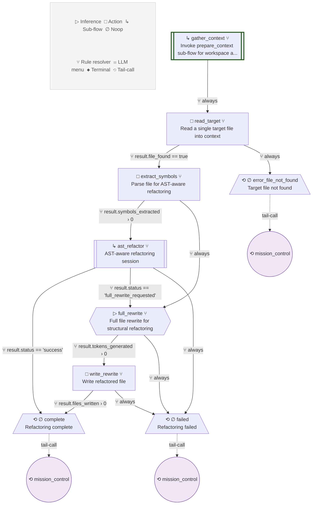
```mermaid
flowchart TD
    %% refactor v2

    subgraph Legend[" "]
        L1["▷ Inference  □ Action  ↳ Sub-flow  ∅ Noop"]
        L2["⑂ Rule resolver  ☰ LLM menu  ◆ Terminal  ⟲ Tail-call"]
    end
    style Legend fill:#f5f5f5,stroke:#ccc,stroke-width:1px
    style L1 fill:#f5f5f5,stroke:none,color:#555
    style L2 fill:#f5f5f5,stroke:none,color:#555

    gather_context[["↳ gather_context ⑂\nInvoke prepare_context sub-flow for workspace a..."]]
    read_target["□ read_target ⑂\nRead a single target file into context"]
    extract_symbols["□ extract_symbols ⑂\nParse file for AST-aware refactoring"]
    ast_refactor[["↳ ast_refactor ⑂\nAST-aware refactoring session"]]
    full_rewrite{{"▷ full_rewrite ⑂\nFull file rewrite for structural refactoring"}}
    write_rewrite["□ write_rewrite ⑂\nWrite refactored file"]
    complete[/"⟲ ∅ complete\nRefactoring complete"\]
    error_file_not_found[/"⟲ ∅ error_file_not_found\nTarget file not found"\]
    failed[/"⟲ ∅ failed\nRefactoring failed"\]

    style gather_context stroke-width:3px,stroke:#2d5a27

    gather_context -->|⑂ always| read_target
    read_target -->|⑂ result.file_found == true| extract_symbols
    read_target -->|⑂ always| error_file_not_found
    extract_symbols -->|⑂ result.symbols_extracted › 0| ast_refactor
    extract_symbols -->|⑂ always| full_rewrite
    ast_refactor -->|⑂ result.status == 'success'| complete
    ast_refactor -->|⑂ result.status == 'full_rewrite_requested'| full_rewrite
    ast_refactor -->|⑂ always| failed
    full_rewrite -->|⑂ result.tokens_generated › 0| write_rewrite
    full_rewrite -->|⑂ always| failed
    write_rewrite -->|⑂ result.files_written › 0| complete
    write_rewrite -->|⑂ always| failed
    tc_complete(("⟲ mission_control"))
    style tc_complete fill:#f0e6f6,stroke:#663399
    complete -.->|tail-call| tc_complete
    tc_error_file_not_found(("⟲ mission_control"))
    style tc_error_file_not_found fill:#f0e6f6,stroke:#663399
    error_file_not_found -.->|tail-call| tc_error_file_not_found
    tc_failed(("⟲ mission_control"))
    style tc_failed fill:#f0e6f6,stroke:#663399
    failed -.->|tail-call| tc_failed

```

#### request_review (v2)
*Submit completed work for review and produce a summary.*

**Inputs:** ○ mission_id · ○ task_id · ◑ task_description · ◑ mission_objective · ◑ working_directory · ◑ target_file_path · ◑ reason · ◑ relevant_notes
**Publishes:** ● context_bundle · ● project_manifest · ● repo_map_formatted · ● related_files · ● inference_response · ● files_changed
**Sub-flows:** ↳ prepare_context
**Tail-calls:** ⟲ mission_control
**Effects:** ⟶ inference · 𓉗 file write
**Stats:** 6 steps · ▷ 1 inference · 3 ⑂ rule

**Prompts:**
- **execute** ▷ (0.4): Execute the task via inference
  Injects: {← input.task_description}, {← input.mission_objective}, {← input.relevant_notes}, {← context.repo_map_formatted}, {← file.path} (+1 more)

```mermaid
flowchart TD
    %% request_review v2

    subgraph Legend[" "]
        L1["▷ Inference  □ Action  ↳ Sub-flow  ∅ Noop"]
        L2["⑂ Rule resolver  ☰ LLM menu  ◆ Terminal  ⟲ Tail-call"]
    end
    style Legend fill:#f5f5f5,stroke:#ccc,stroke-width:1px
    style L1 fill:#f5f5f5,stroke:none,color:#555
    style L2 fill:#f5f5f5,stroke:none,color:#555

    gather_context[["↳ gather_context ⑂\nInvoke prepare_context sub-flow for workspace a..."]]
    execute{{"▷ execute ⑂\nExecute the task via inference"}}
    process_output["□ process_output ⑂\nWrite any file blocks to disk"]
    complete[/"⟲ ∅ complete\nTask complete with files"\]
    complete_no_files[/"⟲ ∅ complete_no_files\nTask complete — analysis only"\]
    failed[/"⟲ ∅ failed\nTask failed"\]

    style gather_context stroke-width:3px,stroke:#2d5a27

    gather_context -->|⑂ always| execute
    execute -->|⑂ result.tokens_generated › 0| process_output
    execute -->|⑂ always| failed
    process_output -->|⑂ result.files_written › 0| complete
    process_output -->|⑂ always| complete_no_files
    tc_complete(("⟲ mission_control"))
    style tc_complete fill:#f0e6f6,stroke:#663399
    complete -.->|tail-call| tc_complete
    tc_complete_no_files(("⟲ mission_control"))
    style tc_complete_no_files fill:#f0e6f6,stroke:#663399
    complete_no_files -.->|tail-call| tc_complete_no_files
    tc_failed(("⟲ mission_control"))
    style tc_failed fill:#f0e6f6,stroke:#663399
    failed -.->|tail-call| tc_failed

```

#### retrospective (v3)
*Capture learnings from frustration recovery — what worked after struggling. Saves analysis as a mission note (accessible to all future director reasoning), NOT as a file on disk. Only fires on frustration reset (task succeeded after elevated frustration).*

**Inputs:** ○ mission_id · ◑ task_id · ◑ task_description · ◑ mission_objective · ◑ working_directory · ◑ target_file_path · ◑ reason · ◑ relevant_notes · ◑ trigger_reason
**Publishes:** ● context_bundle · ● project_manifest · ● repo_map_formatted · ● related_files · ● inference_response
**Sub-flows:** ↳ prepare_context
**Tail-calls:** ⟲ mission_control
**Effects:** ⟶ inference · →𓇴 load mission · 𓇴→ save mission
**Stats:** 5 steps · ▷ 1 inference · 3 ⑂ rule

**Prompts:**
- **execute** ▷ (0.4): Analyze what was tried, what failed, what ultimately worked
  Injects: {← input.trigger_reason or input.reason or input.task_description or 'Frustration recovery'}, {← input.mission_objective}, {← input.relevant_notes}, {← context.repo_map_formatted}, {← file.path} (+1 more)

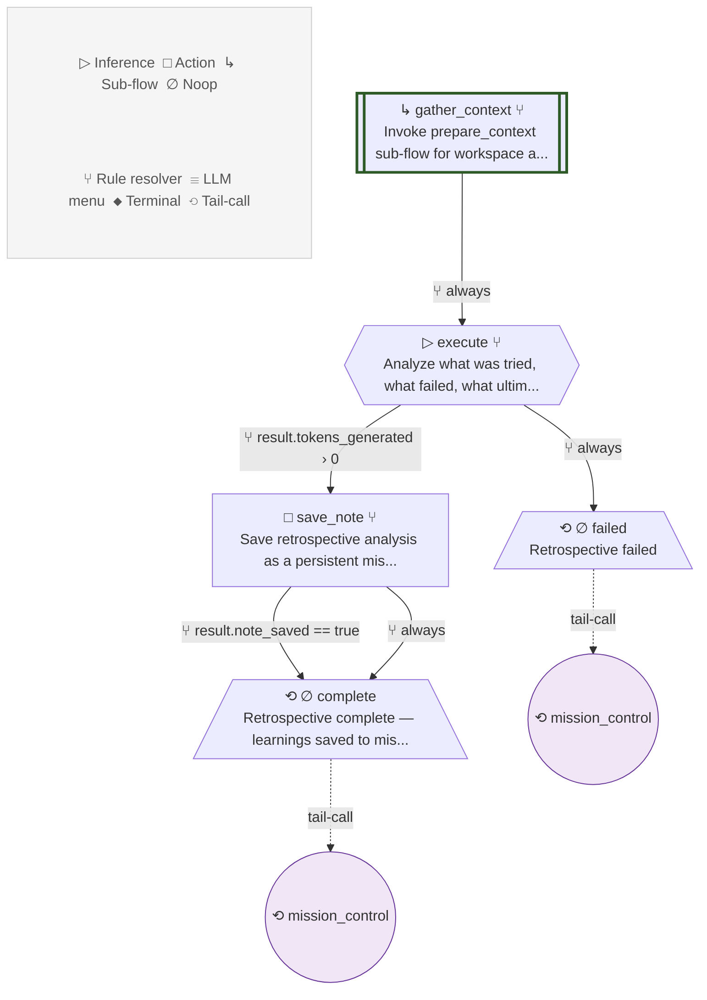
```mermaid
flowchart TD
    %% retrospective v3

    subgraph Legend[" "]
        L1["▷ Inference  □ Action  ↳ Sub-flow  ∅ Noop"]
        L2["⑂ Rule resolver  ☰ LLM menu  ◆ Terminal  ⟲ Tail-call"]
    end
    style Legend fill:#f5f5f5,stroke:#ccc,stroke-width:1px
    style L1 fill:#f5f5f5,stroke:none,color:#555
    style L2 fill:#f5f5f5,stroke:none,color:#555

    gather_context[["↳ gather_context ⑂\nInvoke prepare_context sub-flow for workspace a..."]]
    execute{{"▷ execute ⑂\nAnalyze what was tried, what failed, what ultim..."}}
    save_note["□ save_note ⑂\nSave retrospective analysis as a persistent mis..."]
    complete[/"⟲ ∅ complete\nRetrospective complete — learnings saved to mis..."\]
    failed[/"⟲ ∅ failed\nRetrospective failed"\]

    style gather_context stroke-width:3px,stroke:#2d5a27

    gather_context -->|⑂ always| execute
    execute -->|⑂ result.tokens_generated › 0| save_note
    execute -->|⑂ always| failed
    save_note -->|⑂ result.note_saved == true| complete
    save_note -->|⑂ always| complete
    tc_complete(("⟲ mission_control"))
    style tc_complete fill:#f0e6f6,stroke:#663399
    complete -.->|tail-call| tc_complete
    tc_failed(("⟲ mission_control"))
    style tc_failed fill:#f0e6f6,stroke:#663399
    failed -.->|tail-call| tc_failed

```

#### setup_project (v2)
*Initialize project tooling and structure. Creates directories, pyproject.toml, __init__.py files, and installs dependencies. Uses the terminal for shell commands (mkdir, pip install, etc.) and inference for generating config files.*

**Inputs:** ○ mission_id · ○ task_id · ◑ task_description · ◑ mission_objective · ◑ working_directory · ◑ target_file_path · ◑ reason · ◑ relevant_notes · ◑ setup_focus
**Publishes:** ● context_bundle · ● project_manifest · ● repo_map_formatted · ● related_files · ● inference_response · ● files_changed
**Sub-flows:** ↳ prepare_context
**Tail-calls:** ⟲ mission_control
**Effects:** file_exists · ⟶ inference · ⌘ command · 𓉗 file write
**Stats:** 7 steps · ▷ 1 inference · 4 ⑂ rule

**Prompts:**
- **plan_setup** ▷ (0.3): Determine what setup actions are needed
  Injects: {← input.task_description}, {← input.mission_objective}, {← input.setup_focus}, {← input.relevant_notes}, {← filepath}

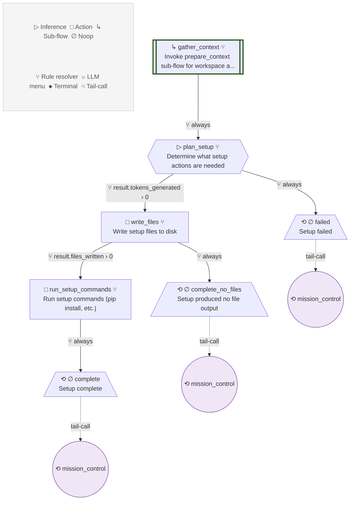
```mermaid
flowchart TD
    %% setup_project v2

    subgraph Legend[" "]
        L1["▷ Inference  □ Action  ↳ Sub-flow  ∅ Noop"]
        L2["⑂ Rule resolver  ☰ LLM menu  ◆ Terminal  ⟲ Tail-call"]
    end
    style Legend fill:#f5f5f5,stroke:#ccc,stroke-width:1px
    style L1 fill:#f5f5f5,stroke:none,color:#555
    style L2 fill:#f5f5f5,stroke:none,color:#555

    gather_context[["↳ gather_context ⑂\nInvoke prepare_context sub-flow for workspace a..."]]
    plan_setup{{"▷ plan_setup ⑂\nDetermine what setup actions are needed"}}
    write_files["□ write_files ⑂\nWrite setup files to disk"]
    run_setup_commands["□ run_setup_commands ⑂\nRun setup commands ⟮pip install, etc.⟯"]
    complete[/"⟲ ∅ complete\nSetup complete"\]
    complete_no_files[/"⟲ ∅ complete_no_files\nSetup produced no file output"\]
    failed[/"⟲ ∅ failed\nSetup failed"\]

    style gather_context stroke-width:3px,stroke:#2d5a27

    gather_context -->|⑂ always| plan_setup
    plan_setup -->|⑂ result.tokens_generated › 0| write_files
    plan_setup -->|⑂ always| failed
    write_files -->|⑂ result.files_written › 0| run_setup_commands
    write_files -->|⑂ always| complete_no_files
    run_setup_commands -->|⑂ always| complete
    tc_complete(("⟲ mission_control"))
    style tc_complete fill:#f0e6f6,stroke:#663399
    complete -.->|tail-call| tc_complete
    tc_complete_no_files(("⟲ mission_control"))
    style tc_complete_no_files fill:#f0e6f6,stroke:#663399
    complete_no_files -.->|tail-call| tc_complete_no_files
    tc_failed(("⟲ mission_control"))
    style tc_failed fill:#f0e6f6,stroke:#663399
    failed -.->|tail-call| tc_failed

```

#### validate_behavior (v2)
*Run the project and verify end-to-end behavior. Uses a terminal session to execute the project and check output.*

**Inputs:** ○ mission_id · ○ task_id · ◑ task_description · ◑ mission_objective · ◑ working_directory · ◑ entry_point
**Publishes:** ● context_bundle · ● project_manifest · ● repo_map_formatted · ● related_files · ● validation_plan · ● terminal_output
**Sub-flows:** ↳ prepare_context · ↳ run_in_terminal
**Tail-calls:** ⟲ mission_control
**Effects:** ⟶ inference
**Stats:** 6 steps · ▷ 1 inference · 3 ⑂ rule

**Prompts:**
- **plan_validation** ▷ (0.2): Determine how to validate the project
  Injects: {← input.mission_objective}, {← input.task_description}, {← context.repo_map_formatted}, {← context.project_manifest.keys() | list | join(', ')}

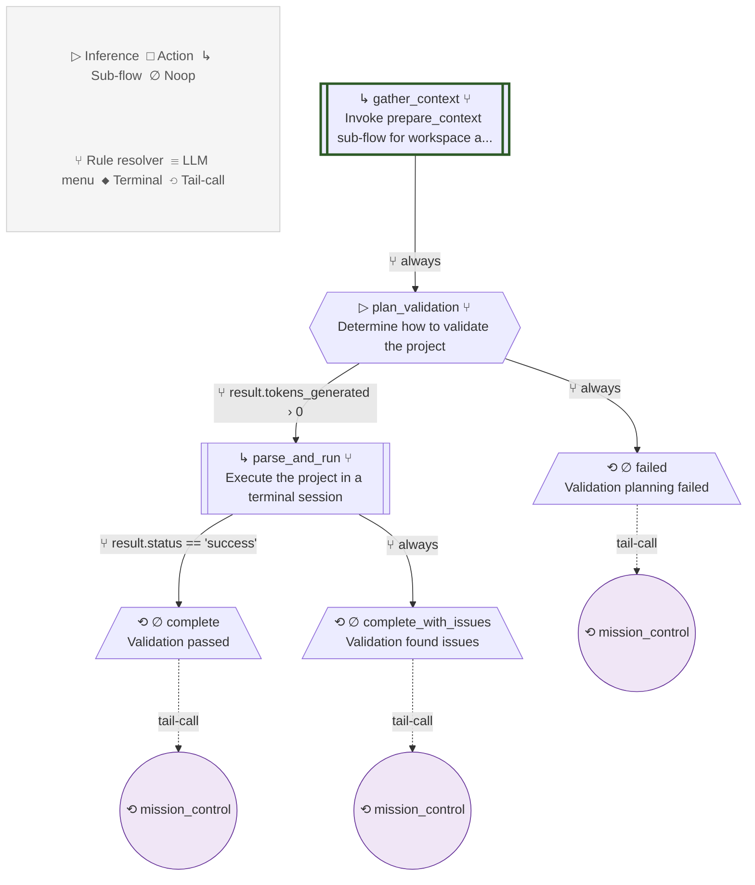
```mermaid
flowchart TD
    %% validate_behavior v2

    subgraph Legend[" "]
        L1["▷ Inference  □ Action  ↳ Sub-flow  ∅ Noop"]
        L2["⑂ Rule resolver  ☰ LLM menu  ◆ Terminal  ⟲ Tail-call"]
    end
    style Legend fill:#f5f5f5,stroke:#ccc,stroke-width:1px
    style L1 fill:#f5f5f5,stroke:none,color:#555
    style L2 fill:#f5f5f5,stroke:none,color:#555

    gather_context[["↳ gather_context ⑂\nInvoke prepare_context sub-flow for workspace a..."]]
    plan_validation{{"▷ plan_validation ⑂\nDetermine how to validate the project"}}
    parse_and_run[["↳ parse_and_run ⑂\nExecute the project in a terminal session"]]
    complete[/"⟲ ∅ complete\nValidation passed"\]
    complete_with_issues[/"⟲ ∅ complete_with_issues\nValidation found issues"\]
    failed[/"⟲ ∅ failed\nValidation planning failed"\]

    style gather_context stroke-width:3px,stroke:#2d5a27

    gather_context -->|⑂ always| plan_validation
    plan_validation -->|⑂ result.tokens_generated › 0| parse_and_run
    plan_validation -->|⑂ always| failed
    parse_and_run -->|⑂ result.status == 'success'| complete
    parse_and_run -->|⑂ always| complete_with_issues
    tc_complete(("⟲ mission_control"))
    style tc_complete fill:#f0e6f6,stroke:#663399
    complete -.->|tail-call| tc_complete
    tc_complete_with_issues(("⟲ mission_control"))
    style tc_complete_with_issues fill:#f0e6f6,stroke:#663399
    complete_with_issues -.->|tail-call| tc_complete_with_issues
    tc_failed(("⟲ mission_control"))
    style tc_failed fill:#f0e6f6,stroke:#663399
    failed -.->|tail-call| tc_failed

```

### Shared Sub-flows

#### ast_edit_session (v1)
*Memoryful AST-aware editing session. Receives a parsed symbol table and file content, presents symbols as a constrained menu for progressive selection, then rewrites each selected symbol sequentially in a memoryful inference session. Each rewrite sees the result of prior rewrites. Returns the modified file written to disk.*

**Inputs:** ○ file_path · ○ file_content · ○ symbol_table · ○ symbol_menu_options · ○ task_description · ◑ reason · ◑ mode · ◑ relevant_notes · ◑ working_directory
**Terminal:** ◆ success · ◆ full_rewrite_requested · ◆ bail · ◆ failed
**Publishes:** ● edit_session_id · ● selected_symbols · ● file_content · ● file_path · ● mode · ● selection_turn · ● rewrite_queue · ● current_symbol · ● file_content_updated · ● files_changed (+2 more)
**Effects:** end_inference_session · session_inference · start_inference_session · 𓉗 file write
**Stats:** 10 steps · 5 ⑂ rule

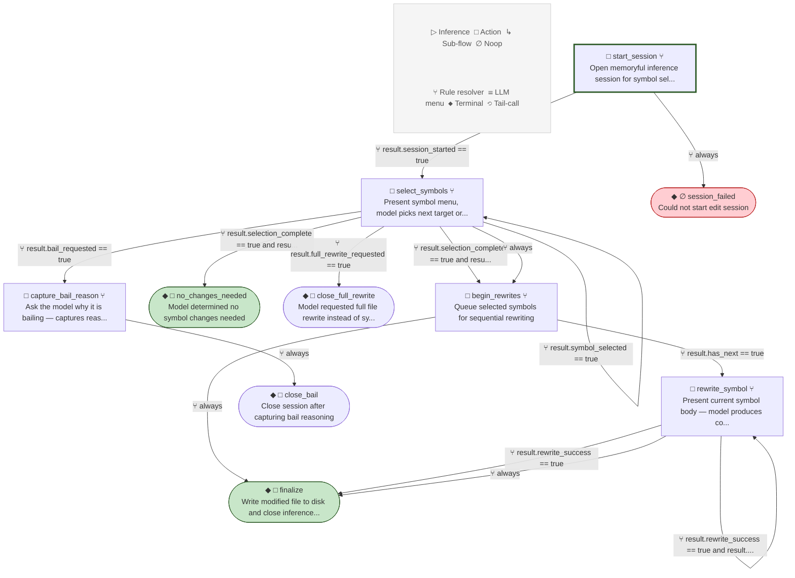
```mermaid
flowchart TD
    %% ast_edit_session v1

    subgraph Legend[" "]
        L1["▷ Inference  □ Action  ↳ Sub-flow  ∅ Noop"]
        L2["⑂ Rule resolver  ☰ LLM menu  ◆ Terminal  ⟲ Tail-call"]
    end
    style Legend fill:#f5f5f5,stroke:#ccc,stroke-width:1px
    style L1 fill:#f5f5f5,stroke:none,color:#555
    style L2 fill:#f5f5f5,stroke:none,color:#555

    start_session["□ start_session ⑂\nOpen memoryful inference session for symbol sel..."]
    select_symbols["□ select_symbols ⑂\nPresent symbol menu, model picks next target or..."]
    begin_rewrites["□ begin_rewrites ⑂\nQueue selected symbols for sequential rewriting"]
    rewrite_symbol["□ rewrite_symbol ⑂\nPresent current symbol body — model produces co..."]
    finalize(["◆ □ finalize\nWrite modified file to disk and close inference..."])
    no_changes_needed(["◆ □ no_changes_needed\nModel determined no symbol changes needed"])
    close_full_rewrite(["◆ □ close_full_rewrite\nModel requested full file rewrite instead of sy..."])
    capture_bail_reason["□ capture_bail_reason ⑂\nAsk the model why it is bailing — captures reas..."]
    close_bail(["◆ □ close_bail\nClose session after capturing bail reasoning"])
    session_failed(["◆ ∅ session_failed\nCould not start edit session"])

    style start_session stroke-width:3px,stroke:#2d5a27

    start_session -->|⑂ result.session_started == true| select_symbols
    start_session -->|⑂ always| session_failed
    select_symbols -->|⑂ result.selection_complete == true and resu...| begin_rewrites
    select_symbols -->|⑂ result.selection_complete == true and resu...| no_changes_needed
    select_symbols -->|⑂ result.full_rewrite_requested == true| close_full_rewrite
    select_symbols -->|⑂ result.bail_requested == true| capture_bail_reason
    select_symbols -->|⑂ result.symbol_selected == true| select_symbols
    select_symbols -->|⑂ always| begin_rewrites
    begin_rewrites -->|⑂ result.has_next == true| rewrite_symbol
    begin_rewrites -->|⑂ always| finalize
    rewrite_symbol -->|⑂ result.rewrite_success == true and result....| rewrite_symbol
    rewrite_symbol -->|⑂ result.rewrite_success == true| finalize
    rewrite_symbol -->|⑂ always| finalize
    capture_bail_reason -->|⑂ always| close_bail

    style finalize fill:#c8e6c9,stroke:#2d5a27
    style no_changes_needed fill:#c8e6c9,stroke:#2d5a27
    style session_failed fill:#ffcdd2,stroke:#b71c1c
```

#### capture_learnings (v1)
*Reflect on completed work and persist observations as notes. Adjusts reflection prompt based on learning_focus parameter.*

**Inputs:** ○ task_description · ◑ target_file_path · ◑ task_outcome · ◑ learning_focus · ◑ category · ◑ tags
**Terminal:** ◆ success
**Publishes:** ● target_file · ● inference_response · ● note_saved
**Effects:** ⟶ inference · →𓇴 load mission · 𓉗 file read · 𓇴→ save mission
**Stats:** 5 steps · ▷ 1 inference · 3 ⑂ rule

**Prompts:**
- **reflect** ▷ (0.2): Generate a reflection on what was learned
  Injects: {← input.task_description}, {← input.target_file_path}, {← input.task_outcome}, {← context.target_file.content[:2000]}

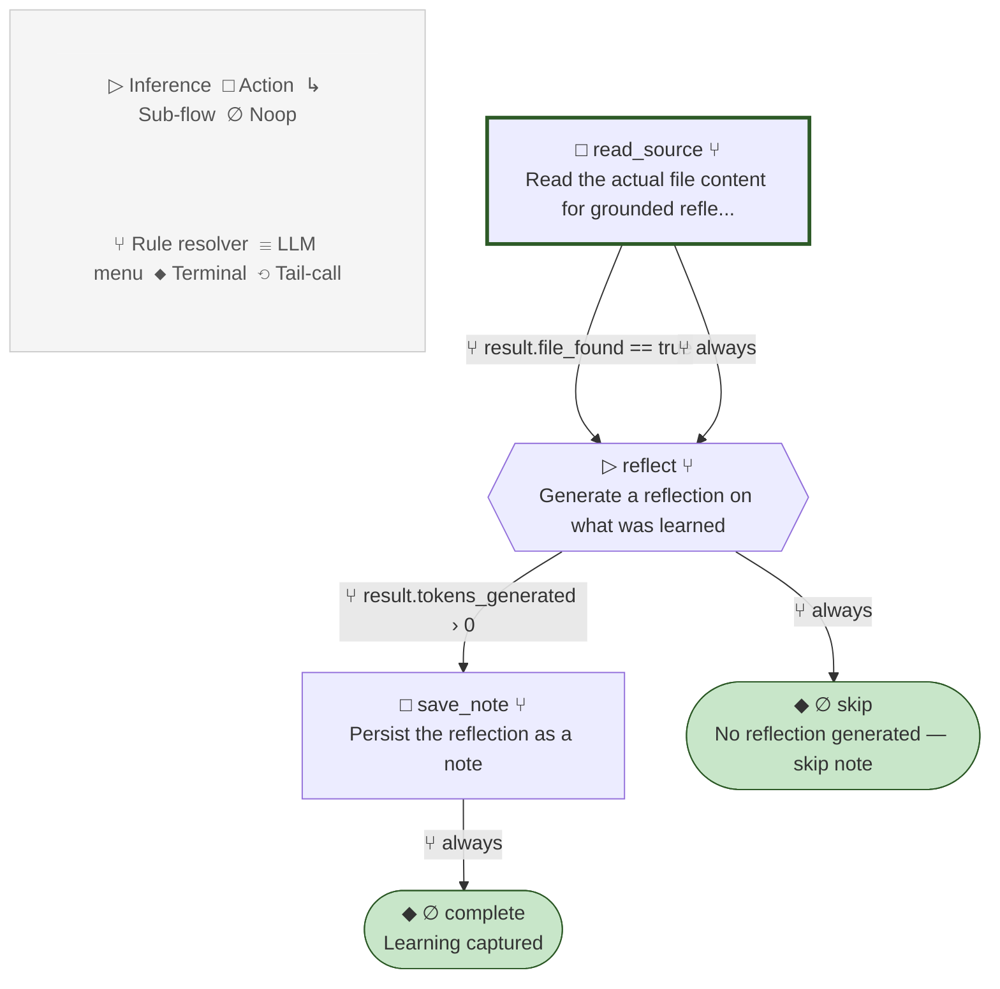
```mermaid
flowchart TD
    %% capture_learnings v1

    subgraph Legend[" "]
        L1["▷ Inference  □ Action  ↳ Sub-flow  ∅ Noop"]
        L2["⑂ Rule resolver  ☰ LLM menu  ◆ Terminal  ⟲ Tail-call"]
    end
    style Legend fill:#f5f5f5,stroke:#ccc,stroke-width:1px
    style L1 fill:#f5f5f5,stroke:none,color:#555
    style L2 fill:#f5f5f5,stroke:none,color:#555

    read_source["□ read_source ⑂\nRead the actual file content for grounded refle..."]
    reflect{{"▷ reflect ⑂\nGenerate a reflection on what was learned"}}
    save_note["□ save_note ⑂\nPersist the reflection as a note"]
    skip(["◆ ∅ skip\nNo reflection generated — skip note"])
    complete(["◆ ∅ complete\nLearning captured"])

    style read_source stroke-width:3px,stroke:#2d5a27

    read_source -->|⑂ result.file_found == true| reflect
    read_source -->|⑂ always| reflect
    reflect -->|⑂ result.tokens_generated › 0| save_note
    reflect -->|⑂ always| skip
    save_note -->|⑂ always| complete

    style skip fill:#c8e6c9,stroke:#2d5a27
    style complete fill:#c8e6c9,stroke:#2d5a27
```

#### prepare_context (v1)
*Sub-flow that scans the workspace, asks the model which files are relevant to a given task, and returns a curated context bundle. Integrates web research when frustration indicates repeated failures.*

**Inputs:** ○ working_directory · ○ task_description · ◑ mission_objective · ◑ target_file_path · ◑ frustration_history · ◑ frustration_level · ◑ context_budget · ◑ relevant_notes
**Terminal:** ◆ success
**Publishes:** ● project_manifest · ● repo_map_formatted · ● related_files · ● research_findings · ● selected_files · ● context_bundle
**Sub-flows:** ↳ research_context
**Effects:** ⟶ inference · 𓉗 list dir · 𓉗 file read
**Stats:** 11 steps · ▷ 2-4 inference · 8 ⑂ rule · 2 ☰ menu

**Prompts:**
- **decide_research_recommended** ▷ (): LLM decides whether to research — frustration elevated
  Injects: {← input.task_description}, {← input.frustration_history}
- **decide_research_optional** ▷ (): LLM decides whether to research — first attempt, optional
  Injects: {← input.task_description}, {← input.mission_objective}

```mermaid
flowchart TD
    %% prepare_context v1

    subgraph Legend[" "]
        L1["▷ Inference  □ Action  ↳ Sub-flow  ∅ Noop"]
        L2["⑂ Rule resolver  ☰ LLM menu  ◆ Terminal  ⟲ Tail-call"]
    end
    style Legend fill:#f5f5f5,stroke:#ccc,stroke-width:1px
    style L1 fill:#f5f5f5,stroke:none,color:#555
    style L2 fill:#f5f5f5,stroke:none,color:#555

    scan_workspace["□ scan_workspace ⑂\nWalk directory tree, extract file signatures"]
    build_repomap["□ build_repomap ⑂\nBuild AST-based dependency map for intelligent ..."]
    check_research_needed(["∅ check_research_needed ⑂\nDetermine if web research should supplement con..."])
    decide_research_recommended{{"▷ decide_research_recommended ☰\nLLM decides whether to research — frustration e..."}}
    decide_research_optional{{"▷ decide_research_optional ☰\nLLM decides whether to research — first attempt..."}}
    research[["↳ research ⑂\nFetch web research to help with repeated failures"]]
    select_relevant["□ select_relevant ⑂\nDeterministically select relevant files via AST..."]
    load_selected["□ load_selected ⑂\nRead full content of selected files ⟮determinis..."]
    load_fallback["□ load_fallback ⑂\nFallback: load target file and immediate neighbors"]
    empty_project(["∅ empty_project ⑂\nNo files exist yet — return empty context bundle"])
    complete(["◆ ∅ complete\nReturn curated context to caller"])

    style scan_workspace stroke-width:3px,stroke:#2d5a27

    scan_workspace -->|⑂ result.file_count › 0| build_repomap
    scan_workspace -->|⑂ result.file_count == 0| empty_project
    build_repomap -->|⑂ always| check_research_needed
    check_research_needed -->|⑂ 'file not found' in str⟮input.get⟮'frustra...| select_relevant
    check_research_needed -->|⑂ input.get⟮'frustration_level', '0'⟯ in ⟮'6...| research
    check_research_needed -->|⑂ input.get⟮'frustration_level', '0'⟯ in ⟮'3...| decide_research_recommended
    check_research_needed -->|⑂ input.get⟮'frustration_level', '0'⟯ in ⟮'1...| decide_research_optional
    check_research_needed -->|⑂ always| select_relevant
    decide_research_recommended -.->|☰ Yes — failures suggest miss...| research
    decide_research_recommended -.->|☰ No — issue is likely mechan...| select_relevant
    decide_research_optional -.->|☰ Yes — task involves unfamil...| research
    decide_research_optional -.->|☰ No — task is straightforwar...| select_relevant
    research -->|⑂ always| select_relevant
    select_relevant -->|⑂ result.files_selected › 0| load_selected
    select_relevant -->|⑂ always| load_fallback
    load_selected -->|⑂ result.files_loaded › 0| complete
    load_selected -->|⑂ always| load_fallback
    load_fallback -->|⑂ always| complete
    empty_project -->|⑂ always| complete

    style complete fill:#c8e6c9,stroke:#2d5a27
```

#### quality_gate (v3)
*Project-wide quality validation. Three-phase gate: 1. Deterministic checks — file scan, cross-file AST consistency, import validation, lint 2. Behavioral validation — sub-flow to run_in_terminal, actually execute the project 3. Summary — LLM reviews all results and determines pass/fail
Receives clean context: working_directory and mission_objective. Judges the product, not the process that built it.
Modes: - "completion" (default): Final gate before declaring mission complete. - "checkpoint": Mid-mission inspection. Terminal execution skipped.*

**Inputs:** ○ working_directory · ○ mission_id · ◑ mission_objective · ◑ relevant_notes · ◑ mode
**Terminal:** ◆ success · ◆ failed
**Publishes:** ● project_manifest · ● cross_file_results · ● cross_file_summary · ● inference_response · ● validation_results · ● terminal_output · ● terminal_status · ● quality_results
**Sub-flows:** ↳ run_in_terminal
**Effects:** ⟶ inference · 𓉗 list dir · →𓇴 load mission · 𓉗 file read · ⌘ command · 𓇴→ save mission
**Stats:** 11 steps · ▷ 2 inference · 8 ⑂ rule

**Prompts:**
- **plan_checks** ▷ (0.0): LLM plans deterministic validation checks (imports, lint)
  Injects: {← input.working_directory}, {← filepath}, {← sig[:120]}
- **summarize** ▷ (0.1): Summarize all quality results into actionable findings
  Injects: {← input.mission_objective or 'not specified'}, {← filepath}, {← context.cross_file_summary}, {← check.name}, {← "PASS" if check.passed else "FAIL"} (+3 more)

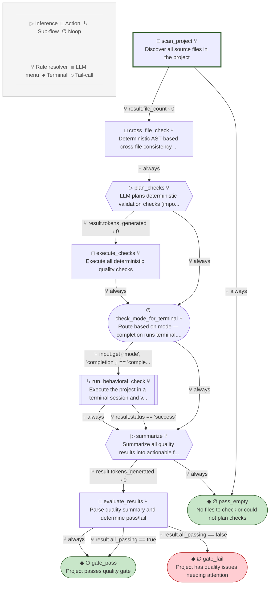
```mermaid
flowchart TD
    %% quality_gate v3

    subgraph Legend[" "]
        L1["▷ Inference  □ Action  ↳ Sub-flow  ∅ Noop"]
        L2["⑂ Rule resolver  ☰ LLM menu  ◆ Terminal  ⟲ Tail-call"]
    end
    style Legend fill:#f5f5f5,stroke:#ccc,stroke-width:1px
    style L1 fill:#f5f5f5,stroke:none,color:#555
    style L2 fill:#f5f5f5,stroke:none,color:#555

    scan_project["□ scan_project ⑂\nDiscover all source files in the project"]
    cross_file_check["□ cross_file_check ⑂\nDeterministic AST-based cross-file consistency ..."]
    plan_checks{{"▷ plan_checks ⑂\nLLM plans deterministic validation checks ⟮impo..."}}
    execute_checks["□ execute_checks ⑂\nExecute all deterministic quality checks"]
    check_mode_for_terminal(["∅ check_mode_for_terminal ⑂\nRoute based on mode — completion runs terminal,..."])
    run_behavioral_check[["↳ run_behavioral_check ⑂\nExecute the project in a terminal session and v..."]]
    summarize{{"▷ summarize ⑂\nSummarize all quality results into actionable f..."}}
    evaluate_results["□ evaluate_results ⑂\nParse quality summary and determine pass/fail"]
    gate_pass(["◆ ∅ gate_pass\nProject passes quality gate"])
    gate_fail(["◆ ∅ gate_fail\nProject has quality issues needing attention"])
    pass_empty(["◆ ∅ pass_empty\nNo files to check or could not plan checks"])

    style scan_project stroke-width:3px,stroke:#2d5a27

    scan_project -->|⑂ result.file_count › 0| cross_file_check
    scan_project -->|⑂ always| pass_empty
    cross_file_check -->|⑂ always| plan_checks
    plan_checks -->|⑂ result.tokens_generated › 0| execute_checks
    plan_checks -->|⑂ always| check_mode_for_terminal
    execute_checks -->|⑂ always| check_mode_for_terminal
    check_mode_for_terminal -->|⑂ input.get⟮'mode', 'completion'⟯ == 'comple...| run_behavioral_check
    check_mode_for_terminal -->|⑂ always| summarize
    run_behavioral_check -->|⑂ result.status == 'success'| summarize
    run_behavioral_check -->|⑂ always| summarize
    summarize -->|⑂ result.tokens_generated › 0| evaluate_results
    summarize -->|⑂ always| pass_empty
    evaluate_results -->|⑂ result.all_passing == true| gate_pass
    evaluate_results -->|⑂ result.all_passing == false| gate_fail
    evaluate_results -->|⑂ always| gate_pass

    style gate_pass fill:#c8e6c9,stroke:#2d5a27
    style gate_fail fill:#ffcdd2,stroke:#b71c1c
    style pass_empty fill:#c8e6c9,stroke:#2d5a27
```

#### research_codebase_history (v1)
*Investigate the history of code changes using git. Plans git commands based on a research question, executes them, and synthesizes the history into an actionable answer.*

**Inputs:** ○ research_query · ◑ working_directory · ◑ target_file · ◑ time_range
**Terminal:** ◆ success · ◆ failed
**Publishes:** ● git_commands · ● git_output · ● raw_results
**Effects:** ⟶ inference · ⌘ command
**Stats:** 4 steps · ▷ 2 inference · 2 ⑂ rule

**Prompts:**
- **determine_git_commands** ▷ (t*0.2): Determine which git commands will answer the question
  Injects: {← context.research_query}, {← context.target_file}, {← context.time_range}
- **analyze_history** ▷ (t*0.3): Synthesize git output into an answer
  Injects: {← context.research_query}, {← context.git_output}

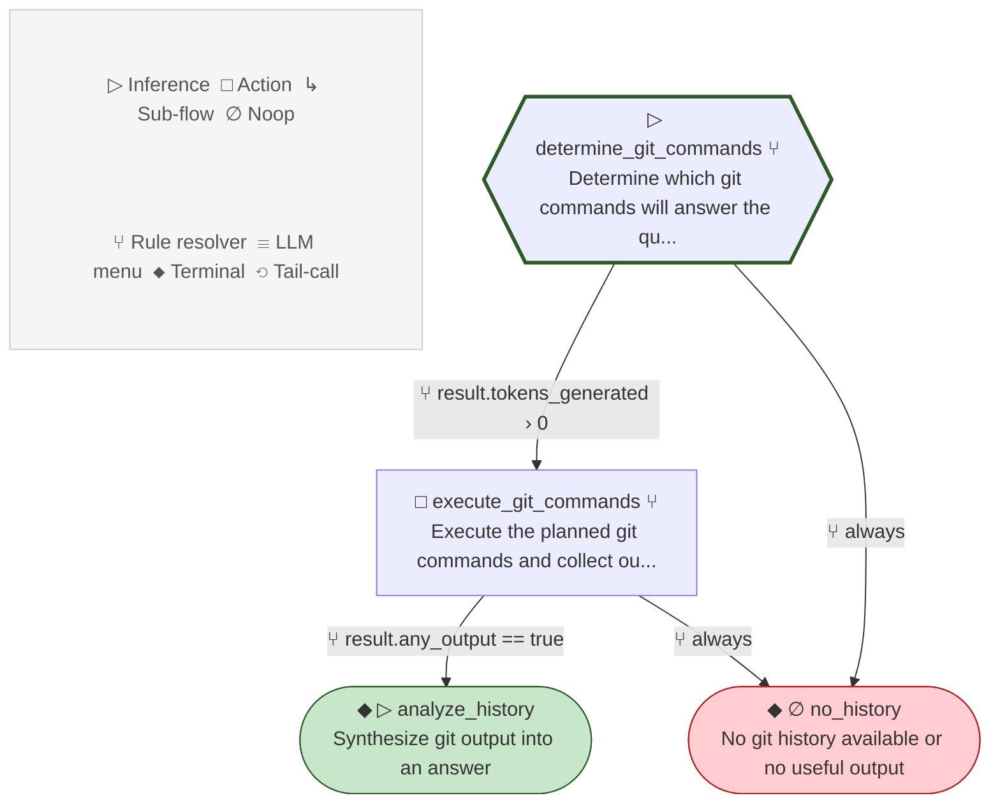
```mermaid
flowchart TD
    %% research_codebase_history v1

    subgraph Legend[" "]
        L1["▷ Inference  □ Action  ↳ Sub-flow  ∅ Noop"]
        L2["⑂ Rule resolver  ☰ LLM menu  ◆ Terminal  ⟲ Tail-call"]
    end
    style Legend fill:#f5f5f5,stroke:#ccc,stroke-width:1px
    style L1 fill:#f5f5f5,stroke:none,color:#555
    style L2 fill:#f5f5f5,stroke:none,color:#555

    determine_git_commands{{"▷ determine_git_commands ⑂\nDetermine which git commands will answer the qu..."}}
    execute_git_commands["□ execute_git_commands ⑂\nExecute the planned git commands and collect ou..."]
    analyze_history(["◆ ▷ analyze_history\nSynthesize git output into an answer"])
    no_history(["◆ ∅ no_history\nNo git history available or no useful output"])

    style determine_git_commands stroke-width:3px,stroke:#2d5a27

    determine_git_commands -->|⑂ result.tokens_generated › 0| execute_git_commands
    determine_git_commands -->|⑂ always| no_history
    execute_git_commands -->|⑂ result.any_output == true| analyze_history
    execute_git_commands -->|⑂ always| no_history

    style analyze_history fill:#c8e6c9,stroke:#2d5a27
    style no_history fill:#ffcdd2,stroke:#b71c1c
```

#### research_context (v2)
*Research dispatcher — classifies a research query and routes to the most appropriate research strategy. Supports web search (default), codebase structure analysis (repomap), git history investigation, and technical literature search. Interface to callers is unchanged from v1 — same inputs, same published outputs.*

**Inputs:** ○ problem_description · ◑ error_output · ◑ search_hints · ◑ max_queries · ◑ working_directory · ◑ target_file_path · ◑ research_type_hint
**Terminal:** ◆ success
**Publishes:** ● query_classification · ● inference_response · ● search_queries · ● raw_search_results · ● research_findings · ● raw_results
**Sub-flows:** ↳ research_repomap · ↳ research_codebase_history · ↳ research_technical
**Effects:** ⟶ inference · ⌘ command
**Stats:** 12 steps · ▷ 4-5 inference · 9 ⑂ rule · 1 ☰ menu

**Prompts:**
- **classify_query_menu** ▷ (): LLM classifies research query
  Injects: {← input.problem_description}, {← input.error_output[:500]}
- **formulate_query** ▷ (0.2): Turn the problem into effective search queries
  Injects: {← input.problem_description}, {← input.error_output}, {← input.search_hints}
- **extract_relevant** ▷ (0.1): Extract actionable information from search results
  Injects: {← input.problem_description}, {← result.url}, {← result.content[:2000]}
- **synthesize_subflow** ▷ (t*0.3): Synthesize sub-flow research results into actionable findings
  Injects: {← input.problem_description}, {← context.raw_results}

```mermaid
flowchart TD
    %% research_context v2

    subgraph Legend[" "]
        L1["▷ Inference  □ Action  ↳ Sub-flow  ∅ Noop"]
        L2["⑂ Rule resolver  ☰ LLM menu  ◆ Terminal  ⟲ Tail-call"]
    end
    style Legend fill:#f5f5f5,stroke:#ccc,stroke-width:1px
    style L1 fill:#f5f5f5,stroke:none,color:#555
    style L2 fill:#f5f5f5,stroke:none,color:#555

    classify_query(["∅ classify_query ⑂\nFast-path when research type is already known"])
    classify_query_menu{{"▷ classify_query_menu ☰\nLLM classifies research query"}}
    formulate_query{{"▷ formulate_query ⑂\nTurn the problem into effective search queries"}}
    parse_queries["□ parse_queries ⑂\nParse JSON array from inference response into s..."]
    execute_search["□ execute_search ⑂\nExecute search queries via curl"]
    extract_relevant{{"▷ extract_relevant ⑂\nExtract actionable information from search results"}}
    route_repomap[["↳ route_repomap ⑂\nAnalyze codebase structure via AST-based repo map"]]
    route_history[["↳ route_history ⑂\nInvestigate code history via git"]]
    route_technical[["↳ route_technical ⑂\nSearch authoritative technical sources"]]
    synthesize_subflow{{"▷ synthesize_subflow ⑂\nSynthesize sub-flow research results into actio..."}}
    empty_result(["◆ ∅ empty_result\nNo useful research results"])
    complete(["◆ ∅ complete\nResearch complete"])

    style classify_query stroke-width:3px,stroke:#2d5a27

    classify_query -->|⑂ input.get⟮'research_type_hint', ''⟯ == 'we...| formulate_query
    classify_query -->|⑂ input.get⟮'research_type_hint', ''⟯ == 'co...| route_repomap
    classify_query -->|⑂ input.get⟮'research_type_hint', ''⟯ == 'co...| route_history
    classify_query -->|⑂ input.get⟮'research_type_hint', ''⟯ == 'te...| route_technical
    classify_query -->|⑂ always| classify_query_menu
    classify_query_menu -.->|☰ Web search — documentation,...| formulate_query
    classify_query_menu -.->|☰ Codebase structure — file r...| route_repomap
    classify_query_menu -.->|☰ Code history — git history ...| route_history
    classify_query_menu -.->|☰ Technical docs — authoritat...| route_technical
    formulate_query -->|⑂ result.tokens_generated › 0| parse_queries
    formulate_query -->|⑂ always| empty_result
    parse_queries -->|⑂ result.query_count › 0| execute_search
    parse_queries -->|⑂ always| empty_result
    execute_search -->|⑂ result.results_found › 0| extract_relevant
    execute_search -->|⑂ always| empty_result
    extract_relevant -->|⑂ result.tokens_generated › 0| complete
    extract_relevant -->|⑂ always| empty_result
    route_repomap -->|⑂ result.status == 'success'| synthesize_subflow
    route_repomap -->|⑂ always| formulate_query
    route_history -->|⑂ result.status == 'success'| synthesize_subflow
    route_history -->|⑂ always| formulate_query
    route_technical -->|⑂ result.status == 'success'| synthesize_subflow
    route_technical -->|⑂ always| formulate_query
    synthesize_subflow -->|⑂ result.tokens_generated › 0| complete
    synthesize_subflow -->|⑂ always| empty_result

    style empty_result fill:#c8e6c9,stroke:#2d5a27
    style complete fill:#c8e6c9,stroke:#2d5a27
```

#### research_repomap (v1)
*Build an AST-based repository map using tree-sitter and PageRank, then query it for structural context relevant to a research question. Returns symbol definitions, file rankings, and related file lists.*

**Inputs:** ○ research_query · ◑ working_directory · ◑ target_file_path · ◑ focus_files
**Terminal:** ◆ success · ◆ failed
**Publishes:** ● repo_map_formatted · ● related_files · ● raw_results
**Effects:** ⟶ inference · 𓉗 list dir · 𓉗 file read
**Stats:** 3 steps · ▷ 1 inference · 1 ⑂ rule

**Prompts:**
- **analyze_structure** ▷ (t*0.3): Analyze the repo map to answer the research query
  Injects: {← context.research_query}, {← context.repo_map_formatted}, {← context.related_files | join(', ')}

```mermaid
flowchart TD
    %% research_repomap v1

    subgraph Legend[" "]
        L1["▷ Inference  □ Action  ↳ Sub-flow  ∅ Noop"]
        L2["⑂ Rule resolver  ☰ LLM menu  ◆ Terminal  ⟲ Tail-call"]
    end
    style Legend fill:#f5f5f5,stroke:#ccc,stroke-width:1px
    style L1 fill:#f5f5f5,stroke:none,color:#555
    style L2 fill:#f5f5f5,stroke:none,color:#555

    build_map["□ build_map ⑂\nBuild repo map from workspace files using tree-..."]
    analyze_structure(["◆ ▷ analyze_structure\nAnalyze the repo map to answer the research query"])
    no_results(["◆ ∅ no_results\nNo source files found to build repo map"])

    style build_map stroke-width:3px,stroke:#2d5a27

    build_map -->|⑂ result.files_mapped › 0| analyze_structure
    build_map -->|⑂ always| no_results

    style analyze_structure fill:#c8e6c9,stroke:#2d5a27
    style no_results fill:#ffcdd2,stroke:#b71c1c
```

#### research_technical (v1)
*Research technical concepts from authoritative sources. Adds site-specific filters to search queries targeting official documentation, academic papers, and authoritative tutorials. Reuses existing curl_search infrastructure.*

**Inputs:** ○ research_query · ◑ domain_hint
**Terminal:** ◆ success · ◆ failed
**Publishes:** ● search_queries · ● raw_search_results · ● raw_results
**Effects:** ⟶ inference · ⌘ command
**Stats:** 4 steps · ▷ 1 inference · 2 ⑂ rule

**Prompts:**
- **filter_and_format** ▷ (t*0.2): Filter search results for technical quality and relevance
  Injects: {← context.research_query}, {← context.domain_hint}, {← result.url}, {← result.content[:2000]}

```mermaid
flowchart TD
    %% research_technical v1

    subgraph Legend[" "]
        L1["▷ Inference  □ Action  ↳ Sub-flow  ∅ Noop"]
        L2["⑂ Rule resolver  ☰ LLM menu  ◆ Terminal  ⟲ Tail-call"]
    end
    style Legend fill:#f5f5f5,stroke:#ccc,stroke-width:1px
    style L1 fill:#f5f5f5,stroke:none,color:#555
    style L2 fill:#f5f5f5,stroke:none,color:#555

    format_query["□ format_query ⑂\nAdd technical site filters to the search query"]
    execute_search["□ execute_search ⑂\nExecute site-filtered search queries via curl"]
    filter_and_format(["◆ ▷ filter_and_format\nFilter search results for technical quality and..."])
    no_results(["◆ ∅ no_results\nNo technical search results found"])

    style format_query stroke-width:3px,stroke:#2d5a27

    format_query -->|⑂ result.query_count › 0| execute_search
    format_query -->|⑂ always| no_results
    execute_search -->|⑂ result.results_found › 0| filter_and_format
    execute_search -->|⑂ always| no_results

    style filter_and_format fill:#c8e6c9,stroke:#2d5a27
    style no_results fill:#ffcdd2,stroke:#b71c1c
```

#### revise_plan (v1)
*Revise the mission plan based on new observations. Can add tasks, reorder priorities, or mark tasks obsoleted. Writes changes to persistence; mission_control picks them up.*

**Inputs:** ○ mission_id · ○ observation · ◑ discovered_requirement · ◑ affected_task_id
**Publishes:** ● mission · ● repo_map_formatted · ● related_files · ● inference_response
**Tail-calls:** ⟲ mission_control
**Effects:** ⟶ inference · 𓉗 list dir · →𓇴 load mission · →𓇴 read events · 𓉗 file read · 𓇴→ save mission
**Stats:** 6 steps · ▷ 1 inference · 4 ⑂ rule

**Prompts:**
- **evaluate_revision** ▷ (0.3): Determine what plan changes are needed
  Injects: {← context.mission.objective}, {← task.status}, {← task.id}, {← task.description}, {← task.flow} (+5 more)

```mermaid
flowchart TD
    %% revise_plan v1

    subgraph Legend[" "]
        L1["▷ Inference  □ Action  ↳ Sub-flow  ∅ Noop"]
        L2["⑂ Rule resolver  ☰ LLM menu  ◆ Terminal  ⟲ Tail-call"]
    end
    style Legend fill:#f5f5f5,stroke:#ccc,stroke-width:1px
    style L1 fill:#f5f5f5,stroke:none,color:#555
    style L2 fill:#f5f5f5,stroke:none,color:#555

    load_current_plan["□ load_current_plan ⑂\nLoad current mission state to see existing plan"]
    scan_workspace["□ scan_workspace ⑂\nBuild AST-based project map so revisions are gr..."]
    evaluate_revision{{"▷ evaluate_revision ⑂\nDetermine what plan changes are needed"}}
    apply_revision["□ apply_revision ⑂\nApply the revision to mission state"]
    skip[/"⟲ ∅ skip\nNo revision needed or possible — return to miss..."\]
    complete[/"⟲ ∅ complete\nPlan revised successfully — return to mission_c..."\]

    style load_current_plan stroke-width:3px,stroke:#2d5a27

    load_current_plan -->|⑂ result.mission.status == 'active'| scan_workspace
    load_current_plan -->|⑂ always| skip
    scan_workspace -->|⑂ always| evaluate_revision
    evaluate_revision -->|⑂ result.tokens_generated › 0| apply_revision
    evaluate_revision -->|⑂ always| skip
    apply_revision -->|⑂ result.revision_applied == true| complete
    apply_revision -->|⑂ always| skip
    tc_skip(("⟲ mission_control"))
    style tc_skip fill:#f0e6f6,stroke:#663399
    skip -.->|tail-call| tc_skip
    tc_complete(("⟲ mission_control"))
    style tc_complete fill:#f0e6f6,stroke:#663399
    complete -.->|tail-call| tc_complete

```

#### run_in_terminal (v1)
*Multi-turn persistent terminal session. Starts a shell subprocess, sends commands, observes output, and loops via LLM menu until the session goal is achieved or max turns exhausted. Used as a sub-flow by validate_behavior, manage_packages, etc.*

**Inputs:** ○ session_goal · ○ working_directory · ◑ initial_commands · ◑ max_turns · ◑ session_context · ◑ environment_vars
**Terminal:** ◆ success · ◆ failed · ◆ issues
**Publishes:** ● session_id · ● inference_session_id · ● session_history · ● inference_response · ● session_summary
**Effects:** ⌘ close terminal · end_inference_session · ⟶ inference · ⌘ terminal cmd · start_inference_session · ⌘ terminal
**Stats:** 7 steps · ▷ 2-3 inference · 3 ⑂ rule · 1 ☰ menu

**Prompts:**
- **plan_next_command** ▷ (t*0.6): LLM decides what command to run next
  Injects: {← input.session_goal}, {← input.session_context}, {← entry.turn}, {← entry.command}, {← entry.output} (+1 more)
- **evaluate** ▷ (t*0.4): LLM evaluates session progress and decides next action
  Injects: {← input.session_goal}, {← entry.turn}, {← entry.command}, {← entry.output}, {← entry.return_code}

```mermaid
flowchart TD
    %% run_in_terminal v1

    subgraph Legend[" "]
        L1["▷ Inference  □ Action  ↳ Sub-flow  ∅ Noop"]
        L2["⑂ Rule resolver  ☰ LLM menu  ◆ Terminal  ⟲ Tail-call"]
    end
    style Legend fill:#f5f5f5,stroke:#ccc,stroke-width:1px
    style L1 fill:#f5f5f5,stroke:none,color:#555
    style L2 fill:#f5f5f5,stroke:none,color:#555

    start_session["□ start_session ⑂\nStart persistent shell, memoryful inference ses..."]
    plan_next_command{{"▷ plan_next_command ⑂\nLLM decides what command to run next"}}
    execute_command["□ execute_command ⑂\nSend LLM-planned command to the terminal session"]
    evaluate{{"▷ evaluate ☰\nLLM evaluates session progress and decides next..."}}
    close_success(["◆ □ close_success\nClose terminal and inference session — goal ach..."])
    close_failure(["◆ □ close_failure\nClose terminal and inference session — session ..."])
    close_max_turns(["◆ □ close_max_turns\nClose terminal and inference session — max turn..."])

    style start_session stroke-width:3px,stroke:#2d5a27

    start_session -->|⑂ result.session_started == true| plan_next_command
    start_session -->|⑂ always| close_failure
    plan_next_command -->|⑂ result.tokens_generated › 0| execute_command
    plan_next_command -->|⑂ always| close_failure
    execute_command -->|⑂ result.stuck_detected == true| close_success
    execute_command -->|⑂ result.max_turns_exceeded == true| close_max_turns
    execute_command -->|⑂ result.command_sent == true| evaluate
    execute_command -->|⑂ always| close_failure
    evaluate -.->|☰ CLOSE terminal — the sessio...| close_success
    evaluate -.->|☰ KEEP OPEN — the session goa...| plan_next_command
    evaluate -.->|☰ CLOSE terminal — a fundamen...| close_failure

    style close_success fill:#c8e6c9,stroke:#2d5a27
    style close_failure fill:#ffcdd2,stroke:#b71c1c
```

#### validate_output (v3)
*Validate a created or modified file with three tiers: 1. Syntax/compile check (required — blocks on failure) 2. Execution/import check (non-blocking — flags issues for correction) 3. Lint check (non-blocking — warnings logged as notes for fixing) The LLM determines language-appropriate commands for each tier.
Three possible outcomes: - success: all checks pass - issues: syntax passes but execution/lint checks have problems (file is usable, needs fixing) - failed: syntax check fails (file is broken)*

**Inputs:** ○ file_path · ○ working_directory · ◑ project_manifest · ◑ validation_hint · ◑ relevant_notes · ◑ test_path · ◑ max_attempts
**Terminal:** ◆ success · ◆ issues · ◆ failed
**Publishes:** ● validation_results · ● inference_response · ● lint_notes_saved
**Effects:** ⟶ inference · →𓇴 load mission · ⌘ command · 𓇴→ save mission
**Stats:** 8 steps · ▷ 1 inference · 5 ⑂ rule

**Prompts:**
- **determine_strategy** ▷ (0.0): LLM decides what validation to run across all three tiers
  Injects: {← input.file_path}, {← input.working_directory}, {← input.validation_hint}, {← filepath}, {← input.relevant_notes}

```mermaid
flowchart TD
    %% validate_output v3

    subgraph Legend[" "]
        L1["▷ Inference  □ Action  ↳ Sub-flow  ∅ Noop"]
        L2["⑂ Rule resolver  ☰ LLM menu  ◆ Terminal  ⟲ Tail-call"]
    end
    style Legend fill:#f5f5f5,stroke:#ccc,stroke-width:1px
    style L1 fill:#f5f5f5,stroke:none,color:#555
    style L2 fill:#f5f5f5,stroke:none,color:#555

    check_file_type(["∅ check_file_type ⑂\nQuick file type check — skip LLM validation for..."])
    determine_strategy{{"▷ determine_strategy ⑂\nLLM decides what validation to run across all t..."}}
    execute_checks["□ execute_checks ⑂\nExecute all validation tiers — syntax, executio..."]
    log_lint_warnings["□ log_lint_warnings ⑂\nCapture execution/lint warnings as mission note..."]
    fallback_check["□ fallback_check ⑂\nFallback: syntax + import check without LLM str..."]
    complete_pass(["◆ ∅ complete_pass\nValidation passed — all checks clean"])
    complete_with_issues(["◆ ∅ complete_with_issues\nSyntax passed but execution/lint issues need co..."])
    complete_fail(["◆ ∅ complete_fail\nValidation failed — syntax errors"])

    style check_file_type stroke-width:3px,stroke:#2d5a27

    check_file_type -->|⑂ input.get⟮'file_path', ''⟯.endswith⟮'.md'⟯...| complete_pass
    check_file_type -->|⑂ always| determine_strategy
    determine_strategy -->|⑂ result.tokens_generated › 0| execute_checks
    determine_strategy -->|⑂ always| fallback_check
    execute_checks -->|⑂ result.all_required_passing == true| log_lint_warnings
    execute_checks -->|⑂ result.all_required_passing == false| complete_fail
    log_lint_warnings -->|⑂ result.notes_logged › 0| complete_with_issues
    log_lint_warnings -->|⑂ always| complete_pass
    fallback_check -->|⑂ result.all_required_passing == true| complete_pass
    fallback_check -->|⑂ always| complete_fail

    style complete_pass fill:#c8e6c9,stroke:#2d5a27
    style complete_fail fill:#ffcdd2,stroke:#b71c1c
```

### Control Flows

#### design_and_plan (v1)
*Merged architecture + plan flow. Architecture design runs first and produces structured ArchitectureState on the mission. Plan generation then receives the architecture as input and creates tasks with file paths that match the architecture's canonical module list. This eliminates the architecture/plan desynchronization problem.*

**Inputs:** ○ mission_id · ◑ existing_progress
**Terminal:** ◆ failed
**Publishes:** ● mission · ● project_manifest · ● repo_map_formatted · ● inference_response · ● architecture
**Tail-calls:** ⟲ mission_control
**Effects:** ⟶ inference · 𓉗 list dir · →𓇴 load mission · →𓇴 read events · 𓉗 file read · 𓇴→ save mission
**Stats:** 10 steps · ▷ 3 inference · 8 ⑂ rule

**Prompts:**
- **design_structure** ▷ (0.4): Design project structure — layout, modules, interfaces, execution conventions
  Injects: {← context.mission.objective}, {← context.repo_map_formatted}, {← filepath}, {← sig[:100]}
- **generate_plan** ▷ (0.4): Generate task plan aligned to the architecture blueprint
  Injects: {← context.mission.objective}, {← context.mission.config.working_directory}, {← context.architecture.import_scheme}, {← context.architecture.run_command}, {← mod.file} (+10 more)
- **generate_plan_no_architecture** ▷ (0.4): Generate plan without structured architecture (architecture parse failed)
  Injects: {← context.mission.objective}, {← context.mission.config.working_directory}, {← context.project_manifest.keys() | list}

```mermaid
flowchart TD
    %% design_and_plan v1

    subgraph Legend[" "]
        L1["▷ Inference  □ Action  ↳ Sub-flow  ∅ Noop"]
        L2["⑂ Rule resolver  ☰ LLM menu  ◆ Terminal  ⟲ Tail-call"]
    end
    style Legend fill:#f5f5f5,stroke:#ccc,stroke-width:1px
    style L1 fill:#f5f5f5,stroke:none,color:#555
    style L2 fill:#f5f5f5,stroke:none,color:#555

    load_mission["□ load_mission ⑂\nLoad mission to get objective and working direc..."]
    scan_workspace["□ scan_workspace ⑂\nDiscover existing files and structure"]
    build_repomap["□ build_repomap ⑂\nBuild AST-based dependency map of existing code"]
    design_structure{{"▷ design_structure ⑂\nDesign project structure — layout, modules, int..."}}
    parse_architecture["□ parse_architecture ⑂\nParse architecture JSON and store as mission.ar..."]
    generate_plan{{"▷ generate_plan ⑂\nGenerate task plan aligned to the architecture ..."}}
    generate_plan_no_architecture{{"▷ generate_plan_no_architecture ⑂\nGenerate plan without structured architecture ⟮..."}}
    parse_plan["□ parse_plan ⑂\nParse LLM plan response into task records, vali..."]
    complete[/"⟲ ∅ complete\nArchitecture designed and plan created — return..."\]
    failed(["◆ □ failed\nDesign and planning failed"])

    style load_mission stroke-width:3px,stroke:#2d5a27

    load_mission -->|⑂ result.mission.status == 'active'| scan_workspace
    load_mission -->|⑂ always| failed
    scan_workspace -->|⑂ always| build_repomap
    build_repomap -->|⑂ always| design_structure
    design_structure -->|⑂ result.tokens_generated › 0| parse_architecture
    design_structure -->|⑂ always| failed
    parse_architecture -->|⑂ result.architecture_parsed == true| generate_plan
    parse_architecture -->|⑂ always| generate_plan_no_architecture
    generate_plan -->|⑂ result.tokens_generated › 0| parse_plan
    generate_plan -->|⑂ always| failed
    generate_plan_no_architecture -->|⑂ result.tokens_generated › 0| parse_plan
    generate_plan_no_architecture -->|⑂ always| failed
    parse_plan -->|⑂ result.plan_created == true and result.tas...| complete
    parse_plan -->|⑂ result.plan_created == true| complete
    parse_plan -->|⑂ always| failed
    tc_complete(("⟲ mission_control"))
    style tc_complete fill:#f0e6f6,stroke:#663399
    complete -.->|tail-call| tc_complete

    style failed fill:#ffcdd2,stroke:#b71c1c
```

#### mission_control (v3)
*Core director flow v3. Uses a memoryful inference session across the entire decision cycle: reason → select_task → select_target_file → dispatch. The model sees the full mission state once, then makes three cheap grammar-constrained decisions within the same session context. Replaces word-overlap task matching with LLM menu selection.*

**Inputs:** ○ mission_id · ◑ last_result · ◑ last_status · ◑ last_task_id
**Terminal:** ◆ completed · ◆ deadlocked · ◆ aborted
**Publishes:** ● mission · ● events · ● frustration · ● session_id · ● director_analysis · ● selected_task · ● selected_task_id · ● dispatch_config · ● dispatch_warning · ● quality_results
**Sub-flows:** ↳ quality_gate · ↳ quality_gate
**Tail-calls:** ⟲ design_and_plan · ⟲ mission_control · ⟲ retrospective · ⟲ revise_plan · ⟲ {{ context.dispatch_config.flow }}
**Effects:** clear_events · end_inference_session · file_exists · ⟶ inference · 𓉗 list dir · →𓇴 load mission · →𓇴 read events · 𓇴→ save mission · session_inference · start_inference_session
**Stats:** 49 steps · ▷ 2-3 inference · 39 ⑂ rule · 1 ☰ menu

**Prompts:**
- **reason** ▷ (t*0.8): Analyze mission state and reason about next action (memoryful session)
  Injects: {← context.mission.objective}, {← context.mission.config.working_directory}, {← context.mission.architecture.import_scheme}, {← context.mission.architecture.run_command}, {← context.mission.architecture.canonical_files() | join(', ')} (+14 more)
- **reason_standalone** ▷ (t*0.8): Director reasoning without memoryful session (fallback)
  Injects: {← context.mission.objective}, {← task.status}, {← task.description}, {← task.frustration}, {← context.get('last_status')} (+1 more)

```mermaid
flowchart TD
    %% mission_control v3

    subgraph Legend[" "]
        L1["▷ Inference  □ Action  ↳ Sub-flow  ∅ Noop"]
        L2["⑂ Rule resolver  ☰ LLM menu  ◆ Terminal  ⟲ Tail-call"]
    end
    style Legend fill:#f5f5f5,stroke:#ccc,stroke-width:1px
    style L1 fill:#f5f5f5,stroke:none,color:#555
    style L2 fill:#f5f5f5,stroke:none,color:#555

    load_state["□ load_state ⑂\nLoad mission state, event queue, and frustratio..."]
    apply_last_result["□ apply_last_result ⑂\nApply the returning flow's outcome to mission s..."]
    dispatch_retrospective[/"⟲ ∅ dispatch_retrospective\nDispatch retrospective — task succeeded after f..."\]
    process_events["□ process_events ⑂\nProcess user messages, abort/pause signals"]
    start_session["□ start_session ⑂\nOpen memoryful inference session for the direct..."]
    reason{{"▷ reason ⑂\nAnalyze mission state and reason about next act..."}}
    reason_standalone{{"▷ reason_standalone ⑂\nDirector reasoning without memoryful session ⟮f..."}}
    decide_flow(["∅ decide_flow ☰\nSelect the best action type based on analysis"])
    select_and_dispatch_create["□ select_and_dispatch_create ⑂\nSelect task for create_file"]
    select_and_dispatch_modify["□ select_and_dispatch_modify ⑂\nSelect task for modify_file"]
    select_and_dispatch_integrate["□ select_and_dispatch_integrate ⑂\nSelect task for integrate_modules"]
    select_and_dispatch_diagnose["□ select_and_dispatch_diagnose ⑂\nSelect task for diagnose_issue"]
    select_and_dispatch_tests["□ select_and_dispatch_tests ⑂\nSelect task for create_tests"]
    select_and_dispatch_validate["□ select_and_dispatch_validate ⑂\nSelect task for validate_behavior"]
    select_and_dispatch_setup["□ select_and_dispatch_setup ⑂\nSelect task for setup_project"]
    select_and_dispatch_explore["□ select_and_dispatch_explore ⑂\nSelect task for explore_spike"]
    select_and_dispatch_refactor["□ select_and_dispatch_refactor ⑂\nSelect task for refactor"]
    select_and_dispatch_document["□ select_and_dispatch_document ⑂\nSelect task for document_project"]
    select_and_dispatch_packages["□ select_and_dispatch_packages ⑂\nSelect task for manage_packages"]
    select_and_dispatch_review["□ select_and_dispatch_review ⑂\nSelect task for request_review"]
    resolve_target_file_create["□ resolve_target_file_create ⑂\nResolve target file for create_file"]
    resolve_target_file_create_tests["□ resolve_target_file_create_tests ⑂\nResolve target file for create_tests"]
    resolve_target_file_modify["□ resolve_target_file_modify ⑂\nResolve target file for modify_file ⟮requires e..."]
    resolve_target_file_diagnose["□ resolve_target_file_diagnose ⑂\nResolve target file for diagnose_issue ⟮require..."]
    resolve_target_file_refactor["□ resolve_target_file_refactor ⑂\nResolve target file for refactor ⟮requires exis..."]
    resolve_target_file_integrate["□ resolve_target_file_integrate ⑂\nResolve target for integrate_modules"]
    resolve_target_file_validate["□ resolve_target_file_validate ⑂\nResolve target for validate_behavior"]
    resolve_target_file_setup["□ resolve_target_file_setup ⑂\nResolve target for setup_project"]
    resolve_target_file_explore["□ resolve_target_file_explore ⑂\nResolve target for explore_spike"]
    resolve_target_file_document["□ resolve_target_file_document ⑂\nResolve target for document_project"]
    resolve_target_file_packages["□ resolve_target_file_packages ⑂\nResolve target for manage_packages"]
    resolve_target_file_review["□ resolve_target_file_review ⑂\nResolve target for request_review"]
    resolve_target_file_retrospective["□ resolve_target_file_retrospective ⑂\nResolve target for retrospective"]
    end_session_and_dispatch["□ end_session_and_dispatch ⑂\nClose director session before dispatching to ta..."]
    record_and_dispatch["□ record_and_dispatch ⑂\nRecord dispatch in history for deduplication, t..."]
    dispatch[/"⟲ ∅ dispatch\nTail-call to the selected task flow"\]
    end_session_and_reason["□ end_session_and_reason ⑂\nClose session — task/file selection failed, loo..."]
    end_session_error_no_files["□ end_session_error_no_files ⑂\nClose session — no files exist for modification..."]
    dispatch_revise_plan[/"⟲ ∅ dispatch_revise_plan\nRepeated dispatch detected or plan revision req..."\]
    dispatch_planning[/"⟲ ∅ dispatch_planning\nNo plan exists — dispatch to design_and_plan flow"\]
    quality_checkpoint["□ quality_checkpoint ⑂\nClose director session, then run quality checkp..."]
    quality_checkpoint_run[["↳ quality_checkpoint_run ⑂\nRun quality inspection on current state"]]
    quality_completion["□ quality_completion ⑂\nClose director session, then run final quality ..."]
    quality_completion_run[["↳ quality_completion_run ⑂\nFinal quality gate for mission completion"]]
    quality_failed_restart[/"⟲ ∅ quality_failed_restart\nQuality gate failed — restart mission_control w..."\]
    completed(["◆ □ completed\nMark mission complete"])
    idle[/"⟲ □ idle\nWait for events"\]
    mission_deadlocked(["◆ □ mission_deadlocked\nMission deadlocked"])
    aborted(["◆ □ aborted\nMission aborted"])

    style load_state stroke-width:3px,stroke:#2d5a27

    load_state -->|⑂ result.mission.status == 'active'| apply_last_result
    load_state -->|⑂ result.mission.status == 'paused'| idle
    load_state -->|⑂ result.mission.status == 'completed'| completed
    load_state -->|⑂ always| aborted
    apply_last_result -->|⑂ result.quality_gate_exhausted == true| completed
    apply_last_result -->|⑂ result.events_pending == true| process_events
    apply_last_result -->|⑂ result.needs_plan == true| dispatch_planning
    apply_last_result -->|⑂ result.frustration_reset == true| dispatch_retrospective
    apply_last_result -->|⑂ always| start_session
    tc_dispatch_retrospective(("⟲ retrospective"))
    style tc_dispatch_retrospective fill:#f0e6f6,stroke:#663399
    dispatch_retrospective -.->|tail-call| tc_dispatch_retrospective
    process_events -->|⑂ result.abort_requested == true| aborted
    process_events -->|⑂ result.pause_requested == true| idle
    process_events -->|⑂ always| start_session
    start_session -->|⑂ result.session_started == true| reason
    start_session -->|⑂ always| reason_standalone
    reason -->|⑂ always| decide_flow
    reason_standalone -->|⑂ always| decide_flow
    decide_flow -.->|☰ Create one or more new sour...| select_and_dispatch_create
    decide_flow -.->|☰ Fix or enhance existing fil...| select_and_dispatch_modify
    decide_flow -.->|☰ Inspect project cohesion — ...| select_and_dispatch_integrate
    decide_flow -.->|☰ Investigate a code issue me...| select_and_dispatch_diagnose
    decide_flow -.->|☰ Create test files to verify...| select_and_dispatch_tests
    decide_flow -.->|☰ Run the project and verify ...| select_and_dispatch_validate
    decide_flow -.->|☰ Initialize or configure pro...| select_and_dispatch_setup
    decide_flow -.->|☰ Investigate a pattern or ap...| select_and_dispatch_explore
    decide_flow -.->|☰ Improve code structure with...| select_and_dispatch_refactor
    decide_flow -.->|☰ Write or update project doc...| select_and_dispatch_document
    decide_flow -.->|☰ Install, remove, or update ...| select_and_dispatch_packages
    decide_flow -.->|☰ Submit completed work for r...| select_and_dispatch_review
    decide_flow -.->|☰ Extend or revise the missio...| dispatch_revise_plan
    decide_flow -.->|☰ Run quality inspection on c...| quality_checkpoint
    decide_flow -.->|☰ All planned work done — run...| quality_completion
    decide_flow -.->|☰ No viable path forward — re...| mission_deadlocked
    select_and_dispatch_create -->|⑂ result.task_selected == true| resolve_target_file_create
    select_and_dispatch_create -->|⑂ result.no_actionable_tasks == true| quality_completion
    select_and_dispatch_create -->|⑂ always| quality_completion
    select_and_dispatch_modify -->|⑂ result.task_selected == true| resolve_target_file_modify
    select_and_dispatch_modify -->|⑂ always| quality_completion
    select_and_dispatch_integrate -->|⑂ result.task_selected == true| resolve_target_file_integrate
    select_and_dispatch_integrate -->|⑂ always| quality_completion
    select_and_dispatch_diagnose -->|⑂ result.task_selected == true| resolve_target_file_diagnose
    select_and_dispatch_diagnose -->|⑂ always| quality_completion
    select_and_dispatch_tests -->|⑂ result.task_selected == true| resolve_target_file_create_tests
    select_and_dispatch_tests -->|⑂ always| quality_completion
    select_and_dispatch_validate -->|⑂ result.task_selected == true| resolve_target_file_validate
    select_and_dispatch_validate -->|⑂ always| quality_completion
    select_and_dispatch_setup -->|⑂ result.task_selected == true| resolve_target_file_setup
    select_and_dispatch_setup -->|⑂ always| quality_completion
    select_and_dispatch_explore -->|⑂ result.task_selected == true| resolve_target_file_explore
    select_and_dispatch_explore -->|⑂ always| quality_completion
    select_and_dispatch_refactor -->|⑂ result.task_selected == true| resolve_target_file_refactor
    select_and_dispatch_refactor -->|⑂ always| quality_completion
    select_and_dispatch_document -->|⑂ result.task_selected == true| resolve_target_file_document
    select_and_dispatch_document -->|⑂ always| quality_completion
    select_and_dispatch_packages -->|⑂ result.task_selected == true| resolve_target_file_packages
    select_and_dispatch_packages -->|⑂ always| quality_completion
    select_and_dispatch_review -->|⑂ result.task_selected == true| resolve_target_file_review
    select_and_dispatch_review -->|⑂ always| quality_completion
    resolve_target_file_create -->|⑂ result.file_selected == true| end_session_and_dispatch
    resolve_target_file_create -->|⑂ result.error == 'no_project_files'| end_session_and_dispatch
    resolve_target_file_create -->|⑂ always| end_session_and_reason
    resolve_target_file_create_tests -->|⑂ result.file_selected == true| end_session_and_dispatch
    resolve_target_file_create_tests -->|⑂ always| end_session_and_dispatch
    resolve_target_file_modify -->|⑂ result.file_selected == true| end_session_and_dispatch
    resolve_target_file_modify -->|⑂ result.error == 'no_project_files'| end_session_error_no_files
    resolve_target_file_modify -->|⑂ always| end_session_and_reason
    resolve_target_file_diagnose -->|⑂ result.file_selected == true| end_session_and_dispatch
    resolve_target_file_diagnose -->|⑂ result.error == 'no_project_files'| end_session_error_no_files
    resolve_target_file_diagnose -->|⑂ always| end_session_and_reason
    resolve_target_file_refactor -->|⑂ result.file_selected == true| end_session_and_dispatch
    resolve_target_file_refactor -->|⑂ result.error == 'no_project_files'| end_session_error_no_files
    resolve_target_file_refactor -->|⑂ always| end_session_and_reason
    resolve_target_file_integrate -->|⑂ always| end_session_and_dispatch
    resolve_target_file_validate -->|⑂ always| end_session_and_dispatch
    resolve_target_file_setup -->|⑂ always| end_session_and_dispatch
    resolve_target_file_explore -->|⑂ always| end_session_and_dispatch
    resolve_target_file_document -->|⑂ always| end_session_and_dispatch
    resolve_target_file_packages -->|⑂ always| end_session_and_dispatch
    resolve_target_file_review -->|⑂ always| end_session_and_dispatch
    resolve_target_file_retrospective -->|⑂ always| end_session_and_dispatch
    end_session_and_dispatch -->|⑂ always| record_and_dispatch
    record_and_dispatch -->|⑂ result.repeat_count ›= 3| dispatch_revise_plan
    record_and_dispatch -->|⑂ always| dispatch
    tc_dispatch(("⟲ dynamic"))
    style tc_dispatch fill:#f0e6f6,stroke:#663399
    dispatch -.->|tail-call| tc_dispatch
    end_session_and_reason -->|⑂ always| start_session
    end_session_error_no_files -->|⑂ always| start_session
    tc_dispatch_revise_plan(("⟲ revise_plan"))
    style tc_dispatch_revise_plan fill:#f0e6f6,stroke:#663399
    dispatch_revise_plan -.->|tail-call| tc_dispatch_revise_plan
    tc_dispatch_planning(("⟲ design_and_plan"))
    style tc_dispatch_planning fill:#f0e6f6,stroke:#663399
    dispatch_planning -.->|tail-call| tc_dispatch_planning
    quality_checkpoint -->|⑂ always| quality_checkpoint_run
    quality_checkpoint_run -->|⑂ result.status == 'success'| start_session
    quality_checkpoint_run -->|⑂ always| quality_failed_restart
    quality_completion -->|⑂ always| quality_completion_run
    quality_completion_run -->|⑂ result.status == 'success'| completed
    quality_completion_run -->|⑂ always| quality_failed_restart
    tc_quality_failed_restart(("⟲ mission_control"))
    style tc_quality_failed_restart fill:#f0e6f6,stroke:#663399
    quality_failed_restart -.->|tail-call| tc_quality_failed_restart
    tc_idle(("⟲ mission_control"))
    style tc_idle fill:#f0e6f6,stroke:#663399
    idle -.->|tail-call| tc_idle

    style completed fill:#c8e6c9,stroke:#2d5a27
    style aborted fill:#ffcdd2,stroke:#b71c1c
```

### Test Flows

#### test_branching (v1)
*Test flow with multiple branch paths and context accumulation*

**Inputs:** ○ mode · ◑ extra_data
**Terminal:** ◆ success
**Publishes:** ● route_taken · ● result_data · ● intermediate · ● summary
**Stats:** 6 steps · 5 ⑂ rule

```mermaid
flowchart TD
    %% test_branching v1

    subgraph Legend[" "]
        L1["▷ Inference  □ Action  ↳ Sub-flow  ∅ Noop"]
        L2["⑂ Rule resolver  ☰ LLM menu  ◆ Terminal  ⟲ Tail-call"]
    end
    style Legend fill:#f5f5f5,stroke:#ccc,stroke-width:1px
    style L1 fill:#f5f5f5,stroke:none,color:#555
    style L2 fill:#f5f5f5,stroke:none,color:#555

    check_mode(["∅ check_mode ⑂\nEntry point — routes based on input mode"])
    fast_path["□ fast_path ⑂\nFast path — minimal processing"]
    slow_path["□ slow_path ⑂\nSlow path — step 1 of 2"]
    slow_path_2["□ slow_path_2 ⑂\nSlow path — step 2 of 2"]
    default_path["□ default_path ⑂\nDefault path — unknown mode"]
    finalize(["◆ □ finalize\nFinalize and report the route taken"])

    style check_mode stroke-width:3px,stroke:#2d5a27

    check_mode -->|⑂ context.mode == 'fast'| fast_path
    check_mode -->|⑂ context.mode == 'slow'| slow_path
    check_mode -->|⑂ always| default_path
    fast_path -->|⑂ result.transformed == true| finalize
    slow_path -->|⑂ result.transformed == true| slow_path_2
    slow_path_2 -->|⑂ result.transformed == true| finalize
    default_path -->|⑂ always| finalize

    style finalize fill:#c8e6c9,stroke:#2d5a27
```

#### test_inference (v1)
*Test flow for Phase 3 — exercises inference action and LLM menu resolver*

**Inputs:** ○ target_file_path · ◑ question
**Terminal:** ◆ success · ◆ failed
**Publishes:** ● target_file · ● inference_response · ● summary
**Effects:** ⟶ inference · 𓉗 file read
**Stats:** 6 steps · ▷ 2-3 inference · 2 ⑂ rule · 1 ☰ menu

**Prompts:**
- **summarize** ▷ (0.1): Ask the model to summarize the file
  Injects: {← context.target_file.path}, {← context.target_file.content}
- **analyze_deeper** ▷ (0.3): Perform deeper analysis
  Injects: {← context.target_file.path}, {← context.inference_response}, {← context.target_file.content}

```mermaid
flowchart TD
    %% test_inference v1

    subgraph Legend[" "]
        L1["▷ Inference  □ Action  ↳ Sub-flow  ∅ Noop"]
        L2["⑂ Rule resolver  ☰ LLM menu  ◆ Terminal  ⟲ Tail-call"]
    end
    style Legend fill:#f5f5f5,stroke:#ccc,stroke-width:1px
    style L1 fill:#f5f5f5,stroke:none,color:#555
    style L2 fill:#f5f5f5,stroke:none,color:#555

    read_file["□ read_file ⑂\nRead the target file"]
    summarize{{"▷ summarize ☰\nAsk the model to summarize the file"}}
    complete(["◆ □ complete\nSummary complete"])
    analyze_deeper{{"▷ analyze_deeper ⑂\nPerform deeper analysis"}}
    complete_deep(["◆ □ complete_deep\nDeep analysis complete"])
    file_not_found(["◆ □ file_not_found\nFile not found"])

    style read_file stroke-width:3px,stroke:#2d5a27

    read_file -->|⑂ result.file_found == true| summarize
    read_file -->|⑂ result.file_found == false| file_not_found
    summarize -.->|☰ The summary is satisfactory...| complete
    summarize -.->|☰ The file needs deeper analysis| analyze_deeper
    analyze_deeper -->|⑂ always| complete_deep

    style complete fill:#c8e6c9,stroke:#2d5a27
    style complete_deep fill:#c8e6c9,stroke:#2d5a27
    style file_not_found fill:#ffcdd2,stroke:#b71c1c
```

#### test_simple (v1)
*A simple test flow: read a file → check condition → branch → terminal*

**Inputs:** ○ target_file_path · ◑ reason
**Terminal:** ◆ success · ◆ failed
**Publishes:** ● target_file · ● related_files · ● processing_result · ● summary
**Effects:** 𓉗 file read
**Stats:** 4 steps · 2 ⑂ rule

```mermaid
flowchart TD
    %% test_simple v1

    subgraph Legend[" "]
        L1["▷ Inference  □ Action  ↳ Sub-flow  ∅ Noop"]
        L2["⑂ Rule resolver  ☰ LLM menu  ◆ Terminal  ⟲ Tail-call"]
    end
    style Legend fill:#f5f5f5,stroke:#ccc,stroke-width:1px
    style L1 fill:#f5f5f5,stroke:none,color:#555
    style L2 fill:#f5f5f5,stroke:none,color:#555

    read_file["□ read_file ⑂\nRead the target file from disk"]
    process_content["□ process_content ⑂\nProcess the file content ⟮passthrough for now⟯"]
    complete(["◆ □ complete\nLog successful completion"])
    file_not_found(["◆ □ file_not_found\nLog file not found"])

    style read_file stroke-width:3px,stroke:#2d5a27

    read_file -->|⑂ result.file_found == true| process_content
    read_file -->|⑂ result.file_found == false| file_not_found
    process_content -->|⑂ result.transformed == true| complete

    style complete fill:#c8e6c9,stroke:#2d5a27
    style file_not_found fill:#ffcdd2,stroke:#b71c1c
```

## Context Key Dictionary

| Key | Published By | Consumed By | Consumers | Audit Flags |
|-----|-------------|-------------|-----------|-------------|
| `architecture` | `design_and_plan.parse_architecture` | `design_and_plan.generate_plan`, `design_and_plan.parse_plan` | 2 | single_consumer |
| `bail_reason` | `ast_edit_session.capture_bail_reason`, `ast_edit_session.close_bail`, `modify_file.ast_edit` | `ast_edit_session.close_bail`, `modify_file.bail` | 2 | — |
| `context_bundle` | `prepare_context.load_selected`, `prepare_context.load_fallback`, `prepare_context.empty_project` (+13) | `create_file.generate_content`, `create_tests.generate_tests`, `diagnose_issue.reproduce_mentally` (+12) | 15 | — |
| `cross_file_results` | `quality_gate.cross_file_check`, `integrate_modules.structural_check` | `integrate_modules.analyze_cohesion` | 1 | single_consumer |
| `cross_file_summary` | `quality_gate.cross_file_check`, `integrate_modules.structural_check` | `quality_gate.plan_checks`, `quality_gate.summarize`, `integrate_modules.analyze_cohesion` | 3 | — |
| `current_symbol` | `ast_edit_session.begin_rewrites`, `ast_edit_session.rewrite_symbol` | `ast_edit_session.rewrite_symbol` | 1 | single_consumer |
| `diagnosis` | `diagnose_issue.compile_diagnosis` | `diagnose_issue.create_fix_task` | 1 | single_consumer |
| `director_analysis` | `mission_control.reason`, `mission_control.reason_standalone` | `mission_control.decide_flow`, `mission_control.select_and_dispatch_create`, `mission_control.select_and_dispatch_modify` (+12) | 15 | single_consumer |
| `dispatch_config` | `mission_control.resolve_target_file_create`, `mission_control.resolve_target_file_create_tests`, `mission_control.resolve_target_file_modify` (+10) | `mission_control.end_session_and_dispatch`, `mission_control.record_and_dispatch`, `mission_control.dispatch` | 3 | single_consumer |
| `dispatch_warning` | `mission_control.record_and_dispatch` |  | 0 | never_consumed |
| `domain_hint` |  | `research_technical.filter_and_format` | 1 | — |
| `edit_session_id` | `ast_edit_session.start_session` | `ast_edit_session.select_symbols`, `ast_edit_session.rewrite_symbol`, `ast_edit_session.finalize` (+4) | 7 | single_consumer |
| `edit_summary` | `ast_edit_session.finalize`, `ast_edit_session.no_changes_needed`, `ast_edit_session.close_bail` (+2) | `modify_file.complete`, `modify_file.bail`, `refactor.complete` | 3 | — |
| `error_analysis` | `diagnose_issue.reproduce_mentally` | `diagnose_issue.form_hypotheses`, `diagnose_issue.compile_diagnosis`, `diagnose_issue.create_fix_task` | 3 | single_consumer |
| `events` | `mission_control.load_state` | `mission_control.apply_last_result`, `mission_control.process_events` | 2 | single_consumer |
| `extra_data` |  | `test_branching.fast_path`, `test_branching.slow_path` | 2 | — |
| `file_content` | `ast_edit_session.start_session` | `ast_edit_session.start_session`, `ast_edit_session.rewrite_symbol`, `ast_edit_session.capture_bail_reason` | 3 | single_consumer |
| `file_content_updated` | `ast_edit_session.rewrite_symbol` | `ast_edit_session.rewrite_symbol`, `ast_edit_session.finalize` | 2 | single_consumer |
| `file_path` | `ast_edit_session.start_session` | `ast_edit_session.start_session`, `ast_edit_session.rewrite_symbol`, `ast_edit_session.finalize` (+1) | 4 | single_consumer |
| `files_changed` | `ast_edit_session.finalize`, `create_file.write_files`, `create_tests.write_tests` (+9) | `create_file.validate`, `create_file.complete`, `create_file.complete_with_issues` (+12) | 15 | — |
| `fix_task_created` | `diagnose_issue.create_fix_task` |  | 0 | never_consumed |
| `frustration` | `mission_control.load_state`, `mission_control.apply_last_result` | `mission_control.apply_last_result`, `mission_control.process_events`, `mission_control.reason` (+2) | 5 | single_consumer |
| `git_commands` | `research_codebase_history.determine_git_commands` | `research_codebase_history.execute_git_commands` | 1 | single_consumer |
| `git_output` | `research_codebase_history.execute_git_commands` | `research_codebase_history.analyze_history` | 1 | single_consumer |
| `hypotheses` | `diagnose_issue.form_hypotheses` | `diagnose_issue.compile_diagnosis` | 1 | single_consumer |
| `inference_response` | `design_and_plan.design_structure`, `design_and_plan.generate_plan`, `design_and_plan.generate_plan_no_architecture` (+20) | `design_and_plan.parse_architecture`, `design_and_plan.parse_plan`, `capture_learnings.save_note` (+24) | 27 | conditionally_published |
| `inference_session_id` | `run_in_terminal.start_session` | `run_in_terminal.plan_next_command`, `run_in_terminal.evaluate`, `run_in_terminal.close_success` (+2) | 5 | single_consumer |
| `integration_report` | `integrate_modules.analyze_cohesion` | `integrate_modules.complete` | 1 | single_consumer |
| `intermediate` | `test_branching.slow_path` | `test_branching.slow_path_2` | 1 | single_consumer |
| `last_result` |  | `mission_control.apply_last_result`, `mission_control.reason`, `mission_control.reason_standalone` | 3 | — |
| `last_status` |  | `mission_control.apply_last_result`, `mission_control.reason`, `mission_control.reason_standalone` | 3 | — |
| `last_task_id` |  | `mission_control.apply_last_result` | 1 | — |
| `lint_notes_saved` | `validate_output.log_lint_warnings` |  | 0 | never_consumed |
| `mission` | `design_and_plan.load_mission`, `design_and_plan.parse_architecture`, `design_and_plan.parse_plan` (+6) | `design_and_plan.design_structure`, `design_and_plan.parse_architecture`, `design_and_plan.generate_plan` (+49) | 52 | — |
| `mode` | `ast_edit_session.start_session` | `ast_edit_session.start_session`, `ast_edit_session.rewrite_symbol` | 2 | single_consumer |
| `note_saved` | `capture_learnings.save_note` |  | 0 | never_consumed |
| `processing_result` | `test_simple.process_content` | `test_simple.complete` | 1 | single_consumer |
| `project_manifest` | `design_and_plan.scan_workspace`, `prepare_context.scan_workspace`, `quality_gate.scan_project` (+14) | `design_and_plan.design_structure`, `design_and_plan.generate_plan`, `design_and_plan.generate_plan_no_architecture` (+25) | 28 | — |
| `quality_results` | `mission_control.quality_checkpoint_run`, `mission_control.quality_completion_run`, `quality_gate.evaluate_results` | `mission_control.quality_failed_restart`, `mission_control.completed` | 2 | single_consumer |
| `query_classification` | `research_context.classify_query_menu` | `research_context.synthesize_subflow` | 1 | single_consumer, conditionally_published |
| `raw_results` | `research_codebase_history.analyze_history`, `research_context.route_repomap`, `research_context.route_history` (+4) | `research_context.synthesize_subflow` | 1 | single_consumer |
| `raw_search_results` | `research_context.execute_search`, `research_technical.execute_search` | `research_context.extract_relevant`, `research_technical.filter_and_format` | 2 | — |
| `reason` |  | `ast_edit_session.start_session` | 1 | — |
| `related_files` | `prepare_context.build_repomap`, `research_repomap.build_map`, `revise_plan.scan_workspace` (+14) | `prepare_context.select_relevant`, `prepare_context.load_selected`, `research_repomap.analyze_structure` (+2) | 5 | — |
| `relevant_notes` |  | `ast_edit_session.start_session` | 1 | — |
| `repo_map_formatted` | `design_and_plan.build_repomap`, `prepare_context.build_repomap`, `research_repomap.build_map` (+14) | `design_and_plan.design_structure`, `design_and_plan.generate_plan_no_architecture`, `prepare_context.decide_research_recommended` (+17) | 20 | — |
| `research_findings` | `prepare_context.research`, `research_context.extract_relevant`, `research_context.synthesize_subflow` | `prepare_context.select_relevant`, `prepare_context.load_selected` | 2 | single_consumer |
| `research_query` |  | `research_codebase_history.determine_git_commands`, `research_codebase_history.analyze_history`, `research_repomap.analyze_structure` (+2) | 5 | — |
| `result_data` | `test_branching.fast_path`, `test_branching.slow_path_2`, `test_branching.default_path` | `test_branching.finalize` | 1 | single_consumer |
| `rewrite_queue` | `ast_edit_session.begin_rewrites`, `ast_edit_session.rewrite_symbol` | `ast_edit_session.rewrite_symbol` | 1 | single_consumer |
| `route_taken` | `test_branching.fast_path`, `test_branching.slow_path`, `test_branching.default_path` | `test_branching.finalize` | 1 | single_consumer |
| `search_queries` | `research_context.parse_queries`, `research_technical.format_query` | `research_context.execute_search`, `research_technical.execute_search` | 2 | — |
| `selected_files` | `prepare_context.select_relevant` | `prepare_context.load_selected` | 1 | single_consumer |
| `selected_symbols` | `ast_edit_session.start_session`, `ast_edit_session.select_symbols` | `ast_edit_session.select_symbols`, `ast_edit_session.begin_rewrites`, `ast_edit_session.finalize` | 3 | single_consumer |
| `selected_task` | `mission_control.select_and_dispatch_create`, `mission_control.select_and_dispatch_modify`, `mission_control.select_and_dispatch_integrate` (+9) | `mission_control.resolve_target_file_create`, `mission_control.resolve_target_file_create_tests`, `mission_control.resolve_target_file_modify` (+10) | 13 | single_consumer |
| `selected_task_id` | `mission_control.select_and_dispatch_create`, `mission_control.select_and_dispatch_modify`, `mission_control.select_and_dispatch_integrate` (+9) |  | 0 | never_consumed |
| `selection_turn` | `ast_edit_session.select_symbols` | `ast_edit_session.select_symbols` | 1 | single_consumer |
| `session_history` | `run_in_terminal.start_session`, `run_in_terminal.execute_command`, `run_in_terminal.close_success` (+2) | `run_in_terminal.plan_next_command`, `run_in_terminal.execute_command`, `run_in_terminal.evaluate` (+3) | 6 | single_consumer |
| `session_id` | `mission_control.start_session`, `run_in_terminal.start_session`, `run_in_terminal.execute_command` | `mission_control.reason`, `mission_control.select_and_dispatch_create`, `mission_control.select_and_dispatch_modify` (+34) | 37 | — |
| `session_summary` | `run_in_terminal.close_success`, `run_in_terminal.close_failure`, `run_in_terminal.close_max_turns` |  | 0 | never_consumed |
| `summary` | `test_branching.finalize`, `test_inference.complete`, `test_inference.complete_deep` (+3) |  | 0 | never_consumed |
| `symbol_menu_options` | `modify_file.extract_symbols`, `refactor.extract_symbols` | `ast_edit_session.start_session`, `ast_edit_session.select_symbols` | 2 | single_consumer |
| `symbol_table` | `modify_file.extract_symbols`, `refactor.extract_symbols` | `ast_edit_session.start_session`, `ast_edit_session.begin_rewrites` | 2 | single_consumer |
| `target_file` | `capture_learnings.read_source`, `diagnose_issue.check_target`, `modify_file.read_target` (+3) | `capture_learnings.reflect`, `research_codebase_history.determine_git_commands`, `diagnose_issue.reproduce_mentally` (+12) | 15 | — |
| `target_file_path` |  | `research_repomap.build_map` | 1 | — |
| `task_description` |  | `ast_edit_session.start_session` | 1 | — |
| `terminal_output` | `quality_gate.run_behavioral_check`, `validate_behavior.parse_and_run` | `quality_gate.summarize`, `validate_behavior.complete_with_issues` | 2 | — |
| `terminal_status` | `quality_gate.run_behavioral_check` | `quality_gate.summarize` | 1 | single_consumer |
| `time_range` |  | `research_codebase_history.determine_git_commands` | 1 | — |
| `validation_plan` | `validate_behavior.plan_validation` |  | 0 | never_consumed |
| `validation_results` | `quality_gate.execute_checks`, `validate_output.check_file_type`, `validate_output.execute_checks` (+4) | `quality_gate.summarize`, `quality_gate.evaluate_results`, `validate_output.log_lint_warnings` (+2) | 5 | — |
| `working_directory` |  | `ast_edit_session.start_session` | 1 | — |

## Action Registry

| Action | Module | Effects Used | Referenced By |
|--------|--------|-------------|---------------|
| `apply_multi_file_changes` | `agent.actions.integration_actions` | write_file | `create_file.write_files`, `create_tests.write_tests`, `document_project.process_output` (+6) |
| `apply_plan_revision` | `agent.actions.refinement_actions` | save_mission | `revise_plan.apply_revision` |
| `apply_quality_gate_results` | `agent.actions.refinement_actions` | load_mission, save_mission | `quality_gate.evaluate_results` |
| `apply_retrospective_recommendations` | `agent.actions.retrospective_actions` | load_mission, save_mission | — |
| `build_and_query_repomap` | `agent.actions.research_actions` | list_directory, read_file | `design_and_plan.build_repomap`, `prepare_context.build_repomap`, `research_repomap.build_map` (+1) |
| `check_condition` | `agent.actions.registry` | — | — |
| `check_remaining_doc_tasks` | `agent.actions.integration_actions` | — | — |
| `check_remaining_smells` | `agent.actions.integration_actions` | — | — |
| `close_edit_session` | `agent.actions.ast_actions` | end_inference_session | `ast_edit_session.no_changes_needed`, `ast_edit_session.close_full_rewrite`, `ast_edit_session.close_bail` |
| `close_terminal_session` | `agent.actions.terminal_actions` | close_terminal, end_inference_session | `run_in_terminal.close_success`, `run_in_terminal.close_failure`, `run_in_terminal.close_max_turns` |
| `compile_diagnosis` | `agent.actions.diagnostic_actions` | — | `diagnose_issue.compile_diagnosis` |
| `compile_integration_report` | `agent.actions.integration_actions` | load_mission, save_mission | — |
| `compose_director_report` | `agent.actions.retrospective_actions` | push_event | — |
| `create_fix_task_from_diagnosis` | `agent.actions.diagnostic_actions` | load_mission, save_mission | `diagnose_issue.create_fix_task` |
| `create_plan_from_architecture` | `agent.actions.mission_actions` | save_mission | `design_and_plan.parse_plan` |
| `curl_search` | `agent.actions.refinement_actions` | run_command | `research_context.execute_search`, `research_technical.execute_search` |
| `end_director_session` | `agent.actions.mission_actions` | end_inference_session | `mission_control.end_session_and_dispatch`, `mission_control.end_session_and_reason`, `mission_control.end_session_error_no_files` (+2) |
| `enter_idle` | `agent.actions.mission_actions` | — | `mission_control.idle` |
| `execute_file_creation` | `agent.actions.mission_actions` | write_file, file_exists | — |
| `execute_project_setup` | `agent.actions.refinement_actions` | file_exists, run_command, write_file | `setup_project.run_setup_commands` |
| `extract_search_queries` | `agent.actions.refinement_actions` | — | `research_context.parse_queries` |
| `extract_symbol_bodies` | `agent.actions.ast_actions` | — | `modify_file.extract_symbols`, `refactor.extract_symbols` |
| `finalize_edit_session` | `agent.actions.ast_actions` | write_file, end_inference_session | `ast_edit_session.finalize` |
| `finalize_mission` | `agent.actions.mission_actions` | save_mission | `mission_control.completed`, `mission_control.mission_deadlocked`, `mission_control.aborted` |
| `format_technical_query` | `agent.actions.research_actions` | — | `research_technical.format_query` |
| `handle_events` | `agent.actions.mission_actions` | clear_events, save_mission | `mission_control.process_events` |
| `load_file_contents` | `agent.actions.refinement_actions` | read_file | `prepare_context.load_selected`, `prepare_context.load_fallback` |
| `load_mission_state` | `agent.actions.mission_actions` | load_mission, read_events | `design_and_plan.load_mission`, `mission_control.load_state`, `revise_plan.load_current_plan` |
| `load_retrospective_data` | `agent.actions.retrospective_actions` | load_mission, list_artifacts, load_artifact | — |
| `log_completion` | `agent.actions.registry` | — | `design_and_plan.failed`, `test_branching.finalize`, `test_inference.complete` (+4) |
| `log_validation_notes` | `agent.actions.refinement_actions` | load_mission, save_mission | `validate_output.log_lint_warnings` |
| `noop` | `agent.actions.registry` | — | — |
| `parse_and_store_architecture` | `agent.actions.mission_actions` | save_mission | `design_and_plan.parse_architecture` |
| `prepare_next_rewrite` | `agent.actions.ast_actions` | — | `ast_edit_session.begin_rewrites` |
| `push_note` | `agent.actions.refinement_actions` | load_mission, save_mission | `capture_learnings.save_note`, `modify_file.bail`, `retrospective.save_note` |
| `read_files` | `agent.actions.registry` | read_file | `capture_learnings.read_source`, `diagnose_issue.check_target`, `modify_file.read_target` (+3) |
| `read_investigation_targets` | `agent.actions.diagnostic_actions` | read_file | — |
| `record_dispatch` | `agent.actions.mission_actions` | save_mission | `mission_control.record_and_dispatch` |
| `restore_file_from_context` | `agent.actions.integration_actions` | write_file | — |
| `rewrite_symbol_turn` | `agent.actions.ast_actions` | session_inference | `ast_edit_session.rewrite_symbol`, `ast_edit_session.capture_bail_reason` |
| `run_git_investigation` | `agent.actions.research_actions` | run_command | `research_codebase_history.execute_git_commands` |
| `run_project_tests` | `agent.actions.integration_actions` | run_command, list_directory | — |
| `run_tests` | `agent.actions.mission_actions` | run_command | — |
| `run_validation_checks` | `agent.actions.refinement_actions` | run_command | `quality_gate.execute_checks`, `validate_output.execute_checks` |
| `scan_project` | `agent.actions.refinement_actions` | list_directory, read_file | `design_and_plan.scan_workspace`, `prepare_context.scan_workspace`, `quality_gate.scan_project` (+1) |
| `select_relevant_files` | `agent.actions.research_actions` | — | `prepare_context.select_relevant` |
| `select_symbol_turn` | `agent.actions.ast_actions` | session_inference | `ast_edit_session.select_symbols` |
| `select_target_file` | `agent.actions.mission_actions` | file_exists, list_directory, session_inference | `mission_control.resolve_target_file_create`, `mission_control.resolve_target_file_create_tests`, `mission_control.resolve_target_file_modify` (+10) |
| `select_task_for_dispatch` | `agent.actions.mission_actions` | session_inference, save_mission | `mission_control.select_and_dispatch_create`, `mission_control.select_and_dispatch_modify`, `mission_control.select_and_dispatch_integrate` (+9) |
| `send_terminal_command` | `agent.actions.terminal_actions` | send_to_terminal | `run_in_terminal.execute_command` |
| `start_director_session` | `agent.actions.mission_actions` | start_inference_session | `mission_control.start_session` |
| `start_edit_session` | `agent.actions.ast_actions` | start_inference_session, session_inference | `ast_edit_session.start_session` |
| `start_terminal_session` | `agent.actions.terminal_actions` | start_terminal, start_inference_session, send_to_terminal | `run_in_terminal.start_session` |
| `submit_review_to_api` | `agent.actions.retrospective_actions` | escalate_to_api | — |
| `transform` | `agent.actions.registry` | — | `test_branching.fast_path`, `test_branching.slow_path`, `test_branching.slow_path_2` (+2) |
| `update_task_status` | `agent.actions.mission_actions` | save_mission | `mission_control.apply_last_result` |
| `validate_created_files` | `agent.actions.refinement_actions` | run_command | `create_file.validate`, `create_tests.validate`, `modify_file.validate` |
| `validate_cross_file_consistency` | `agent.actions.research_actions` | list_directory, read_file | `quality_gate.cross_file_check`, `integrate_modules.structural_check` |
| `write_file` | `agent.actions.registry` | write_file | — |

## Step Templates

| Template | Action | Used By |
|----------|--------|---------|
| `capture_learnings` | `flow` | — |
| `gather_project_context` | `flow` | `create_file.gather_context`, `create_tests.gather_context`, `diagnose_issue.gather_context`, `document_project.gather_context`, `explore_spike.gather_context` (+8) |
| `push_note` | `push_note` | — |
| `read_target_file` | `read_files` | `modify_file.read_target`, `refactor.read_target` |
| `validate_file` | `flow` | — |
| `write_file` | `execute_file_creation` | — |
| `write_files` | `apply_multi_file_changes` | — |