# Ouroboros Blueprint

Generated: 2026-04-02T01:39:53.036818+00:00
Source Hash: `3911447dedbc…`
Flows: **18** | Actions: **69** | Context Keys: **69**

## Legend

### Data Flow Symbols
| Symbol | Name | Meaning |
|--------|------|---------|
| ○ | Required Input | Data the flow cannot execute without |
| ◑ | Optional Input | Data that enriches but isn't required |
| ● | Published Output | Context key added to accumulator |
| ◆ | Terminal Status | Terminal outcome of a flow |

### Step Type Symbols
| Symbol | Name | Meaning |
|--------|------|---------|
| ▷ | Inference Step | Step that invokes LLM inference |
| □ | Action Step | Generic computation (registered callable) |
| ↳ | Sub-flow Invocation | Delegates to a child flow |
| ⟲ | Tail-call | Continues execution in another flow |
| ∅ | Noop Step | Pass-through for routing logic only |

### Resolver Symbols
| Symbol | Name | Meaning |
|--------|------|---------|
| ⑂ | Rule Resolver | Deterministic condition evaluation, no inference cost |
| ☰ | LLM Menu Resolver | Constrained LLM choice, one inference call |

### Effect & System Symbols
| Symbol | Name | Meaning |
|--------|------|---------|
| 𓉗 | File System | File read/write operations |
| 𓇴→ | Persistence Write | Save to persistent state |
| →𓇴 | Persistence Read | Load from persistent state |
| 𓇆 | Notes/Learnings | Accumulated observations and learnings |
| 𓁿 | Frustration | Emotional weight of accumulated failure |
| ⌘ | Subprocess | Terminal/shell execution |
| ⟶ | Inference Call | Token flow to/from model |

### Gate Symbols
| Symbol | Name | Meaning |
|--------|------|---------|
| 𓉫 | Gate Open | Checkpoint passed, path available |
| 𓉪 | Gate Closed | Checkpoint failed, path blocked |

## System Diagrams

### mission_control — Agent Orchestration Hub

```mermaid
flowchart TD
    %% mission_control v5

    subgraph Legend[" "]
        L1["▷ Inference  □ Action  ↳ Sub-flow  ∅ Noop"]
        L2["⑂ Rule resolver  ☰ LLM menu  ◆ Terminal  ⟲ Tail-call"]
    end
    style Legend fill:#f5f5f5,stroke:#ccc,stroke-width:1px
    style L1 fill:#f5f5f5,stroke:none,color:#555
    style L2 fill:#f5f5f5,stroke:none,color:#555

    load_state["□ load_state ⑂"]
    apply_last_result["□ apply_last_result ⑂"]
    dispatch_retrospective[/"⟲ ∅ dispatch_retrospective"\]
    process_events["□ process_events ⑂"]
    start_session["□ start_session ⑂"]
    reason{{"▷ reason ⑂"}}
    decide_flow(["∅ decide_flow ☰"])
    select_task["□ select_task ⑂"]
    compose_directive{{"▷ compose_directive ⑂"}}
    resolve_target["□ resolve_target ⑂"]
    record_and_dispatch["□ record_and_dispatch ⑂"]
    end_session_and_dispatch["□ end_session_and_dispatch ⑂"]
    dispatch[/"⟲ ∅ dispatch"\]
    dispatch_planning[/"⟲ ∅ dispatch_planning"\]
    end_session_and_design["□ end_session_and_design ⑂"]
    dispatch_design[/"⟲ ∅ dispatch_design"\]
    dispatch_revise_plan[/"⟲ ∅ dispatch_revise_plan"\]
    end_session_quality_checkpoint["□ end_session_quality_checkpoint ⑂"]
    quality_checkpoint_run[["↳ quality_checkpoint_run ⑂"]]
    end_session_quality_completion["□ end_session_quality_completion ⑂"]
    quality_completion_run[["↳ quality_completion_run ⑂"]]
    quality_failed_restart[/"⟲ ∅ quality_failed_restart"\]
    end_session_deadlock["□ end_session_deadlock ⑂"]
    check_rescue_budget["□ check_rescue_budget ⑂"]
    rescue_research[["↳ rescue_research ⑂"]]
    save_rescue_notes["□ save_rescue_notes ⑂"]
    completed(["◆ □ completed"])
    idle[/"⟲ □ idle"\]
    mission_deadlocked(["◆ □ mission_deadlocked"])
    aborted(["◆ □ aborted"])

    style load_state stroke-width:3px,stroke:#2d5a27

    load_state -->|⑂ result.mission.status == 'active'| apply_last_result
    load_state -->|⑂ result.mission.status == 'paused'| idle
    load_state -->|⑂ result.mission.status == 'completed'| completed
    load_state -->|⑂ always| aborted
    apply_last_result -->|⑂ result.all_goals_complete == true| completed
    apply_last_result -->|⑂ result.quality_gate_exhausted == true| completed
    apply_last_result -->|⑂ result.events_pending == true| process_events
    apply_last_result -->|⑂ result.needs_plan == true| dispatch_planning
    apply_last_result -->|⑂ result.frustration_reset == true| dispatch_retrospective
    apply_last_result -->|⑂ always| start_session
    tc_dispatch_retrospective(("⟲ retrospective"))
    style tc_dispatch_retrospective fill:#f0e6f6,stroke:#663399
    dispatch_retrospective -.->|tail-call| tc_dispatch_retrospective
    process_events -->|⑂ result.abort_requested == true| aborted
    process_events -->|⑂ result.pause_requested == true| idle
    process_events -->|⑂ always| start_session
    start_session -->|⑂ result.session_started == true| reason
    start_session -->|⑂ always| reason
    reason -->|⑂ always| decide_flow
    decide_flow -.->|☰ file_ops| select_task
    decide_flow -.->|☰ diagnose_issue| select_task
    decide_flow -.->|☰ interact| select_task
    decide_flow -.->|☰ project_ops| select_task
    decide_flow -.->|☰ design_and_plan| end_session_and_design
    decide_flow -.->|☰ quality_checkpoint| end_session_quality_checkpoint
    decide_flow -.->|☰ quality_completion| end_session_quality_completion
    decide_flow -.->|☰ mission_deadlocked| end_session_deadlock
    select_task -->|⑂ result.task_selected == true| resolve_target
    select_task -->|⑂ result.infer_directive == true| compose_directive
    select_task -->|⑂ result.no_tasks_available == true| end_session_and_design
    select_task -->|⑂ always| end_session_and_design
    compose_directive -->|⑂ result.tokens_generated › 0| resolve_target
    compose_directive -->|⑂ always| end_session_and_design
    resolve_target -->|⑂ result.target_resolved == true| record_and_dispatch
    resolve_target -->|⑂ always| record_and_dispatch
    record_and_dispatch -->|⑂ always| end_session_and_dispatch
    end_session_and_dispatch -->|⑂ always| dispatch
    tc_dispatch(("⟲ $ref:context.dispatch_config.flow"))
    style tc_dispatch fill:#f0e6f6,stroke:#663399
    dispatch -.->|tail-call| tc_dispatch
    tc_dispatch_planning(("⟲ design_and_plan"))
    style tc_dispatch_planning fill:#f0e6f6,stroke:#663399
    dispatch_planning -.->|tail-call| tc_dispatch_planning
    end_session_and_design -->|⑂ always| dispatch_design
    tc_dispatch_design(("⟲ design_and_plan"))
    style tc_dispatch_design fill:#f0e6f6,stroke:#663399
    dispatch_design -.->|tail-call| tc_dispatch_design
    tc_dispatch_revise_plan(("⟲ revise_plan"))
    style tc_dispatch_revise_plan fill:#f0e6f6,stroke:#663399
    dispatch_revise_plan -.->|tail-call| tc_dispatch_revise_plan
    end_session_quality_checkpoint -->|⑂ context.mission.quality_gate_blocked == true| start_session
    end_session_quality_checkpoint -->|⑂ always| quality_checkpoint_run
    quality_checkpoint_run -->|⑂ result.status == 'success'| start_session
    quality_checkpoint_run -->|⑂ always| quality_failed_restart
    end_session_quality_completion -->|⑂ context.mission.quality_gate_blocked == true| start_session
    end_session_quality_completion -->|⑂ always| quality_completion_run
    quality_completion_run -->|⑂ result.status == 'success'| completed
    quality_completion_run -->|⑂ always| quality_failed_restart
    tc_quality_failed_restart(("⟲ mission_control"))
    style tc_quality_failed_restart fill:#f0e6f6,stroke:#663399
    quality_failed_restart -.->|tail-call| tc_quality_failed_restart
    end_session_deadlock -->|⑂ always| check_rescue_budget
    check_rescue_budget -->|⑂ result.retries_remaining == true| rescue_research
    check_rescue_budget -->|⑂ always| mission_deadlocked
    rescue_research -->|⑂ result.status == 'success'| save_rescue_notes
    rescue_research -->|⑂ always| mission_deadlocked
    save_rescue_notes -->|⑂ always| dispatch_revise_plan
    tc_idle(("⟲ mission_control"))
    style tc_idle fill:#f0e6f6,stroke:#663399
    idle -.->|tail-call| tc_idle

    style completed fill:#c8e6c9,stroke:#2d5a27
    style aborted fill:#ffcdd2,stroke:#b71c1c
```

### All Flows — System Architecture View

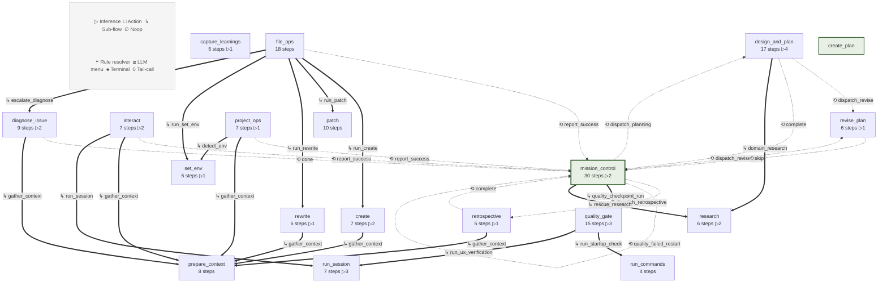
```mermaid
flowchart TD
    %% Ouroboros System View — All Architectural Flows

    subgraph Legend[" "]
        L1["▷ Inference  □ Action  ↳ Sub-flow  ∅ Noop"]
        L2["⑂ Rule resolver  ☰ LLM menu  ◆ Terminal  ⟲ Tail-call"]
    end
    style Legend fill:#f5f5f5,stroke:#ccc,stroke-width:1px
    style L1 fill:#f5f5f5,stroke:none,color:#555
    style L2 fill:#f5f5f5,stroke:none,color:#555

    capture_learnings["capture_learnings\n5 steps ▷1"]
    create["create\n7 steps ▷2"]
    design_and_plan["design_and_plan\n17 steps ▷4"]
    diagnose_issue["diagnose_issue\n9 steps ▷2"]
    file_ops["file_ops\n18 steps"]
    interact["interact\n7 steps ▷2"]
    mission_control["mission_control\n30 steps ▷2"]
    patch["patch\n10 steps"]
    prepare_context["prepare_context\n8 steps"]
    project_ops["project_ops\n7 steps ▷1"]
    quality_gate["quality_gate\n15 steps ▷3"]
    research["research\n6 steps ▷2"]
    retrospective["retrospective\n5 steps ▷1"]
    revise_plan["revise_plan\n6 steps ▷1"]
    rewrite["rewrite\n6 steps ▷1"]
    run_commands["run_commands\n4 steps"]
    run_session["run_session\n7 steps ▷3"]
    set_env["set_env\n5 steps ▷1"]

    create ==>|↳ gather_context| prepare_context
    design_and_plan -.->|⟲ dispatch_revise| revise_plan
    design_and_plan -.->|⟲ complete| mission_control
    design_and_plan ==>|↳ domain_research| research
    diagnose_issue -.->|⟲ done| mission_control
    diagnose_issue ==>|↳ gather_context| prepare_context
    file_ops -.->|⟲ report_success| mission_control
    file_ops ==>|↳ run_create| create
    file_ops ==>|↳ run_patch| patch
    file_ops ==>|↳ run_rewrite| rewrite
    file_ops ==>|↳ run_set_env| set_env
    file_ops ==>|↳ escalate_diagnose| diagnose_issue
    interact -.->|⟲ report_success| mission_control
    interact ==>|↳ gather_context| prepare_context
    interact ==>|↳ run_session| run_session
    mission_control -.->|⟲ dispatch_retrospective| retrospective
    mission_control -.->|⟲ dispatch_planning| design_and_plan
    mission_control -.->|⟲ dispatch_revise_plan| revise_plan
    mission_control -.->|⟲ quality_failed_restart| mission_control
    mission_control ==>|↳ quality_checkpoint_run| quality_gate
    mission_control ==>|↳ rescue_research| research
    project_ops -.->|⟲ report_success| mission_control
    project_ops ==>|↳ gather_context| prepare_context
    project_ops ==>|↳ detect_env| set_env
    quality_gate ==>|↳ run_startup_check| run_commands
    quality_gate ==>|↳ run_ux_verification| run_session
    retrospective -.->|⟲ complete| mission_control
    retrospective ==>|↳ gather_context| prepare_context
    revise_plan -.->|⟲ skip| mission_control
    rewrite ==>|↳ gather_context| prepare_context

    style mission_control fill:#e8f0e6,stroke:#2d5a27,stroke-width:3px
    style create_plan fill:#e8f0e6,stroke:#2d5a27,stroke-width:2px
```

## System Context

**Ouroboros** is a flow-driven autonomous coding agent backed by LLMVP local inference.
It operates as a pure GraphQL client — all inference flows through `localhost:8000/graphql`.

### Actors
- **Shop Director (User)** — Sets missions, checks in periodically via CLI.
- **Junior Developer (Local Model)** — Runs continuously via LLMVP, follows structured flows.
- **Senior Developer (External API)** — Consulted on escalation (design pending).

### Subsystem Boundaries
- **Flow Engine** — Declarative CUE graphs with typed I/O and explicit transitions.
- **Effects Interface** — Swappable protocol for all side effects (file I/O, subprocess, inference, persistence).
- **Persistence** — File-backed JSON in `.agent/` with atomic writes.
- **LLMVP** — External GraphQL inference server (separate project).

### Flow Inventory
| Category | Count |
|----------|-------|
| Orchestrator flows | 3 |
| Task flows | 5 |
| Sub-flows | 8 |
| Other | 2 |
| **Total** | **18** |

## Mission Lifecycle

`mission_control` is the hub flow orchestrating the entire agent lifecycle.
Child task flows tail-call back to `mission_control` on completion, creating a continuous cycle.

### mission_control Steps

- □ **load_state** ⑂ — Load mission state, event queue, and frustration map
- □ **apply_last_result** ⑂ — Apply the returning flow's structured result to mission state
- ∅ **dispatch_retrospective**  — Dispatch retrospective — task succeeded after frustration ⟲ → `retrospective`
- □ **process_events** ⑂ — Process user messages, abort/pause signals
- □ **start_session** ⑂ — Open memoryful inference session for the director cycle
- ▷ **reason** ⑂ — Analyze mission state at goal level — reason about next action
- ∅ **decide_flow** ☰ — Select the best action type based on analysis
- □ **select_task** ⑂ — Select task and assemble flow_directive from goal + task
- ▷ **compose_directive** ⑂ — Director composes a novel flow_directive via inference
- □ **resolve_target** ⑂ — Determine target file for the dispatch
- □ **record_and_dispatch** ⑂ — Record dispatch decision and end session
- □ **end_session_and_dispatch** ⑂ — Close director session, then dispatch task flow
- ∅ **dispatch**  — Dispatch to selected task flow with flow_directive ⟲ → `$ref:context.dispatch_config.flow`
- ∅ **dispatch_planning**  — No plan exists — dispatch to design_and_plan ⟲ → `design_and_plan`
- □ **end_session_and_design** ⑂ — Close director session before design_and_plan dispatch
- ∅ **dispatch_design**  — Director requested architecture revision ⟲ → `design_and_plan`
- ∅ **dispatch_revise_plan**  — Dispatch plan revision ⟲ → `revise_plan`
- □ **end_session_quality_checkpoint** ⑂ — Close director session, then run quality checkpoint
- ↳ **quality_checkpoint_run** ⑂ — Run quality inspection on current state
- □ **end_session_quality_completion** ⑂ — Close director session, then run final quality gate
- ↳ **quality_completion_run** ⑂ — Final quality gate for mission completion
- ∅ **quality_failed_restart**  — Quality gate failed — restart with structured results ⟲ → `mission_control`
- □ **end_session_deadlock** ⑂ — Close session before deadlock rescue attempt
- □ **check_rescue_budget** ⑂ — Check if rescue attempt is available
- ↳ **rescue_research** ⑂ — Diagnostic search — last attempt to find a way forward
- □ **save_rescue_notes** ⑂ — save_rescue_notes
- □ **completed**  — Mark mission complete ◆ `completed`
- □ **idle**  — Wait for events ⟲ → `mission_control`
- □ **mission_deadlocked**  — Mission deadlocked — rescue attempt exhausted ◆ `deadlocked`
- □ **aborted**  — Mission aborted ◆ `aborted`

### Tail-Call Targets (flows that return to mission_control)

- `design_and_plan` → `mission_control` (from step `complete`)
- `diagnose_issue` → `mission_control` (from step `done`)
- `diagnose_issue` → `mission_control` (from step `failed`)
- `file_ops` → `mission_control` (from step `report_success`)
- `file_ops` → `mission_control` (from step `report_failure`)
- `file_ops` → `mission_control` (from step `report_diagnosed`)
- `file_ops` → `mission_control` (from step `report_bail`)
- `interact` → `mission_control` (from step `report_success`)
- `interact` → `mission_control` (from step `report_with_issues`)
- `interact` → `mission_control` (from step `failed`)
- `mission_control` → `mission_control` (from step `quality_failed_restart`)
- `mission_control` → `mission_control` (from step `idle`)
- `project_ops` → `mission_control` (from step `report_success`)
- `project_ops` → `mission_control` (from step `failed`)
- `retrospective` → `mission_control` (from step `complete`)
- `retrospective` → `mission_control` (from step `failed`)
- `revise_plan` → `mission_control` (from step `skip`)
- `revise_plan` → `mission_control` (from step `complete`)

## Flow Catalog

### Orchestrator Flows

#### design_and_plan (v4)
*Design or reconcile project architecture, derive project goals,
then generate or revise the task plan. Auto-detects whether full
architecture reconciliation is needed (drift detected) or can be
skipped (no drift — straight to plan revision).*

**Tier:** `mission_objective` · **Reads:** `mission.objective`, `mission.architecture`, `mission.plan`, `mission.goals` · **Returns:** `architecture_updated`, `goals_derived`, `plan_task_count`
**Peers:** `file_ops`, `project_ops`, `interact`
**Inputs:** ○ mission_id · ◑ existing_progress
**Terminal:** ◆ failed
**Publishes:** ● mission · ● events · ● frustration · ● project_manifest · ● repo_map_formatted · ● inference_response · ● architecture · ● research_summary · ● goals
**Sub-flows:** ↳ research
**Tail-calls:** ⟲ mission_control · ⟲ revise_plan
**Effects:** ⟶ inference · 𓉗 list dir · →𓇴 load mission · →𓇴 read events · 𓉗 file read · 𓇴→ save mission
**Stats:** 17 steps · ▷ 4 inference · 14 ⑂ rule

**Prompts:**
- **design_initial** ▷ (t*0.2): Design project architecture from scratch
  Injects: {← context.mission_objective}, {← context.repo_map_formatted}, {← context.project_file_list}, {← context.existing_architecture}
- **design_reconcile** ▷ (t*0.2): Reconcile architecture with drifted codebase
  Injects: {← context.mission_objective}, {← context.repo_map_formatted}, {← context.project_file_list}, {← context.existing_architecture}
- **generate_plan** ▷ (t*0.2): Generate task plan aligned to architecture blueprint
  Injects: {← context.mission_objective}, {← context.working_directory}, {← context.architecture_listing}, {← context.project_file_list}
- **generate_plan_fallback** ▷ (t*0.2): Generate plan without structured architecture (parse failed)
  Injects: {← context.mission_objective}, {← context.working_directory}, {← context.project_file_list}

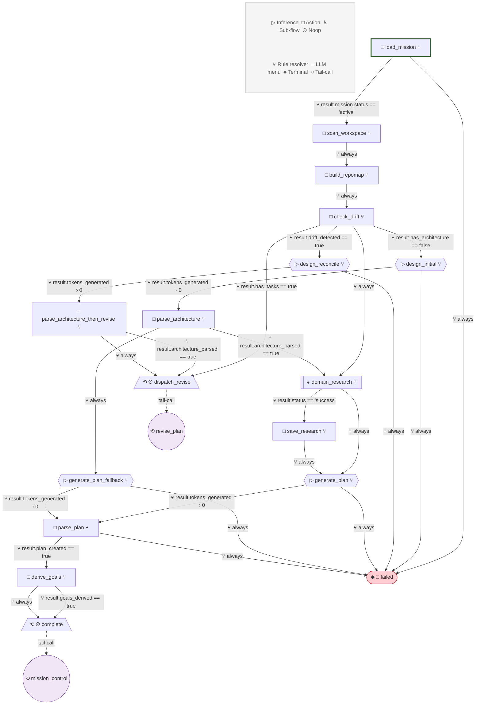
```mermaid
flowchart TD
    %% design_and_plan v4

    subgraph Legend[" "]
        L1["▷ Inference  □ Action  ↳ Sub-flow  ∅ Noop"]
        L2["⑂ Rule resolver  ☰ LLM menu  ◆ Terminal  ⟲ Tail-call"]
    end
    style Legend fill:#f5f5f5,stroke:#ccc,stroke-width:1px
    style L1 fill:#f5f5f5,stroke:none,color:#555
    style L2 fill:#f5f5f5,stroke:none,color:#555

    load_mission["□ load_mission ⑂"]
    scan_workspace["□ scan_workspace ⑂"]
    build_repomap["□ build_repomap ⑂"]
    check_drift["□ check_drift ⑂"]
    design_initial{{"▷ design_initial ⑂"}}
    design_reconcile{{"▷ design_reconcile ⑂"}}
    parse_architecture["□ parse_architecture ⑂"]
    parse_architecture_then_revise["□ parse_architecture_then_revise ⑂"]
    dispatch_revise[/"⟲ ∅ dispatch_revise"\]
    domain_research[["↳ domain_research ⑂"]]
    save_research["□ save_research ⑂"]
    generate_plan{{"▷ generate_plan ⑂"}}
    generate_plan_fallback{{"▷ generate_plan_fallback ⑂"}}
    parse_plan["□ parse_plan ⑂"]
    derive_goals["□ derive_goals ⑂"]
    complete[/"⟲ ∅ complete"\]
    failed(["◆ □ failed"])

    style load_mission stroke-width:3px,stroke:#2d5a27

    load_mission -->|⑂ result.mission.status == 'active'| scan_workspace
    load_mission -->|⑂ always| failed
    scan_workspace -->|⑂ always| build_repomap
    build_repomap -->|⑂ always| check_drift
    check_drift -->|⑂ result.has_architecture == false| design_initial
    check_drift -->|⑂ result.drift_detected == true| design_reconcile
    check_drift -->|⑂ result.has_tasks == true| dispatch_revise
    check_drift -->|⑂ always| domain_research
    design_initial -->|⑂ result.tokens_generated › 0| parse_architecture
    design_initial -->|⑂ always| failed
    design_reconcile -->|⑂ result.tokens_generated › 0| parse_architecture_then_revise
    design_reconcile -->|⑂ always| failed
    parse_architecture -->|⑂ result.architecture_parsed == true| domain_research
    parse_architecture -->|⑂ always| generate_plan_fallback
    parse_architecture_then_revise -->|⑂ result.architecture_parsed == true| dispatch_revise
    parse_architecture_then_revise -->|⑂ always| dispatch_revise
    tc_dispatch_revise(("⟲ revise_plan"))
    style tc_dispatch_revise fill:#f0e6f6,stroke:#663399
    dispatch_revise -.->|tail-call| tc_dispatch_revise
    domain_research -->|⑂ result.status == 'success'| save_research
    domain_research -->|⑂ always| generate_plan
    save_research -->|⑂ always| generate_plan
    generate_plan -->|⑂ result.tokens_generated › 0| parse_plan
    generate_plan -->|⑂ always| failed
    generate_plan_fallback -->|⑂ result.tokens_generated › 0| parse_plan
    generate_plan_fallback -->|⑂ always| failed
    parse_plan -->|⑂ result.plan_created == true| derive_goals
    parse_plan -->|⑂ always| failed
    derive_goals -->|⑂ result.goals_derived == true| complete
    derive_goals -->|⑂ always| complete
    tc_complete(("⟲ mission_control"))
    style tc_complete fill:#f0e6f6,stroke:#663399
    complete -.->|tail-call| tc_complete

    style failed fill:#ffcdd2,stroke:#b71c1c
```

#### mission_control (v5)
*Core director flow. Orchestrates the entire agent lifecycle:
load state → integrate last result → reason about next action →
select task → dispatch with flow_directive. Operates at the
project_goal level — reasons about which capability to advance.*

**Tier:** `project_goal` · **Reads:** `mission.objective`, `mission.goals`, `mission.plan`, `mission.architecture`, `mission.notes`, `mission.dispatch_history` · **Returns:** `final_status`
**Peers:** `file_ops`, `diagnose_issue`, `interact`, `project_ops`, `design_and_plan`, `quality_gate`
**Inputs:** ○ mission_id · ◑ last_result · ◑ last_status · ◑ last_task_id
**Terminal:** ◆ completed · ◆ deadlocked · ◆ aborted
**Publishes:** ● mission · ● events · ● frustration · ● session_id · ● director_analysis · ● dispatch_flow_type · ● dispatch_config · ● quality_results · ● rescue_count · ● research_summary
**Sub-flows:** ↳ quality_gate · ↳ quality_gate · ↳ research
**Tail-calls:** ⟲ $ref:context.dispatch_config.flow · ⟲ design_and_plan · ⟲ mission_control · ⟲ retrospective · ⟲ revise_plan
**Effects:** clear_events · end_inference_session · file_exists · ⟶ inference · 𓉗 list dir · →𓇴 load mission · →𓇴 read events · 𓇴→ save mission · session_inference · start_inference_session
**Stats:** 30 steps · ▷ 2-3 inference · 19 ⑂ rule · 1 ☰ menu

**Prompts:**
- **reason** ▷ (t*0.6): Analyze mission state at goal level — reason about next action
  Injects: {← context.goals_listing}, {← context.plan_listing}, {← context.architecture_summary}, {← context.last_status}, {← context.last_result} (+5 more)
- **compose_directive** ▷ (t*0.6): Director composes a novel flow_directive via inference
  Injects: {← context.director_analysis}, {← context.plan_listing}

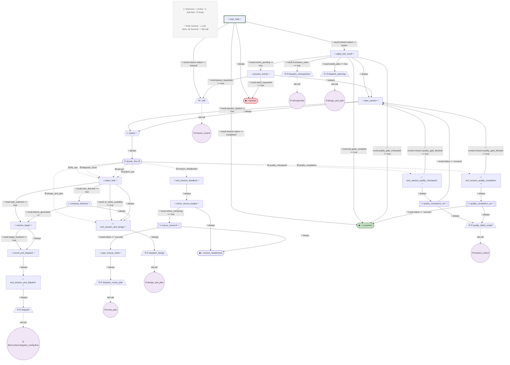
```mermaid
flowchart TD
    %% mission_control v5

    subgraph Legend[" "]
        L1["▷ Inference  □ Action  ↳ Sub-flow  ∅ Noop"]
        L2["⑂ Rule resolver  ☰ LLM menu  ◆ Terminal  ⟲ Tail-call"]
    end
    style Legend fill:#f5f5f5,stroke:#ccc,stroke-width:1px
    style L1 fill:#f5f5f5,stroke:none,color:#555
    style L2 fill:#f5f5f5,stroke:none,color:#555

    load_state["□ load_state ⑂"]
    apply_last_result["□ apply_last_result ⑂"]
    dispatch_retrospective[/"⟲ ∅ dispatch_retrospective"\]
    process_events["□ process_events ⑂"]
    start_session["□ start_session ⑂"]
    reason{{"▷ reason ⑂"}}
    decide_flow(["∅ decide_flow ☰"])
    select_task["□ select_task ⑂"]
    compose_directive{{"▷ compose_directive ⑂"}}
    resolve_target["□ resolve_target ⑂"]
    record_and_dispatch["□ record_and_dispatch ⑂"]
    end_session_and_dispatch["□ end_session_and_dispatch ⑂"]
    dispatch[/"⟲ ∅ dispatch"\]
    dispatch_planning[/"⟲ ∅ dispatch_planning"\]
    end_session_and_design["□ end_session_and_design ⑂"]
    dispatch_design[/"⟲ ∅ dispatch_design"\]
    dispatch_revise_plan[/"⟲ ∅ dispatch_revise_plan"\]
    end_session_quality_checkpoint["□ end_session_quality_checkpoint ⑂"]
    quality_checkpoint_run[["↳ quality_checkpoint_run ⑂"]]
    end_session_quality_completion["□ end_session_quality_completion ⑂"]
    quality_completion_run[["↳ quality_completion_run ⑂"]]
    quality_failed_restart[/"⟲ ∅ quality_failed_restart"\]
    end_session_deadlock["□ end_session_deadlock ⑂"]
    check_rescue_budget["□ check_rescue_budget ⑂"]
    rescue_research[["↳ rescue_research ⑂"]]
    save_rescue_notes["□ save_rescue_notes ⑂"]
    completed(["◆ □ completed"])
    idle[/"⟲ □ idle"\]
    mission_deadlocked(["◆ □ mission_deadlocked"])
    aborted(["◆ □ aborted"])

    style load_state stroke-width:3px,stroke:#2d5a27

    load_state -->|⑂ result.mission.status == 'active'| apply_last_result
    load_state -->|⑂ result.mission.status == 'paused'| idle
    load_state -->|⑂ result.mission.status == 'completed'| completed
    load_state -->|⑂ always| aborted
    apply_last_result -->|⑂ result.all_goals_complete == true| completed
    apply_last_result -->|⑂ result.quality_gate_exhausted == true| completed
    apply_last_result -->|⑂ result.events_pending == true| process_events
    apply_last_result -->|⑂ result.needs_plan == true| dispatch_planning
    apply_last_result -->|⑂ result.frustration_reset == true| dispatch_retrospective
    apply_last_result -->|⑂ always| start_session
    tc_dispatch_retrospective(("⟲ retrospective"))
    style tc_dispatch_retrospective fill:#f0e6f6,stroke:#663399
    dispatch_retrospective -.->|tail-call| tc_dispatch_retrospective
    process_events -->|⑂ result.abort_requested == true| aborted
    process_events -->|⑂ result.pause_requested == true| idle
    process_events -->|⑂ always| start_session
    start_session -->|⑂ result.session_started == true| reason
    start_session -->|⑂ always| reason
    reason -->|⑂ always| decide_flow
    decide_flow -.->|☰ file_ops| select_task
    decide_flow -.->|☰ diagnose_issue| select_task
    decide_flow -.->|☰ interact| select_task
    decide_flow -.->|☰ project_ops| select_task
    decide_flow -.->|☰ design_and_plan| end_session_and_design
    decide_flow -.->|☰ quality_checkpoint| end_session_quality_checkpoint
    decide_flow -.->|☰ quality_completion| end_session_quality_completion
    decide_flow -.->|☰ mission_deadlocked| end_session_deadlock
    select_task -->|⑂ result.task_selected == true| resolve_target
    select_task -->|⑂ result.infer_directive == true| compose_directive
    select_task -->|⑂ result.no_tasks_available == true| end_session_and_design
    select_task -->|⑂ always| end_session_and_design
    compose_directive -->|⑂ result.tokens_generated › 0| resolve_target
    compose_directive -->|⑂ always| end_session_and_design
    resolve_target -->|⑂ result.target_resolved == true| record_and_dispatch
    resolve_target -->|⑂ always| record_and_dispatch
    record_and_dispatch -->|⑂ always| end_session_and_dispatch
    end_session_and_dispatch -->|⑂ always| dispatch
    tc_dispatch(("⟲ $ref:context.dispatch_config.flow"))
    style tc_dispatch fill:#f0e6f6,stroke:#663399
    dispatch -.->|tail-call| tc_dispatch
    tc_dispatch_planning(("⟲ design_and_plan"))
    style tc_dispatch_planning fill:#f0e6f6,stroke:#663399
    dispatch_planning -.->|tail-call| tc_dispatch_planning
    end_session_and_design -->|⑂ always| dispatch_design
    tc_dispatch_design(("⟲ design_and_plan"))
    style tc_dispatch_design fill:#f0e6f6,stroke:#663399
    dispatch_design -.->|tail-call| tc_dispatch_design
    tc_dispatch_revise_plan(("⟲ revise_plan"))
    style tc_dispatch_revise_plan fill:#f0e6f6,stroke:#663399
    dispatch_revise_plan -.->|tail-call| tc_dispatch_revise_plan
    end_session_quality_checkpoint -->|⑂ context.mission.quality_gate_blocked == true| start_session
    end_session_quality_checkpoint -->|⑂ always| quality_checkpoint_run
    quality_checkpoint_run -->|⑂ result.status == 'success'| start_session
    quality_checkpoint_run -->|⑂ always| quality_failed_restart
    end_session_quality_completion -->|⑂ context.mission.quality_gate_blocked == true| start_session
    end_session_quality_completion -->|⑂ always| quality_completion_run
    quality_completion_run -->|⑂ result.status == 'success'| completed
    quality_completion_run -->|⑂ always| quality_failed_restart
    tc_quality_failed_restart(("⟲ mission_control"))
    style tc_quality_failed_restart fill:#f0e6f6,stroke:#663399
    quality_failed_restart -.->|tail-call| tc_quality_failed_restart
    end_session_deadlock -->|⑂ always| check_rescue_budget
    check_rescue_budget -->|⑂ result.retries_remaining == true| rescue_research
    check_rescue_budget -->|⑂ always| mission_deadlocked
    rescue_research -->|⑂ result.status == 'success'| save_rescue_notes
    rescue_research -->|⑂ always| mission_deadlocked
    save_rescue_notes -->|⑂ always| dispatch_revise_plan
    tc_idle(("⟲ mission_control"))
    style tc_idle fill:#f0e6f6,stroke:#663399
    idle -.->|tail-call| tc_idle

    style completed fill:#c8e6c9,stroke:#2d5a27
    style aborted fill:#ffcdd2,stroke:#b71c1c
```

#### revise_plan (v3)
*Revise the mission plan based on new observations.
Can add tasks, reorder priorities, or mark tasks obsoleted.
Reasons at the goal level — which tasks serve which goals.*

**Tier:** `project_goal` · **Reads:** `mission.objective`, `mission.plan`, `mission.goals`, `mission.architecture` · **Returns:** `revision_applied`, `tasks_added`, `tasks_reordered`, `tasks_removed`
**Peers:** `file_ops`, `project_ops`, `interact`
**Inputs:** ○ mission_id · ○ observation · ◑ discovered_requirement · ◑ affected_task_id
**Publishes:** ● repo_map_formatted · ● related_files · ● inference_response · ● mission · ● revision_applied · ● revision_stats
**Tail-calls:** ⟲ mission_control
**Effects:** ⟶ inference · 𓉗 list dir · →𓇴 load mission · →𓇴 read events · 𓉗 file read · 𓇴→ save mission
**Stats:** 6 steps · ▷ 1 inference · 4 ⑂ rule

**Prompts:**
- **evaluate_revision** ▷ (t*0.3): Determine what plan changes are needed
  Injects: {← context.plan_listing}, {← context.repo_map_formatted}, {← context.goals_listing}, {← input.observation}, {← input.discovered_requirement}

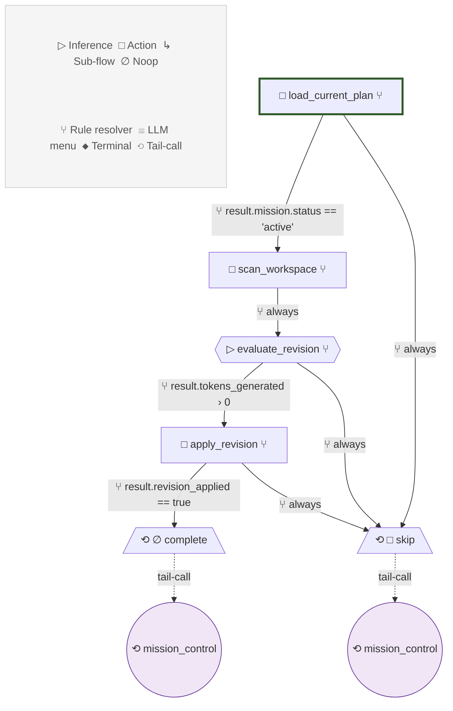
```mermaid
flowchart TD
    %% revise_plan v3

    subgraph Legend[" "]
        L1["▷ Inference  □ Action  ↳ Sub-flow  ∅ Noop"]
        L2["⑂ Rule resolver  ☰ LLM menu  ◆ Terminal  ⟲ Tail-call"]
    end
    style Legend fill:#f5f5f5,stroke:#ccc,stroke-width:1px
    style L1 fill:#f5f5f5,stroke:none,color:#555
    style L2 fill:#f5f5f5,stroke:none,color:#555

    load_current_plan["□ load_current_plan ⑂"]
    scan_workspace["□ scan_workspace ⑂"]
    evaluate_revision{{"▷ evaluate_revision ⑂"}}
    apply_revision["□ apply_revision ⑂"]
    skip[/"⟲ □ skip"\]
    complete[/"⟲ ∅ complete"\]

    style load_current_plan stroke-width:3px,stroke:#2d5a27

    load_current_plan -->|⑂ result.mission.status == 'active'| scan_workspace
    load_current_plan -->|⑂ always| skip
    scan_workspace -->|⑂ always| evaluate_revision
    evaluate_revision -->|⑂ result.tokens_generated › 0| apply_revision
    evaluate_revision -->|⑂ always| skip
    apply_revision -->|⑂ result.revision_applied == true| complete
    apply_revision -->|⑂ always| skip
    tc_skip(("⟲ mission_control"))
    style tc_skip fill:#f0e6f6,stroke:#663399
    skip -.->|tail-call| tc_skip
    tc_complete(("⟲ mission_control"))
    style tc_complete fill:#f0e6f6,stroke:#663399
    complete -.->|tail-call| tc_complete

```

### Task Flows

#### diagnose_issue (v4)
*Deep issue diagnosis. Traces the error path, generates fix
hypotheses, and creates a targeted fix task. Does not modify
files — produces understanding and follow-up work.*

**Tier:** `flow_directive` · **Returns:** `root_cause`, `fix_task_created`, `target_file`
**Peers:** `file_ops`
**Inputs:** ○ mission_id · ○ task_id · ○ flow_directive · ◑ target_file_path · ◑ error_description · ◑ error_output · ◑ working_directory · ◑ relevant_notes
**Publishes:** ● context_bundle · ● project_manifest · ● repo_map_formatted · ● related_files · ● target_file · ● error_analysis · ● hypotheses · ● diagnosis · ● fix_task_created
**Sub-flows:** ↳ prepare_context
**Tail-calls:** ⟲ mission_control
**Effects:** ⟶ inference · 𓉗 list dir · →𓇴 load mission · 𓉗 file read · 𓇴→ save mission
**Stats:** 9 steps · ▷ 2 inference · 7 ⑂ rule

**Prompts:**
- **reproduce_mentally** ▷ (t*0.4): Trace the error execution path — understand, don't fix
  Injects: {← context.target_file_content}, {← context.target_file_path}, {← context.file_excerpts}, {← input.error_description}, {← input.flow_directive} (+1 more)
- **form_hypotheses** ▷ (t*0.8): Generate 2-3 distinct fix hypotheses
  Injects: {← context.error_analysis}, {← context.target_file_content}, {← context.target_file_path}, {← context.peer_personas}

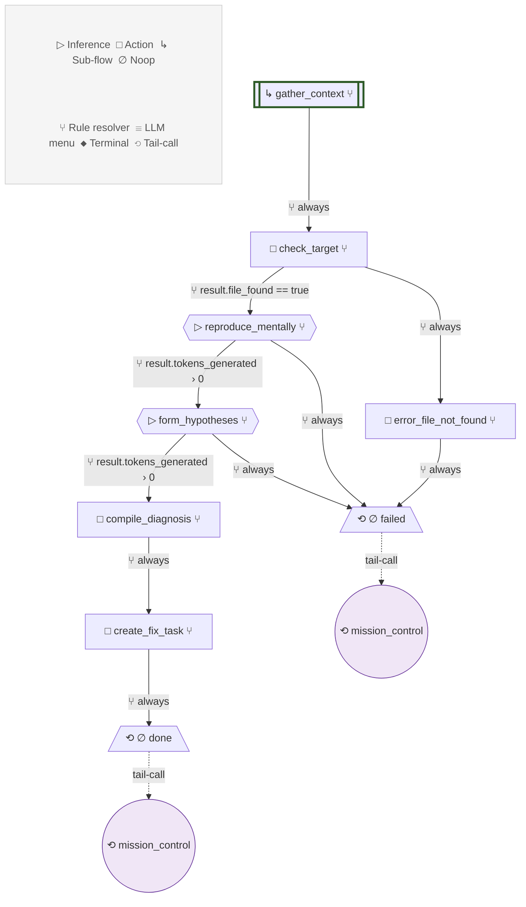
```mermaid
flowchart TD
    %% diagnose_issue v4

    subgraph Legend[" "]
        L1["▷ Inference  □ Action  ↳ Sub-flow  ∅ Noop"]
        L2["⑂ Rule resolver  ☰ LLM menu  ◆ Terminal  ⟲ Tail-call"]
    end
    style Legend fill:#f5f5f5,stroke:#ccc,stroke-width:1px
    style L1 fill:#f5f5f5,stroke:none,color:#555
    style L2 fill:#f5f5f5,stroke:none,color:#555

    gather_context[["↳ gather_context ⑂"]]
    check_target["□ check_target ⑂"]
    reproduce_mentally{{"▷ reproduce_mentally ⑂"}}
    form_hypotheses{{"▷ form_hypotheses ⑂"}}
    compile_diagnosis["□ compile_diagnosis ⑂"]
    create_fix_task["□ create_fix_task ⑂"]
    done[/"⟲ ∅ done"\]
    error_file_not_found["□ error_file_not_found ⑂"]
    failed[/"⟲ ∅ failed"\]

    style gather_context stroke-width:3px,stroke:#2d5a27

    gather_context -->|⑂ always| check_target
    check_target -->|⑂ result.file_found == true| reproduce_mentally
    check_target -->|⑂ always| error_file_not_found
    reproduce_mentally -->|⑂ result.tokens_generated › 0| form_hypotheses
    reproduce_mentally -->|⑂ always| failed
    form_hypotheses -->|⑂ result.tokens_generated › 0| compile_diagnosis
    form_hypotheses -->|⑂ always| failed
    compile_diagnosis -->|⑂ always| create_fix_task
    create_fix_task -->|⑂ always| done
    tc_done(("⟲ mission_control"))
    style tc_done fill:#f0e6f6,stroke:#663399
    done -.->|tail-call| tc_done
    error_file_not_found -->|⑂ always| failed
    tc_failed(("⟲ mission_control"))
    style tc_failed fill:#f0e6f6,stroke:#663399
    failed -.->|tail-call| tc_failed

```

#### file_ops (v1)
*File operations lifecycle. Routes to create/patch/rewrite,
validates output, self-corrects on failure, reports to
mission_control via structured returns.*

**Tier:** `flow_directive` · **Returns:** `target_file`, `files_changed`, `write_action`, `edit_summary`, `validation`, `bail_reason`
**Inputs:** ○ mission_id · ○ task_id · ○ target_file_path · ○ flow_directive · ◑ working_directory · ◑ relevant_notes · ◑ mode · ◑ prompt_variant
**Publishes:** ● files_changed · ● target_file · ● related_files · ● edit_summary · ● bail_reason · ● validation_commands · ● validation_results
**Sub-flows:** ↳ create · ↳ patch · ↳ rewrite · ↳ set_env · ↳ rewrite · ↳ diagnose_issue
**Tail-calls:** ⟲ mission_control
**Effects:** →𓇴 load mission · push_note · 𓉗 file read · ⌘ command · 𓇴→ save mission
**Stats:** 18 steps · 14 ⑂ rule

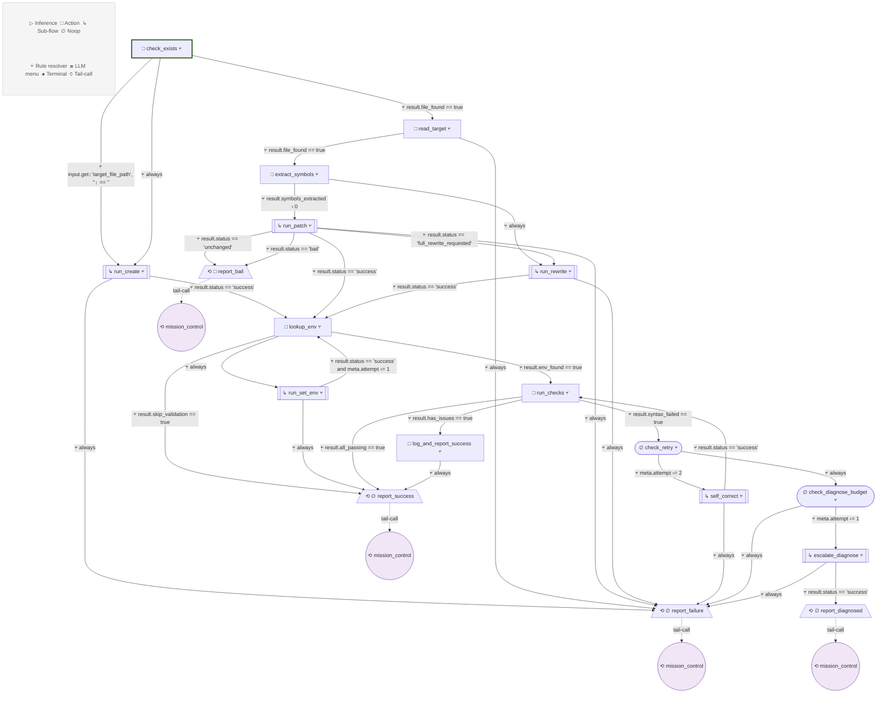
```mermaid
flowchart TD
    %% file_ops v1

    subgraph Legend[" "]
        L1["▷ Inference  □ Action  ↳ Sub-flow  ∅ Noop"]
        L2["⑂ Rule resolver  ☰ LLM menu  ◆ Terminal  ⟲ Tail-call"]
    end
    style Legend fill:#f5f5f5,stroke:#ccc,stroke-width:1px
    style L1 fill:#f5f5f5,stroke:none,color:#555
    style L2 fill:#f5f5f5,stroke:none,color:#555

    check_exists["□ check_exists ⑂"]
    run_create[["↳ run_create ⑂"]]
    read_target["□ read_target ⑂"]
    extract_symbols["□ extract_symbols ⑂"]
    run_patch[["↳ run_patch ⑂"]]
    run_rewrite[["↳ run_rewrite ⑂"]]
    lookup_env["□ lookup_env ⑂"]
    run_set_env[["↳ run_set_env ⑂"]]
    run_checks["□ run_checks ⑂"]
    check_retry(["∅ check_retry ⑂"])
    self_correct[["↳ self_correct ⑂"]]
    check_diagnose_budget(["∅ check_diagnose_budget ⑂"])
    escalate_diagnose[["↳ escalate_diagnose ⑂"]]
    log_and_report_success["□ log_and_report_success ⑂"]
    report_success[/"⟲ ∅ report_success"\]
    report_failure[/"⟲ ∅ report_failure"\]
    report_diagnosed[/"⟲ ∅ report_diagnosed"\]
    report_bail[/"⟲ □ report_bail"\]

    style check_exists stroke-width:3px,stroke:#2d5a27

    check_exists -->|⑂ input.get⟮'target_file_path', ''⟯ == ''| run_create
    check_exists -->|⑂ result.file_found == true| read_target
    check_exists -->|⑂ always| run_create
    run_create -->|⑂ result.status == 'success'| lookup_env
    run_create -->|⑂ always| report_failure
    read_target -->|⑂ result.file_found == true| extract_symbols
    read_target -->|⑂ always| report_failure
    extract_symbols -->|⑂ result.symbols_extracted › 0| run_patch
    extract_symbols -->|⑂ always| run_rewrite
    run_patch -->|⑂ result.status == 'success'| lookup_env
    run_patch -->|⑂ result.status == 'full_rewrite_requested'| run_rewrite
    run_patch -->|⑂ result.status == 'unchanged'| report_bail
    run_patch -->|⑂ result.status == 'bail'| report_bail
    run_patch -->|⑂ always| report_failure
    run_rewrite -->|⑂ result.status == 'success'| lookup_env
    run_rewrite -->|⑂ always| report_failure
    lookup_env -->|⑂ result.env_found == true| run_checks
    lookup_env -->|⑂ result.skip_validation == true| report_success
    lookup_env -->|⑂ always| run_set_env
    run_set_env -->|⑂ result.status == 'success' and meta.attempt ‹= 1| lookup_env
    run_set_env -->|⑂ always| report_success
    run_checks -->|⑂ result.all_passing == true| report_success
    run_checks -->|⑂ result.syntax_failed == true| check_retry
    run_checks -->|⑂ result.has_issues == true| log_and_report_success
    check_retry -->|⑂ meta.attempt ‹= 2| self_correct
    check_retry -->|⑂ always| check_diagnose_budget
    self_correct -->|⑂ result.status == 'success'| run_checks
    self_correct -->|⑂ always| report_failure
    check_diagnose_budget -->|⑂ meta.attempt ‹= 1| escalate_diagnose
    check_diagnose_budget -->|⑂ always| report_failure
    escalate_diagnose -->|⑂ result.status == 'success'| report_diagnosed
    escalate_diagnose -->|⑂ always| report_failure
    log_and_report_success -->|⑂ always| report_success
    tc_report_success(("⟲ mission_control"))
    style tc_report_success fill:#f0e6f6,stroke:#663399
    report_success -.->|tail-call| tc_report_success
    tc_report_failure(("⟲ mission_control"))
    style tc_report_failure fill:#f0e6f6,stroke:#663399
    report_failure -.->|tail-call| tc_report_failure
    tc_report_diagnosed(("⟲ mission_control"))
    style tc_report_diagnosed fill:#f0e6f6,stroke:#663399
    report_diagnosed -.->|tail-call| tc_report_diagnosed
    tc_report_bail(("⟲ mission_control"))
    style tc_report_bail fill:#f0e6f6,stroke:#663399
    report_bail -.->|tail-call| tc_report_bail

```

#### interact (v2)
*Use the product. Run it, interact with it, observe behavior,
test specific features. Returns observations to the director.
Plans an execution persona, then dispatches run_session.*

**Tier:** `flow_directive` · **Returns:** `session_summary`, `commands_run`, `issues_found`
**Inputs:** ○ mission_id · ○ task_id · ○ flow_directive · ◑ working_directory · ◑ relevant_notes
**Publishes:** ● context_bundle · ● project_manifest · ● repo_map_formatted · ● related_files · ● execution_persona · ● terminal_output · ● session_summary · ● inference_response
**Sub-flows:** ↳ prepare_context · ↳ run_session
**Tail-calls:** ⟲ mission_control
**Effects:** ⟶ inference
**Stats:** 7 steps · ▷ 2 inference · 4 ⑂ rule

**Prompts:**
- **plan_interaction** ▷ (t*0.4): Craft execution persona and session context
  Injects: {← context.project_file_list}, {← context.repo_map_formatted}, {← input.flow_directive}, {← input.relevant_notes}
- **evaluate_outcome** ▷ (t*0.2): Evaluate whether the product worked correctly
  Injects: {← context.session_summary}, {← context.terminal_output}, {← input.flow_directive}

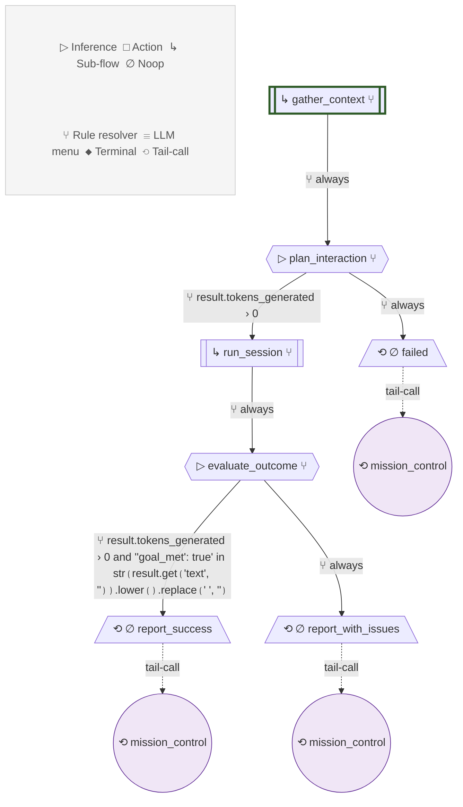
```mermaid
flowchart TD
    %% interact v2

    subgraph Legend[" "]
        L1["▷ Inference  □ Action  ↳ Sub-flow  ∅ Noop"]
        L2["⑂ Rule resolver  ☰ LLM menu  ◆ Terminal  ⟲ Tail-call"]
    end
    style Legend fill:#f5f5f5,stroke:#ccc,stroke-width:1px
    style L1 fill:#f5f5f5,stroke:none,color:#555
    style L2 fill:#f5f5f5,stroke:none,color:#555

    gather_context[["↳ gather_context ⑂"]]
    plan_interaction{{"▷ plan_interaction ⑂"}}
    run_session[["↳ run_session ⑂"]]
    evaluate_outcome{{"▷ evaluate_outcome ⑂"}}
    report_success[/"⟲ ∅ report_success"\]
    report_with_issues[/"⟲ ∅ report_with_issues"\]
    failed[/"⟲ ∅ failed"\]

    style gather_context stroke-width:3px,stroke:#2d5a27

    gather_context -->|⑂ always| plan_interaction
    plan_interaction -->|⑂ result.tokens_generated › 0| run_session
    plan_interaction -->|⑂ always| failed
    run_session -->|⑂ always| evaluate_outcome
    evaluate_outcome -->|⑂ result.tokens_generated › 0 and ''goal_met': true' in str⟮result.get⟮'text', ''⟯⟯.lower⟮⟯.replace⟮' ', ''⟯| report_success
    evaluate_outcome -->|⑂ always| report_with_issues
    tc_report_success(("⟲ mission_control"))
    style tc_report_success fill:#f0e6f6,stroke:#663399
    report_success -.->|tail-call| tc_report_success
    tc_report_with_issues(("⟲ mission_control"))
    style tc_report_with_issues fill:#f0e6f6,stroke:#663399
    report_with_issues -.->|tail-call| tc_report_with_issues
    tc_failed(("⟲ mission_control"))
    style tc_failed fill:#f0e6f6,stroke:#663399
    failed -.->|tail-call| tc_failed

```

#### project_ops (v4)
*Initialize project tooling and structure. Creates config files,
directories, installs dependencies, and detects validation tooling.*

**Tier:** `flow_directive` · **Returns:** `setup_complete`, `files_changed`, `env_detected`
**Inputs:** ○ mission_id · ○ task_id · ○ flow_directive · ◑ working_directory · ◑ relevant_notes · ◑ setup_focus
**Publishes:** ● context_bundle · ● project_manifest · ● repo_map_formatted · ● related_files · ● inference_response
**Sub-flows:** ↳ prepare_context · ↳ set_env
**Tail-calls:** ⟲ mission_control
**Effects:** file_exists · ⟶ inference · 𓉗 file read · ⌘ command · 𓉗 file write
**Stats:** 7 steps · ▷ 1 inference · 5 ⑂ rule

**Prompts:**
- **plan_setup** ▷ (t*0.3): Determine what setup actions are needed
  Injects: {← context.project_file_list}, {← input.flow_directive}, {← input.setup_focus}, {← input.relevant_notes}

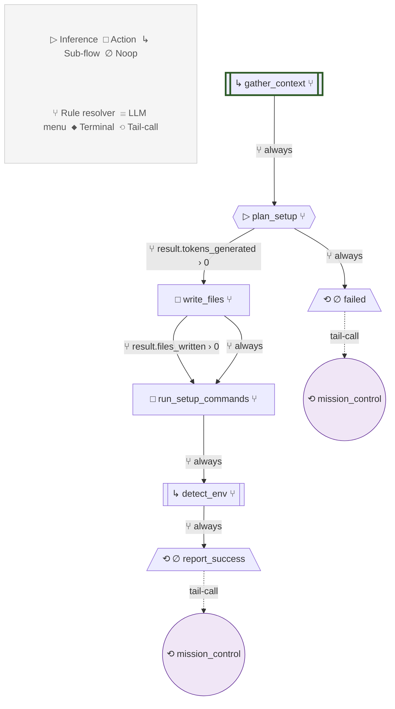
```mermaid
flowchart TD
    %% project_ops v4

    subgraph Legend[" "]
        L1["▷ Inference  □ Action  ↳ Sub-flow  ∅ Noop"]
        L2["⑂ Rule resolver  ☰ LLM menu  ◆ Terminal  ⟲ Tail-call"]
    end
    style Legend fill:#f5f5f5,stroke:#ccc,stroke-width:1px
    style L1 fill:#f5f5f5,stroke:none,color:#555
    style L2 fill:#f5f5f5,stroke:none,color:#555

    gather_context[["↳ gather_context ⑂"]]
    plan_setup{{"▷ plan_setup ⑂"}}
    write_files["□ write_files ⑂"]
    run_setup_commands["□ run_setup_commands ⑂"]
    detect_env[["↳ detect_env ⑂"]]
    report_success[/"⟲ ∅ report_success"\]
    failed[/"⟲ ∅ failed"\]

    style gather_context stroke-width:3px,stroke:#2d5a27

    gather_context -->|⑂ always| plan_setup
    plan_setup -->|⑂ result.tokens_generated › 0| write_files
    plan_setup -->|⑂ always| failed
    write_files -->|⑂ result.files_written › 0| run_setup_commands
    write_files -->|⑂ always| run_setup_commands
    run_setup_commands -->|⑂ always| detect_env
    detect_env -->|⑂ always| report_success
    tc_report_success(("⟲ mission_control"))
    style tc_report_success fill:#f0e6f6,stroke:#663399
    report_success -.->|tail-call| tc_report_success
    tc_failed(("⟲ mission_control"))
    style tc_failed fill:#f0e6f6,stroke:#663399
    failed -.->|tail-call| tc_failed

```

#### research (v2)
*Search for information and summarize into dense, actionable text.
The caller provides a specific research_query. This flow plans
search queries, executes them, and returns a summary.*

**Tier:** `session_task` · **Returns:** `summary`, `queries_run`, `results_found`
**Inputs:** ○ research_query · ◑ research_context · ◑ max_results
**Terminal:** ◆ success · ◆ empty
**Publishes:** ● inference_response · ● search_queries · ● raw_search_results · ● research_summary
**Effects:** ⟶ inference · ⌘ command
**Stats:** 6 steps · ▷ 2 inference · 4 ⑂ rule

**Prompts:**
- **plan_queries** ▷ (t*0.2): Generate 2-3 targeted search queries from the research question
  Injects: {← input.research_query}, {← input.research_context}
- **summarize** ▷ (t*0.2): Distill search results into dense, actionable guidance
  Injects: {← context.raw_search_results}, {← input.research_query}, {← input.research_context}

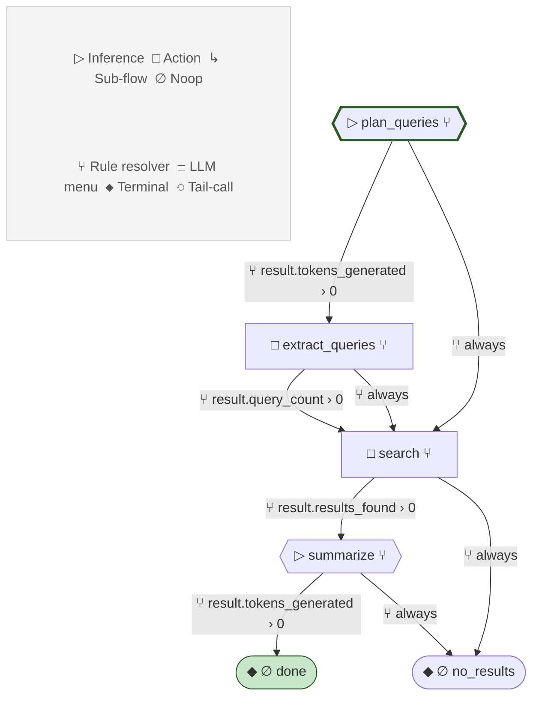
```mermaid
flowchart TD
    %% research v2

    subgraph Legend[" "]
        L1["▷ Inference  □ Action  ↳ Sub-flow  ∅ Noop"]
        L2["⑂ Rule resolver  ☰ LLM menu  ◆ Terminal  ⟲ Tail-call"]
    end
    style Legend fill:#f5f5f5,stroke:#ccc,stroke-width:1px
    style L1 fill:#f5f5f5,stroke:none,color:#555
    style L2 fill:#f5f5f5,stroke:none,color:#555

    plan_queries{{"▷ plan_queries ⑂"}}
    extract_queries["□ extract_queries ⑂"]
    search["□ search ⑂"]
    summarize{{"▷ summarize ⑂"}}
    done(["◆ ∅ done"])
    no_results(["◆ ∅ no_results"])

    style plan_queries stroke-width:3px,stroke:#2d5a27

    plan_queries -->|⑂ result.tokens_generated › 0| extract_queries
    plan_queries -->|⑂ always| search
    extract_queries -->|⑂ result.query_count › 0| search
    extract_queries -->|⑂ always| search
    search -->|⑂ result.results_found › 0| summarize
    search -->|⑂ always| no_results
    summarize -->|⑂ result.tokens_generated › 0| done
    summarize -->|⑂ always| no_results

    style done fill:#c8e6c9,stroke:#2d5a27
```

### Sub-flows

#### capture_learnings (v3)
*Reflect on completed work and persist observations as mission
notes. Reads source file, generates reflection, saves as note.*

**Tier:** `session_task` · **Returns:** `learning_captured`
**Inputs:** ○ task_description · ◑ target_file_path · ◑ task_outcome
**Terminal:** ◆ skipped · ◆ success
**Publishes:** ● source_file · ● inference_response
**Effects:** ⟶ inference · →𓇴 load mission · 𓉗 file read · 𓇴→ save mission
**Stats:** 5 steps · ▷ 1 inference · 3 ⑂ rule

**Prompts:**
- **reflect** ▷ (t*0.5): Reflect on what was learned from this task
  Injects: {← context.source_file_content}, {← input.task_description}, {← input.task_outcome}

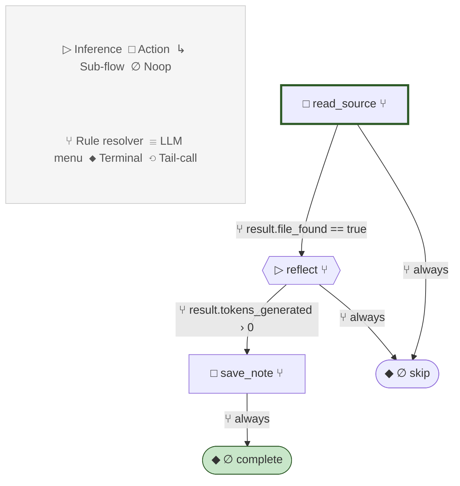
```mermaid
flowchart TD
    %% capture_learnings v3

    subgraph Legend[" "]
        L1["▷ Inference  □ Action  ↳ Sub-flow  ∅ Noop"]
        L2["⑂ Rule resolver  ☰ LLM menu  ◆ Terminal  ⟲ Tail-call"]
    end
    style Legend fill:#f5f5f5,stroke:#ccc,stroke-width:1px
    style L1 fill:#f5f5f5,stroke:none,color:#555
    style L2 fill:#f5f5f5,stroke:none,color:#555

    read_source["□ read_source ⑂"]
    reflect{{"▷ reflect ⑂"}}
    save_note["□ save_note ⑂"]
    skip(["◆ ∅ skip"])
    complete(["◆ ∅ complete"])

    style read_source stroke-width:3px,stroke:#2d5a27

    read_source -->|⑂ result.file_found == true| reflect
    read_source -->|⑂ always| skip
    reflect -->|⑂ result.tokens_generated › 0| save_note
    reflect -->|⑂ always| skip
    save_note -->|⑂ always| complete

    style complete fill:#c8e6c9,stroke:#2d5a27
```

#### create (v1)
*Create a new source file. Gathers project context, generates
content via inference, writes to disk. Called by file_ops
when the target file does not exist.*

**Tier:** `session_task` · **Returns:** `files_changed`
**Inputs:** ○ mission_id · ○ task_id · ○ target_file_path · ○ flow_directive · ◑ working_directory · ◑ relevant_notes · ◑ prompt_variant
**Terminal:** ◆ success · ◆ failed
**Publishes:** ● context_bundle · ● project_manifest · ● repo_map_formatted · ● related_files · ● inference_response
**Sub-flows:** ↳ prepare_context
**Effects:** ⟶ inference · 𓉗 file read · 𓉗 file write
**Stats:** 7 steps · ▷ 2 inference · 5 ⑂ rule

**Prompts:**
- **generate_content** ▷ (t*0.4): Generate file content
  Injects: {← context.repo_map_formatted}, {← context.file_excerpts}, {← input.flow_directive}, {← input.target_file_path}, {← input.relevant_notes}
- **generate_tests** ▷ (t*0.4): Generate test file content
  Injects: {← context.repo_map_formatted}, {← context.file_excerpts}, {← input.flow_directive}, {← input.target_file_path}, {← input.relevant_notes}

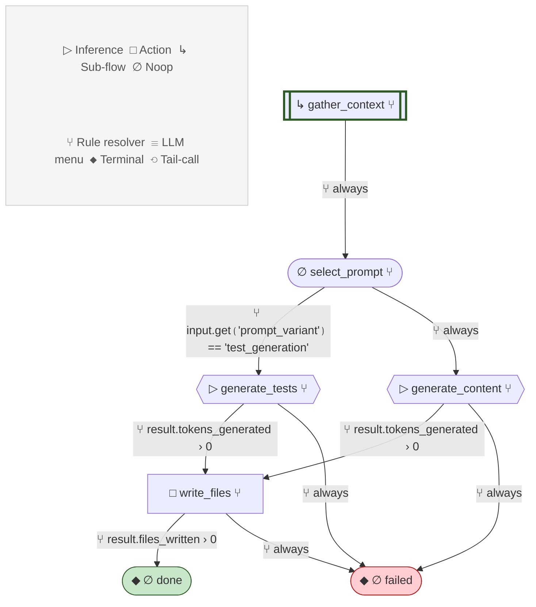
```mermaid
flowchart TD
    %% create v1

    subgraph Legend[" "]
        L1["▷ Inference  □ Action  ↳ Sub-flow  ∅ Noop"]
        L2["⑂ Rule resolver  ☰ LLM menu  ◆ Terminal  ⟲ Tail-call"]
    end
    style Legend fill:#f5f5f5,stroke:#ccc,stroke-width:1px
    style L1 fill:#f5f5f5,stroke:none,color:#555
    style L2 fill:#f5f5f5,stroke:none,color:#555

    gather_context[["↳ gather_context ⑂"]]
    select_prompt(["∅ select_prompt ⑂"])
    generate_content{{"▷ generate_content ⑂"}}
    generate_tests{{"▷ generate_tests ⑂"}}
    write_files["□ write_files ⑂"]
    done(["◆ ∅ done"])
    failed(["◆ ∅ failed"])

    style gather_context stroke-width:3px,stroke:#2d5a27

    gather_context -->|⑂ always| select_prompt
    select_prompt -->|⑂ input.get⟮'prompt_variant'⟯ == 'test_generation'| generate_tests
    select_prompt -->|⑂ always| generate_content
    generate_content -->|⑂ result.tokens_generated › 0| write_files
    generate_content -->|⑂ always| failed
    generate_tests -->|⑂ result.tokens_generated › 0| write_files
    generate_tests -->|⑂ always| failed
    write_files -->|⑂ result.files_written › 0| done
    write_files -->|⑂ always| failed

    style done fill:#c8e6c9,stroke:#2d5a27
    style failed fill:#ffcdd2,stroke:#b71c1c
```

#### patch (v1)
*Surgical AST-aware editing. Presents symbols as a constrained
menu, rewrites each selected symbol in a memoryful inference
session. The most precise file operation available.*

**Tier:** `session_task` · **Returns:** `files_changed`, `edit_summary`, `bail_reason`
**Inputs:** ○ file_path · ○ file_content · ○ symbol_table · ○ symbol_menu_options · ○ flow_directive · ◑ mode · ◑ relevant_notes · ◑ working_directory · ◑ validation_errors
**Terminal:** ◆ success · ◆ unchanged · ◆ full_rewrite_requested · ◆ bail · ◆ failed
**Publishes:** ● edit_session_id · ● selected_symbols · ● file_content · ● file_path · ● mode · ● selection_turn · ● rewrite_queue · ● current_symbol · ● file_content_updated · ● files_changed (+2 more)
**Effects:** end_inference_session · session_inference · start_inference_session · 𓉗 file write
**Stats:** 10 steps · 5 ⑂ rule

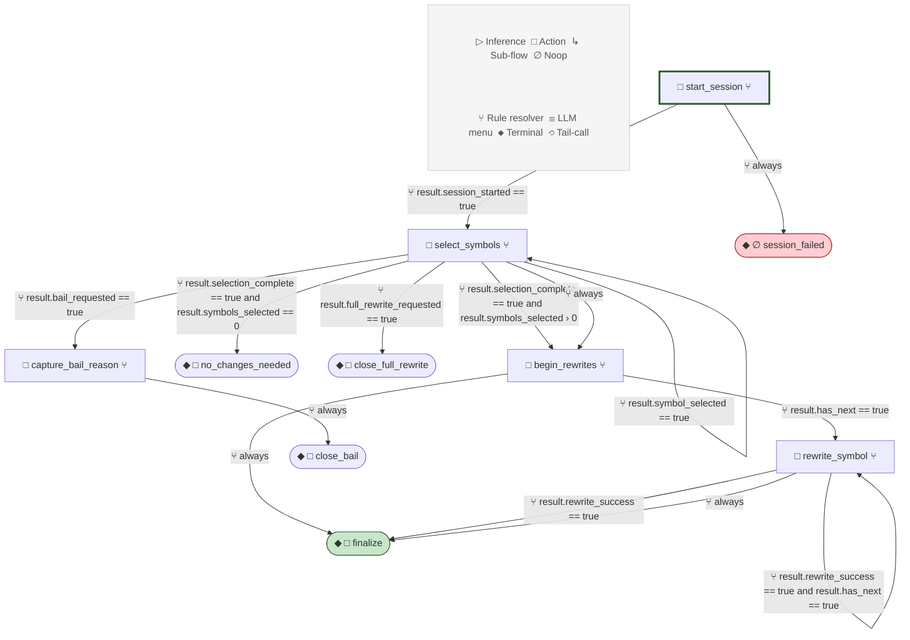
```mermaid
flowchart TD
    %% patch v1

    subgraph Legend[" "]
        L1["▷ Inference  □ Action  ↳ Sub-flow  ∅ Noop"]
        L2["⑂ Rule resolver  ☰ LLM menu  ◆ Terminal  ⟲ Tail-call"]
    end
    style Legend fill:#f5f5f5,stroke:#ccc,stroke-width:1px
    style L1 fill:#f5f5f5,stroke:none,color:#555
    style L2 fill:#f5f5f5,stroke:none,color:#555

    start_session["□ start_session ⑂"]
    select_symbols["□ select_symbols ⑂"]
    begin_rewrites["□ begin_rewrites ⑂"]
    rewrite_symbol["□ rewrite_symbol ⑂"]
    finalize(["◆ □ finalize"])
    no_changes_needed(["◆ □ no_changes_needed"])
    close_full_rewrite(["◆ □ close_full_rewrite"])
    capture_bail_reason["□ capture_bail_reason ⑂"]
    close_bail(["◆ □ close_bail"])
    session_failed(["◆ ∅ session_failed"])

    style start_session stroke-width:3px,stroke:#2d5a27

    start_session -->|⑂ result.session_started == true| select_symbols
    start_session -->|⑂ always| session_failed
    select_symbols -->|⑂ result.selection_complete == true and result.symbols_selected › 0| begin_rewrites
    select_symbols -->|⑂ result.selection_complete == true and result.symbols_selected == 0| no_changes_needed
    select_symbols -->|⑂ result.full_rewrite_requested == true| close_full_rewrite
    select_symbols -->|⑂ result.bail_requested == true| capture_bail_reason
    select_symbols -->|⑂ result.symbol_selected == true| select_symbols
    select_symbols -->|⑂ always| begin_rewrites
    begin_rewrites -->|⑂ result.has_next == true| rewrite_symbol
    begin_rewrites -->|⑂ always| finalize
    rewrite_symbol -->|⑂ result.rewrite_success == true and result.has_next == true| rewrite_symbol
    rewrite_symbol -->|⑂ result.rewrite_success == true| finalize
    rewrite_symbol -->|⑂ always| finalize
    capture_bail_reason -->|⑂ always| close_bail

    style finalize fill:#c8e6c9,stroke:#2d5a27
    style session_failed fill:#ffcdd2,stroke:#b71c1c
```

#### prepare_context (v3)
*Deterministic context preparation. Scans workspace, builds AST
repo map, grabs git summary, selects relevant files, and loads
content. Zero inference calls.*

**Tier:** `session_task` · **Returns:** `context_bundle`, `project_manifest`, `repo_map_formatted`
**Inputs:** ○ working_directory · ○ task_description · ◑ target_file_path · ◑ context_budget · ◑ relevant_notes
**Terminal:** ◆ success
**Publishes:** ● project_manifest · ● repo_map_formatted · ● related_files · ● git_summary · ● selected_files · ● context_bundle
**Effects:** 𓉗 list dir · 𓉗 file read · ⌘ command
**Stats:** 8 steps · 6 ⑂ rule

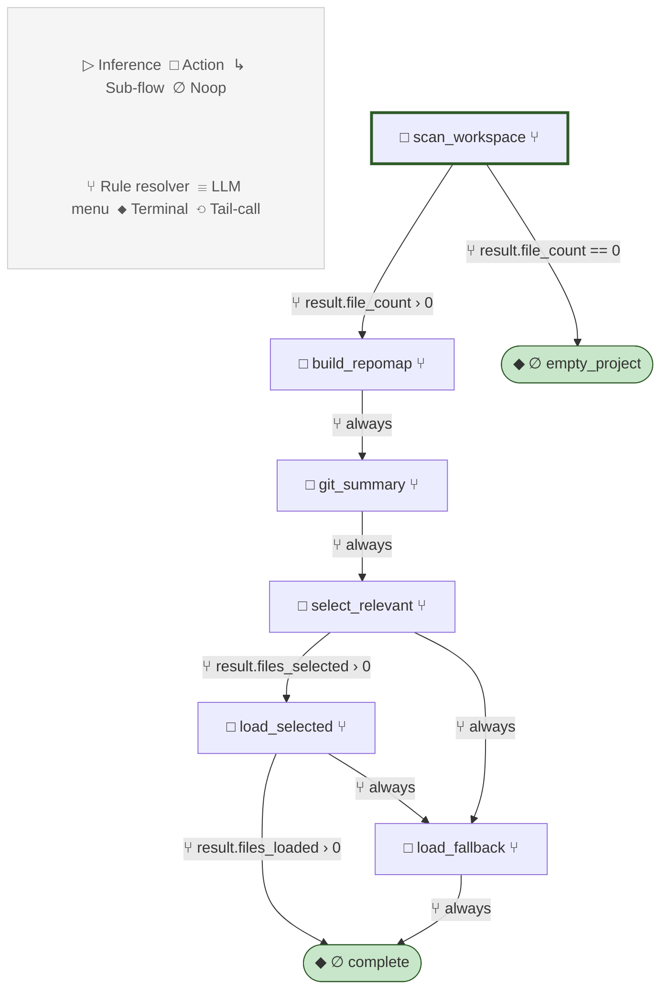
```mermaid
flowchart TD
    %% prepare_context v3

    subgraph Legend[" "]
        L1["▷ Inference  □ Action  ↳ Sub-flow  ∅ Noop"]
        L2["⑂ Rule resolver  ☰ LLM menu  ◆ Terminal  ⟲ Tail-call"]
    end
    style Legend fill:#f5f5f5,stroke:#ccc,stroke-width:1px
    style L1 fill:#f5f5f5,stroke:none,color:#555
    style L2 fill:#f5f5f5,stroke:none,color:#555

    scan_workspace["□ scan_workspace ⑂"]
    build_repomap["□ build_repomap ⑂"]
    git_summary["□ git_summary ⑂"]
    select_relevant["□ select_relevant ⑂"]
    load_selected["□ load_selected ⑂"]
    load_fallback["□ load_fallback ⑂"]
    empty_project(["◆ ∅ empty_project"])
    complete(["◆ ∅ complete"])

    style scan_workspace stroke-width:3px,stroke:#2d5a27

    scan_workspace -->|⑂ result.file_count › 0| build_repomap
    scan_workspace -->|⑂ result.file_count == 0| empty_project
    build_repomap -->|⑂ always| git_summary
    git_summary -->|⑂ always| select_relevant
    select_relevant -->|⑂ result.files_selected › 0| load_selected
    select_relevant -->|⑂ always| load_fallback
    load_selected -->|⑂ result.files_loaded › 0| complete
    load_selected -->|⑂ always| load_fallback
    load_fallback -->|⑂ always| complete

    style empty_project fill:#c8e6c9,stroke:#2d5a27
    style complete fill:#c8e6c9,stroke:#2d5a27
```

#### quality_gate (v5)
*Project-wide quality validation. Three-phase gate:
1. Deterministic checks — file scan, cross-file consistency, lint
2. Behavioral validation — run_commands (fast-fail), then
   run_session (UX verification, completion mode only)
3. Summary — LLM reviews all results and determines pass/fail*

**Tier:** `mission_objective` · **Reads:** `mission.objective` · **Returns:** `verdict`, `blocking_issues`, `check_results`, `terminal_output`, `dep_coverage`
**Inputs:** ○ working_directory · ○ mission_id · ◑ mission_objective · ◑ architecture_run_command · ◑ mode
**Terminal:** ◆ success · ◆ failed
**Publishes:** ● project_manifest · ● cross_file_summary · ● inference_response · ● validation_results · ● dep_check_imports · ● dep_check_manifest · ● dep_check_skipped · ● dep_coverage_result · ● dep_coverage_issues · ● terminal_output (+2 more)
**Sub-flows:** ↳ run_commands · ↳ run_session
**Effects:** ⟶ inference · 𓉗 list dir · →𓇴 load mission · 𓉗 file read · ⌘ command · 𓇴→ save mission
**Stats:** 15 steps · ▷ 3 inference · 12 ⑂ rule

**Prompts:**
- **plan_checks** ▷ (t*0.0): LLM plans deterministic validation checks (imports, lint)
  Injects: {← context.project_listing}, {← input.working_directory}
- **analyze_deps** ▷ (t*0.0): LLM checks whether all imports are covered by declared dependencies
  Injects: {← context.dep_check_imports}, {← context.dep_check_manifest}
- **summarize** ▷ (t*0.1): Summarize all quality results into actionable findings
  Injects: {← context.validation_summary}, {← context.project_file_list}, {← context.cross_file_summary}, {← context.terminal_output}, {← context.session_summary} (+2 more)

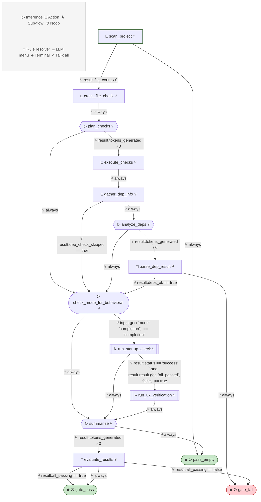
```mermaid
flowchart TD
    %% quality_gate v5

    subgraph Legend[" "]
        L1["▷ Inference  □ Action  ↳ Sub-flow  ∅ Noop"]
        L2["⑂ Rule resolver  ☰ LLM menu  ◆ Terminal  ⟲ Tail-call"]
    end
    style Legend fill:#f5f5f5,stroke:#ccc,stroke-width:1px
    style L1 fill:#f5f5f5,stroke:none,color:#555
    style L2 fill:#f5f5f5,stroke:none,color:#555

    scan_project["□ scan_project ⑂"]
    cross_file_check["□ cross_file_check ⑂"]
    plan_checks{{"▷ plan_checks ⑂"}}
    execute_checks["□ execute_checks ⑂"]
    gather_dep_info["□ gather_dep_info ⑂"]
    analyze_deps{{"▷ analyze_deps ⑂"}}
    parse_dep_result["□ parse_dep_result ⑂"]
    check_mode_for_behavioral(["∅ check_mode_for_behavioral ⑂"])
    run_startup_check[["↳ run_startup_check ⑂"]]
    run_ux_verification[["↳ run_ux_verification ⑂"]]
    summarize{{"▷ summarize ⑂"}}
    evaluate_results["□ evaluate_results ⑂"]
    gate_pass(["◆ ∅ gate_pass"])
    gate_fail(["◆ ∅ gate_fail"])
    pass_empty(["◆ ∅ pass_empty"])

    style scan_project stroke-width:3px,stroke:#2d5a27

    scan_project -->|⑂ result.file_count › 0| cross_file_check
    scan_project -->|⑂ always| pass_empty
    cross_file_check -->|⑂ always| plan_checks
    plan_checks -->|⑂ result.tokens_generated › 0| execute_checks
    plan_checks -->|⑂ always| check_mode_for_behavioral
    execute_checks -->|⑂ always| gather_dep_info
    gather_dep_info -->|⑂ result.dep_check_skipped == true| check_mode_for_behavioral
    gather_dep_info -->|⑂ always| analyze_deps
    analyze_deps -->|⑂ result.tokens_generated › 0| parse_dep_result
    analyze_deps -->|⑂ always| check_mode_for_behavioral
    parse_dep_result -->|⑂ result.deps_ok == true| check_mode_for_behavioral
    parse_dep_result -->|⑂ always| gate_fail
    check_mode_for_behavioral -->|⑂ input.get⟮'mode', 'completion'⟯ == 'completion'| run_startup_check
    check_mode_for_behavioral -->|⑂ always| summarize
    run_startup_check -->|⑂ result.status == 'success' and result.result.get⟮'all_passed', false⟯ == true| run_ux_verification
    run_startup_check -->|⑂ always| summarize
    run_ux_verification -->|⑂ always| summarize
    summarize -->|⑂ result.tokens_generated › 0| evaluate_results
    summarize -->|⑂ always| pass_empty
    evaluate_results -->|⑂ result.all_passing == true| gate_pass
    evaluate_results -->|⑂ result.all_passing == false| gate_fail
    evaluate_results -->|⑂ always| gate_pass

    style gate_pass fill:#c8e6c9,stroke:#2d5a27
    style gate_fail fill:#ffcdd2,stroke:#b71c1c
    style pass_empty fill:#c8e6c9,stroke:#2d5a27
```

#### retrospective (v5)
*Capture learnings from frustration recovery — what worked after struggling.*

**Tier:** `project_goal` · **Returns:** `learning_captured`
**Inputs:** ○ mission_id · ◑ task_id · ◑ goal_context · ◑ working_directory · ◑ target_file_path · ◑ relevant_notes · ◑ trigger_reason
**Publishes:** ● context_bundle · ● project_manifest · ● repo_map_formatted · ● related_files · ● inference_response
**Sub-flows:** ↳ prepare_context
**Tail-calls:** ⟲ mission_control
**Effects:** ⟶ inference · →𓇴 load mission · 𓇴→ save mission
**Stats:** 5 steps · ▷ 1 inference · 3 ⑂ rule

**Prompts:**
- **execute** ▷ (t*0.4): Analyze what was tried, what failed, what ultimately worked
  Injects: {← context.repo_map_formatted}, {← context.file_listing}, {← input.trigger_reason}, {← input.goal_context}, {← input.relevant_notes}

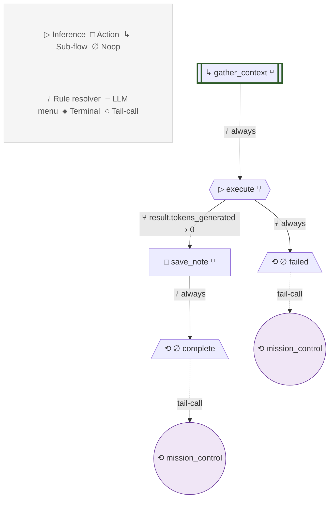
```mermaid
flowchart TD
    %% retrospective v5

    subgraph Legend[" "]
        L1["▷ Inference  □ Action  ↳ Sub-flow  ∅ Noop"]
        L2["⑂ Rule resolver  ☰ LLM menu  ◆ Terminal  ⟲ Tail-call"]
    end
    style Legend fill:#f5f5f5,stroke:#ccc,stroke-width:1px
    style L1 fill:#f5f5f5,stroke:none,color:#555
    style L2 fill:#f5f5f5,stroke:none,color:#555

    gather_context[["↳ gather_context ⑂"]]
    execute{{"▷ execute ⑂"}}
    save_note["□ save_note ⑂"]
    complete[/"⟲ ∅ complete"\]
    failed[/"⟲ ∅ failed"\]

    style gather_context stroke-width:3px,stroke:#2d5a27

    gather_context -->|⑂ always| execute
    execute -->|⑂ result.tokens_generated › 0| save_note
    execute -->|⑂ always| failed
    save_note -->|⑂ always| complete
    tc_complete(("⟲ mission_control"))
    style tc_complete fill:#f0e6f6,stroke:#663399
    complete -.->|tail-call| tc_complete
    tc_failed(("⟲ mission_control"))
    style tc_failed fill:#f0e6f6,stroke:#663399
    failed -.->|tail-call| tc_failed

```

#### rewrite (v1)
*Replace an existing file's entire content via inference.
Reads the current file, generates a complete replacement,
writes to disk. Used when surgical patching is unavailable
or a structural change is needed.*

**Tier:** `session_task` · **Returns:** `files_changed`
**Inputs:** ○ mission_id · ○ task_id · ○ target_file_path · ○ flow_directive · ◑ working_directory · ◑ relevant_notes · ◑ validation_errors
**Terminal:** ◆ success · ◆ failed
**Publishes:** ● context_bundle · ● project_manifest · ● repo_map_formatted · ● related_files · ● target_file · ● inference_response
**Sub-flows:** ↳ prepare_context
**Effects:** ⟶ inference · 𓉗 file read · 𓉗 file write
**Stats:** 6 steps · ▷ 1 inference · 4 ⑂ rule

**Prompts:**
- **generate_rewrite** ▷ (t*0.3): Generate complete file replacement
  Injects: {← context.target_file_content}, {← context.file_excerpts}, {← input.flow_directive}, {← input.target_file_path}, {← input.relevant_notes} (+1 more)

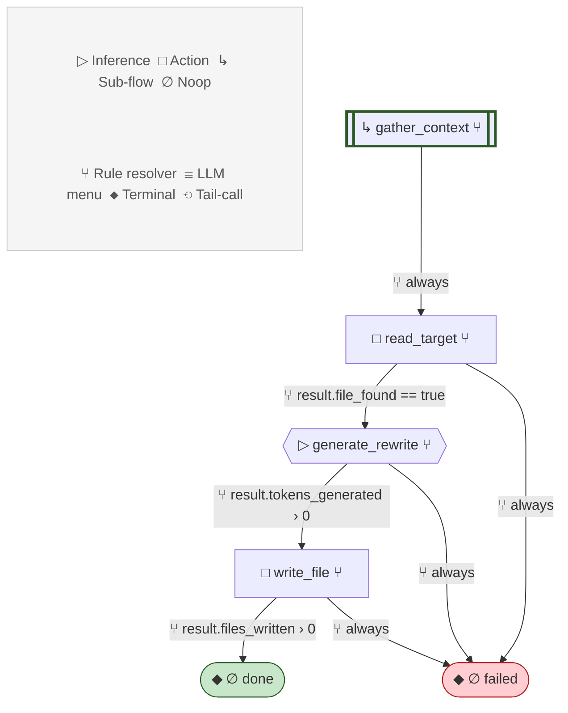
```mermaid
flowchart TD
    %% rewrite v1

    subgraph Legend[" "]
        L1["▷ Inference  □ Action  ↳ Sub-flow  ∅ Noop"]
        L2["⑂ Rule resolver  ☰ LLM menu  ◆ Terminal  ⟲ Tail-call"]
    end
    style Legend fill:#f5f5f5,stroke:#ccc,stroke-width:1px
    style L1 fill:#f5f5f5,stroke:none,color:#555
    style L2 fill:#f5f5f5,stroke:none,color:#555

    gather_context[["↳ gather_context ⑂"]]
    read_target["□ read_target ⑂"]
    generate_rewrite{{"▷ generate_rewrite ⑂"}}
    write_file["□ write_file ⑂"]
    done(["◆ ∅ done"])
    failed(["◆ ∅ failed"])

    style gather_context stroke-width:3px,stroke:#2d5a27

    gather_context -->|⑂ always| read_target
    read_target -->|⑂ result.file_found == true| generate_rewrite
    read_target -->|⑂ always| failed
    generate_rewrite -->|⑂ result.tokens_generated › 0| write_file
    generate_rewrite -->|⑂ always| failed
    write_file -->|⑂ result.files_written › 0| done
    write_file -->|⑂ always| failed

    style done fill:#c8e6c9,stroke:#2d5a27
    style failed fill:#ffcdd2,stroke:#b71c1c
```

#### set_env (v2)
*Detect project validation tooling. Scans the project, makes one
inference call to determine language-appropriate syntax, lint,
and format commands, and persists to .agent/env.json.*

**Tier:** `session_task` · **Returns:** `env_detected`
**Inputs:** ○ working_directory · ○ mission_id · ◑ target_file_path
**Terminal:** ◆ success · ◆ failed
**Publishes:** ● project_manifest · ● inference_response · ● env_config
**Effects:** ⟶ inference · 𓉗 list dir · 𓉗 file read
**Stats:** 5 steps · ▷ 1 inference · 3 ⑂ rule

**Prompts:**
- **detect_tooling** ▷ (t*0.0): Infer validation commands for this project's languages
  Injects: {← context.project_file_list}, {← input.target_file_path}, {← input.working_directory}

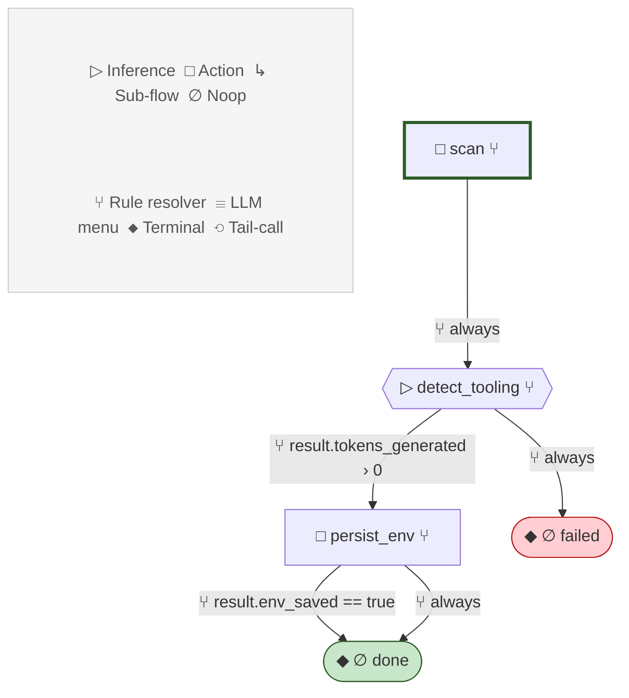
```mermaid
flowchart TD
    %% set_env v2

    subgraph Legend[" "]
        L1["▷ Inference  □ Action  ↳ Sub-flow  ∅ Noop"]
        L2["⑂ Rule resolver  ☰ LLM menu  ◆ Terminal  ⟲ Tail-call"]
    end
    style Legend fill:#f5f5f5,stroke:#ccc,stroke-width:1px
    style L1 fill:#f5f5f5,stroke:none,color:#555
    style L2 fill:#f5f5f5,stroke:none,color:#555

    scan["□ scan ⑂"]
    detect_tooling{{"▷ detect_tooling ⑂"}}
    persist_env["□ persist_env ⑂"]
    done(["◆ ∅ done"])
    failed(["◆ ∅ failed"])

    style scan stroke-width:3px,stroke:#2d5a27

    scan -->|⑂ always| detect_tooling
    detect_tooling -->|⑂ result.tokens_generated › 0| persist_env
    detect_tooling -->|⑂ always| failed
    persist_env -->|⑂ result.env_saved == true| done
    persist_env -->|⑂ always| done

    style done fill:#c8e6c9,stroke:#2d5a27
    style failed fill:#ffcdd2,stroke:#b71c1c
```

### Other Flows

#### run_commands (v1)
*Execute shell commands deterministically. Start terminal, run
each command in sequence, capture output, close. Zero inference.*

**Tier:** `session_task` · **Returns:** `output`, `exit_codes`, `all_passed`
**Inputs:** ○ commands · ○ working_directory · ◑ timeout · ◑ environment_vars · ◑ stop_on_error
**Terminal:** ◆ success · ◆ failed
**Publishes:** ● session_id · ● terminal_output · ● exit_codes · ● all_passed
**Effects:** ⌘ close terminal · end_inference_session · ⌘ terminal cmd · start_inference_session · ⌘ terminal
**Stats:** 4 steps · 2 ⑂ rule

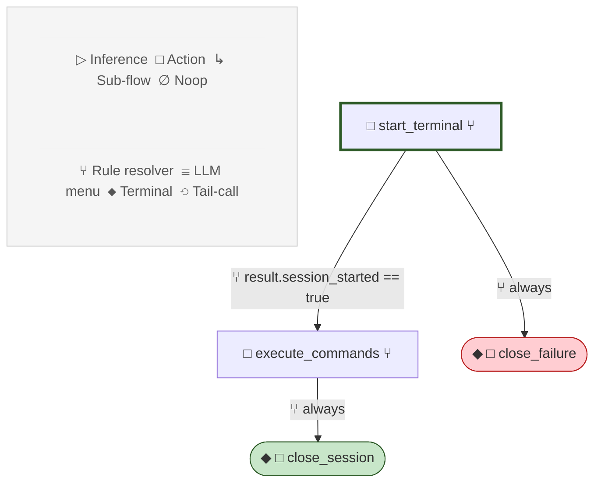
```mermaid
flowchart TD
    %% run_commands v1

    subgraph Legend[" "]
        L1["▷ Inference  □ Action  ↳ Sub-flow  ∅ Noop"]
        L2["⑂ Rule resolver  ☰ LLM menu  ◆ Terminal  ⟲ Tail-call"]
    end
    style Legend fill:#f5f5f5,stroke:#ccc,stroke-width:1px
    style L1 fill:#f5f5f5,stroke:none,color:#555
    style L2 fill:#f5f5f5,stroke:none,color:#555

    start_terminal["□ start_terminal ⑂"]
    execute_commands["□ execute_commands ⑂"]
    close_session(["◆ □ close_session"])
    close_failure(["◆ □ close_failure"])

    style start_terminal stroke-width:3px,stroke:#2d5a27

    start_terminal -->|⑂ result.session_started == true| execute_commands
    start_terminal -->|⑂ always| close_failure
    execute_commands -->|⑂ always| close_session

    style close_session fill:#c8e6c9,stroke:#2d5a27
    style close_failure fill:#ffcdd2,stroke:#b71c1c
```

#### run_session (v1)
*Exploratory terminal session driven by an execution persona.
The model acts as a user — tries things, observes, adapts.
Multi-turn with memoryful inference session.*

**Tier:** `session_task` · **Returns:** `session_summary`, `terminal_output`, `commands_run`
**Inputs:** ○ execution_persona · ○ working_directory · ◑ max_turns · ◑ environment_vars
**Terminal:** ◆ success · ◆ failed
**Publishes:** ● session_id · ● inference_session_id · ● session_history · ● inference_response · ● session_summary · ● terminal_output · ● terminal_status
**Effects:** ⌘ close terminal · end_inference_session · ⟶ inference · ⌘ terminal cmd · start_inference_session · ⌘ terminal
**Stats:** 7 steps · ▷ 3-4 inference · 4 ⑂ rule · 1 ☰ menu

**Prompts:**
- **plan_next_command** ▷ (t*0.6): Model decides what to do next based on persona and observations
  Injects: {← context.session_history}, {← input.execution_persona}, {← input.session_context}
- **evaluate** ▷ (t*0.3): Model evaluates whether to continue exploring or close
  Injects: {← context.last_command_output}, {← context.turn_count}, {← input.execution_persona}
- **summarize_and_close** ▷ (t*0.3): Produce a structured summary of the session before closing
  Injects: {← context.session_history}, {← input.execution_persona}

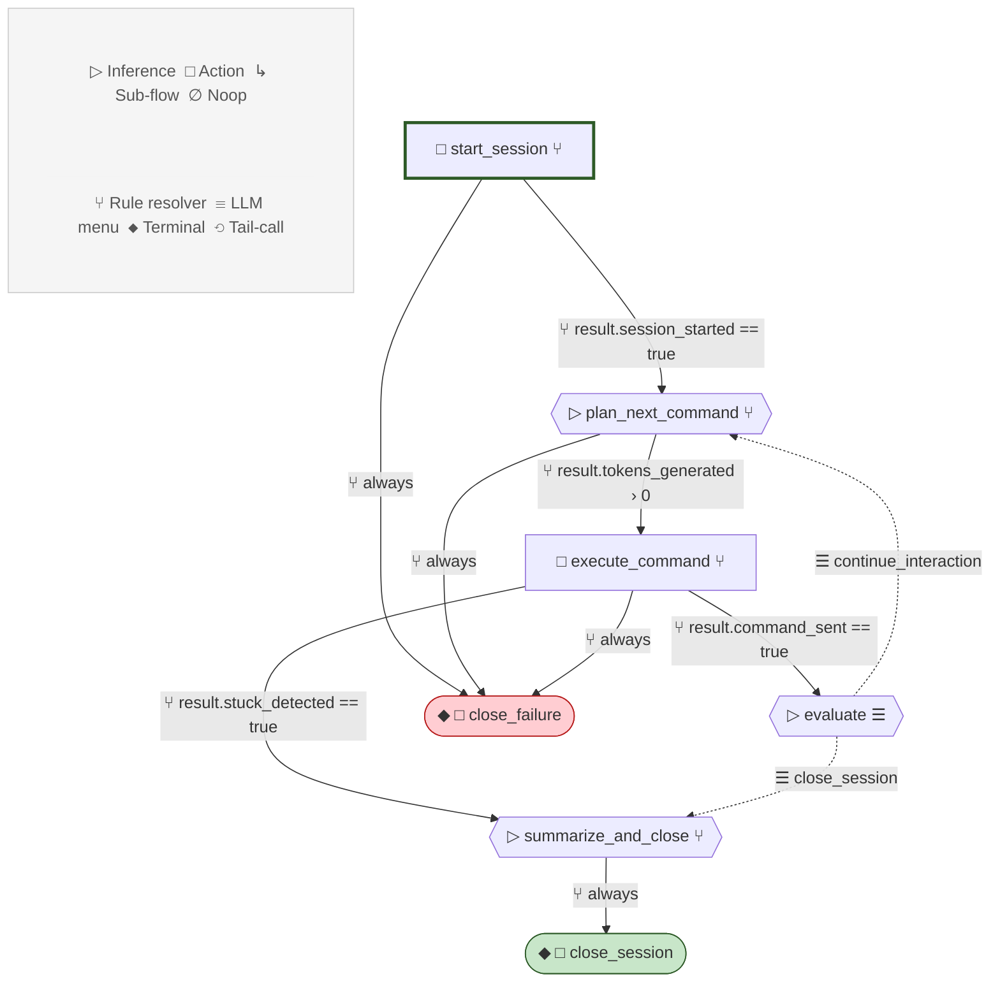
```mermaid
flowchart TD
    %% run_session v1

    subgraph Legend[" "]
        L1["▷ Inference  □ Action  ↳ Sub-flow  ∅ Noop"]
        L2["⑂ Rule resolver  ☰ LLM menu  ◆ Terminal  ⟲ Tail-call"]
    end
    style Legend fill:#f5f5f5,stroke:#ccc,stroke-width:1px
    style L1 fill:#f5f5f5,stroke:none,color:#555
    style L2 fill:#f5f5f5,stroke:none,color:#555

    start_session["□ start_session ⑂"]
    plan_next_command{{"▷ plan_next_command ⑂"}}
    execute_command["□ execute_command ⑂"]
    evaluate{{"▷ evaluate ☰"}}
    summarize_and_close{{"▷ summarize_and_close ⑂"}}
    close_session(["◆ □ close_session"])
    close_failure(["◆ □ close_failure"])

    style start_session stroke-width:3px,stroke:#2d5a27

    start_session -->|⑂ result.session_started == true| plan_next_command
    start_session -->|⑂ always| close_failure
    plan_next_command -->|⑂ result.tokens_generated › 0| execute_command
    plan_next_command -->|⑂ always| close_failure
    execute_command -->|⑂ result.stuck_detected == true| summarize_and_close
    execute_command -->|⑂ result.command_sent == true| evaluate
    execute_command -->|⑂ always| close_failure
    evaluate -.->|☰ continue_interaction| plan_next_command
    evaluate -.->|☰ close_session| summarize_and_close
    summarize_and_close -->|⑂ always| close_session

    style close_session fill:#c8e6c9,stroke:#2d5a27
    style close_failure fill:#ffcdd2,stroke:#b71c1c
```

## Context Key Dictionary

| Key | Published By | Consumed By | Consumers | Audit Flags |
|-----|-------------|-------------|-----------|-------------|
| `all_passed` | `run_commands.execute_commands` | `run_commands.close_session` | 1 | single_consumer |
| `architecture` | `design_and_plan.parse_architecture`, `design_and_plan.parse_architecture_then_revise` | `design_and_plan.generate_plan`, `design_and_plan.parse_plan`, `design_and_plan.derive_goals` | 3 | single_consumer |
| `bail_reason` | `file_ops.run_patch`, `patch.capture_bail_reason`, `patch.close_bail` | `file_ops.report_bail`, `patch.close_bail` | 2 | — |
| `context_bundle` | `create.gather_context`, `diagnose_issue.gather_context`, `interact.gather_context` (+5) | `create.generate_content`, `create.generate_tests`, `diagnose_issue.reproduce_mentally` (+4) | 7 | — |
| `cross_file_summary` | `quality_gate.cross_file_check` | `quality_gate.plan_checks`, `quality_gate.summarize` | 2 | single_consumer |
| `current_symbol` | `patch.begin_rewrites`, `patch.rewrite_symbol` | `patch.rewrite_symbol`, `patch.capture_bail_reason` | 2 | single_consumer |
| `dep_check_imports` | `quality_gate.gather_dep_info` | `quality_gate.analyze_deps` | 1 | single_consumer |
| `dep_check_manifest` | `quality_gate.gather_dep_info` | `quality_gate.analyze_deps` | 1 | single_consumer |
| `dep_check_skipped` | `quality_gate.gather_dep_info` |  | 0 | never_consumed |
| `dep_coverage_issues` | `quality_gate.parse_dep_result` |  | 0 | never_consumed |
| `dep_coverage_result` | `quality_gate.parse_dep_result` |  | 0 | never_consumed |
| `diagnosis` | `diagnose_issue.compile_diagnosis` | `diagnose_issue.create_fix_task` | 1 | single_consumer |
| `director_analysis` | `mission_control.reason` | `mission_control.decide_flow`, `mission_control.select_task`, `mission_control.compose_directive` (+4) | 7 | single_consumer |
| `dispatch_config` | `mission_control.select_task`, `mission_control.compose_directive`, `mission_control.resolve_target` | `mission_control.resolve_target`, `mission_control.record_and_dispatch`, `mission_control.end_session_and_dispatch` (+1) | 4 | single_consumer |
| `dispatch_flow_type` | `mission_control.decide_flow` | `mission_control.select_task`, `mission_control.compose_directive` | 2 | single_consumer, conditionally_published |
| `edit_session_id` | `patch.start_session` | `patch.select_symbols`, `patch.rewrite_symbol`, `patch.finalize` (+4) | 7 | single_consumer |
| `edit_summary` | `file_ops.run_patch`, `patch.finalize`, `patch.no_changes_needed` (+1) | `file_ops.report_success` | 1 | single_consumer |
| `env_config` | `set_env.persist_env` |  | 0 | never_consumed |
| `error_analysis` | `diagnose_issue.reproduce_mentally` | `diagnose_issue.form_hypotheses`, `diagnose_issue.compile_diagnosis`, `diagnose_issue.create_fix_task` | 3 | single_consumer |
| `error_description` |  | `diagnose_issue.compile_diagnosis` | 1 | — |
| `events` | `design_and_plan.load_mission`, `mission_control.load_state` | `mission_control.apply_last_result`, `mission_control.process_events` | 2 | single_consumer |
| `execution_persona` | `interact.plan_interaction` |  | 0 | never_consumed |
| `exit_codes` | `run_commands.execute_commands` | `run_commands.close_session` | 1 | single_consumer |
| `file_content` | `patch.start_session` | `patch.start_session`, `patch.rewrite_symbol`, `patch.capture_bail_reason` | 3 | single_consumer |
| `file_content_updated` | `patch.rewrite_symbol` | `patch.rewrite_symbol`, `patch.finalize` | 2 | single_consumer |
| `file_path` | `patch.start_session` | `patch.start_session`, `patch.rewrite_symbol`, `patch.finalize` (+1) | 4 | single_consumer |
| `files_changed` | `file_ops.run_create`, `file_ops.run_patch`, `file_ops.run_rewrite` (+2) | `file_ops.lookup_env`, `file_ops.report_success`, `project_ops.run_setup_commands` (+1) | 4 | — |
| `fix_task_created` | `diagnose_issue.create_fix_task` |  | 0 | never_consumed |
| `flow_directive` |  | `patch.start_session` | 1 | — |
| `frustration` | `design_and_plan.load_mission`, `mission_control.load_state`, `mission_control.apply_last_result` | `mission_control.apply_last_result`, `mission_control.process_events`, `mission_control.reason` (+2) | 5 | single_consumer |
| `git_summary` | `prepare_context.git_summary` |  | 0 | never_consumed |
| `goals` | `design_and_plan.derive_goals` |  | 0 | never_consumed |
| `hypotheses` | `diagnose_issue.form_hypotheses` | `diagnose_issue.compile_diagnosis` | 1 | single_consumer |
| `inference_response` | `capture_learnings.reflect`, `create.generate_content`, `create.generate_tests` (+16) | `create.write_files`, `design_and_plan.parse_architecture`, `design_and_plan.parse_architecture_then_revise` (+12) | 15 | conditionally_published |
| `inference_session_id` | `run_session.start_session` | `run_session.plan_next_command`, `run_session.evaluate`, `run_session.summarize_and_close` (+2) | 5 | single_consumer |
| `last_result` |  | `mission_control.apply_last_result`, `mission_control.reason` | 2 | — |
| `last_status` |  | `mission_control.apply_last_result`, `mission_control.reason` | 2 | — |
| `last_task_id` |  | `mission_control.apply_last_result` | 1 | — |
| `mission` | `design_and_plan.load_mission`, `design_and_plan.parse_architecture`, `design_and_plan.parse_architecture_then_revise` (+7) | `design_and_plan.check_drift`, `design_and_plan.design_initial`, `design_and_plan.design_reconcile` (+34) | 37 | — |
| `mode` | `patch.start_session` | `patch.start_session`, `patch.rewrite_symbol`, `patch.capture_bail_reason` | 3 | single_consumer |
| `project_manifest` | `create.gather_context`, `design_and_plan.scan_workspace`, `diagnose_issue.gather_context` (+8) | `create.generate_content`, `create.generate_tests`, `design_and_plan.check_drift` (+18) | 21 | — |
| `quality_results` | `mission_control.quality_checkpoint_run`, `mission_control.quality_completion_run`, `quality_gate.evaluate_results` | `mission_control.quality_failed_restart`, `mission_control.completed` | 2 | single_consumer |
| `raw_search_results` | `research.search` | `research.summarize` | 1 | single_consumer |
| `related_files` | `create.gather_context`, `diagnose_issue.gather_context`, `file_ops.read_target` (+7) | `create.generate_content`, `create.generate_tests`, `prepare_context.select_relevant` (+3) | 6 | — |
| `relevant_notes` |  | `patch.start_session` | 1 | — |
| `repo_map_formatted` | `create.gather_context`, `design_and_plan.build_repomap`, `diagnose_issue.gather_context` (+6) | `create.generate_content`, `create.generate_tests`, `design_and_plan.design_initial` (+8) | 11 | — |
| `rescue_count` | `mission_control.check_rescue_budget` |  | 0 | never_consumed |
| `research_summary` | `design_and_plan.domain_research`, `mission_control.rescue_research`, `research.summarize` |  | 0 | never_consumed |
| `revision_applied` | `revise_plan.apply_revision`, `revise_plan.skip` |  | 0 | never_consumed |
| `revision_stats` | `revise_plan.apply_revision` |  | 0 | never_consumed |
| `rewrite_queue` | `patch.begin_rewrites`, `patch.rewrite_symbol` | `patch.rewrite_symbol`, `patch.capture_bail_reason` | 2 | single_consumer |
| `search_queries` | `research.extract_queries` | `research.search` | 1 | single_consumer |
| `selected_files` | `prepare_context.select_relevant` | `prepare_context.load_selected` | 1 | single_consumer |
| `selected_symbols` | `patch.start_session`, `patch.select_symbols` | `patch.select_symbols`, `patch.begin_rewrites`, `patch.finalize` | 3 | single_consumer |
| `selection_turn` | `patch.select_symbols` | `patch.select_symbols` | 1 | single_consumer |
| `session_history` | `run_session.start_session`, `run_session.execute_command` | `run_session.plan_next_command`, `run_session.execute_command`, `run_session.evaluate` (+3) | 6 | single_consumer |
| `session_id` | `mission_control.start_session`, `run_commands.start_terminal`, `run_commands.execute_commands` (+2) | `mission_control.reason`, `mission_control.compose_directive`, `mission_control.record_and_dispatch` (+14) | 17 | — |
| `session_summary` | `interact.run_session`, `quality_gate.run_ux_verification`, `run_session.summarize_and_close` (+1) | `interact.evaluate_outcome`, `interact.report_success`, `interact.report_with_issues` (+2) | 5 | — |
| `source_file` | `capture_learnings.read_source` | `capture_learnings.reflect` | 1 | single_consumer |
| `symbol_menu_options` |  | `patch.start_session`, `patch.select_symbols` | 2 | — |
| `symbol_table` |  | `patch.start_session`, `patch.begin_rewrites` | 2 | — |
| `target_file` | `diagnose_issue.check_target`, `file_ops.read_target`, `rewrite.read_target` | `diagnose_issue.reproduce_mentally`, `diagnose_issue.form_hypotheses`, `diagnose_issue.compile_diagnosis` (+3) | 6 | — |
| `target_file_path` |  | `design_and_plan.build_repomap`, `prepare_context.build_repomap`, `revise_plan.scan_workspace` | 3 | — |
| `terminal_output` | `interact.run_session`, `quality_gate.run_startup_check`, `quality_gate.run_ux_verification` (+3) | `interact.evaluate_outcome`, `interact.report_success`, `interact.report_with_issues` (+2) | 5 | — |
| `terminal_status` | `run_session.close_session`, `run_session.close_failure` |  | 0 | never_consumed |
| `validation_commands` | `file_ops.lookup_env` | `file_ops.run_checks` | 1 | single_consumer |
| `validation_errors` |  | `patch.start_session` | 1 | — |
| `validation_results` | `file_ops.run_checks`, `quality_gate.execute_checks` | `file_ops.self_correct`, `file_ops.escalate_diagnose`, `file_ops.log_and_report_success` (+3) | 6 | — |
| `working_directory` |  | `patch.start_session` | 1 | — |

## Action Registry

| Action | Module | Effects Used | Referenced By |
|--------|--------|-------------|---------------|
| `apply_multi_file_changes` | `agent.actions.integration_actions` | read_file, write_file | `create.write_files`, `project_ops.write_files`, `rewrite.write_file` |
| `apply_plan_revision` | `agent.actions.refinement_actions` | save_mission | `revise_plan.apply_revision` |
| `apply_quality_gate_results` | `agent.actions.refinement_actions` | load_mission, save_mission | `quality_gate.evaluate_results` |
| `apply_retrospective_recommendations` | `agent.actions.retrospective_actions` | load_mission, save_mission | — |
| `build_and_query_repomap` | `agent.actions.research_actions` | list_directory, read_file | `design_and_plan.build_repomap`, `prepare_context.build_repomap`, `revise_plan.scan_workspace` |
| `check_architecture_drift` | `agent.actions.mission_actions` | — | `design_and_plan.check_drift` |
| `check_condition` | `agent.actions.registry` | — | — |
| `check_dependency_coverage` | `agent.actions.pipeline_actions` | read_file | `quality_gate.gather_dep_info` |
| `check_remaining_doc_tasks` | `agent.actions.integration_actions` | — | — |
| `check_remaining_smells` | `agent.actions.integration_actions` | — | — |
| `check_retry_budget` | `agent.actions.pipeline_actions` | — | `mission_control.check_rescue_budget` |
| `close_edit_session` | `agent.actions.ast_actions` | end_inference_session | `patch.no_changes_needed`, `patch.close_full_rewrite`, `patch.close_bail` |
| `close_terminal_session` | `agent.actions.terminal_actions` | close_terminal, end_inference_session | `run_commands.close_session`, `run_commands.close_failure`, `run_session.close_session` (+1) |
| `compile_diagnosis` | `agent.actions.diagnostic_actions` | — | `diagnose_issue.compile_diagnosis` |
| `compile_integration_report` | `agent.actions.integration_actions` | load_mission, save_mission | — |
| `compose_director_report` | `agent.actions.retrospective_actions` | push_event | — |
| `create_fix_task_from_diagnosis` | `agent.actions.diagnostic_actions` | load_mission, save_mission | `diagnose_issue.create_fix_task` |
| `create_plan_from_architecture` | `agent.actions.mission_actions` | save_mission | `design_and_plan.parse_plan` |
| `curl_search` | `agent.actions.refinement_actions` | run_command | `research.search` |
| `derive_project_goals` | `agent.actions.mission_actions` | run_inference, save_mission | `design_and_plan.derive_goals` |
| `end_director_session` | `agent.actions.mission_actions` | end_inference_session | `mission_control.end_session_and_dispatch`, `mission_control.end_session_and_design`, `mission_control.end_session_quality_checkpoint` (+2) |
| `enter_idle` | `agent.actions.mission_actions` | — | `mission_control.idle` |
| `execute_commands_batch` | `agent.actions.terminal_actions` | send_to_terminal | `run_commands.execute_commands` |
| `execute_file_creation` | `agent.actions.mission_actions` | write_file, file_exists | — |
| `execute_project_setup` | `agent.actions.refinement_actions` | file_exists, run_command, write_file | `project_ops.run_setup_commands` |
| `extract_search_queries` | `agent.actions.refinement_actions` | — | `research.extract_queries` |
| `extract_symbol_bodies` | `agent.actions.ast_actions` | — | `file_ops.extract_symbols` |
| `finalize_edit_session` | `agent.actions.ast_actions` | write_file, end_inference_session | `patch.finalize` |
| `finalize_mission` | `agent.actions.mission_actions` | save_mission | `mission_control.completed`, `mission_control.mission_deadlocked`, `mission_control.aborted` |
| `format_technical_query` | `agent.actions.research_actions` | — | — |
| `git_log_summary` | `agent.actions.pipeline_actions` | run_command | `prepare_context.git_summary` |
| `handle_events` | `agent.actions.mission_actions` | clear_events, save_mission | `mission_control.process_events` |
| `load_file_contents` | `agent.actions.refinement_actions` | read_file | `prepare_context.load_selected`, `prepare_context.load_fallback` |
| `load_mission_state` | `agent.actions.mission_actions` | load_mission, read_events | `design_and_plan.load_mission`, `mission_control.load_state`, `revise_plan.load_current_plan` |
| `load_retrospective_data` | `agent.actions.retrospective_actions` | load_mission, list_artifacts, load_artifact | — |
| `log_completion` | `agent.actions.registry` | — | `design_and_plan.failed` |
| `log_validation_notes` | `agent.actions.pipeline_actions` | push_note | `file_ops.log_and_report_success` |
| `lookup_validation_env` | `agent.actions.pipeline_actions` | — | `file_ops.lookup_env` |
| `noop` | `agent.actions.registry` | — | — |
| `parse_and_store_architecture` | `agent.actions.mission_actions` | save_mission | `design_and_plan.parse_architecture`, `design_and_plan.parse_architecture_then_revise` |
| `parse_dep_check_result` | `agent.actions.pipeline_actions` | — | `quality_gate.parse_dep_result` |
| `persist_validation_env` | `agent.actions.pipeline_actions` | — | `set_env.persist_env` |
| `prepare_next_rewrite` | `agent.actions.ast_actions` | — | `patch.begin_rewrites` |
| `push_note` | `agent.actions.refinement_actions` | load_mission, save_mission | `capture_learnings.save_note`, `design_and_plan.save_research`, `file_ops.report_bail` (+2) |
| `read_files` | `agent.actions.registry` | read_file | `capture_learnings.read_source`, `diagnose_issue.check_target`, `file_ops.check_exists` (+2) |
| `read_investigation_targets` | `agent.actions.diagnostic_actions` | read_file | — |
| `record_dispatch` | `agent.actions.mission_actions` | save_mission | `mission_control.record_and_dispatch` |
| `restore_file_from_context` | `agent.actions.integration_actions` | write_file | — |
| `rewrite_symbol_turn` | `agent.actions.ast_actions` | session_inference | `patch.rewrite_symbol`, `patch.capture_bail_reason` |
| `run_git_investigation` | `agent.actions.research_actions` | run_command | — |
| `run_project_tests` | `agent.actions.integration_actions` | run_command, list_directory | — |
| `run_tests` | `agent.actions.mission_actions` | run_command | — |
| `run_validation_checks` | `agent.actions.refinement_actions` | run_command | `quality_gate.execute_checks` |
| `run_validation_checks_from_env` | `agent.actions.pipeline_actions` | run_command | `file_ops.run_checks` |
| `scan_project` | `agent.actions.refinement_actions` | list_directory, read_file | `design_and_plan.scan_workspace`, `diagnose_issue.error_file_not_found`, `prepare_context.scan_workspace` (+2) |
| `select_relevant_files` | `agent.actions.research_actions` | — | `prepare_context.select_relevant` |
| `select_symbol_turn` | `agent.actions.ast_actions` | session_inference | `patch.select_symbols` |
| `select_target_file` | `agent.actions.mission_actions` | file_exists, list_directory, session_inference | `mission_control.resolve_target` |
| `select_task_for_dispatch` | `agent.actions.mission_actions` | save_mission, session_inference | `mission_control.select_task` |
| `send_terminal_command` | `agent.actions.terminal_actions` | send_to_terminal | `run_session.execute_command` |
| `start_director_session` | `agent.actions.mission_actions` | start_inference_session | `mission_control.start_session` |
| `start_edit_session` | `agent.actions.ast_actions` | start_inference_session, session_inference | `patch.start_session` |
| `start_terminal_session` | `agent.actions.terminal_actions` | start_terminal, start_inference_session, send_to_terminal | `run_commands.start_terminal`, `run_session.start_session` |
| `submit_review_to_api` | `agent.actions.retrospective_actions` | escalate_to_api | — |
| `transform` | `agent.actions.registry` | — | `revise_plan.skip` |
| `update_task_status` | `agent.actions.mission_actions` | save_mission | `mission_control.apply_last_result` |
| `validate_created_files` | `agent.actions.refinement_actions` | run_command | — |
| `validate_cross_file_consistency` | `agent.actions.research_actions` | list_directory, read_file | `quality_gate.cross_file_check` |
| `write_file` | `agent.actions.registry` | write_file | — |

## Step Templates

| Template | Action | Used By |
|----------|--------|---------|
| `capture_learnings` | `flow` | — |
| `cross_file_check` | `validate_cross_file_consistency` | `quality_gate.cross_file_check` |
| `execute_search` | `curl_search` | `research.search` |
| `extract_symbols` | `extract_symbol_bodies` | `file_ops.extract_symbols` |
| `gather_project_context` | `flow` | `create.gather_context`, `diagnose_issue.gather_context`, `interact.gather_context`, `project_ops.gather_context`, `retrospective.gather_context` (+1) |
| `load_mission` | `load_mission_state` | `design_and_plan.load_mission`, `mission_control.load_state`, `revise_plan.load_current_plan` |
| `push_note` | `push_note` | `capture_learnings.save_note`, `design_and_plan.save_research`, `mission_control.save_rescue_notes` |
| `read_target_file` | `read_files` | `file_ops.read_target`, `rewrite.read_target` |
| `return_diagnosed` | `noop` | — |
| `return_failed` | `noop` | — |
| `return_success` | `noop` | — |
| `scan_workspace` | `scan_project` | `design_and_plan.scan_workspace`, `diagnose_issue.error_file_not_found`, `quality_gate.scan_project`, `set_env.scan` |
| `write_file` | `execute_file_creation` | — |
| `write_files` | `apply_multi_file_changes` | `create.write_files`, `project_ops.write_files`, `rewrite.write_file` |