# Ouroboros Blueprint

Generated: 2026-07-17T02:19:49.712452+00:00
Source Hash: `c5f6b54dcdc0…`
Flows: **38** | Actions: **154** | Context Keys: **174**

## Legend

### Data Flow Symbols
| Symbol | Name | Meaning |
|--------|------|---------|
| ○ | Required Input | Data the flow cannot execute without |
| ◑ | Optional Input | Data that enriches but isn't required |
| ● | Published Output | Context key added to accumulator |
| ◆ | Terminal Status | Terminal outcome of a flow |

### Step Type Symbols
| Symbol | Name | Meaning |
|--------|------|---------|
| ▷ | Inference Step | Step that invokes LLM inference |
| □ | Action Step | Generic computation (registered callable) |
| ↳ | Sub-flow Invocation | Delegates to a child flow |
| ⟲ | Tail-call | Continues execution in another flow |
| ∅ | Noop Step | Pass-through for routing logic only |

### Resolver Symbols
| Symbol | Name | Meaning |
|--------|------|---------|
| ⑂ | Rule Resolver | Deterministic condition evaluation, no inference cost |
| ☰ | LLM Menu Resolver | Constrained LLM choice, one inference call |

### Effect & System Symbols
| Symbol | Name | Meaning |
|--------|------|---------|
| 𓉗 | File System | File read/write operations |
| 𓇴→ | Persistence Write | Save to persistent state |
| →𓇴 | Persistence Read | Load from persistent state |
| 𓇆 | Notes/Learnings | Accumulated observations and learnings |
| 𓁿 | Frustration | Emotional weight of accumulated failure |
| ⌘ | Subprocess | Terminal/shell execution |
| ⟶ | Inference Call | Token flow to/from model |

### Gate Symbols
| Symbol | Name | Meaning |
|--------|------|---------|
| 𓉫 | Gate Open | Checkpoint passed, path available |
| 𓉪 | Gate Closed | Checkpoint failed, path blocked |

## System Diagrams

### mission_control — Agent Orchestration Hub

```mermaid
flowchart TD
    %% mission_control v9

    subgraph Legend[" "]
        L1["▷ Inference  □ Action  ↳ Sub-flow  ∅ Noop"]
        L2["⑂ Rule resolver  ☰ LLM menu  ◆ Terminal  ⟲ Tail-call"]
    end
    style Legend fill:#f5f5f5,stroke:#ccc,stroke-width:1px
    style L1 fill:#f5f5f5,stroke:none,color:#555
    style L2 fill:#f5f5f5,stroke:none,color:#555

    load_state["□ load_state ⑂"]
    apply_last_result["□ apply_last_result ⑂"]
    process_events["□ process_events ⑂"]
    check_phase["□ check_phase ⑂"]
    dispatch_planning[/"⟲ ∅ dispatch_planning"\]
    dispatch_replan[/"⟲ ∅ dispatch_replan"\]
    structural_sweep_next["□ structural_sweep_next ⑂"]
    dispatch_batch_create[/"⟲ ∅ dispatch_batch_create"\]
    dispatch_structural_create[/"⟲ ∅ dispatch_structural_create"\]
    dispatch_structural_fix[/"⟲ ∅ dispatch_structural_fix"\]
    dispatch_environment_setup[/"⟲ ∅ dispatch_environment_setup"\]
    functional_sweep_next["□ functional_sweep_next ⑂"]
    resolve_fix_target{{"▷ resolve_fix_target"}}
    fallback_fix_target["□ fallback_fix_target ⑂"]
    apply_fix_target["□ apply_fix_target ⑂"]
    dispatch_functional_test[/"⟲ ∅ dispatch_functional_test"\]
    dispatch_functional_fix[/"⟲ ∅ dispatch_functional_fix"\]
    dispatch_quality_gate[["↳ dispatch_quality_gate ⑂"]]
    harvest_quality_findings["□ harvest_quality_findings ⑂"]
    quality_sweep_next["□ quality_sweep_next ⑂"]
    dispatch_test_gate["□ dispatch_test_gate ⑂"]
    dispatch_quality_fix[/"⟲ ∅ dispatch_quality_fix"\]
    completed(["◆ □ completed"])
    idle[/"⟲ □ idle"\]
    aborted(["◆ □ aborted"])

    style load_state stroke-width:3px,stroke:#2d5a27

    load_state -->|⑂ result.mission.status == 'active'| apply_last_result
    load_state -->|⑂ result.mission.status == 'paused'| idle
    load_state -->|⑂ result.mission.status == 'completed'| completed
    load_state -->|⑂ always| aborted
    apply_last_result -->|⑂ result.events_pending == true| process_events
    apply_last_result -->|⑂ context.mission.pending_directive != ''| check_phase
    apply_last_result -->|⑂ result.needs_plan == true| dispatch_planning
    apply_last_result -->|⑂ always| check_phase
    process_events -->|⑂ result.abort_requested == true| aborted
    process_events -->|⑂ result.pause_requested == true| idle
    process_events -->|⑂ always| check_phase
    check_phase -->|⑂ result.phase == 'replan'| dispatch_replan
    check_phase -->|⑂ result.phase == 'plan'| dispatch_planning
    check_phase -->|⑂ result.phase == 'structural'| structural_sweep_next
    check_phase -->|⑂ result.phase == 'environment'| dispatch_environment_setup
    check_phase -->|⑂ result.phase == 'functional'| functional_sweep_next
    check_phase -->|⑂ result.phase == 'quality_fix'| quality_sweep_next
    check_phase -->|⑂ result.phase == 'test_suite'| dispatch_test_gate
    check_phase -->|⑂ result.phase == 'quality'| dispatch_quality_gate
    check_phase -->|⑂ result.phase == 'complete'| completed
    check_phase -->|⑂ always| dispatch_planning
    tc_dispatch_planning(("⟲ design_and_plan"))
    style tc_dispatch_planning fill:#f0e6f6,stroke:#663399
    dispatch_planning -.->|tail-call| tc_dispatch_planning
    tc_dispatch_replan(("⟲ replan"))
    style tc_dispatch_replan fill:#f0e6f6,stroke:#663399
    dispatch_replan -.->|tail-call| tc_dispatch_replan
    structural_sweep_next -->|⑂ result.sweep_complete == true| check_phase
    structural_sweep_next -->|⑂ result.needs_batch_create == true| dispatch_batch_create
    structural_sweep_next -->|⑂ result.needs_create == true| dispatch_structural_create
    structural_sweep_next -->|⑂ result.needs_fix == true| dispatch_structural_fix
    structural_sweep_next -->|⑂ always| check_phase
    tc_dispatch_batch_create(("⟲ build_structure"))
    style tc_dispatch_batch_create fill:#f0e6f6,stroke:#663399
    dispatch_batch_create -.->|tail-call| tc_dispatch_batch_create
    tc_dispatch_structural_create(("⟲ file_ops"))
    style tc_dispatch_structural_create fill:#f0e6f6,stroke:#663399
    dispatch_structural_create -.->|tail-call| tc_dispatch_structural_create
    tc_dispatch_structural_fix(("⟲ $ref:context.dispatch_config.flow"))
    style tc_dispatch_structural_fix fill:#f0e6f6,stroke:#663399
    dispatch_structural_fix -.->|tail-call| tc_dispatch_structural_fix
    tc_dispatch_environment_setup(("⟲ project_ops"))
    style tc_dispatch_environment_setup fill:#f0e6f6,stroke:#663399
    dispatch_environment_setup -.->|tail-call| tc_dispatch_environment_setup
    functional_sweep_next -->|⑂ result.sweep_complete == true| check_phase
    functional_sweep_next -->|⑂ result.needs_test == true| dispatch_functional_test
    functional_sweep_next -->|⑂ result.needs_fix == true| dispatch_functional_fix
    functional_sweep_next -->|⑂ result.needs_target_resolution == true| resolve_fix_target
    functional_sweep_next -->|⑂ always| check_phase
    fallback_fix_target -->|⑂ result.has_target == true| apply_fix_target
    fallback_fix_target -->|⑂ always| check_phase
    apply_fix_target -->|⑂ result.target_applied == true| dispatch_functional_fix
    apply_fix_target -->|⑂ always| check_phase
    tc_dispatch_functional_test(("⟲ interact"))
    style tc_dispatch_functional_test fill:#f0e6f6,stroke:#663399
    dispatch_functional_test -.->|tail-call| tc_dispatch_functional_test
    tc_dispatch_functional_fix(("⟲ $ref:context.dispatch_config.flow"))
    style tc_dispatch_functional_fix fill:#f0e6f6,stroke:#663399
    dispatch_functional_fix -.->|tail-call| tc_dispatch_functional_fix
    dispatch_quality_gate -->|⑂ result.status == 'success'| completed
    dispatch_quality_gate -->|⑂ always| harvest_quality_findings
    harvest_quality_findings -->|⑂ result.done == true| completed
    harvest_quality_findings -->|⑂ always| check_phase
    quality_sweep_next -->|⑂ result.needs_fix == true| dispatch_quality_fix
    quality_sweep_next -->|⑂ always| check_phase
    dispatch_test_gate -->|⑂ always| check_phase
    tc_dispatch_quality_fix(("⟲ $ref:context.dispatch_config.flow"))
    style tc_dispatch_quality_fix fill:#f0e6f6,stroke:#663399
    dispatch_quality_fix -.->|tail-call| tc_dispatch_quality_fix
    tc_idle(("⟲ mission_control"))
    style tc_idle fill:#f0e6f6,stroke:#663399
    idle -.->|tail-call| tc_idle

    style completed fill:#c8e6c9,stroke:#2d5a27
    style aborted fill:#ffcdd2,stroke:#b71c1c
```

### All Flows — System Architecture View

```mermaid
flowchart TD
    %% Ouroboros System View — All Architectural Flows

    subgraph Legend[" "]
        L1["▷ Inference  □ Action  ↳ Sub-flow  ∅ Noop"]
        L2["⑂ Rule resolver  ☰ LLM menu  ◆ Terminal  ⟲ Tail-call"]
    end
    style Legend fill:#f5f5f5,stroke:#ccc,stroke-width:1px
    style L1 fill:#f5f5f5,stroke:none,color:#555
    style L2 fill:#f5f5f5,stroke:none,color:#555

    acquire_catalog["acquire_catalog\n8 steps ▷1"]
    add_symbol["add_symbol\n6 steps ▷1"]
    build_structure["build_structure\n9 steps ▷1"]
    classify["classify\n12 steps ▷1"]
    create["create\n6 steps ▷2"]
    curate_control["curate_control\n14 steps"]
    curate_gate["curate_gate\n4 steps"]
    curate_paper["curate_paper\n5 steps"]
    data_patch["data_patch\n4 steps"]
    deep_search["deep_search\n9 steps ▷1"]
    design_and_plan["design_and_plan\n17 steps ▷3"]
    diagnose_issue["diagnose_issue\n17 steps ▷1"]
    discover["discover\n5 steps ▷1"]
    escalate["escalate\n14 steps ▷1"]
    extract_control["extract_control\n12 steps"]
    extract_gate["extract_gate\n3 steps"]
    extract_pdfs["extract_pdfs\n3 steps"]
    fig_review["fig_review\n3 steps"]
    file_ops["file_ops\n26 steps"]
    ingest_workspace["ingest_workspace\n9 steps ▷1"]
    interact["interact\n24 steps ▷4"]
    mission_control["mission_control\n25 steps ▷1"]
    ops_control["ops_control\n9 steps"]
    ops_task["ops_task\n31 steps ▷8"]
    patch["patch\n10 steps"]
    patch_module["patch_module\n6 steps"]
    plan_research["plan_research\n6 steps ▷1"]
    prepare_context["prepare_context\n4 steps"]
    project_ops["project_ops\n13 steps ▷1"]
    quality_gate["quality_gate\n33 steps ▷7"]
    replan["replan\n9 steps ▷2"]
    research["research\n6 steps ▷2"]
    research_control["research_control\n14 steps"]
    research_gate["research_gate\n9 steps ▷1"]
    rewrite["rewrite\n6 steps ▷1"]
    run_commands["run_commands\n4 steps"]
    run_session["run_session\n7 steps ▷2"]
    set_env["set_env\n5 steps ▷1"]

    build_structure -.->|⟲ report_success| mission_control
    build_structure ==>|↳ run_set_env| set_env
    classify -.->|⟲ handoff_code_core| ingest_workspace
    classify -.->|⟲ handoff_ops| ops_control
    design_and_plan -.->|⟲ complete| mission_control
    design_and_plan ==>|↳ domain_research| research
    diagnose_issue -.->|⟲ done| mission_control
    diagnose_issue ==>|↳ do_deep_search| deep_search
    escalate ==>|↳ do_web_search| deep_search
    file_ops -.->|⟲ report_success| mission_control
    file_ops ==>|↳ run_create| create
    file_ops ==>|↳ run_module_frame_edit| patch_module
    file_ops ==>|↳ run_patch| patch
    file_ops ==>|↳ run_add_symbol| add_symbol
    file_ops ==>|↳ run_data_patch| data_patch
    file_ops ==>|↳ run_rewrite| rewrite
    file_ops ==>|↳ run_set_env| set_env
    file_ops ==>|↳ self_correct| escalate
    file_ops ==>|↳ escalate_diagnose| diagnose_issue
    ingest_workspace -.->|⟲ handoff| mission_control
    ingest_workspace ==>|↳ domain_research| research
    interact -.->|⟲ report_success| mission_control
    interact ==>|↳ run_deterministic| run_commands
    interact ==>|↳ gather_context| prepare_context
    interact ==>|↳ run_session| run_session
    mission_control -.->|⟲ dispatch_planning| design_and_plan
    mission_control -.->|⟲ dispatch_replan| replan
    mission_control -.->|⟲ dispatch_batch_create| build_structure
    mission_control -.->|⟲ dispatch_structural_create| file_ops
    mission_control -.->|⟲ dispatch_environment_setup| project_ops
    mission_control -.->|⟲ dispatch_functional_test| interact
    mission_control -.->|⟲ idle| mission_control
    mission_control ==>|↳ dispatch_quality_gate| quality_gate
    project_ops -.->|⟲ report_success| mission_control
    project_ops ==>|↳ gather_context| prepare_context
    project_ops ==>|↳ detect_env| set_env
    project_ops ==>|↳ run_installs| run_commands
    quality_gate ==>|↳ run_startup_check| run_commands
    quality_gate ==>|↳ run_ux_verification| run_session
    replan -.->|⟲ complete| mission_control
    rewrite ==>|↳ gather_context| prepare_context
    curate_control -.->|⟲ dispatch_fig_review| fig_review
    curate_control -.->|⟲ dispatch_curate| curate_paper
    curate_control -.->|⟲ idle| curate_control
    curate_control ==>|↳ dispatch_curate_gate| curate_gate
    curate_paper -.->|⟲ return_success| curate_control
    fig_review -.->|⟲ return_success| curate_control
    extract_control -.->|⟲ dispatch_extract| extract_pdfs
    extract_control -.->|⟲ idle| extract_control
    extract_control ==>|↳ dispatch_extract_gate| extract_gate
    extract_pdfs -.->|⟲ return_success| extract_control
    ops_control -.->|⟲ dispatch_task| ops_task
    ops_control -.->|⟲ idle| ops_control
    ops_task -.->|⟲ return_success| ops_control
    ops_task ==>|↳ run_terminal| run_session
    acquire_catalog -.->|⟲ return_success| research_control
    discover -.->|⟲ return_success| research_control
    plan_research -.->|⟲ complete| research_control
    research_control -.->|⟲ dispatch_planning| plan_research
    research_control -.->|⟲ dispatch_discover| discover
    research_control -.->|⟲ dispatch_catalog| acquire_catalog
    research_control -.->|⟲ idle| research_control
    research_control ==>|↳ dispatch_research_gate| research_gate

    style mission_control fill:#e8f0e6,stroke:#2d5a27,stroke-width:3px
    style create_plan fill:#e8f0e6,stroke:#2d5a27,stroke-width:2px
```

## System Context

**Ouroboros** is a flow-driven autonomous coding agent backed by LLMVP local inference.
It operates as a pure GraphQL client — all inference flows through `localhost:8008/graphql`.

### Actors
- **Shop Director (User)** — Sets missions, checks in periodically via CLI.
- **Junior Developer (Local Model)** — Runs continuously via LLMVP, follows structured flows.
- **Senior Developer (External API)** — Consulted on escalation (design pending).

### Subsystem Boundaries
- **Flow Engine** — Declarative CUE graphs with typed I/O and explicit transitions.
- **Effects Interface** — Swappable protocol for all side effects (file I/O, subprocess, inference, persistence).
- **Persistence** — File-backed JSON in `.agent/` with atomic writes.
- **LLMVP** — External GraphQL inference server (separate project).

### Flow Inventory
| Category | Count |
|----------|-------|
| Orchestrator flows | 2 |
| Task flows | 5 |
| Sub-flows | 8 |
| Other | 23 |
| **Total** | **38** |

## Mission Lifecycle

`mission_control` is the hub flow orchestrating the entire agent lifecycle.
Child task flows tail-call back to `mission_control` on completion, creating a continuous cycle.

### mission_control Steps

- □ **load_state** ⑂ — Load mission state and event queue
- □ **apply_last_result** ⑂ — Attach returning flow's directive report to goal
- □ **process_events** ⑂ — Process user messages, abort/pause signals
- □ **check_phase** ⑂ — Determine which pipeline phase to enter based on goal statuses
- ∅ **dispatch_planning**  — No architecture or goals — dispatch design_and_plan ⟲ → `design_and_plan`
- ∅ **dispatch_replan**  — Pending directive — decompose against the existing codebase ⟲ → `replan`
- □ **structural_sweep_next** ⑂ — Find next incomplete structural goal in creation order
- ∅ **dispatch_batch_create**  — Batch-create all architecture files in one generation ⟲ → `build_structure`
- ∅ **dispatch_structural_create**  — Create next file in dependency order ⟲ → `file_ops`
- ∅ **dispatch_structural_fix**  — Repair a structural file that failed its gate ⟲ → `$ref:context.dispatch_config.flow`
- ∅ **dispatch_environment_setup**  — Install dependencies and verify tooling ⟲ → `project_ops`
- □ **functional_sweep_next** ⑂ — Find next incomplete functional goal
- ▷ **resolve_fix_target**  — Model selects which file to fix based on diagnosis
- □ **fallback_fix_target** ⑂ — Menu unanswerable — take the top-ranked fix target deterministically
- □ **apply_fix_target** ⑂ — Apply LLM-selected fix target to dispatch config
- ∅ **dispatch_functional_test**  — Test a functional capability via interact ⟲ → `interact`
- ∅ **dispatch_functional_fix**  — Fix a file identified by failed functional test ⟲ → `$ref:context.dispatch_config.flow`
- ↳ **dispatch_quality_gate** ⑂ — Final quality gate for mission completion
- □ **harvest_quality_findings** ⑂ — Create/re-open goals from quality-gate findings
- □ **quality_sweep_next** ⑂ — Diagnose -> file_ops -> complete the next quality goal
- □ **dispatch_test_gate** ⑂ — Run the repo's test suite; harvest fix goals or certify
- ∅ **dispatch_quality_fix**  — Dispatch a diagnose_issue/file_ops fix for a quality finding ⟲ → `$ref:context.dispatch_config.flow`
- □ **completed**  — Mark mission complete ◆ `completed`
- □ **idle**  — Wait for events ⟲ → `mission_control`
- □ **aborted**  — Mission aborted ◆ `aborted`

### Tail-Call Targets (flows that return to mission_control)

- `build_structure` → `mission_control` (from step `report_success`)
- `build_structure` → `mission_control` (from step `report_failed`)
- `design_and_plan` → `mission_control` (from step `complete`)
- `diagnose_issue` → `mission_control` (from step `done`)
- `diagnose_issue` → `mission_control` (from step `failed`)
- `file_ops` → `mission_control` (from step `report_success`)
- `file_ops` → `mission_control` (from step `report_failure`)
- `file_ops` → `mission_control` (from step `report_diagnosed`)
- `file_ops` → `mission_control` (from step `report_bail`)
- `ingest_workspace` → `mission_control` (from step `handoff`)
- `interact` → `mission_control` (from step `report_success`)
- `interact` → `mission_control` (from step `report_with_issues`)
- `interact` → `mission_control` (from step `failed`)
- `mission_control` → `mission_control` (from step `idle`)
- `project_ops` → `mission_control` (from step `report_success`)
- `project_ops` → `mission_control` (from step `failed`)
- `replan` → `mission_control` (from step `complete`)

## Flow Catalog

### Orchestrator Flows

#### design_and_plan (v5)
*Design or reconcile project architecture, then derive project goals.
Goals are the plan — no separate task list. Auto-detects whether
full architecture design is needed (no architecture), reconciliation
is needed (drift detected), or goals can be derived directly.*

**Tier:** `mission_objective` · **Returns:** `architecture_updated`, `goals_derived`
**Peers:** `file_ops`, `project_ops`, `interact`
**Inputs:** ○ mission_id
**Terminal:** ◆ failed
**Publishes:** ● mission · ● project_manifest · ● repo_map_formatted · ● inference_response · ● architecture · ● drift_facts · ● design_gate_feedback · ● research_summary · ● goals
**Sub-flows:** ↳ research
**Tail-calls:** ⟲ mission_control
**Effects:** ⟶ inference · 𓉗 list dir · →𓇴 load mission · push_note · →𓇴 read events · 𓉗 file read · 𓇴→ save mission
**Stats:** 17 steps · ▷ 3 inference · 15 ⑂ rule

**Prompts:**
- **design_initial** ▷ (t*0.2): Design project architecture from scratch
  Injects: {← context.mission_objective}, {← context.repo_map_formatted}, {← context.project_file_list}, {← context.existing_architecture}
- **design_reconcile** ▷ (t*0.2): Reconcile architecture with drifted codebase
  Injects: {← context.mission_objective}, {← context.repo_map_formatted}, {← context.project_file_list}, {← context.existing_architecture}
- **design_gate_critique** ▷ (t*0.1): Adversarially critique the blueprint for internal coherence
  Injects: {← context.blueprint_summary}, {← context.mission_objective}, {← context.tooling_convention}, {← context.drift_facts_rendered}, {← context.prior_rejection}

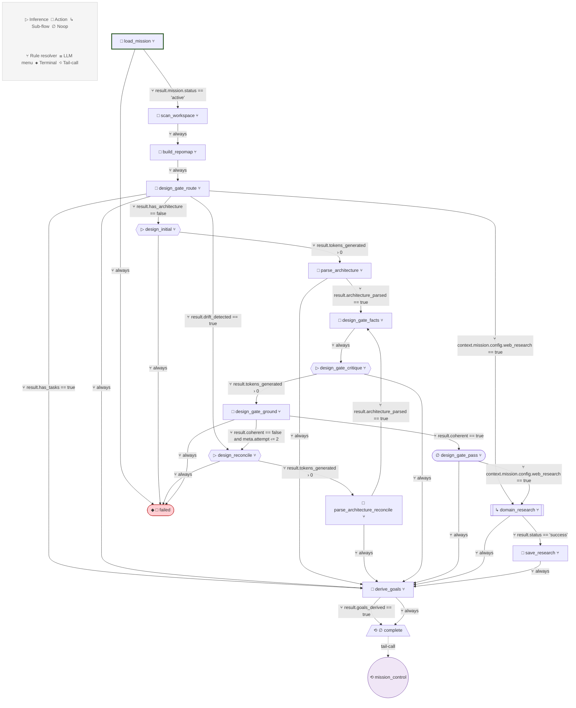
```mermaid
flowchart TD
    %% design_and_plan v5

    subgraph Legend[" "]
        L1["▷ Inference  □ Action  ↳ Sub-flow  ∅ Noop"]
        L2["⑂ Rule resolver  ☰ LLM menu  ◆ Terminal  ⟲ Tail-call"]
    end
    style Legend fill:#f5f5f5,stroke:#ccc,stroke-width:1px
    style L1 fill:#f5f5f5,stroke:none,color:#555
    style L2 fill:#f5f5f5,stroke:none,color:#555

    load_mission["□ load_mission ⑂"]
    scan_workspace["□ scan_workspace ⑂"]
    build_repomap["□ build_repomap ⑂"]
    design_gate_route["□ design_gate_route ⑂"]
    design_initial{{"▷ design_initial ⑂"}}
    design_reconcile{{"▷ design_reconcile ⑂"}}
    parse_architecture["□ parse_architecture ⑂"]
    parse_architecture_reconcile["□ parse_architecture_reconcile ⑂"]
    design_gate_facts["□ design_gate_facts ⑂"]
    design_gate_critique{{"▷ design_gate_critique ⑂"}}
    design_gate_ground["□ design_gate_ground ⑂"]
    design_gate_pass(["∅ design_gate_pass ⑂"])
    domain_research[["↳ domain_research ⑂"]]
    save_research["□ save_research ⑂"]
    derive_goals["□ derive_goals ⑂"]
    complete[/"⟲ ∅ complete"\]
    failed(["◆ □ failed"])

    style load_mission stroke-width:3px,stroke:#2d5a27

    load_mission -->|⑂ result.mission.status == 'active'| scan_workspace
    load_mission -->|⑂ always| failed
    scan_workspace -->|⑂ always| build_repomap
    build_repomap -->|⑂ always| design_gate_route
    design_gate_route -->|⑂ result.has_architecture == false| design_initial
    design_gate_route -->|⑂ result.drift_detected == true| design_reconcile
    design_gate_route -->|⑂ result.has_tasks == true| derive_goals
    design_gate_route -->|⑂ context.mission.config.web_research == true| domain_research
    design_gate_route -->|⑂ always| derive_goals
    design_initial -->|⑂ result.tokens_generated › 0| parse_architecture
    design_initial -->|⑂ always| failed
    design_reconcile -->|⑂ result.tokens_generated › 0| parse_architecture_reconcile
    design_reconcile -->|⑂ always| failed
    parse_architecture -->|⑂ result.architecture_parsed == true| design_gate_facts
    parse_architecture -->|⑂ always| derive_goals
    parse_architecture_reconcile -->|⑂ result.architecture_parsed == true| design_gate_facts
    parse_architecture_reconcile -->|⑂ always| derive_goals
    design_gate_facts -->|⑂ always| design_gate_critique
    design_gate_critique -->|⑂ result.tokens_generated › 0| design_gate_ground
    design_gate_critique -->|⑂ always| derive_goals
    design_gate_ground -->|⑂ result.coherent == true| design_gate_pass
    design_gate_ground -->|⑂ result.coherent == false and meta.attempt ‹= 2| design_reconcile
    design_gate_ground -->|⑂ always| failed
    design_gate_pass -->|⑂ context.mission.config.web_research == true| domain_research
    design_gate_pass -->|⑂ always| derive_goals
    domain_research -->|⑂ result.status == 'success'| save_research
    domain_research -->|⑂ always| derive_goals
    save_research -->|⑂ always| derive_goals
    derive_goals -->|⑂ result.goals_derived == true| complete
    derive_goals -->|⑂ always| complete
    tc_complete(("⟲ mission_control"))
    style tc_complete fill:#f0e6f6,stroke:#663399
    complete -.->|tail-call| tc_complete

    style failed fill:#ffcdd2,stroke:#b71c1c
```

#### mission_control (v9)
*Deterministic pipeline. Computes the current phase from goal
statuses and dispatches the appropriate work without LLM routing.
Phases: plan → structural sweep → environment → functional sweep → quality gate.*

**Tier:** `project_goal` · **Returns:** `final_status`
**Inputs:** ○ mission_id · ◑ last_result · ◑ last_status · ◑ last_goal_id
**Terminal:** ◆ completed · ◆ aborted
**Publishes:** ● mission · ● events · ● dispatch_config · ● selected_fix_target · ● quality_results
**Sub-flows:** ↳ quality_gate
**Tail-calls:** ⟲ $ref:context.dispatch_config.flow · ⟲ build_structure · ⟲ design_and_plan · ⟲ file_ops · ⟲ interact · ⟲ mission_control · ⟲ project_ops · ⟲ replan
**Effects:** archive_overflow · clear_events · ⟶ inference · →𓇴 load mission · →𓇴 read events · 𓉗 file read · ⌘ command · 𓇴→ save mission
**Stats:** 25 steps · ▷ 1 inference · 12 ⑂ rule

**Prompts:**
- **resolve_fix_target** ▷ (): Model selects which file to fix based on diagnosis

```mermaid
flowchart TD
    %% mission_control v9

    subgraph Legend[" "]
        L1["▷ Inference  □ Action  ↳ Sub-flow  ∅ Noop"]
        L2["⑂ Rule resolver  ☰ LLM menu  ◆ Terminal  ⟲ Tail-call"]
    end
    style Legend fill:#f5f5f5,stroke:#ccc,stroke-width:1px
    style L1 fill:#f5f5f5,stroke:none,color:#555
    style L2 fill:#f5f5f5,stroke:none,color:#555

    load_state["□ load_state ⑂"]
    apply_last_result["□ apply_last_result ⑂"]
    process_events["□ process_events ⑂"]
    check_phase["□ check_phase ⑂"]
    dispatch_planning[/"⟲ ∅ dispatch_planning"\]
    dispatch_replan[/"⟲ ∅ dispatch_replan"\]
    structural_sweep_next["□ structural_sweep_next ⑂"]
    dispatch_batch_create[/"⟲ ∅ dispatch_batch_create"\]
    dispatch_structural_create[/"⟲ ∅ dispatch_structural_create"\]
    dispatch_structural_fix[/"⟲ ∅ dispatch_structural_fix"\]
    dispatch_environment_setup[/"⟲ ∅ dispatch_environment_setup"\]
    functional_sweep_next["□ functional_sweep_next ⑂"]
    resolve_fix_target{{"▷ resolve_fix_target"}}
    fallback_fix_target["□ fallback_fix_target ⑂"]
    apply_fix_target["□ apply_fix_target ⑂"]
    dispatch_functional_test[/"⟲ ∅ dispatch_functional_test"\]
    dispatch_functional_fix[/"⟲ ∅ dispatch_functional_fix"\]
    dispatch_quality_gate[["↳ dispatch_quality_gate ⑂"]]
    harvest_quality_findings["□ harvest_quality_findings ⑂"]
    quality_sweep_next["□ quality_sweep_next ⑂"]
    dispatch_test_gate["□ dispatch_test_gate ⑂"]
    dispatch_quality_fix[/"⟲ ∅ dispatch_quality_fix"\]
    completed(["◆ □ completed"])
    idle[/"⟲ □ idle"\]
    aborted(["◆ □ aborted"])

    style load_state stroke-width:3px,stroke:#2d5a27

    load_state -->|⑂ result.mission.status == 'active'| apply_last_result
    load_state -->|⑂ result.mission.status == 'paused'| idle
    load_state -->|⑂ result.mission.status == 'completed'| completed
    load_state -->|⑂ always| aborted
    apply_last_result -->|⑂ result.events_pending == true| process_events
    apply_last_result -->|⑂ context.mission.pending_directive != ''| check_phase
    apply_last_result -->|⑂ result.needs_plan == true| dispatch_planning
    apply_last_result -->|⑂ always| check_phase
    process_events -->|⑂ result.abort_requested == true| aborted
    process_events -->|⑂ result.pause_requested == true| idle
    process_events -->|⑂ always| check_phase
    check_phase -->|⑂ result.phase == 'replan'| dispatch_replan
    check_phase -->|⑂ result.phase == 'plan'| dispatch_planning
    check_phase -->|⑂ result.phase == 'structural'| structural_sweep_next
    check_phase -->|⑂ result.phase == 'environment'| dispatch_environment_setup
    check_phase -->|⑂ result.phase == 'functional'| functional_sweep_next
    check_phase -->|⑂ result.phase == 'quality_fix'| quality_sweep_next
    check_phase -->|⑂ result.phase == 'test_suite'| dispatch_test_gate
    check_phase -->|⑂ result.phase == 'quality'| dispatch_quality_gate
    check_phase -->|⑂ result.phase == 'complete'| completed
    check_phase -->|⑂ always| dispatch_planning
    tc_dispatch_planning(("⟲ design_and_plan"))
    style tc_dispatch_planning fill:#f0e6f6,stroke:#663399
    dispatch_planning -.->|tail-call| tc_dispatch_planning
    tc_dispatch_replan(("⟲ replan"))
    style tc_dispatch_replan fill:#f0e6f6,stroke:#663399
    dispatch_replan -.->|tail-call| tc_dispatch_replan
    structural_sweep_next -->|⑂ result.sweep_complete == true| check_phase
    structural_sweep_next -->|⑂ result.needs_batch_create == true| dispatch_batch_create
    structural_sweep_next -->|⑂ result.needs_create == true| dispatch_structural_create
    structural_sweep_next -->|⑂ result.needs_fix == true| dispatch_structural_fix
    structural_sweep_next -->|⑂ always| check_phase
    tc_dispatch_batch_create(("⟲ build_structure"))
    style tc_dispatch_batch_create fill:#f0e6f6,stroke:#663399
    dispatch_batch_create -.->|tail-call| tc_dispatch_batch_create
    tc_dispatch_structural_create(("⟲ file_ops"))
    style tc_dispatch_structural_create fill:#f0e6f6,stroke:#663399
    dispatch_structural_create -.->|tail-call| tc_dispatch_structural_create
    tc_dispatch_structural_fix(("⟲ $ref:context.dispatch_config.flow"))
    style tc_dispatch_structural_fix fill:#f0e6f6,stroke:#663399
    dispatch_structural_fix -.->|tail-call| tc_dispatch_structural_fix
    tc_dispatch_environment_setup(("⟲ project_ops"))
    style tc_dispatch_environment_setup fill:#f0e6f6,stroke:#663399
    dispatch_environment_setup -.->|tail-call| tc_dispatch_environment_setup
    functional_sweep_next -->|⑂ result.sweep_complete == true| check_phase
    functional_sweep_next -->|⑂ result.needs_test == true| dispatch_functional_test
    functional_sweep_next -->|⑂ result.needs_fix == true| dispatch_functional_fix
    functional_sweep_next -->|⑂ result.needs_target_resolution == true| resolve_fix_target
    functional_sweep_next -->|⑂ always| check_phase
    fallback_fix_target -->|⑂ result.has_target == true| apply_fix_target
    fallback_fix_target -->|⑂ always| check_phase
    apply_fix_target -->|⑂ result.target_applied == true| dispatch_functional_fix
    apply_fix_target -->|⑂ always| check_phase
    tc_dispatch_functional_test(("⟲ interact"))
    style tc_dispatch_functional_test fill:#f0e6f6,stroke:#663399
    dispatch_functional_test -.->|tail-call| tc_dispatch_functional_test
    tc_dispatch_functional_fix(("⟲ $ref:context.dispatch_config.flow"))
    style tc_dispatch_functional_fix fill:#f0e6f6,stroke:#663399
    dispatch_functional_fix -.->|tail-call| tc_dispatch_functional_fix
    dispatch_quality_gate -->|⑂ result.status == 'success'| completed
    dispatch_quality_gate -->|⑂ always| harvest_quality_findings
    harvest_quality_findings -->|⑂ result.done == true| completed
    harvest_quality_findings -->|⑂ always| check_phase
    quality_sweep_next -->|⑂ result.needs_fix == true| dispatch_quality_fix
    quality_sweep_next -->|⑂ always| check_phase
    dispatch_test_gate -->|⑂ always| check_phase
    tc_dispatch_quality_fix(("⟲ $ref:context.dispatch_config.flow"))
    style tc_dispatch_quality_fix fill:#f0e6f6,stroke:#663399
    dispatch_quality_fix -.->|tail-call| tc_dispatch_quality_fix
    tc_idle(("⟲ mission_control"))
    style tc_idle fill:#f0e6f6,stroke:#663399
    idle -.->|tail-call| tc_idle

    style completed fill:#c8e6c9,stroke:#2d5a27
    style aborted fill:#ffcdd2,stroke:#b71c1c
```

### Task Flows

#### diagnose_issue (v12)
*Trace-and-conclude investigation. Opens a memoryful session,
seeds it with goal + test result + transcript + project + prior
attempts, then loops on a single compound menu (trace a symbol,
or conclude). Each trace injects cross-file evidence into the
session's KV cache. Model decides when it has enough signal to
conclude; otherwise the flow auto-concludes after 8 turns.*

**Tier:** `flow_directive` · **Returns:** `root_cause`, `fix_task_created`, `directive_report`
**Peers:** `file_ops`, `project_ops`
**Inputs:** ○ mission_id · ○ goal_id · ○ flow_directive · ◑ goal_description · ◑ target_file_path · ◑ error_description · ◑ error_output · ◑ what_happened · ◑ error_headline · ◑ file_context · ◑ failed_attempts_context
**Publishes:** ● mission · ● search_brief · ● research_summary · ● diagnosis_session_id · ● inference_session_id · ● investigation_turn · ● traced_symbols · ● investigation_choice · ● trace_corrections · ● diagnosis_text (+15 more)
**Sub-flows:** ↳ deep_search
**Tail-calls:** ⟲ mission_control
**Effects:** end_inference_session · ⟶ inference · 𓉗 list dir · →𓇴 load mission · push_note · 𓇴→ save mission · session_inference · start_inference_session
**Stats:** 17 steps · ▷ 1 inference · 14 ⑂ rule

**Prompts:**
- **investigate** ▷ (): Trace another symbol or conclude — single compound menu, loops until budget or conclude

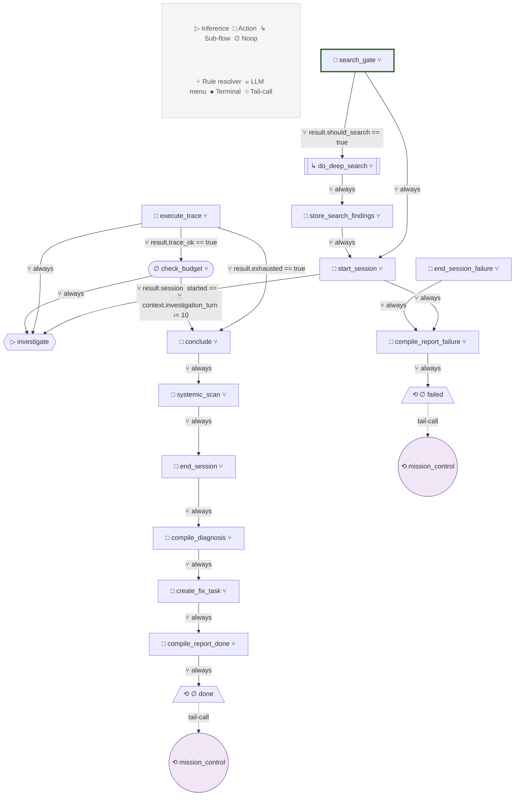
```mermaid
flowchart TD
    %% diagnose_issue v12

    subgraph Legend[" "]
        L1["▷ Inference  □ Action  ↳ Sub-flow  ∅ Noop"]
        L2["⑂ Rule resolver  ☰ LLM menu  ◆ Terminal  ⟲ Tail-call"]
    end
    style Legend fill:#f5f5f5,stroke:#ccc,stroke-width:1px
    style L1 fill:#f5f5f5,stroke:none,color:#555
    style L2 fill:#f5f5f5,stroke:none,color:#555

    search_gate["□ search_gate ⑂"]
    do_deep_search[["↳ do_deep_search ⑂"]]
    store_search_findings["□ store_search_findings ⑂"]
    start_session["□ start_session ⑂"]
    investigate{{"▷ investigate"}}
    execute_trace["□ execute_trace ⑂"]
    check_budget(["∅ check_budget ⑂"])
    conclude["□ conclude ⑂"]
    systemic_scan["□ systemic_scan ⑂"]
    end_session["□ end_session ⑂"]
    end_session_failure["□ end_session_failure ⑂"]
    compile_diagnosis["□ compile_diagnosis ⑂"]
    create_fix_task["□ create_fix_task ⑂"]
    compile_report_done["□ compile_report_done ⑂"]
    compile_report_failure["□ compile_report_failure ⑂"]
    done[/"⟲ ∅ done"\]
    failed[/"⟲ ∅ failed"\]

    style search_gate stroke-width:3px,stroke:#2d5a27

    search_gate -->|⑂ result.should_search == true| do_deep_search
    search_gate -->|⑂ always| start_session
    do_deep_search -->|⑂ always| store_search_findings
    store_search_findings -->|⑂ always| start_session
    start_session -->|⑂ result.session_started == true| investigate
    start_session -->|⑂ always| compile_report_failure
    execute_trace -->|⑂ result.trace_ok == true| check_budget
    execute_trace -->|⑂ result.exhausted == true| conclude
    execute_trace -->|⑂ always| investigate
    check_budget -->|⑂ context.investigation_turn ›= 10| conclude
    check_budget -->|⑂ always| investigate
    conclude -->|⑂ always| systemic_scan
    systemic_scan -->|⑂ always| end_session
    end_session -->|⑂ always| compile_diagnosis
    end_session_failure -->|⑂ always| compile_report_failure
    compile_diagnosis -->|⑂ always| create_fix_task
    create_fix_task -->|⑂ always| compile_report_done
    compile_report_done -->|⑂ always| done
    compile_report_failure -->|⑂ always| failed
    tc_done(("⟲ mission_control"))
    style tc_done fill:#f0e6f6,stroke:#663399
    done -.->|tail-call| tc_done
    tc_failed(("⟲ mission_control"))
    style tc_failed fill:#f0e6f6,stroke:#663399
    failed -.->|tail-call| tc_failed

```

#### file_ops (v3)
*File operations lifecycle. Routes to create/patch/rewrite,
validates output, self-corrects on failure, reports to
mission_control via structured returns.*

**Tier:** `flow_directive` · **Returns:** `target_file`, `files_changed`, `write_action`, `edit_summary`, `validation`, `bail_reason`
**Inputs:** ○ mission_id · ○ goal_id · ○ target_file_path · ○ flow_directive · ◑ working_directory · ◑ file_context · ◑ mode · ◑ prompt_variant · ◑ target_symbol · ◑ change_spec · ◑ diagnosis_kind · ◑ module_statement · ◑ related_symbols
**Publishes:** ● files_changed · ● target_file · ● module_statement · ● module_directive · ● module_fix_symbol_continue · ● edit_summary · ● bail_reason · ● validation_commands · ● validation_results · ● validation_output (+1 more)
**Sub-flows:** ↳ create · ↳ patch_module · ↳ patch · ↳ add_symbol · ↳ data_patch · ↳ rewrite · ↳ set_env · ↳ escalate · ↳ diagnose_issue
**Tail-calls:** ⟲ mission_control
**Effects:** →𓇴 load mission · push_note · 𓉗 file read · ⌘ command · ⟶ inference
**Stats:** 26 steps · 22 ⑂ rule

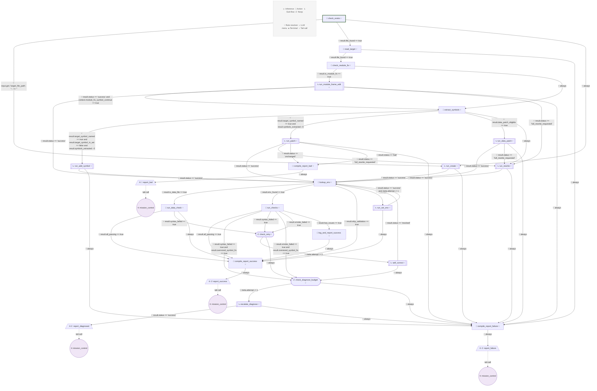
```mermaid
flowchart TD
    %% file_ops v3

    subgraph Legend[" "]
        L1["▷ Inference  □ Action  ↳ Sub-flow  ∅ Noop"]
        L2["⑂ Rule resolver  ☰ LLM menu  ◆ Terminal  ⟲ Tail-call"]
    end
    style Legend fill:#f5f5f5,stroke:#ccc,stroke-width:1px
    style L1 fill:#f5f5f5,stroke:none,color:#555
    style L2 fill:#f5f5f5,stroke:none,color:#555

    check_exists["□ check_exists ⑂"]
    run_create[["↳ run_create ⑂"]]
    read_target["□ read_target ⑂"]
    check_module_fix["□ check_module_fix ⑂"]
    run_module_frame_edit[["↳ run_module_frame_edit ⑂"]]
    extract_symbols["□ extract_symbols ⑂"]
    run_patch[["↳ run_patch ⑂"]]
    run_add_symbol[["↳ run_add_symbol ⑂"]]
    run_data_patch[["↳ run_data_patch ⑂"]]
    run_rewrite[["↳ run_rewrite ⑂"]]
    lookup_env["□ lookup_env ⑂"]
    run_data_check["□ run_data_check ⑂"]
    run_set_env[["↳ run_set_env ⑂"]]
    run_checks["□ run_checks ⑂"]
    check_retry(["∅ check_retry ⑂"])
    self_correct[["↳ self_correct ⑂"]]
    check_diagnose_budget(["∅ check_diagnose_budget ⑂"])
    escalate_diagnose[["↳ escalate_diagnose ⑂"]]
    log_and_report_success["□ log_and_report_success ⑂"]
    compile_report_success["□ compile_report_success ⑂"]
    compile_report_failure["□ compile_report_failure ⑂"]
    report_success[/"⟲ ∅ report_success"\]
    report_failure[/"⟲ ∅ report_failure"\]
    report_diagnosed[/"⟲ ∅ report_diagnosed"\]
    compile_report_bail["□ compile_report_bail ⑂"]
    report_bail[/"⟲ □ report_bail"\]

    style check_exists stroke-width:3px,stroke:#2d5a27

    check_exists -->|⑂ input.get⟮'target_file_path', ''⟯ == ''| run_create
    check_exists -->|⑂ result.file_found == true| read_target
    check_exists -->|⑂ always| run_create
    run_create -->|⑂ result.status == 'success'| lookup_env
    run_create -->|⑂ always| compile_report_failure
    read_target -->|⑂ result.file_found == true| check_module_fix
    read_target -->|⑂ always| compile_report_failure
    check_module_fix -->|⑂ result.is_module_fix == true| run_module_frame_edit
    check_module_fix -->|⑂ always| extract_symbols
    run_module_frame_edit -->|⑂ result.status == 'success' and context.module_fix_symbol_continue == true| extract_symbols
    run_module_frame_edit -->|⑂ result.status == 'success'| lookup_env
    run_module_frame_edit -->|⑂ result.status == 'full_rewrite_requested'| run_rewrite
    run_module_frame_edit -->|⑂ always| compile_report_failure
    extract_symbols -->|⑂ result.target_symbol_named == true and result.target_symbol_in_ast == false and result.symbols_extracted › 0| run_add_symbol
    extract_symbols -->|⑂ result.target_symbol_named == true and result.symbols_extracted › 0| run_patch
    extract_symbols -->|⑂ result.data_patch_eligible == true| run_data_patch
    extract_symbols -->|⑂ always| run_rewrite
    run_patch -->|⑂ result.status == 'success'| lookup_env
    run_patch -->|⑂ result.status == 'full_rewrite_requested'| run_rewrite
    run_patch -->|⑂ result.status == 'unchanged'| compile_report_bail
    run_patch -->|⑂ result.status == 'bail'| compile_report_bail
    run_patch -->|⑂ always| compile_report_failure
    run_add_symbol -->|⑂ result.status == 'success'| lookup_env
    run_add_symbol -->|⑂ always| compile_report_failure
    run_data_patch -->|⑂ result.status == 'success'| lookup_env
    run_data_patch -->|⑂ result.status == 'full_rewrite_requested'| run_rewrite
    run_data_patch -->|⑂ always| compile_report_failure
    run_rewrite -->|⑂ result.status == 'success'| lookup_env
    run_rewrite -->|⑂ always| compile_report_failure
    lookup_env -->|⑂ result.is_data_file == true| run_data_check
    lookup_env -->|⑂ result.env_found == true| run_checks
    lookup_env -->|⑂ result.skip_validation == true| compile_report_success
    lookup_env -->|⑂ always| run_set_env
    run_data_check -->|⑂ result.all_passing == true| compile_report_success
    run_data_check -->|⑂ result.syntax_failed == true| check_retry
    run_data_check -->|⑂ always| compile_report_success
    run_set_env -->|⑂ result.status == 'success' and meta.attempt ‹= 1| lookup_env
    run_set_env -->|⑂ always| compile_report_success
    run_checks -->|⑂ result.all_passing == true| compile_report_success
    run_checks -->|⑂ result.syntax_failed == true and result.oversized_symbol_fix == true| check_diagnose_budget
    run_checks -->|⑂ result.syntax_failed == true| check_retry
    run_checks -->|⑂ result.smoke_failed == true and result.oversized_symbol_fix == true| check_diagnose_budget
    run_checks -->|⑂ result.smoke_failed == true| check_retry
    run_checks -->|⑂ result.has_issues == true| log_and_report_success
    check_retry -->|⑂ meta.attempt ‹= 2| self_correct
    check_retry -->|⑂ always| check_diagnose_budget
    self_correct -->|⑂ result.status == 'resolved'| lookup_env
    self_correct -->|⑂ always| check_diagnose_budget
    check_diagnose_budget -->|⑂ meta.attempt ‹= 1| escalate_diagnose
    check_diagnose_budget -->|⑂ always| compile_report_failure
    escalate_diagnose -->|⑂ result.status == 'success'| report_diagnosed
    escalate_diagnose -->|⑂ always| compile_report_failure
    log_and_report_success -->|⑂ always| compile_report_success
    compile_report_success -->|⑂ always| report_success
    compile_report_failure -->|⑂ always| report_failure
    tc_report_success(("⟲ mission_control"))
    style tc_report_success fill:#f0e6f6,stroke:#663399
    report_success -.->|tail-call| tc_report_success
    tc_report_failure(("⟲ mission_control"))
    style tc_report_failure fill:#f0e6f6,stroke:#663399
    report_failure -.->|tail-call| tc_report_failure
    tc_report_diagnosed(("⟲ mission_control"))
    style tc_report_diagnosed fill:#f0e6f6,stroke:#663399
    report_diagnosed -.->|tail-call| tc_report_diagnosed
    compile_report_bail -->|⑂ always| report_bail
    tc_report_bail(("⟲ mission_control"))
    style tc_report_bail fill:#f0e6f6,stroke:#663399
    report_bail -.->|tail-call| tc_report_bail

```

#### interact (v4)
*Route product interaction to the appropriate sub-flow.
Deterministic goals use run_commands + exit code evaluation (zero inference).
Exploratory goals use persona-driven run_session + inference evaluation.*

**Tier:** `flow_directive` · **Returns:** `terminal_output`, `commands_run`, `evaluation_result`, `directive_report`
**Inputs:** ○ mission_id · ○ goal_id · ○ flow_directive · ◑ working_directory · ◑ interaction_context · ◑ interaction_mode · ◑ run_command · ◑ interactive_prompt · ◑ charter_mode
**Publishes:** ● terminal_output · ● all_passed · ● goal_met · ● summary · ● headline · ● project_manifest · ● repo_map_formatted · ● execution_persona · ● inference_session_id · ● mission (+6 more)
**Sub-flows:** ↳ run_commands · ↳ prepare_context · ↳ run_session
**Tail-calls:** ⟲ mission_control
**Effects:** end_inference_session · ⟶ inference · 𓉗 list dir · →𓇴 load mission · ⌘ command · 𓇴→ save mission
**Stats:** 24 steps · ▷ 4 inference · 18 ⑂ rule

**Prompts:**
- **plan_interaction** ▷ (): Craft a test charter for the run_session sub-flow
- **plan_interaction_explore** ▷ (): Craft an explore-and-build charter for a not-yet-built capability
- **derive_acceptance** ▷ (t*0.1): Derive acceptance checks grounded in the explored session
  Injects: {← context.session_tail}, {← input.flow_directive}
- **evaluate_outcome** ▷ (): Evaluate whether the product interaction achieved its goal

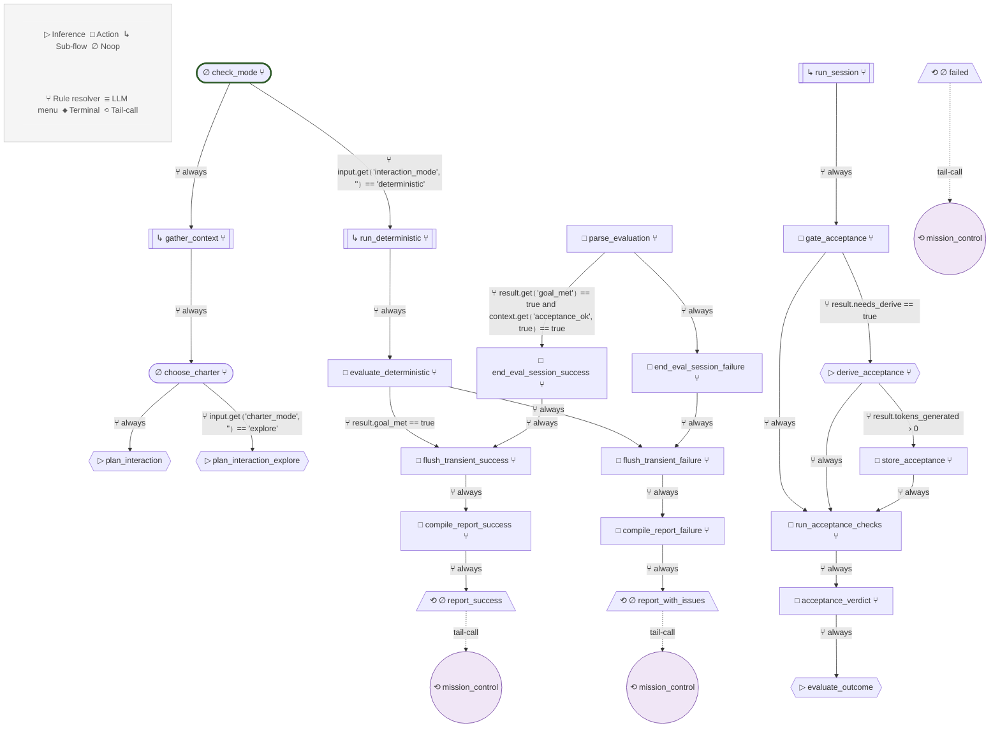
```mermaid
flowchart TD
    %% interact v4

    subgraph Legend[" "]
        L1["▷ Inference  □ Action  ↳ Sub-flow  ∅ Noop"]
        L2["⑂ Rule resolver  ☰ LLM menu  ◆ Terminal  ⟲ Tail-call"]
    end
    style Legend fill:#f5f5f5,stroke:#ccc,stroke-width:1px
    style L1 fill:#f5f5f5,stroke:none,color:#555
    style L2 fill:#f5f5f5,stroke:none,color:#555

    check_mode(["∅ check_mode ⑂"])
    run_deterministic[["↳ run_deterministic ⑂"]]
    evaluate_deterministic["□ evaluate_deterministic ⑂"]
    gather_context[["↳ gather_context ⑂"]]
    choose_charter(["∅ choose_charter ⑂"])
    plan_interaction{{"▷ plan_interaction"}}
    plan_interaction_explore{{"▷ plan_interaction_explore"}}
    run_session[["↳ run_session ⑂"]]
    gate_acceptance["□ gate_acceptance ⑂"]
    derive_acceptance{{"▷ derive_acceptance ⑂"}}
    store_acceptance["□ store_acceptance ⑂"]
    run_acceptance_checks["□ run_acceptance_checks ⑂"]
    acceptance_verdict["□ acceptance_verdict ⑂"]
    evaluate_outcome{{"▷ evaluate_outcome"}}
    parse_evaluation["□ parse_evaluation ⑂"]
    end_eval_session_success["□ end_eval_session_success ⑂"]
    end_eval_session_failure["□ end_eval_session_failure ⑂"]
    flush_transient_success["□ flush_transient_success ⑂"]
    flush_transient_failure["□ flush_transient_failure ⑂"]
    compile_report_success["□ compile_report_success ⑂"]
    compile_report_failure["□ compile_report_failure ⑂"]
    report_success[/"⟲ ∅ report_success"\]
    report_with_issues[/"⟲ ∅ report_with_issues"\]
    failed[/"⟲ ∅ failed"\]

    style check_mode stroke-width:3px,stroke:#2d5a27

    check_mode -->|⑂ input.get⟮'interaction_mode', ''⟯ == 'deterministic'| run_deterministic
    check_mode -->|⑂ always| gather_context
    run_deterministic -->|⑂ always| evaluate_deterministic
    evaluate_deterministic -->|⑂ result.goal_met == true| flush_transient_success
    evaluate_deterministic -->|⑂ always| flush_transient_failure
    gather_context -->|⑂ always| choose_charter
    choose_charter -->|⑂ input.get⟮'charter_mode', ''⟯ == 'explore'| plan_interaction_explore
    choose_charter -->|⑂ always| plan_interaction
    run_session -->|⑂ always| gate_acceptance
    gate_acceptance -->|⑂ result.needs_derive == true| derive_acceptance
    gate_acceptance -->|⑂ always| run_acceptance_checks
    derive_acceptance -->|⑂ result.tokens_generated › 0| store_acceptance
    derive_acceptance -->|⑂ always| run_acceptance_checks
    store_acceptance -->|⑂ always| run_acceptance_checks
    run_acceptance_checks -->|⑂ always| acceptance_verdict
    acceptance_verdict -->|⑂ always| evaluate_outcome
    parse_evaluation -->|⑂ result.get⟮'goal_met'⟯ == true and context.get⟮'acceptance_ok', true⟯ == true| end_eval_session_success
    parse_evaluation -->|⑂ always| end_eval_session_failure
    end_eval_session_success -->|⑂ always| flush_transient_success
    end_eval_session_failure -->|⑂ always| flush_transient_failure
    flush_transient_success -->|⑂ always| compile_report_success
    flush_transient_failure -->|⑂ always| compile_report_failure
    compile_report_success -->|⑂ always| report_success
    compile_report_failure -->|⑂ always| report_with_issues
    tc_report_success(("⟲ mission_control"))
    style tc_report_success fill:#f0e6f6,stroke:#663399
    report_success -.->|tail-call| tc_report_success
    tc_report_with_issues(("⟲ mission_control"))
    style tc_report_with_issues fill:#f0e6f6,stroke:#663399
    report_with_issues -.->|tail-call| tc_report_with_issues
    tc_failed(("⟲ mission_control"))
    style tc_failed fill:#f0e6f6,stroke:#663399
    failed -.->|tail-call| tc_failed

```

#### project_ops (v4)
*Initialize project tooling and structure. Creates config files,
directories, installs dependencies, and detects validation tooling.*

**Tier:** `flow_directive` · **Returns:** `setup_complete`, `files_changed`, `env_detected`, `directive_report`
**Inputs:** ○ mission_id · ○ goal_id · ○ flow_directive · ◑ working_directory · ◑ project_setup_context · ◑ setup_focus
**Publishes:** ● project_manifest · ● repo_map_formatted · ● inference_response · ● install_commands · ● all_passed · ● test_install_commands · ● directive_report
**Sub-flows:** ↳ prepare_context · ↳ set_env · ↳ run_commands · ↳ run_commands
**Tail-calls:** ⟲ mission_control
**Effects:** file_exists · ⟶ inference · 𓉗 file read · ⌘ command · 𓉗 file write
**Stats:** 13 steps · ▷ 1 inference · 10 ⑂ rule

**Prompts:**
- **plan_setup** ▷ (): Determine what setup actions are needed

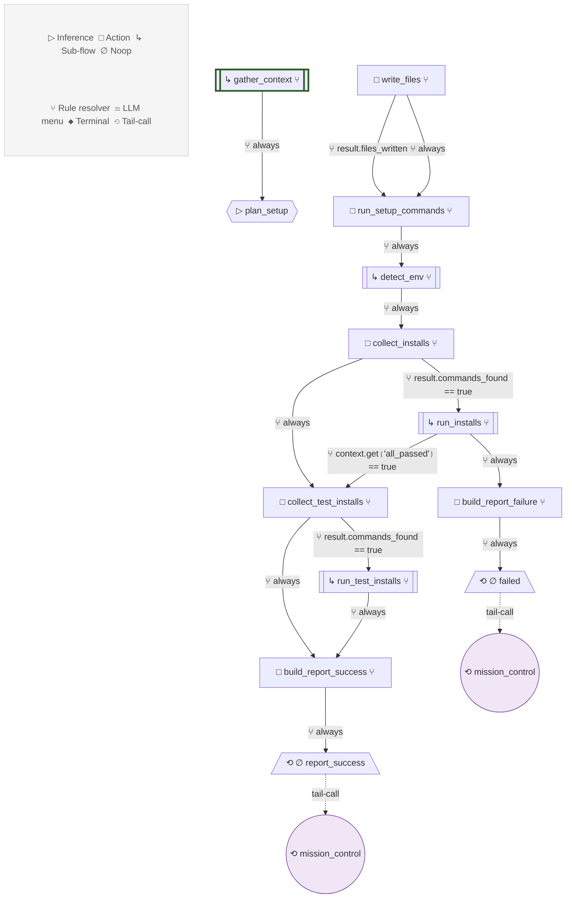
```mermaid
flowchart TD
    %% project_ops v4

    subgraph Legend[" "]
        L1["▷ Inference  □ Action  ↳ Sub-flow  ∅ Noop"]
        L2["⑂ Rule resolver  ☰ LLM menu  ◆ Terminal  ⟲ Tail-call"]
    end
    style Legend fill:#f5f5f5,stroke:#ccc,stroke-width:1px
    style L1 fill:#f5f5f5,stroke:none,color:#555
    style L2 fill:#f5f5f5,stroke:none,color:#555

    gather_context[["↳ gather_context ⑂"]]
    plan_setup{{"▷ plan_setup"}}
    write_files["□ write_files ⑂"]
    run_setup_commands["□ run_setup_commands ⑂"]
    detect_env[["↳ detect_env ⑂"]]
    collect_installs["□ collect_installs ⑂"]
    run_installs[["↳ run_installs ⑂"]]
    collect_test_installs["□ collect_test_installs ⑂"]
    run_test_installs[["↳ run_test_installs ⑂"]]
    build_report_success["□ build_report_success ⑂"]
    build_report_failure["□ build_report_failure ⑂"]
    report_success[/"⟲ ∅ report_success"\]
    failed[/"⟲ ∅ failed"\]

    style gather_context stroke-width:3px,stroke:#2d5a27

    gather_context -->|⑂ always| plan_setup
    write_files -->|⑂ result.files_written › 0| run_setup_commands
    write_files -->|⑂ always| run_setup_commands
    run_setup_commands -->|⑂ always| detect_env
    detect_env -->|⑂ always| collect_installs
    collect_installs -->|⑂ result.commands_found == true| run_installs
    collect_installs -->|⑂ always| collect_test_installs
    run_installs -->|⑂ context.get⟮'all_passed'⟯ == true| collect_test_installs
    run_installs -->|⑂ always| build_report_failure
    collect_test_installs -->|⑂ result.commands_found == true| run_test_installs
    collect_test_installs -->|⑂ always| build_report_success
    run_test_installs -->|⑂ always| build_report_success
    build_report_success -->|⑂ always| report_success
    build_report_failure -->|⑂ always| failed
    tc_report_success(("⟲ mission_control"))
    style tc_report_success fill:#f0e6f6,stroke:#663399
    report_success -.->|tail-call| tc_report_success
    tc_failed(("⟲ mission_control"))
    style tc_failed fill:#f0e6f6,stroke:#663399
    failed -.->|tail-call| tc_failed

```

#### research (v2)
*Search for information and summarize into dense, actionable text.
The caller provides a specific research_query. This flow plans
search queries, executes them, and returns a summary.*

**Tier:** `session_task` · **Returns:** `summary`, `queries_run`, `results_found`
**Inputs:** ○ research_query · ◑ research_context · ◑ max_results
**Terminal:** ◆ success · ◆ empty
**Publishes:** ● inference_response · ● search_queries · ● raw_search_results · ● research_summary
**Effects:** ⟶ inference · mcp_call_tool · mcp_connect
**Stats:** 6 steps · ▷ 2 inference · 2 ⑂ rule

**Prompts:**
- **plan_queries** ▷ (): Generate 2-3 targeted search queries from the research question
- **summarize** ▷ (): Distill search results into dense, actionable guidance

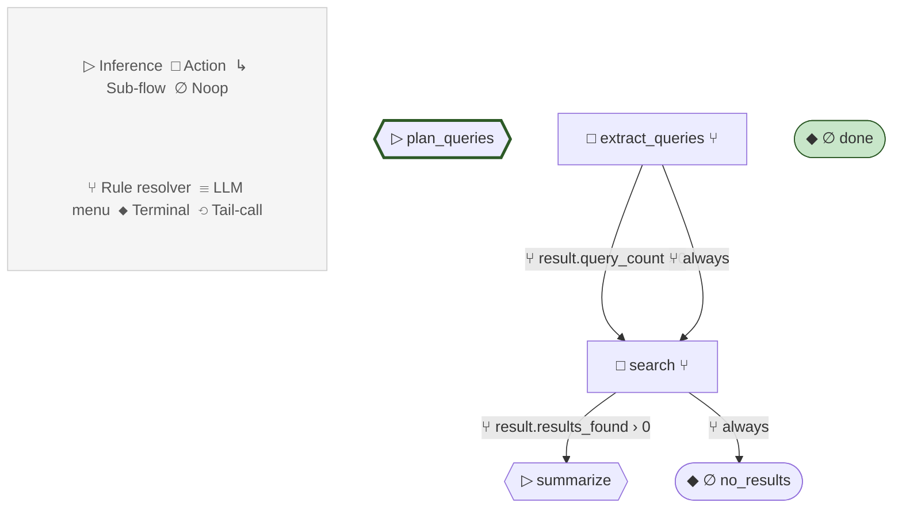
```mermaid
flowchart TD
    %% research v2

    subgraph Legend[" "]
        L1["▷ Inference  □ Action  ↳ Sub-flow  ∅ Noop"]
        L2["⑂ Rule resolver  ☰ LLM menu  ◆ Terminal  ⟲ Tail-call"]
    end
    style Legend fill:#f5f5f5,stroke:#ccc,stroke-width:1px
    style L1 fill:#f5f5f5,stroke:none,color:#555
    style L2 fill:#f5f5f5,stroke:none,color:#555

    plan_queries{{"▷ plan_queries"}}
    extract_queries["□ extract_queries ⑂"]
    search["□ search ⑂"]
    summarize{{"▷ summarize"}}
    done(["◆ ∅ done"])
    no_results(["◆ ∅ no_results"])

    style plan_queries stroke-width:3px,stroke:#2d5a27

    extract_queries -->|⑂ result.query_count › 0| search
    extract_queries -->|⑂ always| search
    search -->|⑂ result.results_found › 0| summarize
    search -->|⑂ always| no_results

    style done fill:#c8e6c9,stroke:#2d5a27
```

### Sub-flows

#### create (v2)
*Create a new source file. Uses file_context projection for
architecture-guided dependency content, generates content via
inference, writes to disk. Called by file_ops when the target
file does not exist.*

**Tier:** `session_task` · **Returns:** `files_changed`
**Inputs:** ○ mission_id · ○ goal_id · ○ target_file_path · ○ flow_directive · ◑ file_context · ◑ prompt_variant
**Terminal:** ◆ success · ◆ failed
**Publishes:** ● inference_response
**Effects:** ⟶ inference · 𓉗 file read
**Stats:** 6 steps · ▷ 2 inference · 2 ⑂ rule

**Prompts:**
- **generate_content** ▷ (): Generate file content
- **generate_tests** ▷ (): Generate test file content

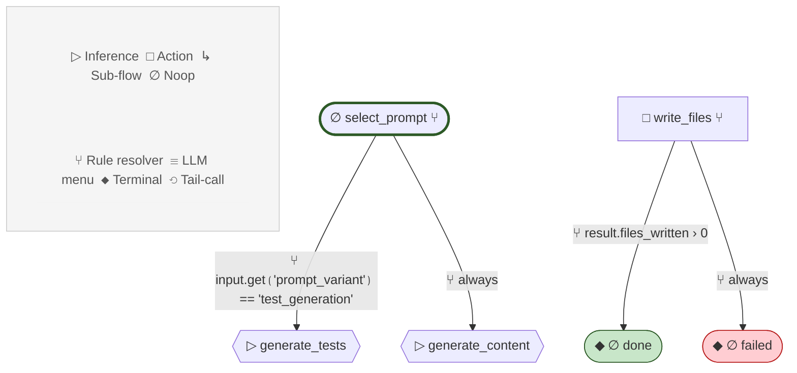
```mermaid
flowchart TD
    %% create v2

    subgraph Legend[" "]
        L1["▷ Inference  □ Action  ↳ Sub-flow  ∅ Noop"]
        L2["⑂ Rule resolver  ☰ LLM menu  ◆ Terminal  ⟲ Tail-call"]
    end
    style Legend fill:#f5f5f5,stroke:#ccc,stroke-width:1px
    style L1 fill:#f5f5f5,stroke:none,color:#555
    style L2 fill:#f5f5f5,stroke:none,color:#555

    select_prompt(["∅ select_prompt ⑂"])
    generate_content{{"▷ generate_content"}}
    generate_tests{{"▷ generate_tests"}}
    write_files["□ write_files ⑂"]
    done(["◆ ∅ done"])
    failed(["◆ ∅ failed"])

    style select_prompt stroke-width:3px,stroke:#2d5a27

    select_prompt -->|⑂ input.get⟮'prompt_variant'⟯ == 'test_generation'| generate_tests
    select_prompt -->|⑂ always| generate_content
    write_files -->|⑂ result.files_written › 0| done
    write_files -->|⑂ always| failed

    style done fill:#c8e6c9,stroke:#2d5a27
    style failed fill:#ffcdd2,stroke:#b71c1c
```

#### patch (v3)
*Surgical AST-aware editing of the diagnose-named symbol plus
related symbols, spanning files when related_symbols are
file-qualified. Generates single-symbol bodies; the splicer
places each at AST-computed line offsets; each file is written
once as its queue drains. Relies on diagnose naming the exact
target_symbol and file_ops routing guaranteeing AST presence.*

**Tier:** `session_task` · **Returns:** `files_changed`, `edit_summary`, `bail_reason`
**Inputs:** ○ file_path · ○ file_content · ○ symbol_table · ○ target_symbol · ○ flow_directive · ◑ mode · ◑ file_context · ◑ working_directory · ◑ validation_errors · ◑ change_spec · ◑ related_symbols
**Terminal:** ◆ success · ◆ bail · ◆ failed
**Publishes:** ● edit_session_id · ● file_content · ● file_path · ● mode · ● rewrite_queue · ● current_symbol · ● cross_file_queue · ● unresolved_symbols · ● files_changed · ● call_graph_block (+6 more)
**Effects:** end_inference_session · 𓉗 file read · session_inference · start_inference_session · 𓉗 file write
**Stats:** 10 steps · 7 ⑂ rule

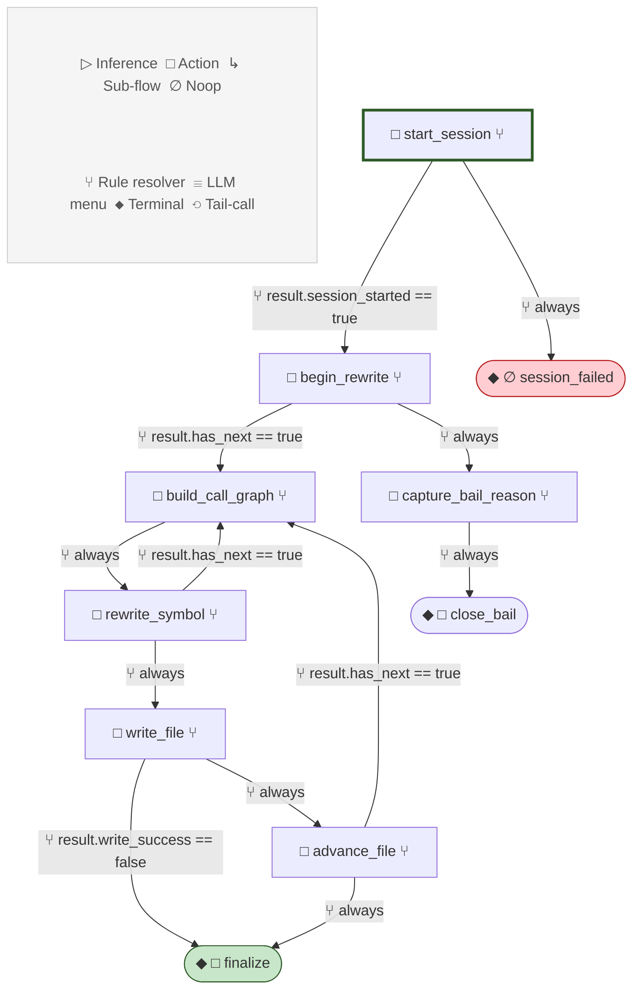
```mermaid
flowchart TD
    %% patch v3

    subgraph Legend[" "]
        L1["▷ Inference  □ Action  ↳ Sub-flow  ∅ Noop"]
        L2["⑂ Rule resolver  ☰ LLM menu  ◆ Terminal  ⟲ Tail-call"]
    end
    style Legend fill:#f5f5f5,stroke:#ccc,stroke-width:1px
    style L1 fill:#f5f5f5,stroke:none,color:#555
    style L2 fill:#f5f5f5,stroke:none,color:#555

    start_session["□ start_session ⑂"]
    begin_rewrite["□ begin_rewrite ⑂"]
    build_call_graph["□ build_call_graph ⑂"]
    rewrite_symbol["□ rewrite_symbol ⑂"]
    write_file["□ write_file ⑂"]
    advance_file["□ advance_file ⑂"]
    finalize(["◆ □ finalize"])
    capture_bail_reason["□ capture_bail_reason ⑂"]
    close_bail(["◆ □ close_bail"])
    session_failed(["◆ ∅ session_failed"])

    style start_session stroke-width:3px,stroke:#2d5a27

    start_session -->|⑂ result.session_started == true| begin_rewrite
    start_session -->|⑂ always| session_failed
    begin_rewrite -->|⑂ result.has_next == true| build_call_graph
    begin_rewrite -->|⑂ always| capture_bail_reason
    build_call_graph -->|⑂ always| rewrite_symbol
    rewrite_symbol -->|⑂ result.has_next == true| build_call_graph
    rewrite_symbol -->|⑂ always| write_file
    write_file -->|⑂ result.write_success == false| finalize
    write_file -->|⑂ always| advance_file
    advance_file -->|⑂ result.has_next == true| build_call_graph
    advance_file -->|⑂ always| finalize
    capture_bail_reason -->|⑂ always| close_bail

    style finalize fill:#c8e6c9,stroke:#2d5a27
    style session_failed fill:#ffcdd2,stroke:#b71c1c
```

#### prepare_context (v4)
*Lightweight project scan. Walks the workspace to build a file
manifest and AST-based dependency map. Zero inference calls.
File content loading is handled by projection materializers
with architecture-guided selection.*

**Tier:** `session_task` · **Returns:** `project_manifest`, `repo_map_formatted`
**Inputs:** ○ working_directory · ○ task_description · ◑ target_file_path
**Terminal:** ◆ success
**Publishes:** ● project_manifest · ● repo_map_formatted
**Effects:** 𓉗 list dir · →𓇴 load mission · 𓉗 file read
**Stats:** 4 steps · 2 ⑂ rule

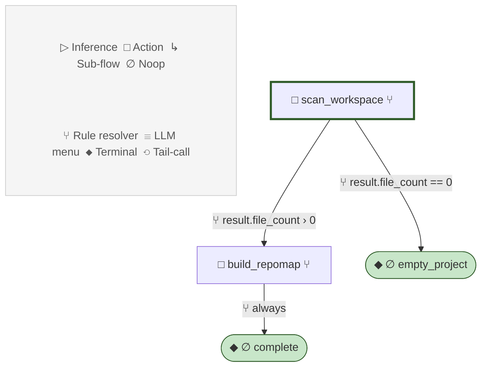
```mermaid
flowchart TD
    %% prepare_context v4

    subgraph Legend[" "]
        L1["▷ Inference  □ Action  ↳ Sub-flow  ∅ Noop"]
        L2["⑂ Rule resolver  ☰ LLM menu  ◆ Terminal  ⟲ Tail-call"]
    end
    style Legend fill:#f5f5f5,stroke:#ccc,stroke-width:1px
    style L1 fill:#f5f5f5,stroke:none,color:#555
    style L2 fill:#f5f5f5,stroke:none,color:#555

    scan_workspace["□ scan_workspace ⑂"]
    build_repomap["□ build_repomap ⑂"]
    empty_project(["◆ ∅ empty_project"])
    complete(["◆ ∅ complete"])

    style scan_workspace stroke-width:3px,stroke:#2d5a27

    scan_workspace -->|⑂ result.file_count › 0| build_repomap
    scan_workspace -->|⑂ result.file_count == 0| empty_project
    build_repomap -->|⑂ always| complete

    style empty_project fill:#c8e6c9,stroke:#2d5a27
    style complete fill:#c8e6c9,stroke:#2d5a27
```

#### quality_gate (v7)
*Project-wide quality validation. Four-phase gate:
1. Deterministic checks — file scan, cross-file consistency, lint
2. Behavioral validation — run_commands (fast-fail), then
   run_session (UX verification, completion mode only)
3. Summary — LLM reviews all results and emits findings
4. Verification — findings with repros are probed against the
   live program; the verdict is derived from surviving claims*

**Tier:** `mission_objective` · **Returns:** `verdict`, `blocking_issues`, `check_results`, `terminal_output`, `dep_coverage`
**Inputs:** ○ working_directory · ○ mission_id · ◑ mission_objective · ◑ architecture_run_command · ◑ architecture_smoke_command · ◑ architecture · ◑ mode · ◑ task_profile
**Terminal:** ◆ success · ◆ failed
**Publishes:** ● project_manifest · ● cross_file_summary · ● data_shape_results · ● data_shape_summary · ● inference_response · ● validation_results · ● task_spec · ● dep_check_imports · ● dep_check_manifest · ● dep_coverage_result (+16 more)
**Sub-flows:** ↳ run_commands · ↳ run_session · ↳ run_commands
**Effects:** end_inference_session · ⟶ inference · 𓉗 list dir · →𓇴 load mission · push_note · 𓉗 file read · ⌘ command · 𓉗 file write
**Stats:** 33 steps · ▷ 7 inference · 30 ⑂ rule

**Prompts:**
- **plan_checks** ▷ (t*0.0): LLM plans deterministic validation checks (imports, lint)
  Injects: {← context.project_listing}, {← input.working_directory}
- **probe_generate** ▷ (t*0.2): Generate a property-based differential test for the candidate
  Injects: {← context.task_spec}
- **analyze_deps** ▷ (t*0.0): LLM checks whether all imports are covered by declared dependencies
  Injects: {← context.dep_check_imports}, {← context.dep_check_manifest}
- **plan_ux_charter** ▷ (t*0.5): Author an exploratory UX charter for the quality session
  Injects: {← context.project_listing}, {← input.mission_objective}, {← input.architecture_run_command}
- **evaluate_ux_session** ▷ (t*0.2): Assess UX session — the model already has full context in KV cache
  Injects: {← input.mission_objective}
- **summarize** ▷ (t*0.1): Summarize all quality results into actionable findings
  Injects: {← context.validation_summary}, {← context.project_file_list}, {← context.cross_file_summary}, {← context.data_shape_summary}, {← context.terminal_output} (+6 more)
- **judge_finding** ▷ (t*0.2): Judge whether the probe transcript confirms the claimed defect
  Injects: {← context.probe_claim}, {← context.probe_expected}, {← context.probe_repro_block}, {← context.probe_launch}, {← context.terminal_output}

```mermaid
flowchart TD
    %% quality_gate v7

    subgraph Legend[" "]
        L1["▷ Inference  □ Action  ↳ Sub-flow  ∅ Noop"]
        L2["⑂ Rule resolver  ☰ LLM menu  ◆ Terminal  ⟲ Tail-call"]
    end
    style Legend fill:#f5f5f5,stroke:#ccc,stroke-width:1px
    style L1 fill:#f5f5f5,stroke:none,color:#555
    style L2 fill:#f5f5f5,stroke:none,color:#555

    scan_project["□ scan_project ⑂"]
    cross_file_check["□ cross_file_check ⑂"]
    data_shape_check["□ data_shape_check ⑂"]
    plan_checks{{"▷ plan_checks ⑂"}}
    execute_checks["□ execute_checks ⑂"]
    profile_oracle["□ profile_oracle ⑂"]
    probe_gate["□ probe_gate ⑂"]
    probe_generate{{"▷ probe_generate ⑂"}}
    probe_run["□ probe_run ⑂"]
    gather_dep_info["□ gather_dep_info ⑂"]
    analyze_deps{{"▷ analyze_deps ⑂"}}
    parse_dep_result["□ parse_dep_result ⑂"]
    check_mode_for_behavioral(["∅ check_mode_for_behavioral ⑂"])
    run_startup_check[["↳ run_startup_check ⑂"]]
    check_boot_liveness["□ check_boot_liveness ⑂"]
    plan_ux_charter{{"▷ plan_ux_charter ⑂"}}
    run_ux_verification[["↳ run_ux_verification ⑂"]]
    evaluate_ux_session{{"▷ evaluate_ux_session ⑂"}}
    end_ux_session["□ end_ux_session ⑂"]
    flush_transient_ux["□ flush_transient_ux ⑂"]
    summarize{{"▷ summarize ⑂"}}
    evaluate_results["□ evaluate_results ⑂"]
    prepare_finding_verification["□ prepare_finding_verification ⑂"]
    run_probe[["↳ run_probe ⑂"]]
    judge_finding{{"▷ judge_finding ⑂"}}
    record_and_advance["□ record_and_advance ⑂"]
    record_probe_error["□ record_probe_error ⑂"]
    flush_transient_probe["□ flush_transient_probe ⑂"]
    flush_transient_final["□ flush_transient_final ⑂"]
    apply_verification_results["□ apply_verification_results ⑂"]
    gate_pass(["◆ ∅ gate_pass"])
    gate_fail(["◆ ∅ gate_fail"])
    pass_empty(["◆ ∅ pass_empty"])

    style scan_project stroke-width:3px,stroke:#2d5a27

    scan_project -->|⑂ result.file_count › 0| cross_file_check
    scan_project -->|⑂ always| pass_empty
    cross_file_check -->|⑂ always| data_shape_check
    data_shape_check -->|⑂ always| plan_checks
    plan_checks -->|⑂ result.tokens_generated › 0| execute_checks
    plan_checks -->|⑂ always| check_mode_for_behavioral
    execute_checks -->|⑂ always| profile_oracle
    profile_oracle -->|⑂ always| probe_gate
    probe_gate -->|⑂ result.run_probe == true| probe_generate
    probe_gate -->|⑂ always| gather_dep_info
    probe_generate -->|⑂ result.tokens_generated › 0| probe_run
    probe_generate -->|⑂ always| gather_dep_info
    probe_run -->|⑂ always| gather_dep_info
    gather_dep_info -->|⑂ result.dep_check_skipped == true| check_mode_for_behavioral
    gather_dep_info -->|⑂ always| analyze_deps
    analyze_deps -->|⑂ result.tokens_generated › 0| parse_dep_result
    analyze_deps -->|⑂ always| check_mode_for_behavioral
    parse_dep_result -->|⑂ result.deps_ok == true| check_mode_for_behavioral
    parse_dep_result -->|⑂ always| gate_fail
    check_mode_for_behavioral -->|⑂ input.get⟮'mode', 'completion'⟯ == 'completion'| run_startup_check
    check_mode_for_behavioral -->|⑂ always| summarize
    run_startup_check -->|⑂ result.status == 'success'| check_boot_liveness
    run_startup_check -->|⑂ always| summarize
    check_boot_liveness -->|⑂ result.boot_clean == true| plan_ux_charter
    check_boot_liveness -->|⑂ always| summarize
    plan_ux_charter -->|⑂ always| run_ux_verification
    run_ux_verification -->|⑂ always| evaluate_ux_session
    evaluate_ux_session -->|⑂ always| end_ux_session
    end_ux_session -->|⑂ always| flush_transient_ux
    flush_transient_ux -->|⑂ always| summarize
    summarize -->|⑂ result.tokens_generated › 0| evaluate_results
    summarize -->|⑂ always| pass_empty
    evaluate_results -->|⑂ result.has_findings == true and input.get⟮'mode', 'completion'⟯ == 'completion'| prepare_finding_verification
    evaluate_results -->|⑂ result.all_passing == true| gate_pass
    evaluate_results -->|⑂ result.all_passing == false| gate_fail
    evaluate_results -->|⑂ always| gate_pass
    prepare_finding_verification -->|⑂ result.has_next == true| run_probe
    prepare_finding_verification -->|⑂ always| apply_verification_results
    run_probe -->|⑂ result.status == 'success'| judge_finding
    run_probe -->|⑂ always| record_probe_error
    judge_finding -->|⑂ result.tokens_generated › 0| record_and_advance
    judge_finding -->|⑂ always| record_probe_error
    record_and_advance -->|⑂ result.has_next == true| flush_transient_probe
    record_and_advance -->|⑂ always| flush_transient_final
    record_probe_error -->|⑂ result.has_next == true| flush_transient_probe
    record_probe_error -->|⑂ always| flush_transient_final
    flush_transient_probe -->|⑂ always| run_probe
    flush_transient_final -->|⑂ always| apply_verification_results
    apply_verification_results -->|⑂ result.all_passing == true| gate_pass
    apply_verification_results -->|⑂ always| gate_fail

    style gate_pass fill:#c8e6c9,stroke:#2d5a27
    style gate_fail fill:#ffcdd2,stroke:#b71c1c
    style pass_empty fill:#ffcdd2,stroke:#b71c1c
```

#### rewrite (v2)
*Replace an existing file's entire content via inference.
Uses file_context projection for target content and dependency
context. Generates a complete replacement and writes to disk.*

**Tier:** `session_task` · **Returns:** `files_changed`
**Inputs:** ○ mission_id · ○ goal_id · ○ target_file_path · ○ flow_directive · ◑ working_directory · ◑ file_context · ◑ validation_errors
**Terminal:** ◆ success · ◆ failed
**Publishes:** ● target_file · ● project_manifest · ● repo_map_formatted · ● inference_response
**Sub-flows:** ↳ prepare_context
**Effects:** ⟶ inference · 𓉗 file read
**Stats:** 6 steps · ▷ 1 inference · 3 ⑂ rule

**Prompts:**
- **generate_rewrite** ▷ (): Generate complete file replacement

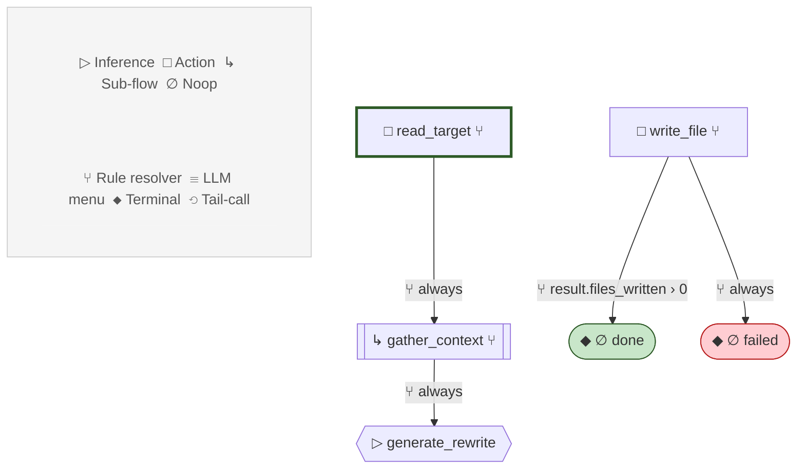
```mermaid
flowchart TD
    %% rewrite v2

    subgraph Legend[" "]
        L1["▷ Inference  □ Action  ↳ Sub-flow  ∅ Noop"]
        L2["⑂ Rule resolver  ☰ LLM menu  ◆ Terminal  ⟲ Tail-call"]
    end
    style Legend fill:#f5f5f5,stroke:#ccc,stroke-width:1px
    style L1 fill:#f5f5f5,stroke:none,color:#555
    style L2 fill:#f5f5f5,stroke:none,color:#555

    read_target["□ read_target ⑂"]
    gather_context[["↳ gather_context ⑂"]]
    generate_rewrite{{"▷ generate_rewrite"}}
    write_file["□ write_file ⑂"]
    done(["◆ ∅ done"])
    failed(["◆ ∅ failed"])

    style read_target stroke-width:3px,stroke:#2d5a27

    read_target -->|⑂ always| gather_context
    gather_context -->|⑂ always| generate_rewrite
    write_file -->|⑂ result.files_written › 0| done
    write_file -->|⑂ always| failed

    style done fill:#c8e6c9,stroke:#2d5a27
    style failed fill:#ffcdd2,stroke:#b71c1c
```

#### run_commands (v2)
*Execute shell commands deterministically via MCP terminal.
Start PTY session, run each command in sequence, capture output,
close. Zero inference.*

**Tier:** `session_task` · **Returns:** `output`, `exit_codes`, `all_passed`
**Inputs:** ○ commands · ○ working_directory · ◑ timeout · ◑ environment_vars · ◑ stop_on_error
**Terminal:** ◆ success · ◆ failed
**Publishes:** ● mcp_connection_id · ● mcp_session_id · ● terminal_output · ● exit_codes · ● all_passed
**Effects:** end_inference_session · mcp_call_tool · mcp_connect · start_inference_session · venv_env_overrides
**Stats:** 4 steps · 2 ⑂ rule

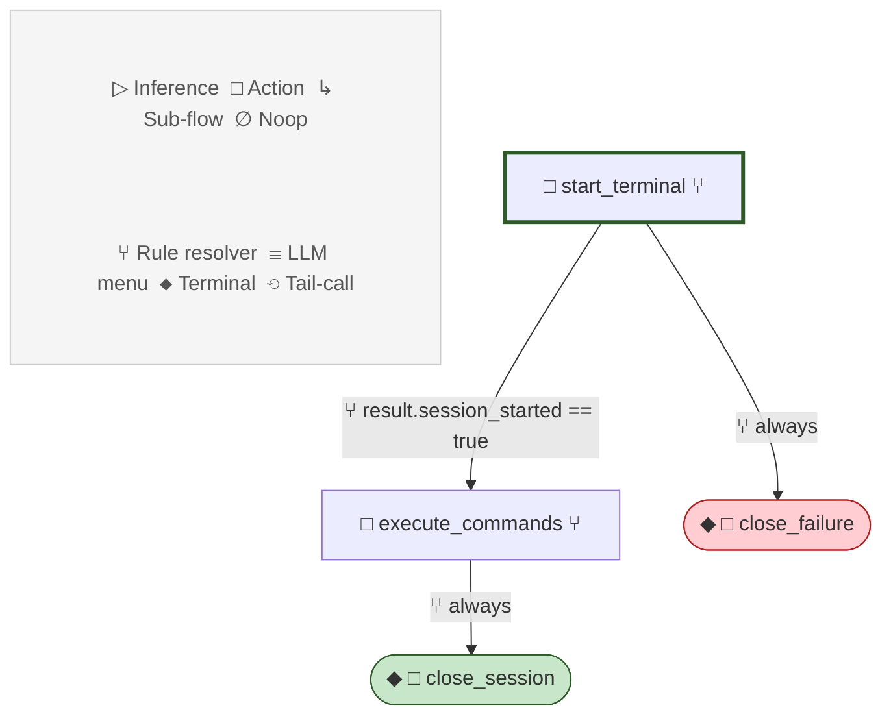
```mermaid
flowchart TD
    %% run_commands v2

    subgraph Legend[" "]
        L1["▷ Inference  □ Action  ↳ Sub-flow  ∅ Noop"]
        L2["⑂ Rule resolver  ☰ LLM menu  ◆ Terminal  ⟲ Tail-call"]
    end
    style Legend fill:#f5f5f5,stroke:#ccc,stroke-width:1px
    style L1 fill:#f5f5f5,stroke:none,color:#555
    style L2 fill:#f5f5f5,stroke:none,color:#555

    start_terminal["□ start_terminal ⑂"]
    execute_commands["□ execute_commands ⑂"]
    close_session(["◆ □ close_session"])
    close_failure(["◆ □ close_failure"])

    style start_terminal stroke-width:3px,stroke:#2d5a27

    start_terminal -->|⑂ result.session_started == true| execute_commands
    start_terminal -->|⑂ always| close_failure
    execute_commands -->|⑂ always| close_session

    style close_session fill:#c8e6c9,stroke:#2d5a27
    style close_failure fill:#ffcdd2,stroke:#b71c1c
```

#### run_session (v3)
*Interactive terminal session driven by an execution persona.
The model acts as a user — tries things, observes, adapts.
Multi-turn with memoryful inference session. Uses PTY via MCP
for true interactive program support.

The inference session is kept alive after the PTY closes so
the calling flow can run evaluation in the same KV cache context.
The caller is responsible for ending the inference session.*

**Tier:** `session_task` · **Returns:** `terminal_output`, `commands_run`, `inference_session_id`, `launch_command`
**Inputs:** ○ execution_persona · ○ working_directory · ◑ environment_vars · ◑ expected_prompt
**Terminal:** ◆ success · ◆ failed
**Publishes:** ● mcp_connection_id · ● mcp_session_id · ● inference_session_id · ● session_history · ● inference_response · ● planned_action · ● launch_command · ● relaunch_choice · ● relaunch_count · ● terminal_output
**Effects:** end_inference_session · ⟶ inference · mcp_call_tool · mcp_connect · start_inference_session · venv_env_overrides
**Stats:** 7 steps · ▷ 2 inference · 3 ⑂ rule

**Prompts:**
- **plan_interaction** ▷ (): Model decides what to do next — shell command, send input, or close
- **ask_relaunch** ▷ (): Program exited — does the brief need another run?

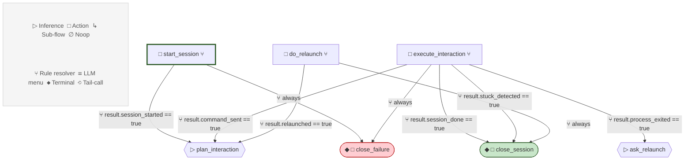
```mermaid
flowchart TD
    %% run_session v3

    subgraph Legend[" "]
        L1["▷ Inference  □ Action  ↳ Sub-flow  ∅ Noop"]
        L2["⑂ Rule resolver  ☰ LLM menu  ◆ Terminal  ⟲ Tail-call"]
    end
    style Legend fill:#f5f5f5,stroke:#ccc,stroke-width:1px
    style L1 fill:#f5f5f5,stroke:none,color:#555
    style L2 fill:#f5f5f5,stroke:none,color:#555

    start_session["□ start_session ⑂"]
    plan_interaction{{"▷ plan_interaction"}}
    execute_interaction["□ execute_interaction ⑂"]
    ask_relaunch{{"▷ ask_relaunch"}}
    do_relaunch["□ do_relaunch ⑂"]
    close_session(["◆ □ close_session"])
    close_failure(["◆ □ close_failure"])

    style start_session stroke-width:3px,stroke:#2d5a27

    start_session -->|⑂ result.session_started == true| plan_interaction
    start_session -->|⑂ always| close_failure
    execute_interaction -->|⑂ result.session_done == true| close_session
    execute_interaction -->|⑂ result.stuck_detected == true| close_session
    execute_interaction -->|⑂ result.process_exited == true| ask_relaunch
    execute_interaction -->|⑂ result.command_sent == true| plan_interaction
    execute_interaction -->|⑂ always| close_failure
    do_relaunch -->|⑂ result.relaunched == true| plan_interaction
    do_relaunch -->|⑂ always| close_session

    style close_session fill:#c8e6c9,stroke:#2d5a27
    style close_failure fill:#ffcdd2,stroke:#b71c1c
```

#### set_env (v2)
*Detect project validation tooling. Scans the project, makes one
inference call to determine language-appropriate syntax, lint,
and format commands, and persists to .agent/env.json.*

**Tier:** `session_task` · **Returns:** `env_detected`
**Inputs:** ○ working_directory · ○ mission_id · ◑ target_file_path
**Terminal:** ◆ success · ◆ failed
**Publishes:** ● project_manifest · ● inference_response · ● env_config
**Effects:** ⟶ inference · 𓉗 list dir · →𓇴 load mission · 𓉗 file read · 𓉗 file write
**Stats:** 5 steps · ▷ 1 inference · 2 ⑂ rule

**Prompts:**
- **detect_tooling** ▷ (): Infer validation commands for this project's languages

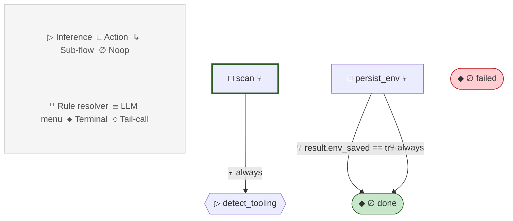
```mermaid
flowchart TD
    %% set_env v2

    subgraph Legend[" "]
        L1["▷ Inference  □ Action  ↳ Sub-flow  ∅ Noop"]
        L2["⑂ Rule resolver  ☰ LLM menu  ◆ Terminal  ⟲ Tail-call"]
    end
    style Legend fill:#f5f5f5,stroke:#ccc,stroke-width:1px
    style L1 fill:#f5f5f5,stroke:none,color:#555
    style L2 fill:#f5f5f5,stroke:none,color:#555

    scan["□ scan ⑂"]
    detect_tooling{{"▷ detect_tooling"}}
    persist_env["□ persist_env ⑂"]
    done(["◆ ∅ done"])
    failed(["◆ ∅ failed"])

    style scan stroke-width:3px,stroke:#2d5a27

    scan -->|⑂ always| detect_tooling
    persist_env -->|⑂ result.env_saved == true| done
    persist_env -->|⑂ always| done

    style done fill:#c8e6c9,stroke:#2d5a27
    style failed fill:#ffcdd2,stroke:#b71c1c
```

### Other Flows

#### acquire_catalog (v1)
*Acquire and catalog a batch of candidate papers: OA resolution,
PDF download, reference fetch, and aspect tagging
(exact/close/adjacent) grounded in the abstracts.*

**Tier:** `flow_directive` · **Returns:** `directive_report`
**Inputs:** ○ mission_id · ○ goal_id · ○ flow_directive · ○ paper_keys · ○ working_directory
**Publishes:** ● mission · ● events · ● catalog_batch · ● inference_response · ● directive_report
**Tail-calls:** ⟲ research_control
**Effects:** http_download · ⟶ inference · →𓇴 load mission · →𓇴 read events
**Stats:** 8 steps · ▷ 1 inference · 7 ⑂ rule

**Prompts:**
- **tag_papers** ▷ (t*0.3): Tag the batch against the plan's aspects (one turn)
  Injects: {← context.aspects_block}, {← context.papers_block}

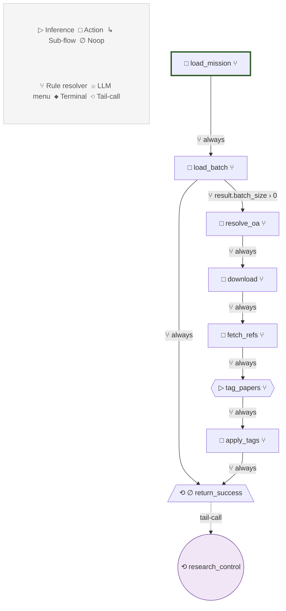
```mermaid
flowchart TD
    %% acquire_catalog v1

    subgraph Legend[" "]
        L1["▷ Inference  □ Action  ↳ Sub-flow  ∅ Noop"]
        L2["⑂ Rule resolver  ☰ LLM menu  ◆ Terminal  ⟲ Tail-call"]
    end
    style Legend fill:#f5f5f5,stroke:#ccc,stroke-width:1px
    style L1 fill:#f5f5f5,stroke:none,color:#555
    style L2 fill:#f5f5f5,stroke:none,color:#555

    load_mission["□ load_mission ⑂"]
    load_batch["□ load_batch ⑂"]
    resolve_oa["□ resolve_oa ⑂"]
    download["□ download ⑂"]
    fetch_refs["□ fetch_refs ⑂"]
    tag_papers{{"▷ tag_papers ⑂"}}
    apply_tags["□ apply_tags ⑂"]
    return_success[/"⟲ ∅ return_success"\]

    style load_mission stroke-width:3px,stroke:#2d5a27

    load_mission -->|⑂ always| load_batch
    load_batch -->|⑂ result.batch_size › 0| resolve_oa
    load_batch -->|⑂ always| return_success
    resolve_oa -->|⑂ always| download
    download -->|⑂ always| fetch_refs
    fetch_refs -->|⑂ always| tag_papers
    tag_papers -->|⑂ always| apply_tags
    apply_tags -->|⑂ always| return_success
    tc_return_success(("⟲ research_control"))
    style tc_return_success fill:#f0e6f6,stroke:#663399
    return_success -.->|tail-call| tc_return_success

```

#### add_symbol (v1)
*AST-aware insertion of a new symbol into an existing file.
Infers placement from the symbol's qualified name (method
goes into parent class; top-level function goes end of file).
Produces a single-symbol-shaped inference call — never a full
file rewrite.*

**Tier:** `session_task` · **Returns:** `files_changed`, `edit_summary`
**Inputs:** ○ file_path · ○ file_content · ○ symbol_table · ○ flow_directive · ○ target_symbol · ◑ change_spec · ◑ mode · ◑ file_context · ◑ working_directory · ◑ validation_errors
**Terminal:** ◆ success · ◆ failed
**Publishes:** ● current_symbol · ● inference_response · ● files_changed · ● edit_summary · ● file_content_updated
**Effects:** ⟶ inference · 𓉗 file write
**Stats:** 6 steps · ▷ 1 inference · 3 ⑂ rule

**Prompts:**
- **generate_new_symbol** ▷ (): Generate the body of a new symbol matching the change_spec

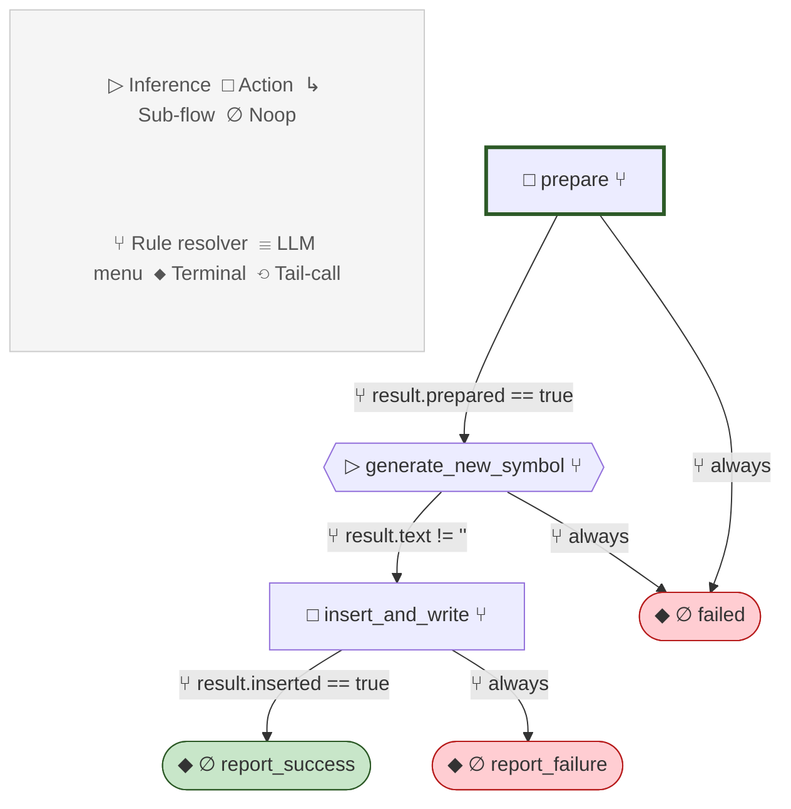
```mermaid
flowchart TD
    %% add_symbol v1

    subgraph Legend[" "]
        L1["▷ Inference  □ Action  ↳ Sub-flow  ∅ Noop"]
        L2["⑂ Rule resolver  ☰ LLM menu  ◆ Terminal  ⟲ Tail-call"]
    end
    style Legend fill:#f5f5f5,stroke:#ccc,stroke-width:1px
    style L1 fill:#f5f5f5,stroke:none,color:#555
    style L2 fill:#f5f5f5,stroke:none,color:#555

    prepare["□ prepare ⑂"]
    generate_new_symbol{{"▷ generate_new_symbol ⑂"}}
    insert_and_write["□ insert_and_write ⑂"]
    report_success(["◆ ∅ report_success"])
    report_failure(["◆ ∅ report_failure"])
    failed(["◆ ∅ failed"])

    style prepare stroke-width:3px,stroke:#2d5a27

    prepare -->|⑂ result.prepared == true| generate_new_symbol
    prepare -->|⑂ always| failed
    generate_new_symbol -->|⑂ result.text != ''| insert_and_write
    generate_new_symbol -->|⑂ always| failed
    insert_and_write -->|⑂ result.inserted == true| report_success
    insert_and_write -->|⑂ always| report_failure

    style report_success fill:#c8e6c9,stroke:#2d5a27
    style report_failure fill:#ffcdd2,stroke:#b71c1c
    style failed fill:#ffcdd2,stroke:#b71c1c
```

#### build_structure (v1)
*One-shot batch creation of all architecture files. Generates the
whole project in shared context, slices per-file, gates each file
deterministically, completes passing structural goals, and returns
a batch summary to mission_control.*

**Tier:** `flow_directive` · **Returns:** `files_changed`, `batch_manifest`, `directive_report`
**Inputs:** ○ mission_id · ○ goal_id · ○ working_directory · ○ flow_directive
**Publishes:** ● mission · ● events · ● inference_response · ● batch_manifest · ● files_changed · ● primary_code_file · ● validation_commands · ● batch_check_results · ● validation_results · ● validation_output (+1 more)
**Sub-flows:** ↳ set_env
**Tail-calls:** ⟲ mission_control
**Effects:** ⟶ inference · →𓇴 load mission · →𓇴 read events · 𓉗 file read · 𓇴→ save mission
**Stats:** 9 steps · ▷ 1 inference · 6 ⑂ rule

**Prompts:**
- **generate_all_files** ▷ (): Generate every architecture file in one completion

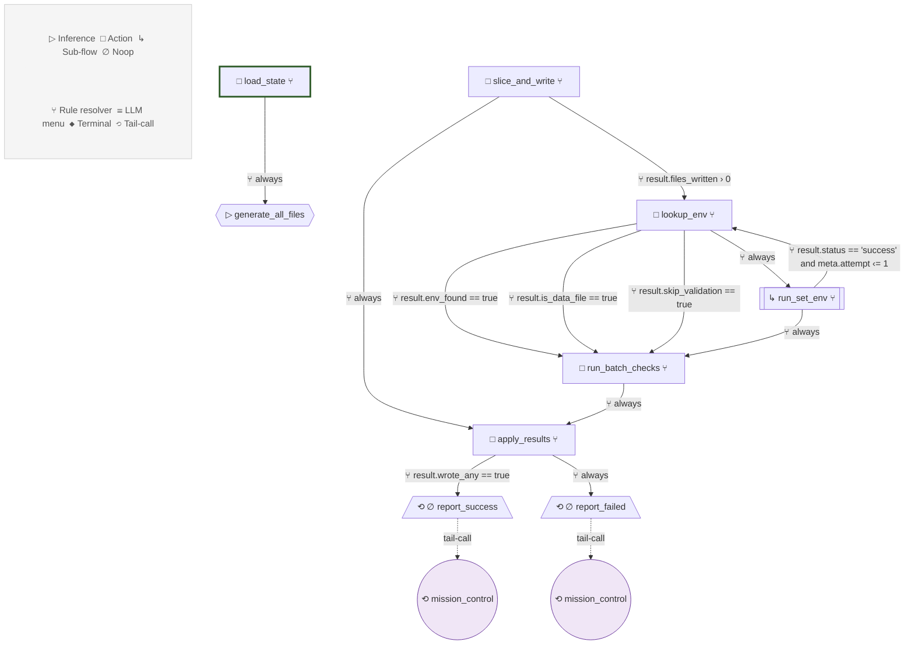
```mermaid
flowchart TD
    %% build_structure v1

    subgraph Legend[" "]
        L1["▷ Inference  □ Action  ↳ Sub-flow  ∅ Noop"]
        L2["⑂ Rule resolver  ☰ LLM menu  ◆ Terminal  ⟲ Tail-call"]
    end
    style Legend fill:#f5f5f5,stroke:#ccc,stroke-width:1px
    style L1 fill:#f5f5f5,stroke:none,color:#555
    style L2 fill:#f5f5f5,stroke:none,color:#555

    load_state["□ load_state ⑂"]
    generate_all_files{{"▷ generate_all_files"}}
    slice_and_write["□ slice_and_write ⑂"]
    lookup_env["□ lookup_env ⑂"]
    run_set_env[["↳ run_set_env ⑂"]]
    run_batch_checks["□ run_batch_checks ⑂"]
    apply_results["□ apply_results ⑂"]
    report_success[/"⟲ ∅ report_success"\]
    report_failed[/"⟲ ∅ report_failed"\]

    style load_state stroke-width:3px,stroke:#2d5a27

    load_state -->|⑂ always| generate_all_files
    slice_and_write -->|⑂ result.files_written › 0| lookup_env
    slice_and_write -->|⑂ always| apply_results
    lookup_env -->|⑂ result.env_found == true| run_batch_checks
    lookup_env -->|⑂ result.is_data_file == true| run_batch_checks
    lookup_env -->|⑂ result.skip_validation == true| run_batch_checks
    lookup_env -->|⑂ always| run_set_env
    run_set_env -->|⑂ result.status == 'success' and meta.attempt ‹= 1| lookup_env
    run_set_env -->|⑂ always| run_batch_checks
    run_batch_checks -->|⑂ always| apply_results
    apply_results -->|⑂ result.wrote_any == true| report_success
    apply_results -->|⑂ always| report_failed
    tc_report_success(("⟲ mission_control"))
    style tc_report_success fill:#f0e6f6,stroke:#663399
    report_success -.->|tail-call| tc_report_success
    tc_report_failed(("⟲ mission_control"))
    style tc_report_failed fill:#f0e6f6,stroke:#663399
    report_failed -.->|tail-call| tc_report_failed

```

#### classify (v1)
*In-graph task router: pick flow_set (ops|code_core) + capability profile
via two menu turns, persist them onto the mission, and hand off to the
chosen controller. The full-local autonomy entry (flow_set=="auto");
explicit config skips it.*

**Tier:** `mission_objective`
**Inputs:** ○ mission_id
**Terminal:** ◆ failed
**Publishes:** ● mission · ● inference_session_id · ● router_session_id · ● router_turn · ● router_corrections · ● router_choice · ● routed_flow_set · ● routed_profile · ● router_findings
**Tail-calls:** ⟲ ingest_workspace · ⟲ ops_control
**Effects:** end_inference_session · ⟶ inference · →𓇴 load mission · →𓇴 read events · 𓉗 file read · ⌘ command · 𓇴→ save mission · session_inference · start_inference_session · 𓉗 file write
**Stats:** 12 steps · ▷ 1 inference · 8 ⑂ rule

**Prompts:**
- **explore** ▷ (): Scout the workspace: run a command, read a file, or conclude

```mermaid
flowchart TD
    %% classify v1

    subgraph Legend[" "]
        L1["▷ Inference  □ Action  ↳ Sub-flow  ∅ Noop"]
        L2["⑂ Rule resolver  ☰ LLM menu  ◆ Terminal  ⟲ Tail-call"]
    end
    style Legend fill:#f5f5f5,stroke:#ccc,stroke-width:1px
    style L1 fill:#f5f5f5,stroke:none,color:#555
    style L2 fill:#f5f5f5,stroke:none,color:#555

    load_mission["□ load_mission ⑂"]
    open_router_session["□ open_router_session ⑂"]
    explore{{"▷ explore"}}
    do_run["□ do_run ⑂"]
    do_read["□ do_read ⑂"]
    check_budget(["∅ check_budget ⑂"])
    conclude_route["□ conclude_route ⑂"]
    end_router_session["□ end_router_session ⑂"]
    persist_routing["□ persist_routing ⑂"]
    handoff_code_core[/"⟲ ∅ handoff_code_core"\]
    handoff_ops[/"⟲ ∅ handoff_ops"\]
    failed(["◆ □ failed"])

    style load_mission stroke-width:3px,stroke:#2d5a27

    load_mission -->|⑂ result.mission.status == 'active'| open_router_session
    load_mission -->|⑂ always| failed
    open_router_session -->|⑂ result.session_started == true| explore
    open_router_session -->|⑂ always| persist_routing
    do_run -->|⑂ result.exhausted == true| conclude_route
    do_run -->|⑂ always| check_budget
    do_read -->|⑂ result.exhausted == true| conclude_route
    do_read -->|⑂ always| check_budget
    check_budget -->|⑂ context.router_turn ›= 5| conclude_route
    check_budget -->|⑂ always| explore
    conclude_route -->|⑂ always| end_router_session
    end_router_session -->|⑂ always| persist_routing
    persist_routing -->|⑂ result.flow_set == 'code_core'| handoff_code_core
    persist_routing -->|⑂ always| handoff_ops
    tc_handoff_code_core(("⟲ ingest_workspace"))
    style tc_handoff_code_core fill:#f0e6f6,stroke:#663399
    handoff_code_core -.->|tail-call| tc_handoff_code_core
    tc_handoff_ops(("⟲ ops_control"))
    style tc_handoff_ops fill:#f0e6f6,stroke:#663399
    handoff_ops -.->|tail-call| tc_handoff_ops

    style failed fill:#ffcdd2,stroke:#b71c1c
```

#### curate_control (v1)
*Curator pipeline controller. Bootstraps the fig-review and
curation goals from the databank, sweeps both worklists, and
completes when the deterministic curation gate passes and the
corpus dataset is built.*

**Tier:** `project_goal` · **Returns:** `final_status`
**Inputs:** ○ mission_id · ◑ last_result · ◑ last_status · ◑ last_goal_id
**Terminal:** ◆ completed · ◆ aborted
**Publishes:** ● mission · ● events · ● dispatch_config · ● gate_results
**Sub-flows:** ↳ curate_gate
**Tail-calls:** ⟲ curate_control · ⟲ curate_paper · ⟲ fig_review
**Effects:** archive_overflow · clear_events · →𓇴 load mission · →𓇴 read events · ⌘ command · 𓇴→ save mission
**Stats:** 14 steps · 9 ⑂ rule

```mermaid
flowchart TD
    %% curate_control v1

    subgraph Legend[" "]
        L1["▷ Inference  □ Action  ↳ Sub-flow  ∅ Noop"]
        L2["⑂ Rule resolver  ☰ LLM menu  ◆ Terminal  ⟲ Tail-call"]
    end
    style Legend fill:#f5f5f5,stroke:#ccc,stroke-width:1px
    style L1 fill:#f5f5f5,stroke:none,color:#555
    style L2 fill:#f5f5f5,stroke:none,color:#555

    load_state["□ load_state ⑂"]
    apply_last_result["□ apply_last_result ⑂"]
    process_events["□ process_events ⑂"]
    bootstrap_goals["□ bootstrap_goals ⑂"]
    check_phase["□ check_phase ⑂"]
    fig_review_sweep_next["□ fig_review_sweep_next ⑂"]
    dispatch_fig_review[/"⟲ ∅ dispatch_fig_review"\]
    curate_sweep_next["□ curate_sweep_next ⑂"]
    dispatch_curate[/"⟲ ∅ dispatch_curate"\]
    dispatch_curate_gate[["↳ dispatch_curate_gate ⑂"]]
    reopen_goal["□ reopen_goal ⑂"]
    completed(["◆ □ completed"])
    idle[/"⟲ □ idle"\]
    aborted(["◆ □ aborted"])

    style load_state stroke-width:3px,stroke:#2d5a27

    load_state -->|⑂ result.mission.status == 'active'| apply_last_result
    load_state -->|⑂ result.mission.status == 'paused'| idle
    load_state -->|⑂ result.mission.status == 'completed'| completed
    load_state -->|⑂ always| aborted
    apply_last_result -->|⑂ result.events_pending == true| process_events
    apply_last_result -->|⑂ always| bootstrap_goals
    process_events -->|⑂ result.abort_requested == true| aborted
    process_events -->|⑂ result.pause_requested == true| idle
    process_events -->|⑂ always| bootstrap_goals
    bootstrap_goals -->|⑂ result.goals_ready == true| check_phase
    bootstrap_goals -->|⑂ always| completed
    check_phase -->|⑂ result.phase == 'fig_review'| fig_review_sweep_next
    check_phase -->|⑂ result.phase == 'curate'| curate_sweep_next
    check_phase -->|⑂ result.phase == 'curate_gate'| dispatch_curate_gate
    check_phase -->|⑂ always| completed
    fig_review_sweep_next -->|⑂ result.needs_fig_review == true| dispatch_fig_review
    fig_review_sweep_next -->|⑂ always| check_phase
    tc_dispatch_fig_review(("⟲ fig_review"))
    style tc_dispatch_fig_review fill:#f0e6f6,stroke:#663399
    dispatch_fig_review -.->|tail-call| tc_dispatch_fig_review
    curate_sweep_next -->|⑂ result.needs_curate == true| dispatch_curate
    curate_sweep_next -->|⑂ always| check_phase
    tc_dispatch_curate(("⟲ curate_paper"))
    style tc_dispatch_curate fill:#f0e6f6,stroke:#663399
    dispatch_curate -.->|tail-call| tc_dispatch_curate
    dispatch_curate_gate -->|⑂ result.status == 'success'| completed
    dispatch_curate_gate -->|⑂ always| reopen_goal
    reopen_goal -->|⑂ always| check_phase
    tc_idle(("⟲ curate_control"))
    style tc_idle fill:#f0e6f6,stroke:#663399
    idle -.->|tail-call| tc_idle

    style completed fill:#c8e6c9,stroke:#2d5a27
    style aborted fill:#ffcdd2,stroke:#b71c1c
```

#### curate_gate (v1)
*Deterministic curation gate: every extracted paper terminal,
corpus.json built. The dataset + key registry are the next
stage's input contract; zero silent inclusions by construction.*

**Tier:** `session_task` · **Returns:** `gate_passed`
**Inputs:** ○ mission_id · ○ working_directory
**Terminal:** ◆ success · ◆ failed
**Publishes:** ● pending_curation
**Effects:** 𓉗 file read · 𓉗 file write
**Stats:** 4 steps · 2 ⑂ rule

```mermaid
flowchart TD
    %% curate_gate v1

    subgraph Legend[" "]
        L1["▷ Inference  □ Action  ↳ Sub-flow  ∅ Noop"]
        L2["⑂ Rule resolver  ☰ LLM menu  ◆ Terminal  ⟲ Tail-call"]
    end
    style Legend fill:#f5f5f5,stroke:#ccc,stroke-width:1px
    style L1 fill:#f5f5f5,stroke:none,color:#555
    style L2 fill:#f5f5f5,stroke:none,color:#555

    check["□ check ⑂"]
    build_corpus["□ build_corpus ⑂"]
    gate_pass(["◆ ∅ gate_pass"])
    gate_fail(["◆ ∅ gate_fail"])

    style check stroke-width:3px,stroke:#2d5a27

    check -->|⑂ result.gate_passed == true| build_corpus
    check -->|⑂ always| gate_fail
    build_corpus -->|⑂ result.built == true| gate_pass
    build_corpus -->|⑂ always| gate_fail

    style gate_pass fill:#c8e6c9,stroke:#2d5a27
    style gate_fail fill:#ffcdd2,stroke:#b71c1c
```

#### curate_paper (v1)
*Review one extracted paper (accept/deny as a data reference)
and, if accepted, pack its raw data into the open-key dataset
behind deterministic gates. Ingest once, snapshot, branch.*

**Tier:** `flow_directive` · **Returns:** `directive_report`
**Inputs:** ○ mission_id · ○ goal_id · ○ flow_directive · ○ paper_key · ○ working_directory
**Publishes:** ● curate_state · ● directive_report
**Tail-calls:** ⟲ curate_control
**Effects:** end_inference_session · purge_inference_snapshot · session_inference · session_snapshot · start_inference_session · 𓉗 file write
**Stats:** 5 steps · 3 ⑂ rule

```mermaid
flowchart TD
    %% curate_paper v1

    subgraph Legend[" "]
        L1["▷ Inference  □ Action  ↳ Sub-flow  ∅ Noop"]
        L2["⑂ Rule resolver  ☰ LLM menu  ◆ Terminal  ⟲ Tail-call"]
    end
    style Legend fill:#f5f5f5,stroke:#ccc,stroke-width:1px
    style L1 fill:#f5f5f5,stroke:none,color:#555
    style L2 fill:#f5f5f5,stroke:none,color:#555

    ingest_review["□ ingest_review ⑂"]
    pack_data["□ pack_data ⑂"]
    book_result["□ book_result ⑂"]
    return_success[/"⟲ ∅ return_success"\]
    return_failed[/"⟲ ∅ return_failed"\]

    style ingest_review stroke-width:3px,stroke:#2d5a27

    ingest_review -->|⑂ result.verdict == 'accepted'| pack_data
    ingest_review -->|⑂ always| book_result
    pack_data -->|⑂ always| book_result
    book_result -->|⑂ result.status == 'success'| return_success
    book_result -->|⑂ always| return_failed
    tc_return_success(("⟲ curate_control"))
    style tc_return_success fill:#f0e6f6,stroke:#663399
    return_success -.->|tail-call| tc_return_success
    tc_return_failed(("⟲ curate_control"))
    style tc_return_failed fill:#f0e6f6,stroke:#663399
    return_failed -.->|tail-call| tc_return_failed

```

#### data_patch (v1)
*Surgical path-scoped edit of a YAML data file via data_ops. Translates
the prose change_spec into structured operations (set/add/remove/move at
RFC-6901 pointers), dry-runs them, and writes the result — preserving
comments and key order. Falls back to full rewrite on any miss.*

**Tier:** `session_task` · **Returns:** `files_changed`, `edit_summary`
**Inputs:** ○ target_file_path · ○ file_content · ○ flow_directive · ◑ change_spec · ◑ target_symbol · ◑ file_context · ◑ working_directory · ◑ mission_id · ◑ goal_id
**Terminal:** ◆ success · ◆ full_rewrite_requested
**Publishes:** ● data_patched_text · ● data_ops_summary · ● files_changed · ● edit_summary
**Effects:** 𓉗 file read · ⟶ inference · 𓉗 file write
**Stats:** 4 steps · 2 ⑂ rule

```mermaid
flowchart TD
    %% data_patch v1

    subgraph Legend[" "]
        L1["▷ Inference  □ Action  ↳ Sub-flow  ∅ Noop"]
        L2["⑂ Rule resolver  ☰ LLM menu  ◆ Terminal  ⟲ Tail-call"]
    end
    style Legend fill:#f5f5f5,stroke:#ccc,stroke-width:1px
    style L1 fill:#f5f5f5,stroke:none,color:#555
    style L2 fill:#f5f5f5,stroke:none,color:#555

    translate_ops["□ translate_ops ⑂"]
    apply_ops["□ apply_ops ⑂"]
    finalize(["◆ ∅ finalize"])
    request_rewrite(["◆ ∅ request_rewrite"])

    style translate_ops stroke-width:3px,stroke:#2d5a27

    translate_ops -->|⑂ result.ops_ready == true| apply_ops
    translate_ops -->|⑂ always| request_rewrite
    apply_ops -->|⑂ result.status == 'success'| finalize
    apply_ops -->|⑂ always| request_rewrite

    style finalize fill:#c8e6c9,stroke:#2d5a27
```

#### deep_search (v1)
*Bounded reflect-and-refine web-research loop: name the missing fact,
search it, condense the hits into the session, repeat, then synthesize a
grounded summary. The shared deep-search primitive.*

**Tier:** `session_task` · **Returns:** `research_summary`, `sufficient`, `queries_run`
**Inputs:** ○ brief · ◑ mission_id · ◑ working_directory
**Terminal:** ◆ success · ◆ deferred
**Publishes:** ● inference_session_id · ● search_session_id · ● search_round · ● search_corrections · ● search_queries_run · ● research_summary · ● search_sufficient · ● search_choice · ● raw_search_results · ● last_query (+1 more)
**Effects:** end_inference_session · ⟶ inference · →𓇴 load mission · mcp_call_tool · mcp_connect · session_inference · start_inference_session
**Stats:** 9 steps · ▷ 1 inference · 6 ⑂ rule

**Prompts:**
- **reflect** ▷ (): Name the missing fact → search it, or conclude done

```mermaid
flowchart TD
    %% deep_search v1

    subgraph Legend[" "]
        L1["▷ Inference  □ Action  ↳ Sub-flow  ∅ Noop"]
        L2["⑂ Rule resolver  ☰ LLM menu  ◆ Terminal  ⟲ Tail-call"]
    end
    style Legend fill:#f5f5f5,stroke:#ccc,stroke-width:1px
    style L1 fill:#f5f5f5,stroke:none,color:#555
    style L2 fill:#f5f5f5,stroke:none,color:#555

    start_session["□ start_session ⑂"]
    reflect{{"▷ reflect"}}
    do_search["□ do_search ⑂"]
    condense["□ condense ⑂"]
    check_budget(["∅ check_budget ⑂"])
    synthesize["□ synthesize ⑂"]
    end_session["□ end_session ⑂"]
    done(["◆ ∅ done"])
    unavailable(["◆ ∅ unavailable"])

    style start_session stroke-width:3px,stroke:#2d5a27

    start_session -->|⑂ result.session_started == true| reflect
    start_session -->|⑂ always| unavailable
    do_search -->|⑂ result.has_hits == true| condense
    do_search -->|⑂ result.exhausted == true| synthesize
    do_search -->|⑂ always| check_budget
    condense -->|⑂ always| check_budget
    check_budget -->|⑂ context.search_round ›= 4| synthesize
    check_budget -->|⑂ always| reflect
    synthesize -->|⑂ always| end_session
    end_session -->|⑂ always| done

    style done fill:#c8e6c9,stroke:#2d5a27
```

#### discover (v1)
*Scholarly discovery round: refine queries for one aspect, search
S2 + OpenAlex, merge candidates into the workspace databank
(DOI-keyed dedup), and return a directive report.*

**Tier:** `flow_directive` · **Returns:** `directive_report`
**Inputs:** ○ mission_id · ○ goal_id · ○ flow_directive · ○ aspect_name · ○ working_directory · ◑ aspect_description · ◑ seed_queries · ◑ coverage_target · ◑ have_count
**Publishes:** ● inference_response · ● search_queries · ● raw_candidates · ● discovery_stats · ● directive_report
**Tail-calls:** ⟲ research_control
**Effects:** ⟶ inference
**Stats:** 5 steps · ▷ 1 inference · 4 ⑂ rule

**Prompts:**
- **refine_queries** ▷ (t*0.5): Refine scholarly queries for the aspect
  Injects: {← input.aspect_name}, {← input.aspect_description}, {← input.seed_queries}, {← input.coverage_target}, {← input.have_count}

```mermaid
flowchart TD
    %% discover v1

    subgraph Legend[" "]
        L1["▷ Inference  □ Action  ↳ Sub-flow  ∅ Noop"]
        L2["⑂ Rule resolver  ☰ LLM menu  ◆ Terminal  ⟲ Tail-call"]
    end
    style Legend fill:#f5f5f5,stroke:#ccc,stroke-width:1px
    style L1 fill:#f5f5f5,stroke:none,color:#555
    style L2 fill:#f5f5f5,stroke:none,color:#555

    refine_queries{{"▷ refine_queries ⑂"}}
    extract_queries["□ extract_queries ⑂"]
    search["□ search ⑂"]
    merge["□ merge ⑂"]
    return_success[/"⟲ ∅ return_success"\]

    style refine_queries stroke-width:3px,stroke:#2d5a27

    refine_queries -->|⑂ result.tokens_generated › 0| extract_queries
    refine_queries -->|⑂ always| search
    extract_queries -->|⑂ always| search
    search -->|⑂ always| merge
    merge -->|⑂ always| return_success
    tc_return_success(("⟲ research_control"))
    style tc_return_success fill:#f0e6f6,stroke:#663399
    return_success -.->|tail-call| tc_return_success

```

#### escalate (v1)
*Bounded recovery loop for a failed deterministic step: read/run/write
with a small budget, then conclude resolved (invoker re-validates) or
deferred (invoker's failure path). The shared escalation primitive.*

**Tier:** `session_task` · **Returns:** `escalation_summary`, `files_changed`
**Inputs:** ○ failure_evidence · ○ expected_outcome · ◑ mission_id · ◑ working_directory · ◑ target_file_path · ◑ invoking_flow
**Terminal:** ◆ resolved · ◆ deferred
**Publishes:** ● inference_session_id · ● escalation_session_id · ● escalation_turn · ● escalation_corrections · ● escalation_files · ● escalation_choice · ● research_summary · ● escalation_summary · ● files_changed
**Sub-flows:** ↳ deep_search
**Effects:** end_inference_session · ⟶ inference · →𓇴 load mission · 𓉗 file read · ⌘ command · session_inference · start_inference_session
**Stats:** 14 steps · ▷ 1 inference · 10 ⑂ rule

**Prompts:**
- **work** ▷ (): Pick one action: read a file, run a command, write a fix, or conclude

```mermaid
flowchart TD
    %% escalate v1

    subgraph Legend[" "]
        L1["▷ Inference  □ Action  ↳ Sub-flow  ∅ Noop"]
        L2["⑂ Rule resolver  ☰ LLM menu  ◆ Terminal  ⟲ Tail-call"]
    end
    style Legend fill:#f5f5f5,stroke:#ccc,stroke-width:1px
    style L1 fill:#f5f5f5,stroke:none,color:#555
    style L2 fill:#f5f5f5,stroke:none,color:#555

    start_session["□ start_session ⑂"]
    work{{"▷ work"}}
    do_read["□ do_read ⑂"]
    do_run["□ do_run ⑂"]
    do_write["□ do_write ⑂"]
    do_web_search[["↳ do_web_search ⑂"]]
    fold_search["□ fold_search ⑂"]
    check_budget(["∅ check_budget ⑂"])
    conclude["□ conclude ⑂"]
    end_session_resolved["□ end_session_resolved ⑂"]
    end_session_deferred["□ end_session_deferred ⑂"]
    resolved(["◆ ∅ resolved"])
    deferred(["◆ ∅ deferred"])
    deferred_no_session(["◆ ∅ deferred_no_session"])

    style start_session stroke-width:3px,stroke:#2d5a27

    start_session -->|⑂ result.session_started == true| work
    start_session -->|⑂ always| deferred_no_session
    do_read -->|⑂ result.exhausted == true| conclude
    do_read -->|⑂ always| check_budget
    do_run -->|⑂ result.exhausted == true| conclude
    do_run -->|⑂ always| check_budget
    do_write -->|⑂ result.exhausted == true| conclude
    do_write -->|⑂ always| check_budget
    do_web_search -->|⑂ always| fold_search
    fold_search -->|⑂ result.exhausted == true| conclude
    fold_search -->|⑂ always| check_budget
    check_budget -->|⑂ context.escalation_turn ›= 6| conclude
    check_budget -->|⑂ always| work
    conclude -->|⑂ result.outcome == 'resolved'| end_session_resolved
    conclude -->|⑂ always| end_session_deferred
    end_session_resolved -->|⑂ always| resolved
    end_session_deferred -->|⑂ always| deferred

```

#### extract_control (v1)
*Extractor pipeline controller. Bootstraps the corpus extraction
goal from the databank, sweeps pending OA PDFs through the
Paddle-MLX toolchain in batches, and completes when the
deterministic extraction gate passes.*

**Tier:** `project_goal` · **Returns:** `final_status`
**Inputs:** ○ mission_id · ◑ last_result · ◑ last_status · ◑ last_goal_id
**Terminal:** ◆ completed · ◆ aborted
**Publishes:** ● mission · ● events · ● dispatch_config · ● gate_results
**Sub-flows:** ↳ extract_gate
**Tail-calls:** ⟲ extract_control · ⟲ extract_pdfs
**Effects:** archive_overflow · clear_events · →𓇴 load mission · →𓇴 read events · ⌘ command · 𓇴→ save mission
**Stats:** 12 steps · 8 ⑂ rule

```mermaid
flowchart TD
    %% extract_control v1

    subgraph Legend[" "]
        L1["▷ Inference  □ Action  ↳ Sub-flow  ∅ Noop"]
        L2["⑂ Rule resolver  ☰ LLM menu  ◆ Terminal  ⟲ Tail-call"]
    end
    style Legend fill:#f5f5f5,stroke:#ccc,stroke-width:1px
    style L1 fill:#f5f5f5,stroke:none,color:#555
    style L2 fill:#f5f5f5,stroke:none,color:#555

    load_state["□ load_state ⑂"]
    apply_last_result["□ apply_last_result ⑂"]
    process_events["□ process_events ⑂"]
    bootstrap_goals["□ bootstrap_goals ⑂"]
    check_phase["□ check_phase ⑂"]
    pdf_extract_sweep_next["□ pdf_extract_sweep_next ⑂"]
    dispatch_extract[/"⟲ ∅ dispatch_extract"\]
    dispatch_extract_gate[["↳ dispatch_extract_gate ⑂"]]
    reopen_goal["□ reopen_goal ⑂"]
    completed(["◆ □ completed"])
    idle[/"⟲ □ idle"\]
    aborted(["◆ □ aborted"])

    style load_state stroke-width:3px,stroke:#2d5a27

    load_state -->|⑂ result.mission.status == 'active'| apply_last_result
    load_state -->|⑂ result.mission.status == 'paused'| idle
    load_state -->|⑂ result.mission.status == 'completed'| completed
    load_state -->|⑂ always| aborted
    apply_last_result -->|⑂ result.events_pending == true| process_events
    apply_last_result -->|⑂ always| bootstrap_goals
    process_events -->|⑂ result.abort_requested == true| aborted
    process_events -->|⑂ result.pause_requested == true| idle
    process_events -->|⑂ always| bootstrap_goals
    bootstrap_goals -->|⑂ result.goals_ready == true| check_phase
    bootstrap_goals -->|⑂ always| completed
    check_phase -->|⑂ result.phase == 'pdf_extract'| pdf_extract_sweep_next
    check_phase -->|⑂ result.phase == 'extract_gate'| dispatch_extract_gate
    check_phase -->|⑂ always| completed
    pdf_extract_sweep_next -->|⑂ result.needs_extract == true| dispatch_extract
    pdf_extract_sweep_next -->|⑂ always| check_phase
    tc_dispatch_extract(("⟲ extract_pdfs"))
    style tc_dispatch_extract fill:#f0e6f6,stroke:#663399
    dispatch_extract -.->|tail-call| tc_dispatch_extract
    dispatch_extract_gate -->|⑂ result.status == 'success'| completed
    dispatch_extract_gate -->|⑂ always| reopen_goal
    reopen_goal -->|⑂ always| check_phase
    tc_idle(("⟲ extract_control"))
    style tc_idle fill:#f0e6f6,stroke:#663399
    idle -.->|tail-call| tc_idle

    style completed fill:#c8e6c9,stroke:#2d5a27
    style aborted fill:#ffcdd2,stroke:#b71c1c
```

#### extract_gate (v1)
*Deterministic extraction gate: every OA PDF terminal. The
per-record extraction_quality distribution is the stage's
scorecard and the dataset stage's input contract.*

**Tier:** `session_task` · **Returns:** `gate_passed`
**Inputs:** ○ mission_id · ○ working_directory
**Terminal:** ◆ success · ◆ failed
**Publishes:** ● pending_extractions
**Stats:** 3 steps · 1 ⑂ rule

```mermaid
flowchart TD
    %% extract_gate v1

    subgraph Legend[" "]
        L1["▷ Inference  □ Action  ↳ Sub-flow  ∅ Noop"]
        L2["⑂ Rule resolver  ☰ LLM menu  ◆ Terminal  ⟲ Tail-call"]
    end
    style Legend fill:#f5f5f5,stroke:#ccc,stroke-width:1px
    style L1 fill:#f5f5f5,stroke:none,color:#555
    style L2 fill:#f5f5f5,stroke:none,color:#555

    check["□ check ⑂"]
    gate_pass(["◆ ∅ gate_pass"])
    gate_fail(["◆ ∅ gate_fail"])

    style check stroke-width:3px,stroke:#2d5a27

    check -->|⑂ result.gate_passed == true| gate_pass
    check -->|⑂ always| gate_fail

    style gate_pass fill:#c8e6c9,stroke:#2d5a27
    style gate_fail fill:#ffcdd2,stroke:#b71c1c
```

#### extract_pdfs (v1)
*Extract markdown + figures from a batch of OA PDFs via the
Paddle-MLX toolchain; verify against the publisher text layer;
update databank records by quality policy.*

**Tier:** `flow_directive` · **Returns:** `directive_report`
**Inputs:** ○ mission_id · ○ goal_id · ○ flow_directive · ○ paper_keys · ○ working_directory
**Publishes:** ● directive_report
**Tail-calls:** ⟲ extract_control
**Effects:** ⌘ command
**Stats:** 3 steps · 1 ⑂ rule

```mermaid
flowchart TD
    %% extract_pdfs v1

    subgraph Legend[" "]
        L1["▷ Inference  □ Action  ↳ Sub-flow  ∅ Noop"]
        L2["⑂ Rule resolver  ☰ LLM menu  ◆ Terminal  ⟲ Tail-call"]
    end
    style Legend fill:#f5f5f5,stroke:#ccc,stroke-width:1px
    style L1 fill:#f5f5f5,stroke:none,color:#555
    style L2 fill:#f5f5f5,stroke:none,color:#555

    extract["□ extract ⑂"]
    return_success[/"⟲ ∅ return_success"\]
    return_failed[/"⟲ ∅ return_failed"\]

    style extract stroke-width:3px,stroke:#2d5a27

    extract -->|⑂ result.status == 'failed'| return_failed
    extract -->|⑂ always| return_success
    tc_return_success(("⟲ extract_control"))
    style tc_return_success fill:#f0e6f6,stroke:#663399
    return_success -.->|tail-call| tc_return_success
    tc_return_failed(("⟲ extract_control"))
    style tc_return_failed fill:#f0e6f6,stroke:#663399
    return_failed -.->|tail-call| tc_return_failed

```

#### fig_review (v1)
*VLM figure readings (figtext) for a batch of extracted papers
via the fig_review sidecar; book results into the databank.*

**Tier:** `flow_directive` · **Returns:** `directive_report`
**Inputs:** ○ mission_id · ○ goal_id · ○ flow_directive · ○ paper_keys · ○ working_directory
**Publishes:** ● directive_report
**Tail-calls:** ⟲ curate_control
**Effects:** ⌘ command
**Stats:** 3 steps · 1 ⑂ rule

```mermaid
flowchart TD
    %% fig_review v1

    subgraph Legend[" "]
        L1["▷ Inference  □ Action  ↳ Sub-flow  ∅ Noop"]
        L2["⑂ Rule resolver  ☰ LLM menu  ◆ Terminal  ⟲ Tail-call"]
    end
    style Legend fill:#f5f5f5,stroke:#ccc,stroke-width:1px
    style L1 fill:#f5f5f5,stroke:none,color:#555
    style L2 fill:#f5f5f5,stroke:none,color:#555

    review_figs["□ review_figs ⑂"]
    return_success[/"⟲ ∅ return_success"\]
    return_failed[/"⟲ ∅ return_failed"\]

    style review_figs stroke-width:3px,stroke:#2d5a27

    review_figs -->|⑂ result.status == 'failed'| return_failed
    review_figs -->|⑂ always| return_success
    tc_return_success(("⟲ curate_control"))
    style tc_return_success fill:#f0e6f6,stroke:#663399
    return_success -.->|tail-call| tc_return_success
    tc_return_failed(("⟲ curate_control"))
    style tc_return_failed fill:#f0e6f6,stroke:#663399
    return_failed -.->|tail-call| tc_return_failed

```

#### ingest_workspace (v1)
*Adopt an existing (non-Ouroboros) workspace: scan the code, build a
dependency map, extract the existing architecture into
mission.architecture, then hand off to mission_control so the
pending directive can be repaired against the real files. No
greenfield design, no build-everything goal derivation.*

**Tier:** `mission_objective` · **Returns:** `architecture_ingested`
**Peers:** `file_ops`, `project_ops`, `interact`
**Inputs:** ○ mission_id
**Terminal:** ◆ failed
**Publishes:** ● mission · ● project_manifest · ● repo_map_formatted · ● inference_response · ● architecture · ● research_summary
**Sub-flows:** ↳ research
**Tail-calls:** ⟲ mission_control
**Effects:** ⟶ inference · 𓉗 list dir · →𓇴 load mission · push_note · →𓇴 read events · 𓉗 file read · 𓇴→ save mission
**Stats:** 9 steps · ▷ 1 inference · 7 ⑂ rule

**Prompts:**
- **extract_architecture** ▷ (t*0.2): inference step
  Injects: {← context.mission_objective}, {← context.repo_map_formatted}, {← context.project_file_list}

```mermaid
flowchart TD
    %% ingest_workspace v1

    subgraph Legend[" "]
        L1["▷ Inference  □ Action  ↳ Sub-flow  ∅ Noop"]
        L2["⑂ Rule resolver  ☰ LLM menu  ◆ Terminal  ⟲ Tail-call"]
    end
    style Legend fill:#f5f5f5,stroke:#ccc,stroke-width:1px
    style L1 fill:#f5f5f5,stroke:none,color:#555
    style L2 fill:#f5f5f5,stroke:none,color:#555

    load_mission["□ load_mission ⑂"]
    scan_workspace["□ scan_workspace ⑂"]
    build_repomap["□ build_repomap ⑂"]
    extract_architecture{{"▷ extract_architecture ⑂"}}
    parse_architecture["□ parse_architecture ⑂"]
    domain_research[["↳ domain_research ⑂"]]
    save_research["□ save_research ⑂"]
    handoff[/"⟲ ∅ handoff"\]
    failed(["◆ □ failed"])

    style load_mission stroke-width:3px,stroke:#2d5a27

    load_mission -->|⑂ result.mission.status == 'active'| scan_workspace
    load_mission -->|⑂ always| failed
    scan_workspace -->|⑂ always| build_repomap
    build_repomap -->|⑂ always| extract_architecture
    extract_architecture -->|⑂ result.tokens_generated › 0| parse_architecture
    extract_architecture -->|⑂ always| handoff
    parse_architecture -->|⑂ result.architecture_parsed == true and context.mission.config.web_research == true| domain_research
    parse_architecture -->|⑂ always| handoff
    domain_research -->|⑂ result.status == 'success'| save_research
    domain_research -->|⑂ always| handoff
    save_research -->|⑂ always| handoff
    tc_handoff(("⟲ mission_control"))
    style tc_handoff fill:#f0e6f6,stroke:#663399
    handoff -.->|tail-call| tc_handoff

    style failed fill:#ffcdd2,stroke:#b71c1c
```

#### ops_control (v1)
*Ops pipeline controller. Derives one task goal from the objective,
then drives run_session work cycles (which derive the grounded
definition-of-done) and judges completion against the done-checks
until the task is complete.*

**Tier:** `project_goal` · **Returns:** `final_status`
**Inputs:** ○ mission_id · ◑ last_result · ◑ last_status · ◑ last_goal_id
**Terminal:** ◆ completed · ◆ aborted
**Publishes:** ● mission · ● events
**Tail-calls:** ⟲ ops_control · ⟲ ops_task
**Effects:** archive_overflow · clear_events · →𓇴 load mission · →𓇴 read events · ⌘ command · 𓇴→ save mission
**Stats:** 9 steps · 5 ⑂ rule

```mermaid
flowchart TD
    %% ops_control v1

    subgraph Legend[" "]
        L1["▷ Inference  □ Action  ↳ Sub-flow  ∅ Noop"]
        L2["⑂ Rule resolver  ☰ LLM menu  ◆ Terminal  ⟲ Tail-call"]
    end
    style Legend fill:#f5f5f5,stroke:#ccc,stroke-width:1px
    style L1 fill:#f5f5f5,stroke:none,color:#555
    style L2 fill:#f5f5f5,stroke:none,color:#555

    load_state["□ load_state ⑂"]
    apply_last_result["□ apply_last_result ⑂"]
    process_events["□ process_events ⑂"]
    bootstrap_goals["□ bootstrap_goals ⑂"]
    check_phase["□ check_phase ⑂"]
    dispatch_task[/"⟲ ∅ dispatch_task"\]
    completed(["◆ □ completed"])
    idle[/"⟲ □ idle"\]
    aborted(["◆ □ aborted"])

    style load_state stroke-width:3px,stroke:#2d5a27

    load_state -->|⑂ result.mission.status == 'active'| apply_last_result
    load_state -->|⑂ result.mission.status == 'paused'| idle
    load_state -->|⑂ result.mission.status == 'completed'| completed
    load_state -->|⑂ always| aborted
    apply_last_result -->|⑂ result.events_pending == true| process_events
    apply_last_result -->|⑂ always| bootstrap_goals
    process_events -->|⑂ result.abort_requested == true| aborted
    process_events -->|⑂ result.pause_requested == true| idle
    process_events -->|⑂ always| bootstrap_goals
    bootstrap_goals -->|⑂ result.goals_ready == true| check_phase
    bootstrap_goals -->|⑂ always| completed
    check_phase -->|⑂ result.phase == 'task_exec'| dispatch_task
    check_phase -->|⑂ result.phase == 'complete'| completed
    check_phase -->|⑂ always| completed
    tc_dispatch_task(("⟲ ops_task"))
    style tc_dispatch_task fill:#f0e6f6,stroke:#663399
    dispatch_task -.->|tail-call| tc_dispatch_task
    tc_idle(("⟲ ops_control"))
    style tc_idle fill:#f0e6f6,stroke:#663399
    idle -.->|tail-call| tc_idle

    style completed fill:#c8e6c9,stroke:#2d5a27
    style aborted fill:#ffcdd2,stroke:#b71c1c
```

#### ops_task (v1)
*One ops work cycle: accomplish-charter → run_session → completion
checks → judge → complete or loop-with-feedback.*

**Tier:** `project_goal` · **Returns:** `task_done`
**Inputs:** ○ mission_id · ○ working_directory
**Publishes:** ● mission · ● project_manifest · ● search_queries · ● raw_search_results · ● inference_response · ● terminal_output · ● inference_session_id · ● validation_results · ● sanity_artifact_excerpt · ● vbh_transcript (+1 more)
**Sub-flows:** ↳ run_session
**Tail-calls:** ⟲ ops_control
**Effects:** end_inference_session · file_exists · ⟶ inference · 𓉗 list dir · →𓇴 load mission · mcp_call_tool · mcp_connect · →𓇴 read events · 𓉗 file read · ⌘ command · 𓇴→ save mission · 𓉗 file write
**Stats:** 31 steps · ▷ 8 inference · 29 ⑂ rule

**Prompts:**
- **plan_provision** ▷ (t*0.2): Plan setup/install commands the task's environment needs
  Injects: {← context.task_spec}, {← context.workspace_ledger}, {← context.feedback_block}
- **plan_charter** ▷ (t*0.4): Write an accomplish-charter for the terminal session
  Injects: {← context.task_spec}, {← context.workspace_context}, {← context.search_findings_block}, {← context.workspace_ledger}, {← context.feedback_block} (+1 more)
- **reground_criteria** ▷ (t*0.1): Derive the definition-of-done grounded in the explored workspace
  Injects: {← context.task_spec}, {← context.working_directory}, {← context.workspace_context}, {← context.session_tail}
- **reground_output_format** ▷ (t*0.1): Re-derive the output-format spec grounded in the scanned workspace
  Injects: {← context.task_spec}, {← context.working_directory}, {← context.workspace_context}, {← context.session_tail}
- **sanity_plausibility** ▷ (t*0.1): Judge whether the produced answer is plausible (type/magnitude)
  Injects: {← context.task_spec}, {← context.sanity_artifact_excerpt}
- **probe_generate** ▷ (t*0.2): Generate a property-based differential test for the candidate
  Injects: {← context.task_spec}
- **judge_step** ▷ (t*0.1): Judge whether the task is complete
  Injects: {← context.task_spec}, {← context.validation_summary}, {← context.session_tail}
- **verify_completion** ▷ (t*0.1): Confirm genuine completion from the fresh re-probe
  Injects: {← context.task_spec}, {← context.vbh_transcript}

```mermaid
flowchart TD
    %% ops_task v1

    subgraph Legend[" "]
        L1["▷ Inference  □ Action  ↳ Sub-flow  ∅ Noop"]
        L2["⑂ Rule resolver  ☰ LLM menu  ◆ Terminal  ⟲ Tail-call"]
    end
    style Legend fill:#f5f5f5,stroke:#ccc,stroke-width:1px
    style L1 fill:#f5f5f5,stroke:none,color:#555
    style L2 fill:#f5f5f5,stroke:none,color:#555

    load_state["□ load_state ⑂"]
    gather_context["□ gather_context ⑂"]
    exa_probe_gate["□ exa_probe_gate ⑂"]
    exa_search["□ exa_search ⑂"]
    store_search_findings["□ store_search_findings ⑂"]
    plan_provision{{"▷ plan_provision ⑂"}}
    run_provision["□ run_provision ⑂"]
    plan_charter{{"▷ plan_charter ⑂"}}
    run_terminal[["↳ run_terminal ⑂"]]
    gate_reground_criteria["□ gate_reground_criteria ⑂"]
    reground_criteria{{"▷ reground_criteria ⑂"}}
    store_reground_criteria["□ store_reground_criteria ⑂"]
    run_checks["□ run_checks ⑂"]
    gate_reground["□ gate_reground ⑂"]
    reground_output_format{{"▷ reground_output_format ⑂"}}
    store_reground_format["□ store_reground_format ⑂"]
    artifact_oracle["□ artifact_oracle ⑂"]
    sanity_plausibility{{"▷ sanity_plausibility ⑂"}}
    record_sanity["□ record_sanity ⑂"]
    probe_gate["□ probe_gate ⑂"]
    probe_generate{{"▷ probe_generate ⑂"}}
    probe_run["□ probe_run ⑂"]
    judge_step{{"▷ judge_step ⑂"}}
    reprobe_completion["□ reprobe_completion ⑂"]
    verify_completion{{"▷ verify_completion ⑂"}}
    record_completion_verify["□ record_completion_verify ⑂"]
    decide["□ decide ⑂"]
    end_session_success["□ end_session_success ⑂"]
    end_session_loop["□ end_session_loop ⑂"]
    return_success[/"⟲ ∅ return_success"\]
    return_loop[/"⟲ ∅ return_loop"\]

    style load_state stroke-width:3px,stroke:#2d5a27

    load_state -->|⑂ result.mission.status == 'active'| gather_context
    load_state -->|⑂ always| return_loop
    gather_context -->|⑂ always| exa_probe_gate
    exa_probe_gate -->|⑂ result.should_search == true| exa_search
    exa_probe_gate -->|⑂ always| plan_provision
    exa_search -->|⑂ always| store_search_findings
    store_search_findings -->|⑂ always| plan_provision
    plan_provision -->|⑂ result.tokens_generated › 0| run_provision
    plan_provision -->|⑂ always| plan_charter
    run_provision -->|⑂ always| plan_charter
    plan_charter -->|⑂ result.tokens_generated › 0| run_terminal
    plan_charter -->|⑂ always| return_loop
    run_terminal -->|⑂ always| gate_reground_criteria
    gate_reground_criteria -->|⑂ result.needs_reground == true| reground_criteria
    gate_reground_criteria -->|⑂ always| run_checks
    reground_criteria -->|⑂ result.tokens_generated › 0| store_reground_criteria
    reground_criteria -->|⑂ always| run_checks
    store_reground_criteria -->|⑂ always| run_checks
    run_checks -->|⑂ always| gate_reground
    gate_reground -->|⑂ result.needs_reground == true| reground_output_format
    gate_reground -->|⑂ always| artifact_oracle
    reground_output_format -->|⑂ result.tokens_generated › 0| store_reground_format
    reground_output_format -->|⑂ always| artifact_oracle
    store_reground_format -->|⑂ always| artifact_oracle
    artifact_oracle -->|⑂ result.check_plausibility == true| sanity_plausibility
    artifact_oracle -->|⑂ always| probe_gate
    sanity_plausibility -->|⑂ always| record_sanity
    record_sanity -->|⑂ always| probe_gate
    probe_gate -->|⑂ result.run_probe == true| probe_generate
    probe_gate -->|⑂ always| judge_step
    probe_generate -->|⑂ result.tokens_generated › 0| probe_run
    probe_generate -->|⑂ always| judge_step
    probe_run -->|⑂ always| judge_step
    judge_step -->|⑂ always| reprobe_completion
    reprobe_completion -->|⑂ result.do_verify == true| verify_completion
    reprobe_completion -->|⑂ always| decide
    verify_completion -->|⑂ always| record_completion_verify
    record_completion_verify -->|⑂ always| decide
    decide -->|⑂ result.task_done == true| end_session_success
    decide -->|⑂ always| end_session_loop
    end_session_success -->|⑂ always| return_success
    end_session_loop -->|⑂ always| return_loop
    tc_return_success(("⟲ ops_control"))
    style tc_return_success fill:#f0e6f6,stroke:#663399
    return_success -.->|tail-call| tc_return_success
    tc_return_loop(("⟲ ops_control"))
    style tc_return_loop fill:#f0e6f6,stroke:#663399
    return_loop -.->|tail-call| tc_return_loop

```

#### patch_module (v1)
*Module-frame editor: the model edits a file's non-symbol frame
(imports, docstring, top-level, __main__) while function/class
bodies are preserved and spliced back deterministically. Fired for
import-class fixes the symbol patch can't express. Any splice
mismatch → full_rewrite_requested (file_ops falls back to rewrite).*

**Tier:** `session_task` · **Returns:** `files_changed`, `edit_summary`
**Inputs:** ○ target_file_path · ○ file_content · ○ flow_directive · ◑ module_directive · ◑ change_spec · ◑ root_cause · ◑ working_directory
**Terminal:** ◆ success · ◆ full_rewrite_requested · ◆ failed
**Publishes:** ● frame_text · ● preserved_bodies · ● model_frame · ● files_changed · ● edit_summary · ● file_content_updated
**Effects:** ⟶ inference · 𓉗 file write
**Stats:** 6 steps · 3 ⑂ rule

```mermaid
flowchart TD
    %% patch_module v1

    subgraph Legend[" "]
        L1["▷ Inference  □ Action  ↳ Sub-flow  ∅ Noop"]
        L2["⑂ Rule resolver  ☰ LLM menu  ◆ Terminal  ⟲ Tail-call"]
    end
    style Legend fill:#f5f5f5,stroke:#ccc,stroke-width:1px
    style L1 fill:#f5f5f5,stroke:none,color:#555
    style L2 fill:#f5f5f5,stroke:none,color:#555

    prepare_frame["□ prepare_frame ⑂"]
    rewrite_frame["□ rewrite_frame ⑂"]
    splice["□ splice ⑂"]
    report_success(["◆ ∅ report_success"])
    request_rewrite(["◆ ∅ request_rewrite"])
    report_failure(["◆ ∅ report_failure"])

    style prepare_frame stroke-width:3px,stroke:#2d5a27

    prepare_frame -->|⑂ result.frame_ready == true| rewrite_frame
    prepare_frame -->|⑂ always| request_rewrite
    rewrite_frame -->|⑂ result.frame_edited == true| splice
    rewrite_frame -->|⑂ always| request_rewrite
    splice -->|⑂ result.status == 'success'| report_success
    splice -->|⑂ result.status == 'full_rewrite_requested'| request_rewrite
    splice -->|⑂ always| report_failure

    style report_success fill:#c8e6c9,stroke:#2d5a27
    style report_failure fill:#ffcdd2,stroke:#b71c1c
```

#### plan_research (v1)
*Decompose the mission's research abstract into aspects with seed
queries and coverage targets (mission.research_plan), then derive
per-aspect discovery goals plus one corpus catalog goal.*

**Tier:** `mission_objective` · **Returns:** `plan_parsed`
**Inputs:** ○ mission_id
**Terminal:** ◆ failed
**Publishes:** ● mission · ● events · ● inference_response
**Tail-calls:** ⟲ research_control
**Effects:** ⟶ inference · →𓇴 load mission · →𓇴 read events · 𓇴→ save mission
**Stats:** 6 steps · ▷ 1 inference · 4 ⑂ rule

**Prompts:**
- **design_plan** ▷ (t*0.4): Decompose the abstract into research aspects
  Injects: {← context.mission_objective}

```mermaid
flowchart TD
    %% plan_research v1

    subgraph Legend[" "]
        L1["▷ Inference  □ Action  ↳ Sub-flow  ∅ Noop"]
        L2["⑂ Rule resolver  ☰ LLM menu  ◆ Terminal  ⟲ Tail-call"]
    end
    style Legend fill:#f5f5f5,stroke:#ccc,stroke-width:1px
    style L1 fill:#f5f5f5,stroke:none,color:#555
    style L2 fill:#f5f5f5,stroke:none,color:#555

    load_mission["□ load_mission ⑂"]
    design_plan{{"▷ design_plan ⑂"}}
    parse_plan["□ parse_plan ⑂"]
    derive_goals["□ derive_goals ⑂"]
    complete[/"⟲ ∅ complete"\]
    failed(["◆ □ failed"])

    style load_mission stroke-width:3px,stroke:#2d5a27

    load_mission -->|⑂ result.mission.status == 'active'| design_plan
    load_mission -->|⑂ always| failed
    design_plan -->|⑂ result.tokens_generated › 0| parse_plan
    design_plan -->|⑂ always| failed
    parse_plan -->|⑂ result.plan_parsed == true| derive_goals
    parse_plan -->|⑂ always| failed
    derive_goals -->|⑂ always| complete
    tc_complete(("⟲ research_control"))
    style tc_complete fill:#f0e6f6,stroke:#663399
    complete -.->|tail-call| tc_complete

    style failed fill:#ffcdd2,stroke:#b71c1c
```

#### replan (v1)
*Decompose a pending directive into additions to the existing codebase.
Append-only goal derivation against the current architecture — new files
become structural goals, everything else becomes functional capability
goals to build. No greenfield re-design.*

**Tier:** `mission_objective` · **Returns:** `goals_derived`
**Peers:** `file_ops`, `project_ops`, `interact`
**Inputs:** ○ mission_id
**Terminal:** ◆ failed
**Publishes:** ● mission · ● project_manifest · ● repo_map_formatted · ● repo_file_index · ● inference_response
**Tail-calls:** ⟲ mission_control
**Effects:** ⟶ inference · 𓉗 list dir · →𓇴 load mission · →𓇴 read events · 𓉗 file read · 𓇴→ save mission
**Stats:** 9 steps · ▷ 2 inference · 7 ⑂ rule

**Prompts:**
- **decompose_directive** ▷ (t*0.2): Decompose the pending directive into goals against the existing codebase
  Injects: {← context.mission_objective}, {← context.pending_directive}, {← context.existing_architecture}, {← context.existing_goals}, {← context.repo_map_formatted} (+2 more)
- **decompose_repair** ▷ (t*0.2): Decompose a bug-fix directive into the minimal fix goal(s)
  Injects: {← context.mission_objective}, {← context.pending_directive}, {← context.existing_architecture}, {← context.existing_goals}, {← context.repo_map_formatted} (+2 more)

```mermaid
flowchart TD
    %% replan v1

    subgraph Legend[" "]
        L1["▷ Inference  □ Action  ↳ Sub-flow  ∅ Noop"]
        L2["⑂ Rule resolver  ☰ LLM menu  ◆ Terminal  ⟲ Tail-call"]
    end
    style Legend fill:#f5f5f5,stroke:#ccc,stroke-width:1px
    style L1 fill:#f5f5f5,stroke:none,color:#555
    style L2 fill:#f5f5f5,stroke:none,color:#555

    load_mission["□ load_mission ⑂"]
    scan_workspace["□ scan_workspace ⑂"]
    build_repomap["□ build_repomap ⑂"]
    choose_decompose(["∅ choose_decompose ⑂"])
    decompose_directive{{"▷ decompose_directive ⑂"}}
    decompose_repair{{"▷ decompose_repair ⑂"}}
    derive_directive_goals["□ derive_directive_goals ⑂"]
    complete[/"⟲ ∅ complete"\]
    failed(["◆ □ failed"])

    style load_mission stroke-width:3px,stroke:#2d5a27

    load_mission -->|⑂ result.mission.status == 'active'| scan_workspace
    load_mission -->|⑂ always| failed
    scan_workspace -->|⑂ always| build_repomap
    build_repomap -->|⑂ always| choose_decompose
    choose_decompose -->|⑂ context.mission.config.task_profile == 'repair'| decompose_repair
    choose_decompose -->|⑂ always| decompose_directive
    decompose_directive -->|⑂ result.tokens_generated › 0| derive_directive_goals
    decompose_directive -->|⑂ always| failed
    decompose_repair -->|⑂ result.tokens_generated › 0| derive_directive_goals
    decompose_repair -->|⑂ always| failed
    derive_directive_goals -->|⑂ always| complete
    tc_complete(("⟲ mission_control"))
    style tc_complete fill:#f0e6f6,stroke:#663399
    complete -.->|tail-call| tc_complete

    style failed fill:#ffcdd2,stroke:#b71c1c
```

#### research_control (v1)
*Scraper pipeline controller. Computes the current phase from goal
statuses (SCRAPER_PHASES) and dispatches discovery/catalog work
against the workspace databank; the research gate derives the
completion verdict from coverage and tag grounding.*

**Tier:** `project_goal` · **Returns:** `final_status`
**Inputs:** ○ mission_id · ◑ last_result · ◑ last_status · ◑ last_goal_id
**Terminal:** ◆ completed · ◆ aborted
**Publishes:** ● mission · ● events · ● dispatch_config · ● gate_results
**Sub-flows:** ↳ research_gate
**Tail-calls:** ⟲ acquire_catalog · ⟲ discover · ⟲ plan_research · ⟲ research_control
**Effects:** archive_overflow · clear_events · →𓇴 load mission · push_note · →𓇴 read events · ⌘ command · 𓇴→ save mission
**Stats:** 14 steps · 8 ⑂ rule

```mermaid
flowchart TD
    %% research_control v1

    subgraph Legend[" "]
        L1["▷ Inference  □ Action  ↳ Sub-flow  ∅ Noop"]
        L2["⑂ Rule resolver  ☰ LLM menu  ◆ Terminal  ⟲ Tail-call"]
    end
    style Legend fill:#f5f5f5,stroke:#ccc,stroke-width:1px
    style L1 fill:#f5f5f5,stroke:none,color:#555
    style L2 fill:#f5f5f5,stroke:none,color:#555

    load_state["□ load_state ⑂"]
    apply_last_result["□ apply_last_result ⑂"]
    process_events["□ process_events ⑂"]
    check_phase["□ check_phase ⑂"]
    dispatch_planning[/"⟲ ∅ dispatch_planning"\]
    discovery_sweep_next["□ discovery_sweep_next ⑂"]
    dispatch_discover[/"⟲ ∅ dispatch_discover"\]
    catalog_sweep_next["□ catalog_sweep_next ⑂"]
    dispatch_catalog[/"⟲ ∅ dispatch_catalog"\]
    dispatch_research_gate[["↳ dispatch_research_gate ⑂"]]
    harvest_findings["□ harvest_findings ⑂"]
    completed(["◆ □ completed"])
    idle[/"⟲ □ idle"\]
    aborted(["◆ □ aborted"])

    style load_state stroke-width:3px,stroke:#2d5a27

    load_state -->|⑂ result.mission.status == 'active'| apply_last_result
    load_state -->|⑂ result.mission.status == 'paused'| idle
    load_state -->|⑂ result.mission.status == 'completed'| completed
    load_state -->|⑂ always| aborted
    apply_last_result -->|⑂ result.events_pending == true| process_events
    apply_last_result -->|⑂ result.needs_plan == true| dispatch_planning
    apply_last_result -->|⑂ always| check_phase
    process_events -->|⑂ result.abort_requested == true| aborted
    process_events -->|⑂ result.pause_requested == true| idle
    process_events -->|⑂ always| check_phase
    check_phase -->|⑂ result.phase == 'plan'| dispatch_planning
    check_phase -->|⑂ result.phase == 'discovery'| discovery_sweep_next
    check_phase -->|⑂ result.phase == 'catalog'| catalog_sweep_next
    check_phase -->|⑂ result.phase == 'gate'| dispatch_research_gate
    check_phase -->|⑂ always| dispatch_planning
    tc_dispatch_planning(("⟲ plan_research"))
    style tc_dispatch_planning fill:#f0e6f6,stroke:#663399
    dispatch_planning -.->|tail-call| tc_dispatch_planning
    discovery_sweep_next -->|⑂ result.needs_discover == true| dispatch_discover
    discovery_sweep_next -->|⑂ always| check_phase
    tc_dispatch_discover(("⟲ discover"))
    style tc_dispatch_discover fill:#f0e6f6,stroke:#663399
    dispatch_discover -.->|tail-call| tc_dispatch_discover
    catalog_sweep_next -->|⑂ result.needs_catalog == true| dispatch_catalog
    catalog_sweep_next -->|⑂ always| check_phase
    tc_dispatch_catalog(("⟲ acquire_catalog"))
    style tc_dispatch_catalog fill:#f0e6f6,stroke:#663399
    dispatch_catalog -.->|tail-call| tc_dispatch_catalog
    dispatch_research_gate -->|⑂ result.status == 'success'| completed
    dispatch_research_gate -->|⑂ always| harvest_findings
    harvest_findings -->|⑂ result.done == true| completed
    harvest_findings -->|⑂ always| check_phase
    tc_idle(("⟲ research_control"))
    style tc_idle fill:#f0e6f6,stroke:#663399
    idle -.->|tail-call| tc_idle

    style completed fill:#c8e6c9,stroke:#2d5a27
    style aborted fill:#ffcdd2,stroke:#b71c1c
```

#### research_gate (v1)
*Research completion gate: aspect coverage (exact+close tags vs
targets), corpus cross-link finalization, and tag-grounding
probes. Verdict derived from probed facts.*

**Tier:** `mission_objective` · **Returns:** `verdict`, `blocking_issues`, `stats`
**Inputs:** ○ mission_id · ○ working_directory · ◑ mission_objective
**Terminal:** ◆ success · ◆ failed
**Publishes:** ● mission · ● events · ● coverage_report · ● grounding_queue · ● grounded_tags · ● ungrounded_tags · ● probe_abstract · ● probe_tags · ● probe_paper_key · ● inference_response (+1 more)
**Effects:** ⟶ inference · →𓇴 load mission · push_note · →𓇴 read events · 𓉗 file write
**Stats:** 9 steps · ▷ 1 inference · 7 ⑂ rule

**Prompts:**
- **judge_grounding** ▷ (t*0.2): Judge whether the abstract supports the queued tags
  Injects: {← context.probe_abstract}, {← context.probe_tags}

```mermaid
flowchart TD
    %% research_gate v1

    subgraph Legend[" "]
        L1["▷ Inference  □ Action  ↳ Sub-flow  ∅ Noop"]
        L2["⑂ Rule resolver  ☰ LLM menu  ◆ Terminal  ⟲ Tail-call"]
    end
    style Legend fill:#f5f5f5,stroke:#ccc,stroke-width:1px
    style L1 fill:#f5f5f5,stroke:none,color:#555
    style L2 fill:#f5f5f5,stroke:none,color:#555

    load_mission["□ load_mission ⑂"]
    coverage_check["□ coverage_check ⑂"]
    finalize_crosslinks["□ finalize_crosslinks ⑂"]
    prepare_grounding["□ prepare_grounding ⑂"]
    judge_grounding{{"▷ judge_grounding ⑂"}}
    record_grounding["□ record_grounding ⑂"]
    apply_results["□ apply_results ⑂"]
    gate_pass(["◆ ∅ gate_pass"])
    gate_fail(["◆ ∅ gate_fail"])

    style load_mission stroke-width:3px,stroke:#2d5a27

    load_mission -->|⑂ always| coverage_check
    coverage_check -->|⑂ always| finalize_crosslinks
    finalize_crosslinks -->|⑂ always| prepare_grounding
    prepare_grounding -->|⑂ result.has_next == true| judge_grounding
    prepare_grounding -->|⑂ always| apply_results
    judge_grounding -->|⑂ always| record_grounding
    record_grounding -->|⑂ result.has_next == true| judge_grounding
    record_grounding -->|⑂ always| apply_results
    apply_results -->|⑂ result.all_passing == true| gate_pass
    apply_results -->|⑂ always| gate_fail

    style gate_pass fill:#c8e6c9,stroke:#2d5a27
    style gate_fail fill:#ffcdd2,stroke:#b71c1c
```

## Context Key Dictionary

| Key | Published By | Consumed By | Consumers | Audit Flags |
|-----|-------------|-------------|-----------|-------------|
| `acceptance_ok` | `interact.acceptance_verdict` |  | 0 | never_consumed |
| `acceptance_summary` | `interact.acceptance_verdict` | `interact.evaluate_outcome` | 1 | single_consumer |
| `all_passed` | `interact.run_deterministic`, `project_ops.run_installs`, `run_commands.execute_commands` | `interact.evaluate_deterministic`, `run_commands.close_session` | 2 | — |
| `already_rewritten` | `patch.rewrite_symbol` | `patch.rewrite_symbol`, `patch.write_file` | 2 | single_consumer |
| `already_rewritten_block` |  | `patch.rewrite_symbol` | 1 | — |
| `architecture` | `design_and_plan.parse_architecture`, `design_and_plan.parse_architecture_reconcile`, `ingest_workspace.parse_architecture` | `design_and_plan.derive_goals`, `quality_gate.data_shape_check` | 2 | — |
| `bail_reason` | `file_ops.run_patch`, `patch.capture_bail_reason`, `patch.close_bail` | `file_ops.compile_report_failure`, `file_ops.compile_report_bail`, `file_ops.report_bail` (+1) | 4 | — |
| `batch_check_results` | `build_structure.run_batch_checks` | `build_structure.apply_results` | 1 | single_consumer |
| `batch_manifest` | `build_structure.slice_and_write` | `build_structure.apply_results` | 1 | single_consumer |
| `call_graph_block` | `patch.build_call_graph` | `patch.rewrite_symbol` | 1 | single_consumer |
| `catalog_batch` | `acquire_catalog.load_batch`, `acquire_catalog.resolve_oa`, `acquire_catalog.download` (+1) | `acquire_catalog.resolve_oa`, `acquire_catalog.download`, `acquire_catalog.fetch_refs` (+2) | 5 | single_consumer |
| `change_spec` | `diagnose_issue.conclude`, `diagnose_issue.systemic_scan` | `add_symbol.generate_new_symbol`, `diagnose_issue.systemic_scan`, `diagnose_issue.compile_diagnosis` | 3 | — |
| `coverage_report` | `research_gate.coverage_check` | `research_gate.apply_results` | 1 | single_consumer |
| `cross_file_queue` | `patch.begin_rewrite`, `patch.advance_file` | `patch.advance_file` | 1 | single_consumer |
| `cross_file_summary` | `quality_gate.cross_file_check` | `quality_gate.plan_checks`, `quality_gate.summarize` | 2 | single_consumer |
| `curate_state` | `curate_paper.ingest_review`, `curate_paper.pack_data` | `curate_paper.pack_data`, `curate_paper.book_result` | 2 | single_consumer |
| `current_symbol` | `add_symbol.prepare`, `patch.begin_rewrite`, `patch.rewrite_symbol` (+1) | `add_symbol.generate_new_symbol`, `patch.build_call_graph`, `patch.rewrite_symbol` (+1) | 4 | — |
| `data_ops_summary` | `data_patch.translate_ops` | `data_patch.apply_ops` | 1 | single_consumer |
| `data_patched_text` | `data_patch.translate_ops` | `data_patch.apply_ops` | 1 | single_consumer |
| `data_shape_results` | `quality_gate.data_shape_check` | `quality_gate.evaluate_results` | 1 | single_consumer |
| `data_shape_summary` | `quality_gate.data_shape_check` | `quality_gate.summarize` | 1 | single_consumer |
| `dep_check_imports` | `quality_gate.gather_dep_info` | `quality_gate.analyze_deps` | 1 | single_consumer |
| `dep_check_manifest` | `quality_gate.gather_dep_info` | `quality_gate.analyze_deps` | 1 | single_consumer |
| `dep_coverage_result` | `quality_gate.parse_dep_result` |  | 0 | never_consumed |
| `design_gate_feedback` | `design_and_plan.design_gate_ground` |  | 0 | never_consumed |
| `diagnosis` | `diagnose_issue.compile_diagnosis` | `diagnose_issue.create_fix_task`, `diagnose_issue.compile_report_done` | 2 | single_consumer |
| `diagnosis_confidence` | `diagnose_issue.conclude` | `diagnose_issue.compile_diagnosis` | 1 | single_consumer |
| `diagnosis_kind` | `diagnose_issue.conclude` | `diagnose_issue.systemic_scan`, `diagnose_issue.compile_diagnosis` | 2 | single_consumer |
| `diagnosis_session_id` | `diagnose_issue.start_session` | `diagnose_issue.investigate`, `diagnose_issue.execute_trace`, `diagnose_issue.conclude` (+1) | 4 | single_consumer |
| `diagnosis_text` | `diagnose_issue.conclude` | `diagnose_issue.compile_diagnosis`, `diagnose_issue.compile_report_done`, `diagnose_issue.compile_report_failure` | 3 | single_consumer |
| `directive_report` | `build_structure.apply_results`, `diagnose_issue.compile_report_done`, `diagnose_issue.compile_report_failure` (+12) | `diagnose_issue.done`, `diagnose_issue.failed`, `file_ops.report_success` (+8) | 11 | — |
| `discovery_stats` | `discover.merge` |  | 0 | never_consumed |
| `dispatch_config` | `mission_control.structural_sweep_next`, `mission_control.functional_sweep_next`, `mission_control.apply_fix_target` (+6) | `mission_control.dispatch_batch_create`, `mission_control.dispatch_structural_create`, `mission_control.dispatch_structural_fix` (+11) | 14 | — |
| `drift_facts` | `design_and_plan.design_gate_facts` | `design_and_plan.design_gate_critique` | 1 | single_consumer |
| `edit_session_id` | `patch.start_session` | `patch.rewrite_symbol`, `patch.finalize`, `patch.capture_bail_reason` (+1) | 4 | single_consumer |
| `edit_summary` | `add_symbol.insert_and_write`, `data_patch.apply_ops`, `file_ops.run_module_frame_edit` (+6) | `file_ops.compile_report_success`, `file_ops.compile_report_failure`, `file_ops.report_success` (+1) | 4 | single_consumer |
| `edit_summary_parts` | `patch.write_file` | `patch.write_file`, `patch.finalize` | 2 | single_consumer |
| `env_config` | `set_env.persist_env` |  | 0 | never_consumed |
| `error_analysis` | `diagnose_issue.conclude` | `diagnose_issue.compile_diagnosis`, `diagnose_issue.create_fix_task` | 2 | single_consumer |
| `error_description` |  | `diagnose_issue.start_session`, `diagnose_issue.compile_diagnosis` | 2 | — |
| `error_headline` |  | `diagnose_issue.search_gate`, `diagnose_issue.start_session` | 2 | — |
| `error_output` |  | `diagnose_issue.start_session` | 1 | — |
| `escalation_choice` | `escalate.work` |  | 0 | never_consumed |
| `escalation_choice_arg` |  | `escalate.do_read`, `escalate.do_run`, `escalate.do_write` (+1) | 4 | — |
| `escalation_corrections` | `escalate.start_session`, `escalate.do_read`, `escalate.do_run` (+2) | `escalate.start_session`, `escalate.do_read`, `escalate.do_run` (+2) | 5 | single_consumer |
| `escalation_files` | `escalate.start_session`, `escalate.do_write` | `escalate.do_write`, `escalate.conclude` | 2 | single_consumer |
| `escalation_session_id` | `escalate.start_session` | `escalate.work`, `escalate.do_read`, `escalate.do_run` (+3) | 6 | single_consumer |
| `escalation_summary` | `escalate.conclude`, `escalate.resolved`, `escalate.deferred` | `escalate.resolved`, `escalate.deferred` | 2 | single_consumer |
| `escalation_turn` | `escalate.start_session`, `escalate.do_read`, `escalate.do_run` (+2) | `escalate.start_session`, `escalate.work`, `escalate.do_read` (+4) | 7 | single_consumer |
| `events` | `build_structure.load_state`, `mission_control.load_state`, `curate_control.load_state` (+6) | `mission_control.apply_last_result`, `mission_control.process_events`, `curate_control.apply_last_result` (+7) | 10 | — |
| `execution_persona` | `interact.plan_interaction`, `interact.plan_interaction_explore`, `quality_gate.plan_ux_charter` |  | 0 | never_consumed |
| `exit_codes` | `run_commands.execute_commands` | `run_commands.close_session` | 1 | single_consumer |
| `expected_error` | `diagnose_issue.conclude` |  | 0 | never_consumed |
| `failed_attempts_context` |  | `diagnose_issue.start_session` | 1 | — |
| `file_content` | `patch.start_session`, `patch.advance_file` | `add_symbol.generate_new_symbol`, `add_symbol.insert_and_write`, `data_patch.translate_ops` (+4) | 7 | — |
| `file_content_updated` | `add_symbol.insert_and_write`, `patch.rewrite_symbol`, `patch.advance_file` (+1) | `patch.rewrite_symbol`, `patch.write_file` | 2 | single_consumer |
| `file_context` |  | `add_symbol.generate_new_symbol`, `data_patch.translate_ops`, `diagnose_issue.start_session` (+3) | 6 | — |
| `file_outline_block` |  | `add_symbol.generate_new_symbol` | 1 | — |
| `file_path` | `patch.start_session`, `patch.advance_file` | `add_symbol.generate_new_symbol`, `add_symbol.insert_and_write`, `patch.start_session` (+5) | 8 | — |
| `files_changed` | `add_symbol.insert_and_write`, `build_structure.slice_and_write`, `data_patch.apply_ops` (+13) | `build_structure.run_batch_checks`, `escalate.resolved`, `file_ops.run_checks` (+9) | 12 | — |
| `fix_task_created` | `diagnose_issue.create_fix_task` | `diagnose_issue.compile_report_done` | 1 | single_consumer |
| `flow_directive` |  | `add_symbol.generate_new_symbol`, `diagnose_issue.start_session`, `patch.start_session` (+1) | 4 | — |
| `frame_text` | `patch_module.prepare_frame` | `patch_module.rewrite_frame` | 1 | single_consumer |
| `gate_results` | `curate_control.dispatch_curate_gate`, `extract_control.dispatch_extract_gate`, `research_control.dispatch_research_gate` (+1) | `curate_control.completed`, `extract_control.completed`, `research_control.harvest_findings` (+1) | 4 | — |
| `gate_terminal_output` | `quality_gate.prepare_finding_verification` | `quality_gate.apply_verification_results` | 1 | single_consumer |
| `goal_acceptance_checks` | `interact.gate_acceptance`, `interact.store_acceptance` | `interact.run_acceptance_checks` | 1 | single_consumer |
| `goal_description` |  | `diagnose_issue.start_session` | 1 | — |
| `goal_met` | `interact.evaluate_deterministic`, `interact.parse_evaluation` |  | 0 | never_consumed |
| `goals` | `design_and_plan.derive_goals` |  | 0 | never_consumed |
| `grounded_tags` | `research_gate.prepare_grounding`, `research_gate.record_grounding` | `research_gate.record_grounding` | 1 | single_consumer |
| `grounding_queue` | `research_gate.prepare_grounding`, `research_gate.record_grounding` | `research_gate.record_grounding` | 1 | single_consumer |
| `headline` | `interact.evaluate_deterministic`, `interact.parse_evaluation` | `file_ops.compile_report_success`, `file_ops.compile_report_failure`, `interact.compile_report_success` (+1) | 4 | — |
| `hypotheses` | `diagnose_issue.conclude` | `diagnose_issue.compile_diagnosis` | 1 | single_consumer |
| `inference_response` | `add_symbol.generate_new_symbol`, `build_structure.generate_all_files`, `create.generate_content` (+32) | `add_symbol.insert_and_write`, `build_structure.slice_and_write`, `create.write_files` (+36) | 39 | — |
| `inference_session_id` | `classify.open_router_session`, `deep_search.start_session`, `diagnose_issue.start_session` (+7) | `classify.end_router_session`, `deep_search.end_session`, `diagnose_issue.end_session` (+17) | 20 | — |
| `inference_tokens_generated` |  | `build_structure.apply_results` | 1 | — |
| `inference_truncated` |  | `build_structure.slice_and_write` | 1 | — |
| `install_commands` | `project_ops.collect_installs` |  | 0 | never_consumed |
| `investigation_choice` | `diagnose_issue.investigate` |  | 0 | never_consumed |
| `investigation_choice_arg` |  | `diagnose_issue.execute_trace` | 1 | — |
| `investigation_turn` | `diagnose_issue.start_session`, `diagnose_issue.execute_trace`, `diagnose_issue.conclude` | `diagnose_issue.investigate`, `diagnose_issue.execute_trace`, `diagnose_issue.check_budget` (+1) | 4 | single_consumer |
| `judge_response` | `ops_task.reprobe_completion` | `ops_task.decide` | 1 | single_consumer |
| `last_goal_id` |  | `mission_control.apply_last_result`, `curate_control.apply_last_result`, `extract_control.apply_last_result` (+2) | 5 | — |
| `last_query` | `deep_search.do_search` | `deep_search.condense` | 1 | single_consumer |
| `last_result` |  | `mission_control.apply_last_result`, `curate_control.apply_last_result`, `extract_control.apply_last_result` (+2) | 5 | — |
| `last_status` |  | `mission_control.apply_last_result`, `curate_control.apply_last_result`, `extract_control.apply_last_result` (+2) | 5 | — |
| `launch_command` | `quality_gate.run_ux_verification`, `run_session.execute_interaction` | `quality_gate.prepare_finding_verification`, `quality_gate.record_and_advance`, `quality_gate.record_probe_error` (+2) | 5 | — |
| `mcp_connection_id` | `run_commands.start_terminal`, `run_session.start_session` | `run_commands.execute_commands`, `run_commands.close_session`, `run_commands.close_failure` (+4) | 7 | — |
| `mcp_session_id` | `run_commands.start_terminal`, `run_commands.execute_commands`, `run_session.start_session` (+1) | `run_commands.execute_commands`, `run_commands.close_session`, `run_commands.close_failure` (+6) | 9 | — |
| `mission` | `build_structure.load_state`, `build_structure.apply_results`, `classify.load_mission` (+41) | `build_structure.generate_all_files`, `build_structure.slice_and_write`, `build_structure.apply_results` (+122) | 125 | — |
| `mission_objective` |  | `quality_gate.probe_gate`, `ops_task.probe_gate` | 2 | — |
| `mode` | `patch.start_session` | `add_symbol.generate_new_symbol`, `patch.start_session`, `patch.rewrite_symbol` (+1) | 4 | — |
| `model_frame` | `patch_module.rewrite_frame` | `patch_module.splice` | 1 | single_consumer |
| `module_directive` | `file_ops.check_module_fix` | `patch_module.rewrite_frame` | 1 | single_consumer |
| `module_fix_symbol_continue` | `file_ops.check_module_fix` |  | 0 | never_consumed |
| `module_statement` | `diagnose_issue.conclude`, `file_ops.check_module_fix` | `diagnose_issue.compile_diagnosis` | 1 | single_consumer |
| `paper_keys` |  | `acquire_catalog.load_batch` | 1 | — |
| `passthrough_tasks` | `quality_gate.prepare_finding_verification` | `quality_gate.apply_verification_results` | 1 | single_consumer |
| `pending_curation` | `curate_gate.check` |  | 0 | never_consumed |
| `pending_extractions` | `extract_gate.check` |  | 0 | never_consumed |
| `planned_action` | `run_session.plan_interaction` | `run_session.execute_interaction` | 1 | single_consumer |
| `planned_action_arg` |  | `run_session.execute_interaction` | 1 | — |
| `preserved_bodies` | `patch_module.prepare_frame` | `patch_module.splice` | 1 | single_consumer |
| `primary_code_file` | `build_structure.slice_and_write` | `build_structure.lookup_env`, `build_structure.run_set_env` | 2 | single_consumer |
| `probe_abstract` | `research_gate.prepare_grounding`, `research_gate.record_grounding` | `research_gate.judge_grounding` | 1 | single_consumer |
| `probe_claim` | `quality_gate.prepare_finding_verification`, `quality_gate.record_and_advance`, `quality_gate.record_probe_error` | `quality_gate.judge_finding` | 1 | single_consumer |
| `probe_commands` | `quality_gate.prepare_finding_verification`, `quality_gate.record_and_advance`, `quality_gate.record_probe_error` |  | 0 | never_consumed |
| `probe_expected` | `quality_gate.prepare_finding_verification`, `quality_gate.record_and_advance`, `quality_gate.record_probe_error` | `quality_gate.judge_finding` | 1 | single_consumer |
| `probe_launch` | `quality_gate.prepare_finding_verification`, `quality_gate.record_and_advance`, `quality_gate.record_probe_error` | `quality_gate.judge_finding` | 1 | single_consumer |
| `probe_paper_key` | `research_gate.prepare_grounding`, `research_gate.record_grounding` | `research_gate.judge_grounding` | 1 | single_consumer |
| `probe_repro_block` | `quality_gate.prepare_finding_verification`, `quality_gate.record_and_advance`, `quality_gate.record_probe_error` | `quality_gate.judge_finding` | 1 | single_consumer |
| `probe_tags` | `research_gate.prepare_grounding`, `research_gate.record_grounding` | `research_gate.judge_grounding` | 1 | single_consumer |
| `project_manifest` | `design_and_plan.scan_workspace`, `ingest_workspace.scan_workspace`, `interact.gather_context` (+7) | `design_and_plan.design_gate_route`, `design_and_plan.design_initial`, `design_and_plan.design_reconcile` (+16) | 19 | — |
| `quality_results` | `mission_control.dispatch_quality_gate`, `quality_gate.evaluate_results`, `quality_gate.apply_verification_results` | `mission_control.harvest_quality_findings`, `mission_control.completed`, `quality_gate.prepare_finding_verification` (+1) | 4 | — |
| `queries_run` | `deep_search.synthesize`, `deep_search.done` | `deep_search.done` | 1 | single_consumer |
| `raw_candidates` | `discover.search` | `discover.merge` | 1 | single_consumer |
| `raw_search_results` | `deep_search.do_search`, `research.search`, `ops_task.exa_search` | `deep_search.condense`, `research.summarize`, `ops_task.store_search_findings` | 3 | — |
| `recommended_flow` | `diagnose_issue.conclude` | `diagnose_issue.compile_diagnosis` | 1 | single_consumer |
| `refuted_findings` | `quality_gate.prepare_finding_verification`, `quality_gate.record_and_advance`, `quality_gate.record_probe_error` | `quality_gate.record_and_advance`, `quality_gate.record_probe_error`, `quality_gate.apply_verification_results` | 3 | single_consumer |
| `related_symbols` | `diagnose_issue.conclude`, `diagnose_issue.systemic_scan` | `diagnose_issue.systemic_scan`, `diagnose_issue.compile_diagnosis` | 2 | single_consumer |
| `relaunch_choice` | `run_session.ask_relaunch` |  | 0 | never_consumed |
| `relaunch_count` | `run_session.do_relaunch` | `run_session.ask_relaunch`, `run_session.do_relaunch` | 2 | single_consumer |
| `repo_file_index` | `replan.build_repomap` | `replan.decompose_directive`, `replan.decompose_repair` | 2 | single_consumer |
| `repo_map_formatted` | `design_and_plan.build_repomap`, `ingest_workspace.build_repomap`, `interact.gather_context` (+4) | `design_and_plan.design_initial`, `design_and_plan.design_reconcile`, `ingest_workspace.extract_architecture` (+6) | 9 | — |
| `research_summary` | `deep_search.start_session`, `deep_search.synthesize`, `deep_search.done` (+6) | `deep_search.done`, `deep_search.unavailable`, `design_and_plan.save_research` (+3) | 6 | — |
| `rewrite_queue` | `patch.begin_rewrite`, `patch.rewrite_symbol`, `patch.advance_file` | `patch.rewrite_symbol` | 1 | single_consumer |
| `root_cause` | `diagnose_issue.conclude` | `diagnose_issue.compile_diagnosis` | 1 | single_consumer |
| `routed_flow_set` | `classify.conclude_route` | `classify.persist_routing` | 1 | single_consumer |
| `routed_profile` | `classify.conclude_route` | `classify.persist_routing` | 1 | single_consumer |
| `router_choice` | `classify.explore` |  | 0 | never_consumed |
| `router_choice_arg` |  | `classify.do_run`, `classify.do_read` | 2 | — |
| `router_corrections` | `classify.open_router_session`, `classify.do_run`, `classify.do_read` | `classify.do_run`, `classify.do_read` | 2 | single_consumer |
| `router_findings` | `classify.conclude_route` | `classify.persist_routing` | 1 | single_consumer |
| `router_session_id` | `classify.open_router_session` | `classify.explore`, `classify.do_run`, `classify.do_read` (+1) | 4 | single_consumer |
| `router_turn` | `classify.open_router_session`, `classify.do_run`, `classify.do_read` | `classify.explore`, `classify.do_run`, `classify.do_read` (+1) | 4 | single_consumer |
| `sanity_artifact_excerpt` | `ops_task.artifact_oracle` | `ops_task.sanity_plausibility`, `ops_task.record_sanity` | 2 | single_consumer |
| `search_brief` | `diagnose_issue.search_gate` | `diagnose_issue.do_deep_search` | 1 | single_consumer |
| `search_choice` | `deep_search.reflect` |  | 0 | never_consumed |
| `search_choice_arg` |  | `deep_search.do_search`, `deep_search.condense` | 2 | — |
| `search_corrections` | `deep_search.start_session`, `deep_search.do_search` | `deep_search.do_search` | 1 | single_consumer |
| `search_queries` | `research.extract_queries`, `ops_task.exa_probe_gate`, `discover.extract_queries` | `research.search`, `ops_task.exa_search`, `discover.search` | 3 | — |
| `search_queries_run` | `deep_search.start_session`, `deep_search.do_search` | `deep_search.do_search`, `deep_search.synthesize` | 2 | single_consumer |
| `search_round` | `deep_search.start_session`, `deep_search.condense` | `deep_search.reflect`, `deep_search.do_search`, `deep_search.condense` (+1) | 4 | single_consumer |
| `search_session_id` | `deep_search.start_session` | `deep_search.reflect`, `deep_search.do_search`, `deep_search.condense` (+1) | 4 | single_consumer |
| `search_sufficient` | `deep_search.start_session`, `deep_search.synthesize`, `deep_search.done` (+1) | `deep_search.done`, `deep_search.unavailable` | 2 | single_consumer |
| `selected_fix_target` | `mission_control.resolve_fix_target`, `mission_control.fallback_fix_target` | `mission_control.apply_fix_target` | 1 | single_consumer |
| `session_history` | `run_session.start_session`, `run_session.execute_interaction`, `run_session.do_relaunch` | `run_commands.close_session`, `run_commands.close_failure`, `run_session.plan_interaction` (+5) | 8 | — |
| `session_summary` |  | `interact.compile_report_success`, `interact.compile_report_failure`, `interact.report_success` (+5) | 8 | — |
| `setup_result` |  | `project_ops.build_report_success` | 1 | — |
| `summary` | `interact.evaluate_deterministic`, `interact.parse_evaluation` |  | 0 | never_consumed |
| `symbol_table` | `patch.advance_file` | `add_symbol.generate_new_symbol`, `add_symbol.insert_and_write`, `patch.start_session` (+2) | 5 | — |
| `target_file` | `diagnose_issue.conclude`, `file_ops.read_target`, `rewrite.read_target` | `diagnose_issue.systemic_scan`, `diagnose_issue.compile_diagnosis`, `file_ops.check_module_fix` (+2) | 5 | — |
| `target_file_path` |  | `design_and_plan.build_repomap`, `diagnose_issue.create_fix_task`, `ingest_workspace.build_repomap` (+4) | 7 | — |
| `target_kind` |  | `add_symbol.prepare` | 1 | — |
| `target_symbol` | `diagnose_issue.conclude` | `add_symbol.prepare`, `add_symbol.generate_new_symbol`, `add_symbol.insert_and_write` (+4) | 7 | — |
| `task_profile` |  | `quality_gate.profile_oracle`, `ops_task.artifact_oracle` | 2 | — |
| `task_spec` | `quality_gate.probe_gate` | `quality_gate.probe_generate` | 1 | single_consumer |
| `terminal_output` | `interact.run_deterministic`, `interact.run_session`, `quality_gate.run_startup_check` (+7) | `interact.evaluate_deterministic`, `interact.derive_acceptance`, `interact.evaluate_outcome` (+18) | 21 | — |
| `test_install_commands` | `project_ops.collect_test_installs` |  | 0 | never_consumed |
| `trace_corrections` | `diagnose_issue.execute_trace` | `diagnose_issue.execute_trace` | 1 | single_consumer |
| `traced_symbols` | `diagnose_issue.start_session`, `diagnose_issue.execute_trace` | `diagnose_issue.execute_trace`, `diagnose_issue.conclude` | 2 | single_consumer |
| `ungrounded_tags` | `research_gate.prepare_grounding`, `research_gate.record_grounding` | `research_gate.record_grounding`, `research_gate.apply_results` | 2 | single_consumer |
| `unresolved_symbols` | `patch.begin_rewrite`, `patch.advance_file` | `patch.advance_file`, `patch.finalize` | 2 | single_consumer |
| `ux_session_assessment` | `quality_gate.evaluate_ux_session` | `quality_gate.summarize` | 1 | single_consumer |
| `validation_commands` | `build_structure.lookup_env`, `file_ops.lookup_env` | `file_ops.run_checks` | 1 | single_consumer |
| `validation_errors` |  | `add_symbol.generate_new_symbol`, `patch.start_session` | 2 | — |
| `validation_output` | `build_structure.run_batch_checks`, `file_ops.run_data_check`, `file_ops.run_checks` | `file_ops.self_correct`, `file_ops.escalate_diagnose` | 2 | single_consumer |
| `validation_results` | `build_structure.run_batch_checks`, `file_ops.run_data_check`, `file_ops.run_checks` (+10) | `file_ops.escalate_diagnose`, `file_ops.log_and_report_success`, `file_ops.compile_report_success` (+16) | 19 | — |
| `validation_strategy` |  | `interact.run_acceptance_checks`, `ops_task.run_checks` | 2 | — |
| `vbh_transcript` | `ops_task.reprobe_completion` | `ops_task.verify_completion` | 1 | single_consumer |
| `verification_queue` | `quality_gate.prepare_finding_verification`, `quality_gate.record_and_advance`, `quality_gate.record_probe_error` | `quality_gate.record_and_advance`, `quality_gate.record_probe_error` | 2 | single_consumer |
| `verified_findings` | `quality_gate.prepare_finding_verification`, `quality_gate.record_and_advance`, `quality_gate.record_probe_error` | `quality_gate.record_and_advance`, `quality_gate.record_probe_error`, `quality_gate.apply_verification_results` | 3 | single_consumer |
| `what_happened` |  | `diagnose_issue.start_session` | 1 | — |
| `working_directory` |  | `add_symbol.insert_and_write`, `diagnose_issue.execute_trace`, `diagnose_issue.systemic_scan` (+3) | 6 | — |

## Action Registry

| Action | Module | Effects Used | Referenced By |
|--------|--------|-------------|---------------|
| `apply_acceptance_verdict` | `agent.actions.pipeline_actions` | — | `interact.acceptance_verdict` |
| `apply_batch_results` | `agent.actions.batch_structural_actions` | load_mission, save_mission | `build_structure.apply_results` |
| `apply_data_ops` | `agent.actions.data_ops_actions` | read_file, write_file | `data_patch.apply_ops` |
| `apply_fix_target` | `agent.actions.mission_actions` | save_mission | `mission_control.apply_fix_target` |
| `apply_multi_file_changes` | `agent.actions.file_ops_actions` | read_file | `create.write_files`, `project_ops.write_files`, `rewrite.write_file` |
| `apply_paper_tags` | `agent.actions.scholarly_actions` | — | `acquire_catalog.apply_tags` |
| `apply_quality_gate_results` | `agent.actions.refinement_actions` | push_note | `quality_gate.evaluate_results` |
| `apply_research_gate_results` | `agent.actions.research_gate_actions` | push_note | `research_gate.apply_results` |
| `apply_verification_results` | `agent.actions.verification_actions` | push_note | `quality_gate.apply_verification_results` |
| `attach_directive_report` | `agent.actions.reporting_actions` | run_command, archive_overflow, save_mission | `mission_control.apply_last_result`, `curate_control.apply_last_result`, `extract_control.apply_last_result` (+2) |
| `build_and_query_repomap` | `agent.actions.research_actions` | list_directory, read_file | `design_and_plan.build_repomap`, `ingest_workspace.build_repomap`, `prepare_context.build_repomap` (+1) |
| `build_call_graph` | `agent.actions.ast_actions` | — | `patch.build_call_graph` |
| `build_corpus_dataset` | `agent.actions.curation_actions` | read_file, write_file | `curate_gate.build_corpus` |
| `build_directive_report` | `agent.actions.reporting_actions` | — | `project_ops.build_report_success`, `project_ops.build_report_failure` |
| `capture_bail_turn` | `agent.actions.ast_actions` | session_inference | `patch.capture_bail_reason` |
| `catalog_batch_next` | `agent.actions.scholarly_actions` | — | `acquire_catalog.load_batch` |
| `catalog_sweep_next` | `agent.actions.research_plan_actions` | save_mission | `research_control.catalog_sweep_next` |
| `check_architecture_drift` | `agent.actions.mission_actions` | — | — |
| `check_artifact_oracles` | `agent.actions.oracle_actions` | — | `ops_task.artifact_oracle` |
| `check_aspect_coverage` | `agent.actions.research_gate_actions` | — | `research_gate.coverage_check` |
| `check_boot_liveness` | `agent.actions.oracle_actions` | — | `quality_gate.check_boot_liveness` |
| `check_curation_complete` | `agent.actions.curation_actions` | — | `curate_gate.check` |
| `check_data_file` | `agent.actions.pipeline_actions` | read_file | `file_ops.run_data_check` |
| `check_dependency_coverage` | `agent.actions.pipeline_actions` | read_file | `quality_gate.gather_dep_info` |
| `check_extraction_complete` | `agent.actions.extraction_actions` | — | `extract_gate.check` |
| `check_module_fix` | `agent.actions.frame_actions` | — | `file_ops.check_module_fix` |
| `check_output_format` | `agent.actions.oracle_actions` | read_file | — |
| `check_output_sanity` | `agent.actions.oracle_actions` | read_file | — |
| `check_pipeline_phase` | `agent.actions.mission_actions` | — | `mission_control.check_phase`, `curate_control.check_phase`, `extract_control.check_phase` (+2) |
| `check_profile_oracle` | `agent.actions.oracle_actions` | — | `quality_gate.profile_oracle` |
| `close_edit_session` | `agent.actions.ast_actions` | end_inference_session | `patch.close_bail` |
| `close_interactive_session` | `agent.actions.interactive_actions` | mcp_call_tool, end_inference_session | `run_commands.close_session`, `run_commands.close_failure`, `run_session.close_session` (+1) |
| `collect_env_field` | `agent.actions.pipeline_actions` | — | `project_ops.collect_installs`, `project_ops.collect_test_installs` |
| `compile_diagnosis` | `agent.actions.diagnostic_actions` | — | `diagnose_issue.compile_diagnosis` |
| `compile_directive_report` | `agent.actions.reporting_actions` | run_inference | `diagnose_issue.compile_report_done`, `diagnose_issue.compile_report_failure`, `file_ops.compile_report_success` (+4) |
| `conclude_diagnosis` | `agent.actions.diagnosis_session_actions` | load_mission, save_mission | `diagnose_issue.conclude` |
| `conclude_escalation` | `agent.actions.escalation_actions` | session_inference | `escalate.conclude` |
| `conclude_route` | `agent.actions.router_actions` | session_inference | `classify.conclude_route` |
| `conclude_search` | `agent.actions.deep_search_actions` | session_inference | `deep_search.synthesize` |
| `condense_results` | `agent.actions.deep_search_actions` | start_inference_session, session_inference, end_inference_session | `deep_search.condense` |
| `create_fix_task_from_diagnosis` | `agent.actions.diagnostic_actions` | push_note | `diagnose_issue.create_fix_task` |
| `curate_book_result` | `agent.actions.curation_actions` | end_inference_session, purge_inference_snapshot, write_file | `curate_paper.book_result` |
| `curate_ingest_review` | `agent.actions.curation_actions` | purge_inference_snapshot, start_inference_session, session_inference, session_snapshot | `curate_paper.ingest_review` |
| `curate_pack_data` | `agent.actions.curation_actions` | session_inference, end_inference_session, start_inference_session | `curate_paper.pack_data` |
| `curate_sweep_next` | `agent.actions.curation_actions` | save_mission | `curate_control.curate_sweep_next` |
| `derive_curation_goals` | `agent.actions.curation_actions` | save_mission | `curate_control.bootstrap_goals` |
| `derive_directive_goals` | `agent.actions.mission_actions` | save_mission | `replan.derive_directive_goals` |
| `derive_extraction_goals` | `agent.actions.extraction_actions` | save_mission | `extract_control.bootstrap_goals` |
| `derive_project_goals` | `agent.actions.mission_actions` | run_inference, save_mission | `design_and_plan.derive_goals` |
| `derive_repair_tests` | `agent.actions.pipeline_actions` | save_mission | — |
| `derive_research_goals` | `agent.actions.research_plan_actions` | save_mission | `plan_research.derive_goals` |
| `derive_task_goal` | `agent.actions.operations_actions` | save_mission | `ops_control.bootstrap_goals` |
| `design_gate` | `agent.actions.mission_actions` | — | `design_and_plan.design_gate_route`, `design_and_plan.design_gate_facts` |
| `detect_solver_task` | `agent.actions.operations_actions` | — | `quality_gate.probe_gate`, `ops_task.probe_gate` |
| `discovery_sweep_next` | `agent.actions.research_plan_actions` | save_mission | `research_control.discovery_sweep_next` |
| `download_papers` | `agent.actions.scholarly_actions` | http_download | `acquire_catalog.download` |
| `end_inference_session` | `agent.actions.interactive_actions` | end_inference_session | `classify.end_router_session`, `deep_search.end_session`, `diagnose_issue.end_session` (+8) |
| `enter_idle` | `agent.actions.mission_actions` | — | `mission_control.idle`, `curate_control.idle`, `extract_control.idle` (+2) |
| `escalation_fold_search` | `agent.actions.escalation_actions` | — | `escalate.fold_search` |
| `escalation_read` | `agent.actions.escalation_actions` | read_file | `escalate.do_read` |
| `escalation_run` | `agent.actions.escalation_actions` | run_command | `escalate.do_run` |
| `escalation_write` | `agent.actions.escalation_actions` | — | `escalate.do_write` |
| `evaluate_deterministic_result` | `agent.actions.pipeline_actions` | load_mission | `interact.evaluate_deterministic` |
| `exa_probe_gate` | `agent.actions.operations_actions` | — | `ops_task.exa_probe_gate` |
| `exa_search` | `agent.actions.refinement_actions` | mcp_connect, mcp_call_tool | `research.search`, `ops_task.exa_search` |
| `execute_commands_batch` | `agent.actions.interactive_actions` | mcp_call_tool | `run_commands.execute_commands` |
| `execute_project_setup` | `agent.actions.refinement_actions` | file_exists, run_command, write_file | `project_ops.run_setup_commands`, `ops_task.run_provision` |
| `execute_symbol_trace` | `agent.actions.diagnosis_session_actions` | — | `diagnose_issue.execute_trace` |
| `extract_pdf_batch` | `agent.actions.extraction_actions` | run_command | `extract_pdfs.extract` |
| `extract_search_queries` | `agent.actions.refinement_actions` | — | `research.extract_queries`, `discover.extract_queries` |
| `extract_symbol_bodies` | `agent.actions.ast_actions` | — | `file_ops.extract_symbols` |
| `fallback_fix_target` | `agent.actions.mission_actions` | — | `mission_control.fallback_fix_target` |
| `fetch_references` | `agent.actions.scholarly_actions` | — | `acquire_catalog.fetch_refs` |
| `fig_review_batch` | `agent.actions.curation_actions` | run_command | `fig_review.review_figs` |
| `fig_review_sweep_next` | `agent.actions.curation_actions` | save_mission | `curate_control.fig_review_sweep_next` |
| `finalize_crosslinks` | `agent.actions.research_gate_actions` | write_file | `research_gate.finalize_crosslinks` |
| `finalize_edit_session` | `agent.actions.ast_actions` | end_inference_session | `patch.finalize` |
| `finalize_mission` | `agent.actions.mission_actions` | archive_overflow, save_mission | `mission_control.completed`, `mission_control.aborted`, `curate_control.completed` (+7) |
| `flush_transient_files` | `agent.actions.interactive_actions` | load_mission, list_directory, run_command | `interact.flush_transient_success`, `interact.flush_transient_failure`, `quality_gate.flush_transient_ux` (+2) |
| `functional_sweep_next` | `agent.actions.mission_actions` | read_file, save_mission | `mission_control.functional_sweep_next` |
| `gate_goal_acceptance` | `agent.actions.pipeline_actions` | load_mission | `interact.gate_acceptance` |
| `gate_reground_criteria` | `agent.actions.oracle_actions` | — | `ops_task.gate_reground_criteria` |
| `gate_reground_output_format` | `agent.actions.oracle_actions` | — | `ops_task.gate_reground` |
| `goal_search_gate` | `agent.actions.diagnosis_session_actions` | load_mission | `diagnose_issue.search_gate` |
| `ground_design_gate_verdict` | `agent.actions.mission_actions` | save_mission | `design_and_plan.design_gate_ground` |
| `handle_events` | `agent.actions.mission_actions` | clear_events, save_mission | `mission_control.process_events`, `curate_control.process_events`, `extract_control.process_events` (+2) |
| `harvest_quality_findings` | `agent.actions.mission_actions` | load_mission, save_mission | `mission_control.harvest_quality_findings` |
| `harvest_research_findings` | `agent.actions.research_plan_actions` | load_mission, push_note, save_mission | `research_control.harvest_findings` |
| `insert_new_symbol` | `agent.actions.ast_actions` | write_file | `add_symbol.insert_and_write` |
| `judge_task_completion` | `agent.actions.operations_actions` | save_mission | `ops_task.decide` |
| `load_mission_state` | `agent.actions.mission_actions` | load_mission, read_events | `build_structure.load_state`, `classify.load_mission`, `design_and_plan.load_mission` (+11) |
| `load_next_file` | `agent.actions.ast_actions` | read_file | `patch.advance_file` |
| `log_completion` | `agent.actions.registry` | — | `classify.failed`, `design_and_plan.failed`, `ingest_workspace.failed` (+2) |
| `log_validation_notes` | `agent.actions.pipeline_actions` | push_note | `file_ops.log_and_report_success` |
| `lookup_validation_env` | `agent.actions.pipeline_actions` | — | `build_structure.lookup_env`, `file_ops.lookup_env` |
| `merge_candidates` | `agent.actions.scholarly_actions` | — | `discover.merge` |
| `noop` | `agent.actions.registry` | — | — |
| `open_escalation_session` | `agent.actions.escalation_actions` | start_inference_session, load_mission | `escalate.start_session` |
| `open_router_session` | `agent.actions.router_actions` | start_inference_session | `classify.open_router_session` |
| `open_search_session` | `agent.actions.deep_search_actions` | load_mission, start_inference_session | `deep_search.start_session` |
| `parse_and_store_architecture` | `agent.actions.mission_actions` | save_mission | `design_and_plan.parse_architecture`, `design_and_plan.parse_architecture_reconcile`, `ingest_workspace.parse_architecture` |
| `parse_and_store_research_plan` | `agent.actions.research_plan_actions` | save_mission | `plan_research.parse_plan` |
| `parse_dep_check_result` | `agent.actions.pipeline_actions` | — | `quality_gate.parse_dep_result` |
| `parse_inference_json` | `agent.actions.pipeline_actions` | — | `interact.parse_evaluation` |
| `pdf_extract_sweep_next` | `agent.actions.extraction_actions` | save_mission | `extract_control.pdf_extract_sweep_next` |
| `persist_routing` | `agent.actions.mission_actions` | save_mission, write_file | `classify.persist_routing` |
| `persist_validation_env` | `agent.actions.pipeline_actions` | write_file | `set_env.persist_env` |
| `prepare_finding_verification` | `agent.actions.verification_actions` | — | `quality_gate.prepare_finding_verification` |
| `prepare_frame` | `agent.actions.frame_actions` | — | `patch_module.prepare_frame` |
| `prepare_insert_context` | `agent.actions.ast_actions` | — | `add_symbol.prepare` |
| `prepare_next_rewrite` | `agent.actions.ast_actions` | — | `patch.begin_rewrite` |
| `prepare_tag_grounding` | `agent.actions.research_gate_actions` | — | `research_gate.prepare_grounding` |
| `push_note` | `agent.actions.refinement_actions` | push_note | `design_and_plan.save_research`, `file_ops.report_bail`, `ingest_workspace.save_research` |
| `quality_sweep_next` | `agent.actions.mission_actions` | save_mission | `mission_control.quality_sweep_next` |
| `read_files` | `agent.actions.registry` | read_file | `file_ops.check_exists`, `file_ops.read_target`, `rewrite.read_target` |
| `record_completion_verify` | `agent.actions.oracle_actions` | — | `ops_task.record_completion_verify` |
| `record_finding_verification` | `agent.actions.verification_actions` | — | `quality_gate.record_and_advance`, `quality_gate.record_probe_error` |
| `record_output_sanity` | `agent.actions.oracle_actions` | — | `ops_task.record_sanity` |
| `record_tag_grounding` | `agent.actions.research_gate_actions` | — | `research_gate.record_grounding` |
| `relaunch_program` | `agent.actions.interactive_actions` | mcp_call_tool | `run_session.do_relaunch` |
| `reopen_curation_goal` | `agent.actions.curation_actions` | save_mission | `curate_control.reopen_goal` |
| `reopen_extraction_goal` | `agent.actions.extraction_actions` | save_mission | `extract_control.reopen_goal` |
| `reprobe_completion` | `agent.actions.oracle_actions` | run_command, read_file | `ops_task.reprobe_completion` |
| `resolve_oa_pdf` | `agent.actions.scholarly_actions` | — | `acquire_catalog.resolve_oa` |
| `rewrite_frame_turn` | `agent.actions.frame_actions` | run_inference | `patch_module.rewrite_frame` |
| `rewrite_symbol_turn` | `agent.actions.ast_actions` | session_inference | `patch.rewrite_symbol` |
| `router_read` | `agent.actions.router_actions` | read_file | `classify.do_read` |
| `router_run` | `agent.actions.router_actions` | run_command | `classify.do_run` |
| `run_batch_file_checks` | `agent.actions.batch_structural_actions` | read_file | `build_structure.run_batch_checks` |
| `run_property_probe` | `agent.actions.operations_actions` | write_file, run_command | `quality_gate.probe_run`, `ops_task.probe_run` |
| `run_test_suite_gate` | `agent.actions.mission_actions` | run_command, save_mission | `mission_control.dispatch_test_gate` |
| `run_validation_checks` | `agent.actions.refinement_actions` | run_command | `interact.run_acceptance_checks`, `quality_gate.execute_checks`, `ops_task.run_checks` |
| `run_validation_checks_from_env` | `agent.actions.pipeline_actions` | run_command, load_mission, read_file | `file_ops.run_checks` |
| `scan_project` | `agent.actions.refinement_actions` | list_directory, read_file, load_mission | `design_and_plan.scan_workspace`, `ingest_workspace.scan_workspace`, `prepare_context.scan_workspace` (+4) |
| `scholarly_search` | `agent.actions.scholarly_actions` | — | `discover.search` |
| `search_run` | `agent.actions.deep_search_actions` | mcp_connect, mcp_call_tool | `deep_search.do_search` |
| `select_symbol_turn` | `agent.actions.ast_actions` | session_inference | — |
| `send_interaction` | `agent.actions.interactive_actions` | mcp_call_tool | `run_session.execute_interaction` |
| `slice_batch_files` | `agent.actions.batch_structural_actions` | — | `build_structure.slice_and_write` |
| `splice_frame` | `agent.actions.frame_actions` | write_file | `patch_module.splice` |
| `start_diagnosis_session` | `agent.actions.diagnosis_session_actions` | start_inference_session, list_directory, load_mission | `diagnose_issue.start_session` |
| `start_edit_session` | `agent.actions.ast_actions` | start_inference_session | `patch.start_session` |
| `start_interactive_session` | `agent.actions.interactive_actions` | mcp_connect, venv_env_overrides, mcp_call_tool, start_inference_session | `run_commands.start_terminal`, `run_session.start_session` |
| `store_goal_acceptance` | `agent.actions.pipeline_actions` | save_mission | `interact.store_acceptance` |
| `store_goal_search_findings` | `agent.actions.diagnosis_session_actions` | save_mission | `diagnose_issue.store_search_findings` |
| `store_reground_criteria` | `agent.actions.operations_actions` | save_mission | `ops_task.store_reground_criteria` |
| `store_reground_output_format` | `agent.actions.operations_actions` | save_mission | `ops_task.store_reground_format` |
| `store_search_findings` | `agent.actions.operations_actions` | save_mission | `ops_task.store_search_findings` |
| `structural_sweep_next` | `agent.actions.mission_actions` | save_mission | `mission_control.structural_sweep_next` |
| `systemic_scan` | `agent.actions.diagnosis_session_actions` | session_inference | `diagnose_issue.systemic_scan` |
| `translate_data_ops_turn` | `agent.actions.data_ops_actions` | read_file, run_inference | `data_patch.translate_ops` |
| `validate_cross_file_consistency` | `agent.actions.research_actions` | list_directory, read_file | `quality_gate.cross_file_check` |
| `validate_data_shapes` | `agent.actions.research_actions` | read_file | `quality_gate.data_shape_check` |
| `write_patched_file` | `agent.actions.ast_actions` | write_file | `patch.write_file` |

## Step Templates

| Template | Action | Used By |
|----------|--------|---------|
| `close_session` | `end_inference_session` | `diagnose_issue.end_session`, `diagnose_issue.end_session_failure`, `interact.end_eval_session_success`, `interact.end_eval_session_failure`, `quality_gate.end_ux_session` (+6) |
| `controller_idle` | `enter_idle` | `mission_control.idle`, `curate_control.idle`, `extract_control.idle`, `ops_control.idle`, `research_control.idle` |
| `cross_file_check` | `validate_cross_file_consistency` | `quality_gate.cross_file_check` |
| `execute_search` | `exa_search` | `research.search` |
| `extract_symbols` | `extract_symbol_bodies` | `file_ops.extract_symbols` |
| `flush_transient` | `flush_transient_files` | `interact.flush_transient_success`, `interact.flush_transient_failure`, `quality_gate.flush_transient_ux`, `quality_gate.flush_transient_probe`, `quality_gate.flush_transient_final` |
| `gather_project_context` | `flow` | `interact.gather_context`, `project_ops.gather_context`, `rewrite.gather_context` |
| `load_mission` | `load_mission_state` | `design_and_plan.load_mission`, `ingest_workspace.load_mission`, `mission_control.load_state`, `replan.load_mission`, `curate_control.load_state` (+8) |
| `mission_aborted` | `finalize_mission` | — |
| `process_events` | `handle_events` | `mission_control.process_events`, `curate_control.process_events`, `extract_control.process_events`, `ops_control.process_events`, `research_control.process_events` |
| `push_note` | `push_note` | `design_and_plan.save_research`, `ingest_workspace.save_research` |
| `read_target_file` | `read_files` | `file_ops.read_target`, `rewrite.read_target` |
| `return_diagnosed` | `noop` | — |
| `return_failed` | `noop` | `build_structure.report_failed` |
| `return_success` | `noop` | `build_structure.report_success` |
| `return_to_director` | `noop` | `diagnose_issue.done`, `diagnose_issue.failed`, `file_ops.report_success`, `file_ops.report_failure`, `file_ops.report_diagnosed` (+5) |
| `scan_workspace` | `scan_project` | `design_and_plan.scan_workspace`, `ingest_workspace.scan_workspace`, `quality_gate.scan_project`, `replan.scan_workspace`, `set_env.scan` |
| `terminal_failure` | `noop` | `patch.session_failed`, `quality_gate.gate_fail`, `quality_gate.pass_empty`, `research_gate.gate_fail` |
| `terminal_success` | `noop` | `data_patch.finalize`, `prepare_context.empty_project`, `quality_gate.gate_pass`, `research_gate.gate_pass` |
| `write_file` | `execute_file_creation` | — |
| `write_files` | `apply_multi_file_changes` | `create.write_files`, `project_ops.write_files`, `rewrite.write_file` |