# Ouroboros Blueprint

Generated: 2026-04-19T17:32:39.324541+00:00
Source Hash: `076fe9e4bf2a…`
Flows: **15** | Actions: **55** | Context Keys: **72**

## Legend

### Data Flow Symbols
| Symbol | Name | Meaning |
|--------|------|---------|
| ○ | Required Input | Data the flow cannot execute without |
| ◑ | Optional Input | Data that enriches but isn't required |
| ● | Published Output | Context key added to accumulator |
| ◆ | Terminal Status | Terminal outcome of a flow |

### Step Type Symbols
| Symbol | Name | Meaning |
|--------|------|---------|
| ▷ | Inference Step | Step that invokes LLM inference |
| □ | Action Step | Generic computation (registered callable) |
| ↳ | Sub-flow Invocation | Delegates to a child flow |
| ⟲ | Tail-call | Continues execution in another flow |
| ∅ | Noop Step | Pass-through for routing logic only |

### Resolver Symbols
| Symbol | Name | Meaning |
|--------|------|---------|
| ⑂ | Rule Resolver | Deterministic condition evaluation, no inference cost |
| ☰ | LLM Menu Resolver | Constrained LLM choice, one inference call |

### Effect & System Symbols
| Symbol | Name | Meaning |
|--------|------|---------|
| 𓉗 | File System | File read/write operations |
| 𓇴→ | Persistence Write | Save to persistent state |
| →𓇴 | Persistence Read | Load from persistent state |
| 𓇆 | Notes/Learnings | Accumulated observations and learnings |
| 𓁿 | Frustration | Emotional weight of accumulated failure |
| ⌘ | Subprocess | Terminal/shell execution |
| ⟶ | Inference Call | Token flow to/from model |

### Gate Symbols
| Symbol | Name | Meaning |
|--------|------|---------|
| 𓉫 | Gate Open | Checkpoint passed, path available |
| 𓉪 | Gate Closed | Checkpoint failed, path blocked |

## System Diagrams

### mission_control — Agent Orchestration Hub

### All Flows — System Architecture View

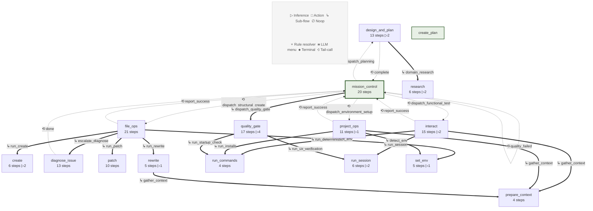

## System Context

**Ouroboros** is a flow-driven autonomous coding agent backed by LLMVP local inference.
It operates as a pure GraphQL client — all inference flows through `localhost:8008/graphql`.

### Actors
- **Shop Director (User)** — Sets missions, checks in periodically via CLI.
- **Junior Developer (Local Model)** — Runs continuously via LLMVP, follows structured flows.
- **Senior Developer (External API)** — Consulted on escalation (design pending).

### Subsystem Boundaries
- **Flow Engine** — Declarative CUE graphs with typed I/O and explicit transitions.
- **Effects Interface** — Swappable protocol for all side effects (file I/O, subprocess, inference, persistence).
- **Persistence** — File-backed JSON in `.agent/` with atomic writes.
- **LLMVP** — External GraphQL inference server (separate project).

### Flow Inventory
| Category | Count |
|----------|-------|
| Orchestrator flows | 2 |
| Task flows | 5 |
| Sub-flows | 8 |
| Other | 0 |
| **Total** | **15** |

## Mission Lifecycle

`mission_control` is the hub flow orchestrating the entire agent lifecycle.
Child task flows tail-call back to `mission_control` on completion, creating a continuous cycle.

### mission_control Steps

- □ **load_state** ⑂ — Load mission state and event queue
- □ **apply_last_result** ⑂ — Attach returning flow's directive report to goal
- □ **process_events** ⑂ — Process user messages, abort/pause signals
- □ **check_phase** ⑂ — Determine which pipeline phase to enter based on goal statuses
- ∅ **dispatch_planning**  — No architecture or goals — dispatch design_and_plan ⟲ → `design_and_plan`
- □ **structural_sweep_next** ⑂ — Find next incomplete structural goal in creation order
- ∅ **dispatch_structural_create**  — Create next file in dependency order ⟲ → `file_ops`
- ∅ **dispatch_structural_fix**  — Fix a structural file that failed its gate ⟲ → `file_ops`
- ∅ **dispatch_environment_setup**  — Install dependencies and verify tooling ⟲ → `project_ops`
- □ **functional_sweep_next** ⑂ — Find next incomplete functional goal
- □ **build_fix_target_menu** ⑂ — Build file menu for LLM fix target selection
- ∅ **resolve_fix_target** ☰ — LLM selects which file to fix based on diagnosis
- □ **apply_fix_target** ⑂ — Apply LLM-selected fix target to dispatch config
- ∅ **dispatch_functional_test**  — Test a functional capability via interact ⟲ → `interact`
- ∅ **dispatch_functional_fix**  — Fix a file identified by failed functional test ⟲ → `$ref:context.dispatch_config.flow`
- ↳ **dispatch_quality_gate** ⑂ — Final quality gate for mission completion
- ∅ **quality_failed**  — Quality gate failed — re-enter pipeline to find regressed goals ⟲ → `mission_control`
- □ **completed**  — Mark mission complete ◆ `completed`
- □ **idle**  — Wait for events ⟲ → `mission_control`
- □ **aborted**  — Mission aborted ◆ `aborted`

### Tail-Call Targets (flows that return to mission_control)

- `design_and_plan` → `mission_control` (from step `complete`)
- `diagnose_issue` → `mission_control` (from step `done`)
- `diagnose_issue` → `mission_control` (from step `failed`)
- `file_ops` → `mission_control` (from step `report_success`)
- `file_ops` → `mission_control` (from step `report_failure`)
- `file_ops` → `mission_control` (from step `report_diagnosed`)
- `file_ops` → `mission_control` (from step `report_bail`)
- `interact` → `mission_control` (from step `report_success`)
- `interact` → `mission_control` (from step `report_with_issues`)
- `interact` → `mission_control` (from step `failed`)
- `mission_control` → `mission_control` (from step `quality_failed`)
- `mission_control` → `mission_control` (from step `idle`)
- `project_ops` → `mission_control` (from step `report_success`)
- `project_ops` → `mission_control` (from step `failed`)

## Flow Catalog

### Orchestrator Flows

#### design_and_plan (v5)
*Design or reconcile project architecture, then derive project goals.
Goals are the plan — no separate task list. Auto-detects whether
full architecture design is needed (no architecture), reconciliation
is needed (drift detected), or goals can be derived directly.*

**Tier:** `mission_objective` · **Returns:** `architecture_updated`, `goals_derived`
**Peers:** `file_ops`, `project_ops`, `interact`
**Inputs:** ○ mission_id
**Terminal:** ◆ failed
**Publishes:** ● mission · ● project_manifest · ● repo_map_formatted · ● inference_response · ● architecture · ● research_summary · ● goals
**Sub-flows:** ↳ research
**Tail-calls:** ⟲ mission_control
**Effects:** ⟶ inference · 𓉗 list dir · →𓇴 load mission · push_note · →𓇴 read events · 𓉗 file read · 𓇴→ save mission
**Stats:** 13 steps · ▷ 2 inference · 11 ⑂ rule

**Prompts:**
- **design_initial** ▷ (t*0.2): Design project architecture from scratch
  Injects: {← context.mission_objective}, {← context.repo_map_formatted}, {← context.project_file_list}, {← context.existing_architecture}
- **design_reconcile** ▷ (t*0.2): Reconcile architecture with drifted codebase
  Injects: {← context.mission_objective}, {← context.repo_map_formatted}, {← context.project_file_list}, {← context.existing_architecture}

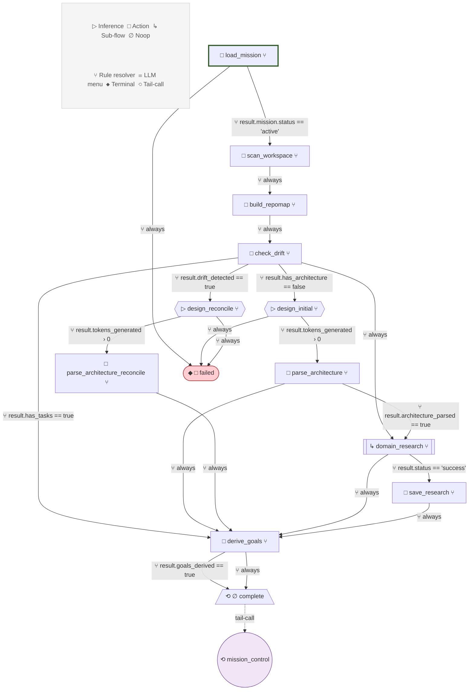

#### mission_control (v9)
*Deterministic pipeline. Computes the current phase from goal
statuses and dispatches the appropriate work without LLM routing.
Phases: plan → structural sweep → environment → functional sweep → quality gate.*

**Tier:** `project_goal` · **Returns:** `final_status`
**Inputs:** ○ mission_id · ◑ last_result · ◑ last_status · ◑ last_goal_id
**Terminal:** ◆ completed · ◆ aborted
**Publishes:** ● mission · ● events · ● dispatch_config · ● fix_target_options · ● diagnosis_context · ● selected_fix_target · ● quality_results
**Sub-flows:** ↳ quality_gate
**Tail-calls:** ⟲ $ref:context.dispatch_config.flow · ⟲ design_and_plan · ⟲ file_ops · ⟲ interact · ⟲ mission_control · ⟲ project_ops
**Effects:** clear_events · →𓇴 load mission · →𓇴 read events · 𓇴→ save mission
**Stats:** 20 steps · 9 ⑂ rule · 1 ☰ menu

```mermaid
flowchart TD
    %% mission_control v9

    subgraph Legend[" "]
        L1["▷ Inference  □ Action  ↳ Sub-flow  ∅ Noop"]
        L2["⑂ Rule resolver  ☰ LLM menu  ◆ Terminal  ⟲ Tail-call"]
    end
    style Legend fill:#f5f5f5,stroke:#ccc,stroke-width:1px
    style L1 fill:#f5f5f5,stroke:none,color:#555
    style L2 fill:#f5f5f5,stroke:none,color:#555

    load_state["□ load_state ⑂"]
    apply_last_result["□ apply_last_result ⑂"]
    process_events["□ process_events ⑂"]
    check_phase["□ check_phase ⑂"]
    dispatch_planning[/"⟲ ∅ dispatch_planning"\]
    structural_sweep_next["□ structural_sweep_next ⑂"]
    dispatch_structural_create[/"⟲ ∅ dispatch_structural_create"\]
    dispatch_structural_fix[/"⟲ ∅ dispatch_structural_fix"\]
    dispatch_environment_setup[/"⟲ ∅ dispatch_environment_setup"\]
    functional_sweep_next["□ functional_sweep_next ⑂"]
    build_fix_target_menu["□ build_fix_target_menu ⑂"]
    resolve_fix_target(["∅ resolve_fix_target ☰"])
    apply_fix_target["□ apply_fix_target ⑂"]
    dispatch_functional_test[/"⟲ ∅ dispatch_functional_test"\]
    dispatch_functional_fix[/"⟲ ∅ dispatch_functional_fix"\]
    dispatch_quality_gate[["↳ dispatch_quality_gate ⑂"]]
    quality_failed[/"⟲ ∅ quality_failed"\]
    completed(["◆ □ completed"])
    idle[/"⟲ □ idle"\]
    aborted(["◆ □ aborted"])

    style load_state stroke-width:3px,stroke:#2d5a27

    load_state -->|⑂ result.mission.status == 'active'| apply_last_result
    load_state -->|⑂ result.mission.status == 'paused'| idle
    load_state -->|⑂ result.mission.status == 'completed'| completed
    load_state -->|⑂ always| aborted
    apply_last_result -->|⑂ result.events_pending == true| process_events
    apply_last_result -->|⑂ result.needs_plan == true| dispatch_planning
    apply_last_result -->|⑂ always| check_phase
    process_events -->|⑂ result.abort_requested == true| aborted
    process_events -->|⑂ result.pause_requested == true| idle
    process_events -->|⑂ always| check_phase
    check_phase -->|⑂ result.phase == 'plan'| dispatch_planning
    check_phase -->|⑂ result.phase == 'structural'| structural_sweep_next
    check_phase -->|⑂ result.phase == 'environment'| dispatch_environment_setup
    check_phase -->|⑂ result.phase == 'functional'| functional_sweep_next
    check_phase -->|⑂ result.phase == 'quality'| dispatch_quality_gate
    check_phase -->|⑂ result.phase == 'complete'| completed
    check_phase -->|⑂ always| dispatch_planning
    tc_dispatch_planning(("⟲ design_and_plan"))
    style tc_dispatch_planning fill:#f0e6f6,stroke:#663399
    dispatch_planning -.->|tail-call| tc_dispatch_planning
    structural_sweep_next -->|⑂ result.sweep_complete == true| check_phase
    structural_sweep_next -->|⑂ result.needs_create == true| dispatch_structural_create
    structural_sweep_next -->|⑂ result.needs_fix == true| dispatch_structural_fix
    structural_sweep_next -->|⑂ always| check_phase
    tc_dispatch_structural_create(("⟲ file_ops"))
    style tc_dispatch_structural_create fill:#f0e6f6,stroke:#663399
    dispatch_structural_create -.->|tail-call| tc_dispatch_structural_create
    tc_dispatch_structural_fix(("⟲ file_ops"))
    style tc_dispatch_structural_fix fill:#f0e6f6,stroke:#663399
    dispatch_structural_fix -.->|tail-call| tc_dispatch_structural_fix
    tc_dispatch_environment_setup(("⟲ project_ops"))
    style tc_dispatch_environment_setup fill:#f0e6f6,stroke:#663399
    dispatch_environment_setup -.->|tail-call| tc_dispatch_environment_setup
    functional_sweep_next -->|⑂ result.sweep_complete == true| check_phase
    functional_sweep_next -->|⑂ result.needs_test == true| dispatch_functional_test
    functional_sweep_next -->|⑂ result.needs_fix == true| dispatch_functional_fix
    functional_sweep_next -->|⑂ result.needs_target_resolution == true| build_fix_target_menu
    functional_sweep_next -->|⑂ always| check_phase
    build_fix_target_menu -->|⑂ result.menu_built == true| resolve_fix_target
    build_fix_target_menu -->|⑂ always| check_phase
    apply_fix_target -->|⑂ result.target_applied == true| dispatch_functional_fix
    apply_fix_target -->|⑂ always| check_phase
    tc_dispatch_functional_test(("⟲ interact"))
    style tc_dispatch_functional_test fill:#f0e6f6,stroke:#663399
    dispatch_functional_test -.->|tail-call| tc_dispatch_functional_test
    tc_dispatch_functional_fix(("⟲ $ref:context.dispatch_config.flow"))
    style tc_dispatch_functional_fix fill:#f0e6f6,stroke:#663399
    dispatch_functional_fix -.->|tail-call| tc_dispatch_functional_fix
    dispatch_quality_gate -->|⑂ result.status == 'success'| completed
    dispatch_quality_gate -->|⑂ always| quality_failed
    tc_quality_failed(("⟲ mission_control"))
    style tc_quality_failed fill:#f0e6f6,stroke:#663399
    quality_failed -.->|tail-call| tc_quality_failed
    tc_idle(("⟲ mission_control"))
    style tc_idle fill:#f0e6f6,stroke:#663399
    idle -.->|tail-call| tc_idle

    style completed fill:#c8e6c9,stroke:#2d5a27
    style aborted fill:#ffcdd2,stroke:#b71c1c
```

### Task Flows

#### diagnose_issue (v9)
*Guided ReAct investigation. Opens a memoryful session, seeds it
with error context, then guides the model through: (1) file
selection from architecture modules, (2) symbol selection with
automatic cross-file tracing, (3) optional command execution.
Model decisions are constrained menus; evidence gathering is
deterministic. Does not modify files.*

**Tier:** `flow_directive` · **Returns:** `root_cause`, `fix_task_created`, `directive_report`
**Peers:** `file_ops`, `project_ops`
**Inputs:** ○ mission_id · ○ goal_id · ○ flow_directive · ◑ target_file_path · ◑ error_description · ◑ error_output · ◑ file_context · ◑ failed_attempts_context
**Publishes:** ● diagnosis_session_id · ● inference_session_id · ● investigation_turn · ● suspect_file · ● diagnosis_text · ● hypotheses · ● error_analysis · ● recommended_flow · ● diagnosis · ● fix_task_created (+1 more)
**Tail-calls:** ⟲ mission_control
**Effects:** end_inference_session · push_note · ⟶ inference · session_inference · start_inference_session
**Stats:** 13 steps · 10 ⑂ rule · 1 ☰ menu

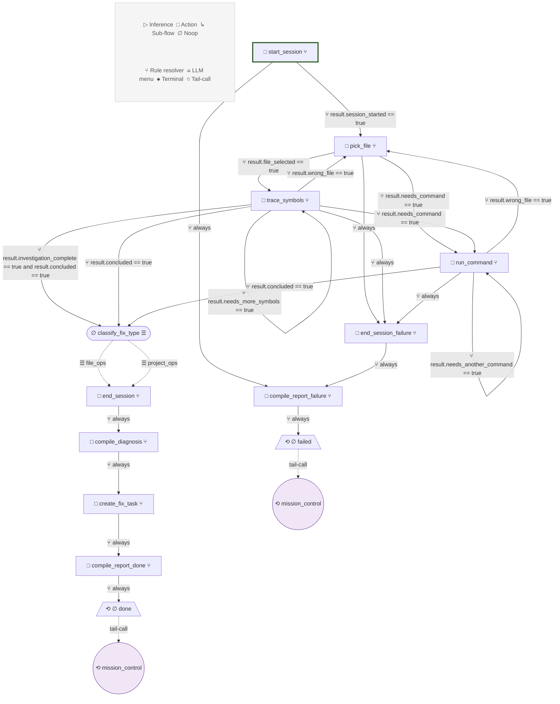

#### file_ops (v2)
*File operations lifecycle. Routes to create/patch/rewrite,
validates output, self-corrects on failure, reports to
mission_control via structured returns.*

**Tier:** `flow_directive` · **Returns:** `target_file`, `files_changed`, `write_action`, `edit_summary`, `validation`, `bail_reason`
**Inputs:** ○ mission_id · ○ goal_id · ○ target_file_path · ○ flow_directive · ◑ working_directory · ◑ file_context · ◑ mode · ◑ prompt_variant
**Publishes:** ● files_changed · ● target_file · ● edit_summary · ● bail_reason · ● validation_commands · ● validation_results · ● validation_output · ● directive_report
**Sub-flows:** ↳ create · ↳ patch · ↳ rewrite · ↳ set_env · ↳ rewrite · ↳ diagnose_issue
**Tail-calls:** ⟲ mission_control
**Effects:** push_note · 𓉗 file read · ⌘ command · ⟶ inference
**Stats:** 21 steps · 17 ⑂ rule

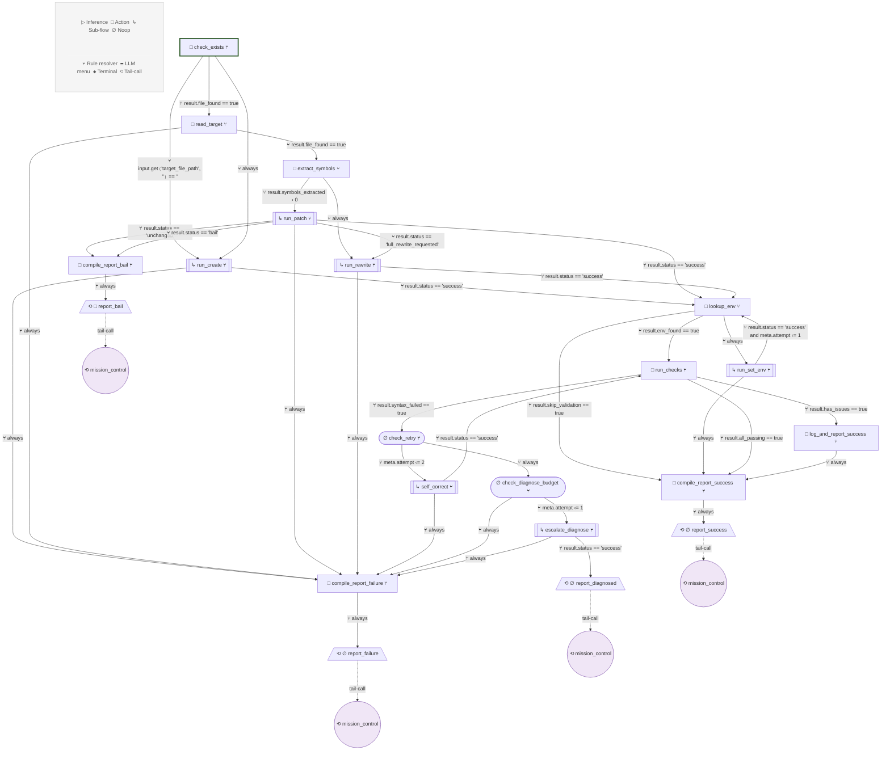

#### interact (v4)
*Route product interaction to the appropriate sub-flow.
Deterministic goals use run_commands + exit code evaluation (zero inference).
Exploratory goals use persona-driven run_session + inference evaluation.*

**Tier:** `flow_directive` · **Returns:** `terminal_output`, `commands_run`, `evaluation_result`, `directive_report`
**Inputs:** ○ mission_id · ○ goal_id · ○ flow_directive · ◑ working_directory · ◑ interaction_context · ◑ interaction_mode · ◑ run_command · ◑ interactive_prompt
**Publishes:** ● terminal_output · ● all_passed · ● project_manifest · ● repo_map_formatted · ● execution_persona · ● inference_session_id · ● inference_response · ● goal_met · ● directive_report
**Sub-flows:** ↳ run_commands · ↳ prepare_context · ↳ run_session
**Tail-calls:** ⟲ mission_control
**Effects:** end_inference_session · ⟶ inference
**Stats:** 15 steps · ▷ 2 inference · 12 ⑂ rule

**Prompts:**
- **plan_interaction** ▷ (t*0.4): Craft execution persona and session context
  Injects: {← context.project_file_list}, {← context.repo_map_formatted}, {← context.interaction_brief}, {← input.flow_directive}
- **evaluate_outcome** ▷ (t*0.2): Evaluate whether the product worked correctly
  Injects: {← context.terminal_output}, {← input.flow_directive}

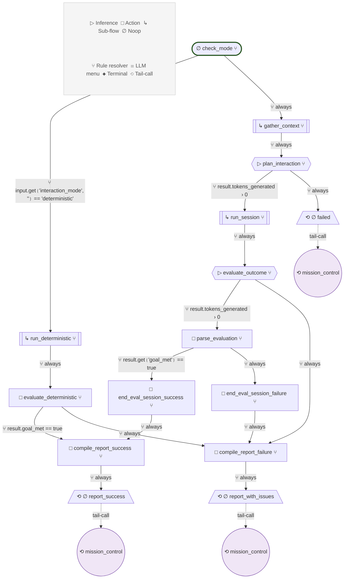

#### project_ops (v4)
*Initialize project tooling and structure. Creates config files,
directories, installs dependencies, and detects validation tooling.*

**Tier:** `flow_directive` · **Returns:** `setup_complete`, `files_changed`, `env_detected`, `directive_report`
**Inputs:** ○ mission_id · ○ goal_id · ○ flow_directive · ◑ working_directory · ◑ project_setup_context · ◑ setup_focus
**Publishes:** ● project_manifest · ● repo_map_formatted · ● inference_response · ● install_commands · ● all_passed · ● directive_report
**Sub-flows:** ↳ prepare_context · ↳ set_env · ↳ run_commands
**Tail-calls:** ⟲ mission_control
**Effects:** file_exists · ⟶ inference · 𓉗 file read · ⌘ command · 𓉗 file write
**Stats:** 11 steps · ▷ 1 inference · 9 ⑂ rule

**Prompts:**
- **plan_setup** ▷ (t*0.3): Determine what setup actions are needed
  Injects: {← context.project_file_list}, {← context.setup_brief}, {← input.flow_directive}, {← input.setup_focus}

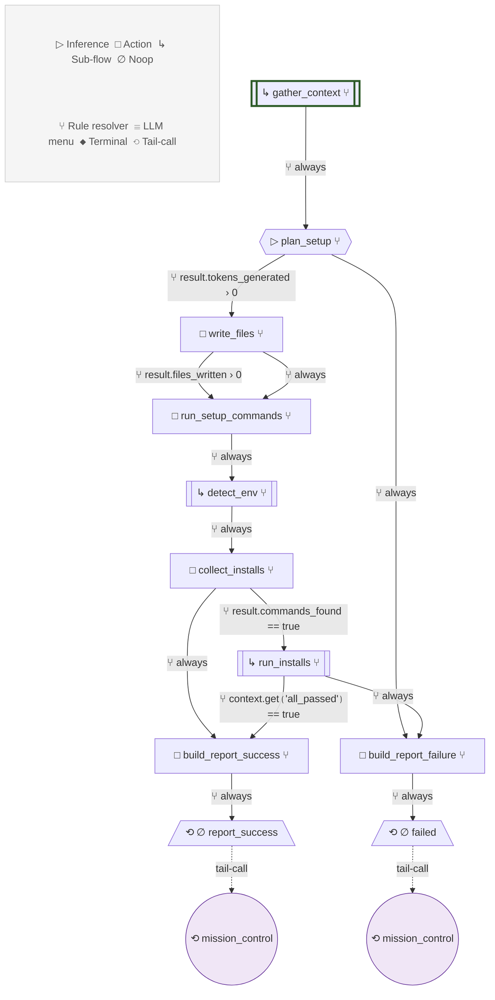

#### research (v2)
*Search for information and summarize into dense, actionable text.
The caller provides a specific research_query. This flow plans
search queries, executes them, and returns a summary.*

**Tier:** `session_task` · **Returns:** `summary`, `queries_run`, `results_found`
**Inputs:** ○ research_query · ◑ research_context · ◑ max_results
**Terminal:** ◆ success · ◆ empty
**Publishes:** ● inference_response · ● search_queries · ● raw_search_results · ● research_summary
**Effects:** ⟶ inference · mcp_call_tool · mcp_connect
**Stats:** 6 steps · ▷ 2 inference · 4 ⑂ rule

**Prompts:**
- **plan_queries** ▷ (t*0.2): Generate 2-3 targeted search queries from the research question
  Injects: {← input.research_query}, {← input.research_context}
- **summarize** ▷ (t*0.2): Distill search results into dense, actionable guidance
  Injects: {← context.raw_search_results}, {← input.research_query}, {← input.research_context}

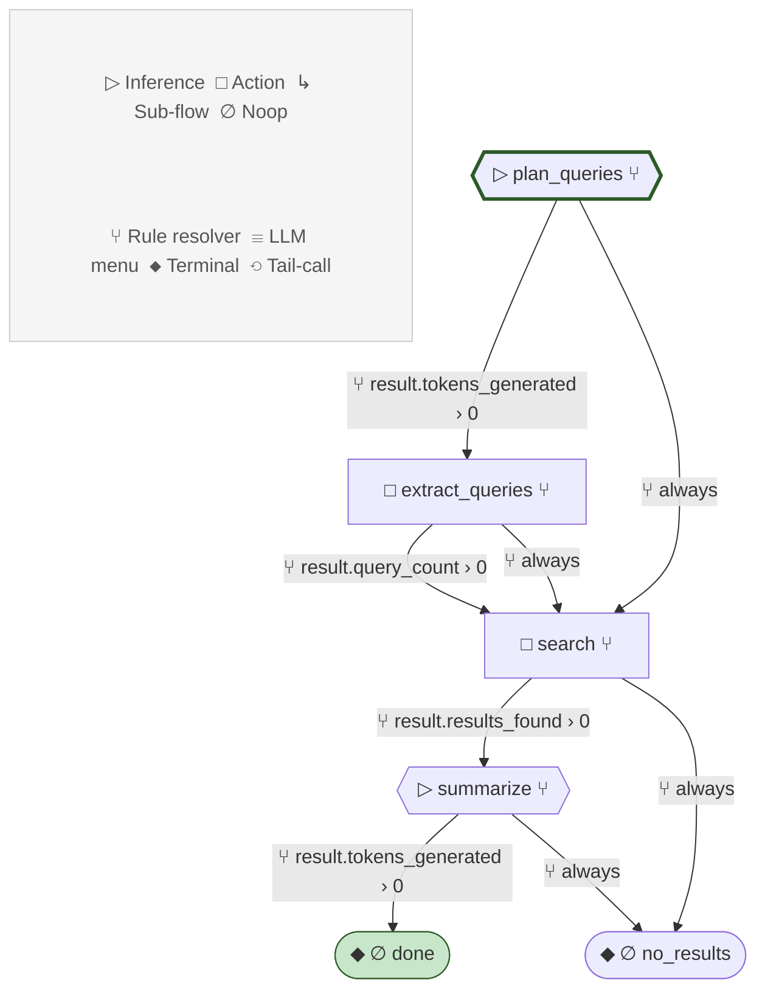

### Sub-flows

#### create (v2)
*Create a new source file. Uses file_context projection for
architecture-guided dependency content, generates content via
inference, writes to disk. Called by file_ops when the target
file does not exist.*

**Tier:** `session_task` · **Returns:** `files_changed`
**Inputs:** ○ mission_id · ○ goal_id · ○ target_file_path · ○ flow_directive · ◑ file_context · ◑ prompt_variant
**Terminal:** ◆ success · ◆ failed
**Publishes:** ● inference_response
**Effects:** ⟶ inference · 𓉗 file read · 𓉗 file write
**Stats:** 6 steps · ▷ 2 inference · 4 ⑂ rule

**Prompts:**
- **generate_content** ▷ (t*0.4): Generate file content
  Injects: {← context.file_excerpts}, {← context.architecture_spec}, {← context.data_contract_block}, {← input.flow_directive}, {← input.target_file_path}
- **generate_tests** ▷ (t*0.4): Generate test file content
  Injects: {← context.file_excerpts}, {← context.architecture_spec}, {← context.data_contract_block}, {← input.flow_directive}, {← input.target_file_path}

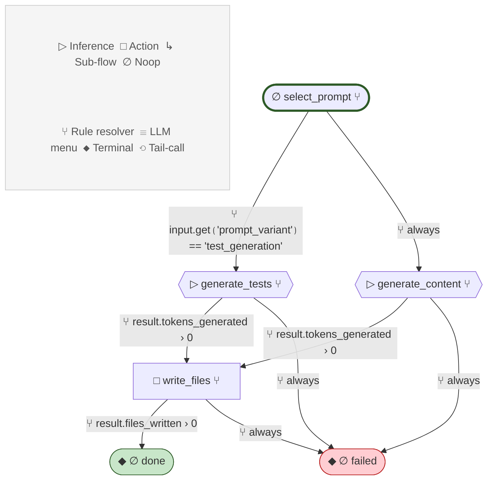

#### patch (v1)
*Surgical AST-aware editing. Presents symbols as a constrained
menu, rewrites each selected symbol in a memoryful inference
session. The most precise file operation available.*

**Tier:** `session_task` · **Returns:** `files_changed`, `edit_summary`, `bail_reason`
**Inputs:** ○ file_path · ○ file_content · ○ symbol_table · ○ symbol_menu_options · ○ flow_directive · ◑ mode · ◑ file_context · ◑ working_directory · ◑ validation_errors
**Terminal:** ◆ success · ◆ unchanged · ◆ full_rewrite_requested · ◆ bail · ◆ failed
**Publishes:** ● edit_session_id · ● selected_symbols · ● file_content · ● file_path · ● mode · ● selection_turn · ● rewrite_queue · ● current_symbol · ● file_content_updated · ● files_changed (+2 more)
**Effects:** end_inference_session · session_inference · start_inference_session · 𓉗 file write
**Stats:** 10 steps · 5 ⑂ rule

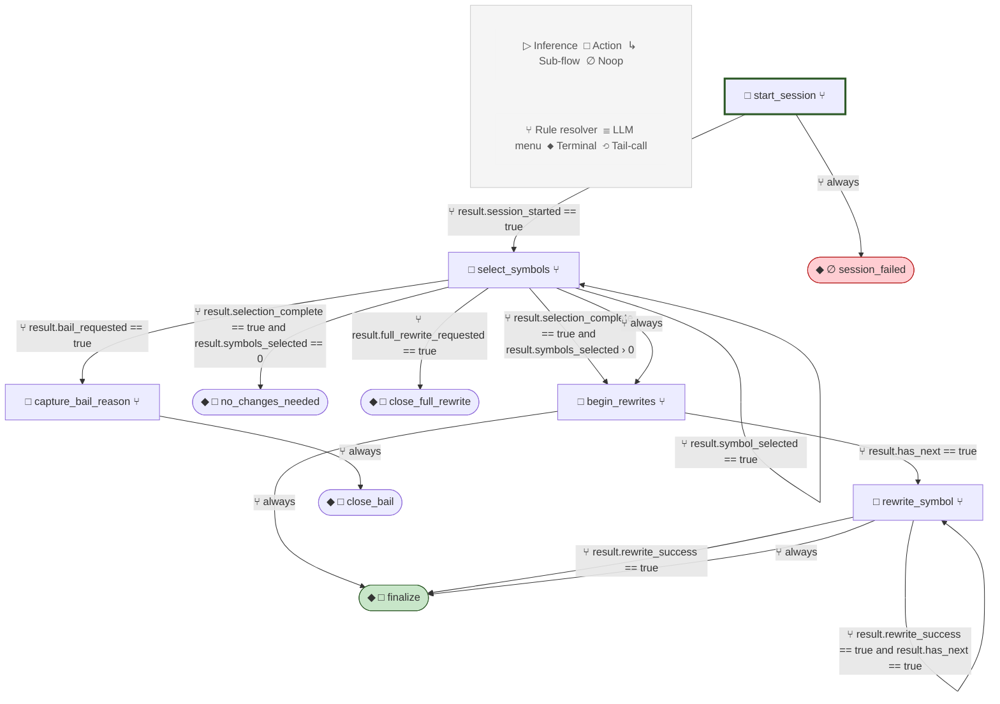

#### prepare_context (v4)
*Lightweight project scan. Walks the workspace to build a file
manifest and AST-based dependency map. Zero inference calls.
File content loading is handled by projection materializers
with architecture-guided selection.*

**Tier:** `session_task` · **Returns:** `project_manifest`, `repo_map_formatted`
**Inputs:** ○ working_directory · ○ task_description · ◑ target_file_path
**Terminal:** ◆ success
**Publishes:** ● project_manifest · ● repo_map_formatted
**Effects:** 𓉗 list dir · 𓉗 file read
**Stats:** 4 steps · 2 ⑂ rule

#### quality_gate (v5)
*Project-wide quality validation. Three-phase gate:
1. Deterministic checks — file scan, cross-file consistency, lint
2. Behavioral validation — run_commands (fast-fail), then
   run_session (UX verification, completion mode only)
3. Summary — LLM reviews all results and determines pass/fail*

**Tier:** `mission_objective` · **Returns:** `verdict`, `blocking_issues`, `check_results`, `terminal_output`, `dep_coverage`
**Inputs:** ○ working_directory · ○ mission_id · ◑ mission_objective · ◑ architecture_run_command · ◑ architecture · ◑ mode
**Terminal:** ◆ success · ◆ failed
**Publishes:** ● project_manifest · ● cross_file_summary · ● inference_response · ● validation_results · ● dep_check_imports · ● dep_check_manifest · ● dep_coverage_result · ● terminal_output · ● inference_session_id · ● ux_session_assessment (+1 more)
**Sub-flows:** ↳ run_commands · ↳ run_session
**Effects:** end_inference_session · ⟶ inference · 𓉗 list dir · push_note · 𓉗 file read · ⌘ command
**Stats:** 17 steps · ▷ 4 inference · 14 ⑂ rule

**Prompts:**
- **plan_checks** ▷ (t*0.0): LLM plans deterministic validation checks (imports, lint)
  Injects: {← context.project_listing}, {← input.working_directory}
- **analyze_deps** ▷ (t*0.0): LLM checks whether all imports are covered by declared dependencies
  Injects: {← context.dep_check_imports}, {← context.dep_check_manifest}
- **evaluate_ux_session** ▷ (t*0.2): Assess UX session — the model already has full context in KV cache
  Injects: {← input.mission_objective}
- **summarize** ▷ (t*0.1): Summarize all quality results into actionable findings
  Injects: {← context.validation_summary}, {← context.project_file_list}, {← context.cross_file_summary}, {← context.terminal_output}, {← context.ux_session_assessment} (+4 more)

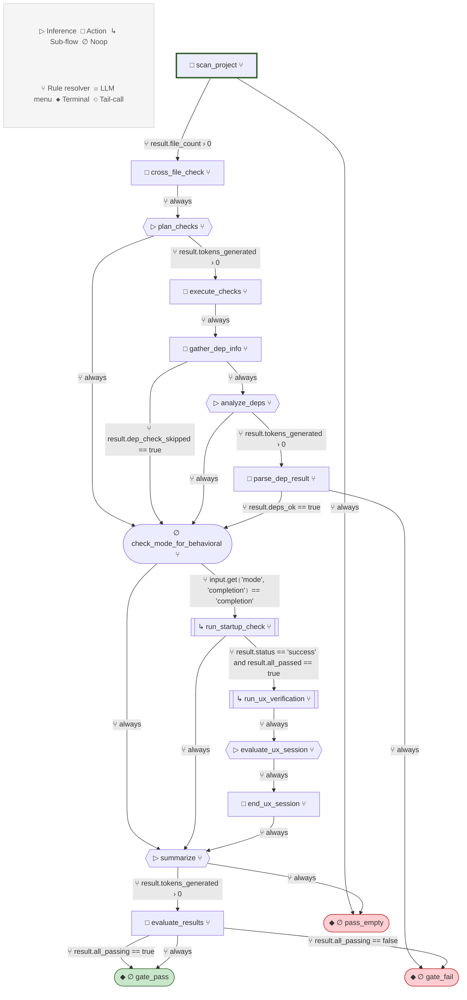

#### rewrite (v2)
*Replace an existing file's entire content via inference.
Uses file_context projection for target content and dependency
context. Generates a complete replacement and writes to disk.*

**Tier:** `session_task` · **Returns:** `files_changed`
**Inputs:** ○ mission_id · ○ goal_id · ○ target_file_path · ○ flow_directive · ◑ working_directory · ◑ file_context · ◑ validation_errors
**Terminal:** ◆ success · ◆ failed
**Publishes:** ● project_manifest · ● repo_map_formatted · ● inference_response
**Sub-flows:** ↳ prepare_context
**Effects:** ⟶ inference · 𓉗 file read · 𓉗 file write
**Stats:** 5 steps · ▷ 1 inference · 3 ⑂ rule

**Prompts:**
- **generate_rewrite** ▷ (t*0.3): Generate complete file replacement
  Injects: {← context.target_file_content}, {← context.file_excerpts}, {← context.architecture_spec}, {← context.data_contract_block}, {← input.flow_directive} (+2 more)

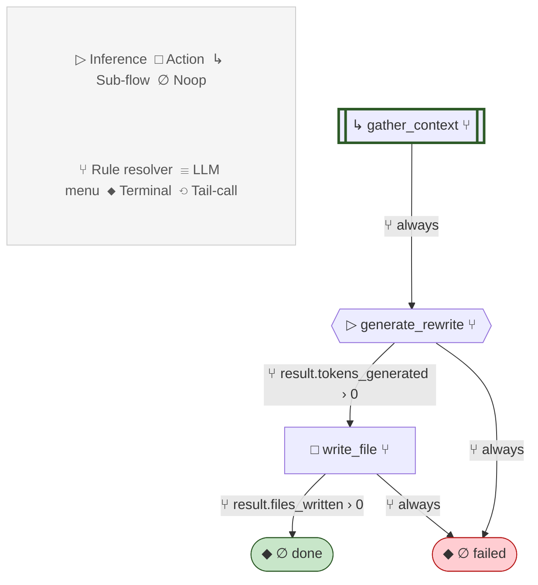

#### run_commands (v2)
*Execute shell commands deterministically via MCP terminal.
Start PTY session, run each command in sequence, capture output,
close. Zero inference.*

**Tier:** `session_task` · **Returns:** `output`, `exit_codes`, `all_passed`
**Inputs:** ○ commands · ○ working_directory · ◑ timeout · ◑ environment_vars · ◑ stop_on_error
**Terminal:** ◆ success · ◆ failed
**Publishes:** ● mcp_connection_id · ● mcp_session_id · ● terminal_output · ● exit_codes · ● all_passed
**Effects:** end_inference_session · mcp_call_tool · mcp_connect · start_inference_session
**Stats:** 4 steps · 2 ⑂ rule

#### run_session (v3)
*Interactive terminal session driven by an execution persona.
The model acts as a user — tries things, observes, adapts.
Multi-turn with memoryful inference session. Uses PTY via MCP
for true interactive program support.

The inference session is kept alive after the PTY closes so
the calling flow can run evaluation in the same KV cache context.
The caller is responsible for ending the inference session.*

**Tier:** `session_task` · **Returns:** `terminal_output`, `commands_run`, `inference_session_id`
**Inputs:** ○ execution_persona · ○ working_directory · ◑ environment_vars · ◑ expected_prompt
**Terminal:** ◆ success · ◆ failed
**Publishes:** ● mcp_connection_id · ● mcp_session_id · ● inference_session_id · ● session_history · ● inference_response · ● terminal_output
**Effects:** end_inference_session · ⟶ inference · mcp_call_tool · mcp_connect · start_inference_session
**Stats:** 6 steps · ▷ 2-3 inference · 3 ⑂ rule · 1 ☰ menu

**Prompts:**
- **plan_interaction** ▷ (t*0.6): Model decides what to do next — shell command, send input, or close
  Injects: {← context.session_history}, {← context.last_turn}, {← input.execution_persona}, {← input.session_context}
- **evaluate** ▷ (t*0.3): Model evaluates whether to continue exploring or close
  Injects: {← context.last_command_output}, {← context.turn_count}, {← input.execution_persona}

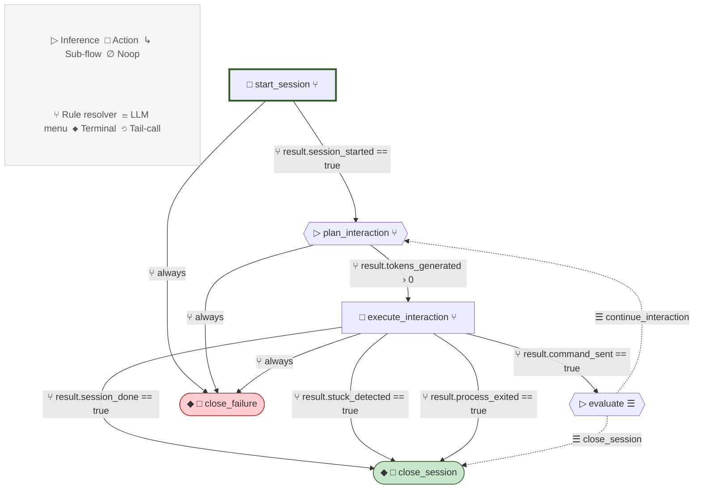

#### set_env (v2)
*Detect project validation tooling. Scans the project, makes one
inference call to determine language-appropriate syntax, lint,
and format commands, and persists to .agent/env.json.*

**Tier:** `session_task` · **Returns:** `env_detected`
**Inputs:** ○ working_directory · ○ mission_id · ◑ target_file_path
**Terminal:** ◆ success · ◆ failed
**Publishes:** ● project_manifest · ● inference_response · ● env_config
**Effects:** ⟶ inference · 𓉗 list dir · 𓉗 file read
**Stats:** 5 steps · ▷ 1 inference · 3 ⑂ rule

**Prompts:**
- **detect_tooling** ▷ (t*0.0): Infer validation commands for this project's languages
  Injects: {← context.project_file_list}, {← input.target_file_path}, {← input.working_directory}

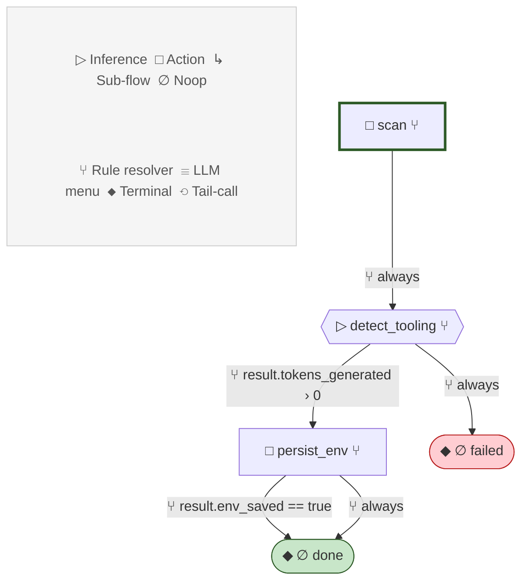

## Context Key Dictionary

| Key | Published By | Consumed By | Consumers | Audit Flags |
|-----|-------------|-------------|-----------|-------------|
| `all_passed` | `interact.run_deterministic`, `project_ops.run_installs`, `run_commands.execute_commands` | `interact.evaluate_deterministic`, `run_commands.close_session` | 2 | — |
| `architecture` | `design_and_plan.parse_architecture`, `design_and_plan.parse_architecture_reconcile` | `design_and_plan.derive_goals` | 1 | single_consumer |
| `bail_reason` | `file_ops.run_patch`, `patch.capture_bail_reason`, `patch.close_bail` | `file_ops.compile_report_failure`, `file_ops.compile_report_bail`, `file_ops.report_bail` (+1) | 4 | — |
| `cross_file_summary` | `quality_gate.cross_file_check` | `quality_gate.plan_checks`, `quality_gate.summarize` | 2 | single_consumer |
| `current_symbol` | `patch.begin_rewrites`, `patch.rewrite_symbol` | `patch.rewrite_symbol`, `patch.capture_bail_reason` | 2 | single_consumer |
| `dep_check_imports` | `quality_gate.gather_dep_info` | `quality_gate.analyze_deps` | 1 | single_consumer |
| `dep_check_manifest` | `quality_gate.gather_dep_info` | `quality_gate.analyze_deps` | 1 | single_consumer |
| `dep_coverage_result` | `quality_gate.parse_dep_result` |  | 0 | never_consumed |
| `diagnosis` | `diagnose_issue.compile_diagnosis` | `diagnose_issue.create_fix_task`, `diagnose_issue.compile_report_done` | 2 | single_consumer |
| `diagnosis_context` | `mission_control.build_fix_target_menu` | `mission_control.resolve_fix_target` | 1 | single_consumer |
| `diagnosis_session_id` | `diagnose_issue.start_session` | `diagnose_issue.pick_file`, `diagnose_issue.trace_symbols`, `diagnose_issue.run_command` | 3 | single_consumer |
| `diagnosis_text` | `diagnose_issue.trace_symbols`, `diagnose_issue.run_command` | `diagnose_issue.classify_fix_type`, `diagnose_issue.compile_diagnosis`, `diagnose_issue.compile_report_done` (+1) | 4 | single_consumer |
| `directive_report` | `diagnose_issue.compile_report_done`, `diagnose_issue.compile_report_failure`, `file_ops.compile_report_success` (+6) | `diagnose_issue.done`, `diagnose_issue.failed`, `file_ops.report_success` (+6) | 9 | — |
| `dispatch_config` | `mission_control.structural_sweep_next`, `mission_control.functional_sweep_next`, `mission_control.apply_fix_target` | `mission_control.dispatch_structural_create`, `mission_control.dispatch_structural_fix`, `mission_control.build_fix_target_menu` (+4) | 7 | single_consumer |
| `edit_session_id` | `patch.start_session` | `patch.select_symbols`, `patch.rewrite_symbol`, `patch.finalize` (+4) | 7 | single_consumer |
| `edit_summary` | `file_ops.run_patch`, `patch.finalize`, `patch.no_changes_needed` (+1) | `file_ops.compile_report_success`, `file_ops.report_success`, `file_ops.compile_report_bail` | 3 | single_consumer |
| `env_config` | `set_env.persist_env` |  | 0 | never_consumed |
| `error_analysis` | `diagnose_issue.trace_symbols`, `diagnose_issue.run_command` | `diagnose_issue.compile_diagnosis`, `diagnose_issue.create_fix_task` | 2 | single_consumer |
| `error_description` |  | `diagnose_issue.start_session`, `diagnose_issue.compile_diagnosis` | 2 | — |
| `error_output` |  | `diagnose_issue.start_session` | 1 | — |
| `events` | `mission_control.load_state` | `mission_control.apply_last_result`, `mission_control.process_events` | 2 | single_consumer |
| `execution_persona` | `interact.plan_interaction` |  | 0 | never_consumed |
| `exit_codes` | `run_commands.execute_commands` | `run_commands.close_session` | 1 | single_consumer |
| `failed_attempts_context` |  | `diagnose_issue.start_session` | 1 | — |
| `file_content` | `patch.start_session` | `patch.start_session`, `patch.rewrite_symbol`, `patch.capture_bail_reason` | 3 | single_consumer |
| `file_content_updated` | `patch.rewrite_symbol` | `patch.rewrite_symbol`, `patch.finalize` | 2 | single_consumer |
| `file_context` |  | `diagnose_issue.start_session`, `diagnose_issue.pick_file`, `diagnose_issue.trace_symbols` (+1) | 4 | — |
| `file_path` | `patch.start_session` | `patch.start_session`, `patch.rewrite_symbol`, `patch.finalize` (+1) | 4 | single_consumer |
| `files_changed` | `file_ops.run_create`, `file_ops.run_patch`, `file_ops.run_rewrite` (+2) | `file_ops.lookup_env`, `file_ops.compile_report_success`, `file_ops.report_success` (+4) | 7 | — |
| `fix_target_options` | `mission_control.build_fix_target_menu` | `mission_control.resolve_fix_target` | 1 | single_consumer |
| `fix_task_created` | `diagnose_issue.create_fix_task` | `diagnose_issue.compile_report_done` | 1 | single_consumer |
| `flow_directive` |  | `diagnose_issue.start_session`, `patch.start_session` | 2 | — |
| `goal_met` | `interact.parse_evaluation` |  | 0 | never_consumed |
| `goals` | `design_and_plan.derive_goals` |  | 0 | never_consumed |
| `hypotheses` | `diagnose_issue.trace_symbols`, `diagnose_issue.run_command` | `diagnose_issue.classify_fix_type`, `diagnose_issue.compile_diagnosis` | 2 | single_consumer |
| `inference_response` | `create.generate_content`, `create.generate_tests`, `design_and_plan.design_initial` (+11) | `create.write_files`, `design_and_plan.parse_architecture`, `design_and_plan.parse_architecture_reconcile` (+12) | 15 | conditionally_published |
| `inference_session_id` | `diagnose_issue.start_session`, `interact.run_session`, `quality_gate.run_ux_verification` (+3) | `diagnose_issue.classify_fix_type`, `diagnose_issue.end_session`, `diagnose_issue.end_session_failure` (+11) | 14 | — |
| `install_commands` | `project_ops.collect_installs` |  | 0 | never_consumed |
| `investigation_turn` | `diagnose_issue.start_session`, `diagnose_issue.pick_file`, `diagnose_issue.trace_symbols` (+1) | `diagnose_issue.pick_file`, `diagnose_issue.trace_symbols`, `diagnose_issue.run_command` | 3 | single_consumer |
| `last_goal_id` |  | `mission_control.apply_last_result` | 1 | — |
| `last_result` |  | `mission_control.apply_last_result` | 1 | — |
| `last_status` |  | `mission_control.apply_last_result` | 1 | — |
| `mcp_connection_id` | `run_commands.start_terminal`, `run_session.start_session` | `run_commands.execute_commands`, `run_commands.close_session`, `run_commands.close_failure` (+3) | 6 | — |
| `mcp_session_id` | `run_commands.start_terminal`, `run_commands.execute_commands`, `run_session.start_session` (+1) | `run_commands.execute_commands`, `run_commands.close_session`, `run_commands.close_failure` (+5) | 8 | — |
| `mission` | `design_and_plan.load_mission`, `design_and_plan.parse_architecture`, `design_and_plan.parse_architecture_reconcile` (+4) | `design_and_plan.check_drift`, `design_and_plan.design_initial`, `design_and_plan.design_reconcile` (+25) | 28 | — |
| `mode` | `patch.start_session` | `patch.start_session`, `patch.rewrite_symbol`, `patch.capture_bail_reason` | 3 | single_consumer |
| `project_manifest` | `design_and_plan.scan_workspace`, `interact.gather_context`, `prepare_context.scan_workspace` (+4) | `design_and_plan.check_drift`, `design_and_plan.design_initial`, `design_and_plan.design_reconcile` (+9) | 12 | — |
| `quality_results` | `mission_control.dispatch_quality_gate`, `quality_gate.evaluate_results` | `mission_control.quality_failed`, `mission_control.completed` | 2 | single_consumer |
| `raw_search_results` | `research.search` | `research.summarize` | 1 | single_consumer |
| `recommended_flow` | `diagnose_issue.classify_fix_type` | `diagnose_issue.compile_diagnosis` | 1 | single_consumer, conditionally_published |
| `repo_map_formatted` | `design_and_plan.build_repomap`, `interact.gather_context`, `prepare_context.build_repomap` (+2) | `design_and_plan.design_initial`, `design_and_plan.design_reconcile`, `interact.plan_interaction` (+2) | 5 | — |
| `research_summary` | `design_and_plan.domain_research`, `research.summarize` | `design_and_plan.save_research` | 1 | single_consumer |
| `rewrite_queue` | `patch.begin_rewrites`, `patch.rewrite_symbol` | `patch.rewrite_symbol`, `patch.capture_bail_reason` | 2 | single_consumer |
| `search_queries` | `research.extract_queries` | `research.search` | 1 | single_consumer |
| `selected_fix_target` | `mission_control.resolve_fix_target` | `mission_control.apply_fix_target` | 1 | single_consumer, conditionally_published |
| `selected_symbols` | `patch.start_session`, `patch.select_symbols` | `patch.select_symbols`, `patch.begin_rewrites`, `patch.finalize` | 3 | single_consumer |
| `selection_turn` | `patch.select_symbols` | `patch.select_symbols` | 1 | single_consumer |
| `session_history` | `run_session.start_session`, `run_session.execute_interaction` | `run_commands.close_session`, `run_commands.close_failure`, `run_session.plan_interaction` (+4) | 7 | — |
| `session_summary` |  | `interact.compile_report_success`, `interact.compile_report_failure`, `interact.report_success` (+5) | 8 | — |
| `setup_result` |  | `project_ops.build_report_success` | 1 | — |
| `suspect_file` | `diagnose_issue.pick_file` | `diagnose_issue.trace_symbols` | 1 | single_consumer |
| `symbol_menu_options` |  | `patch.start_session`, `patch.select_symbols` | 2 | — |
| `symbol_table` |  | `patch.start_session`, `patch.begin_rewrites` | 2 | — |
| `target_file` | `file_ops.read_target` | `file_ops.extract_symbols` | 1 | single_consumer |
| `target_file_path` |  | `design_and_plan.build_repomap`, `diagnose_issue.create_fix_task`, `prepare_context.build_repomap` | 3 | — |
| `terminal_output` | `interact.run_deterministic`, `interact.run_session`, `quality_gate.run_startup_check` (+4) | `interact.evaluate_deterministic`, `interact.evaluate_outcome`, `interact.compile_report_success` (+9) | 12 | — |
| `ux_session_assessment` | `quality_gate.evaluate_ux_session` | `quality_gate.summarize` | 1 | single_consumer |
| `validation_commands` | `file_ops.lookup_env` | `file_ops.run_checks` | 1 | single_consumer |
| `validation_errors` |  | `patch.start_session` | 1 | — |
| `validation_output` | `file_ops.run_checks` | `file_ops.escalate_diagnose` | 1 | single_consumer |
| `validation_results` | `file_ops.run_checks`, `quality_gate.execute_checks` | `file_ops.self_correct`, `file_ops.escalate_diagnose`, `file_ops.log_and_report_success` (+5) | 8 | — |
| `working_directory` |  | `patch.start_session` | 1 | — |

## Action Registry

| Action | Module | Effects Used | Referenced By |
|--------|--------|-------------|---------------|
| `apply_fix_target` | `agent.actions.mission_actions` | save_mission | `mission_control.apply_fix_target` |
| `apply_multi_file_changes` | `agent.actions.integration_actions` | read_file, write_file | `create.write_files`, `project_ops.write_files`, `rewrite.write_file` |
| `apply_quality_gate_results` | `agent.actions.refinement_actions` | push_note | `quality_gate.evaluate_results` |
| `attach_directive_report` | `agent.actions.reporting_actions` | save_mission | `mission_control.apply_last_result` |
| `build_and_query_repomap` | `agent.actions.research_actions` | list_directory, read_file | `design_and_plan.build_repomap`, `prepare_context.build_repomap` |
| `build_directive_report` | `agent.actions.reporting_actions` | — | `project_ops.build_report_success`, `project_ops.build_report_failure` |
| `build_fix_target_menu` | `agent.actions.mission_actions` | — | `mission_control.build_fix_target_menu` |
| `check_architecture_drift` | `agent.actions.mission_actions` | — | `design_and_plan.check_drift` |
| `check_dependency_coverage` | `agent.actions.pipeline_actions` | read_file | `quality_gate.gather_dep_info` |
| `check_pipeline_phase` | `agent.actions.mission_actions` | — | `mission_control.check_phase` |
| `close_edit_session` | `agent.actions.ast_actions` | end_inference_session | `patch.no_changes_needed`, `patch.close_full_rewrite`, `patch.close_bail` |
| `close_interactive_session` | `agent.actions.interactive_actions` | mcp_call_tool, end_inference_session | `run_commands.close_session`, `run_commands.close_failure`, `run_session.close_session` (+1) |
| `collect_env_field` | `agent.actions.pipeline_actions` | — | `project_ops.collect_installs` |
| `compile_diagnosis` | `agent.actions.diagnostic_actions` | — | `diagnose_issue.compile_diagnosis` |
| `compile_directive_report` | `agent.actions.reporting_actions` | run_inference | `diagnose_issue.compile_report_done`, `diagnose_issue.compile_report_failure`, `file_ops.compile_report_success` (+4) |
| `create_fix_task_from_diagnosis` | `agent.actions.diagnostic_actions` | push_note | `diagnose_issue.create_fix_task` |
| `derive_project_goals` | `agent.actions.mission_actions` | run_inference, save_mission | `design_and_plan.derive_goals` |
| `end_inference_session` | `agent.actions.interactive_actions` | end_inference_session | `diagnose_issue.end_session`, `diagnose_issue.end_session_failure`, `interact.end_eval_session_success` (+2) |
| `enter_idle` | `agent.actions.mission_actions` | — | `mission_control.idle` |
| `evaluate_deterministic_result` | `agent.actions.pipeline_actions` | — | `interact.evaluate_deterministic` |
| `exa_search` | `agent.actions.refinement_actions` | mcp_connect, mcp_call_tool | `research.search` |
| `execute_commands_batch` | `agent.actions.interactive_actions` | mcp_call_tool | `run_commands.execute_commands` |
| `execute_project_setup` | `agent.actions.refinement_actions` | file_exists, run_command, write_file | `project_ops.run_setup_commands` |
| `extract_search_queries` | `agent.actions.refinement_actions` | — | `research.extract_queries` |
| `extract_symbol_bodies` | `agent.actions.ast_actions` | — | `file_ops.extract_symbols` |
| `finalize_edit_session` | `agent.actions.ast_actions` | write_file, end_inference_session | `patch.finalize` |
| `finalize_mission` | `agent.actions.mission_actions` | save_mission | `mission_control.completed`, `mission_control.aborted` |
| `functional_sweep_next` | `agent.actions.mission_actions` | save_mission | `mission_control.functional_sweep_next` |
| `handle_events` | `agent.actions.mission_actions` | clear_events, save_mission | `mission_control.process_events` |
| `load_mission_state` | `agent.actions.mission_actions` | load_mission, read_events | `design_and_plan.load_mission`, `mission_control.load_state` |
| `log_completion` | `agent.actions.registry` | — | `design_and_plan.failed` |
| `log_validation_notes` | `agent.actions.pipeline_actions` | push_note | `file_ops.log_and_report_success` |
| `lookup_validation_env` | `agent.actions.pipeline_actions` | — | `file_ops.lookup_env` |
| `noop` | `agent.actions.registry` | — | — |
| `parse_and_store_architecture` | `agent.actions.mission_actions` | save_mission | `design_and_plan.parse_architecture`, `design_and_plan.parse_architecture_reconcile` |
| `parse_dep_check_result` | `agent.actions.pipeline_actions` | — | `quality_gate.parse_dep_result` |
| `parse_inference_json` | `agent.actions.pipeline_actions` | — | `interact.parse_evaluation` |
| `persist_validation_env` | `agent.actions.pipeline_actions` | — | `set_env.persist_env` |
| `pick_suspect_file` | `agent.actions.diagnosis_session_actions` | session_inference | `diagnose_issue.pick_file` |
| `prepare_next_rewrite` | `agent.actions.ast_actions` | — | `patch.begin_rewrites` |
| `push_note` | `agent.actions.refinement_actions` | push_note | `design_and_plan.save_research`, `file_ops.report_bail` |
| `read_files` | `agent.actions.registry` | read_file | `file_ops.check_exists`, `file_ops.read_target` |
| `rewrite_symbol_turn` | `agent.actions.ast_actions` | session_inference | `patch.rewrite_symbol`, `patch.capture_bail_reason` |
| `run_investigation_command` | `agent.actions.diagnosis_session_actions` | session_inference | `diagnose_issue.run_command` |
| `run_validation_checks` | `agent.actions.refinement_actions` | run_command | `quality_gate.execute_checks` |
| `run_validation_checks_from_env` | `agent.actions.pipeline_actions` | run_command | `file_ops.run_checks` |
| `scan_project` | `agent.actions.refinement_actions` | list_directory, read_file | `design_and_plan.scan_workspace`, `prepare_context.scan_workspace`, `quality_gate.scan_project` (+1) |
| `select_and_trace_symbols` | `agent.actions.diagnosis_session_actions` | session_inference | `diagnose_issue.trace_symbols` |
| `select_symbol_turn` | `agent.actions.ast_actions` | session_inference | `patch.select_symbols` |
| `send_interaction` | `agent.actions.interactive_actions` | mcp_call_tool | `run_session.execute_interaction` |
| `start_diagnosis_session` | `agent.actions.diagnosis_session_actions` | start_inference_session | `diagnose_issue.start_session` |
| `start_edit_session` | `agent.actions.ast_actions` | start_inference_session | `patch.start_session` |
| `start_interactive_session` | `agent.actions.interactive_actions` | mcp_connect, mcp_call_tool, start_inference_session | `run_commands.start_terminal`, `run_session.start_session` |
| `structural_sweep_next` | `agent.actions.mission_actions` | save_mission | `mission_control.structural_sweep_next` |
| `validate_cross_file_consistency` | `agent.actions.research_actions` | list_directory, read_file | `quality_gate.cross_file_check` |

## Step Templates

| Template | Action | Used By |
|----------|--------|---------|
| `cross_file_check` | `validate_cross_file_consistency` | `quality_gate.cross_file_check` |
| `execute_search` | `exa_search` | `research.search` |
| `extract_symbols` | `extract_symbol_bodies` | `file_ops.extract_symbols` |
| `gather_project_context` | `flow` | `interact.gather_context`, `project_ops.gather_context`, `rewrite.gather_context` |
| `load_mission` | `load_mission_state` | `design_and_plan.load_mission`, `mission_control.load_state` |
| `push_note` | `push_note` | `design_and_plan.save_research` |
| `read_target_file` | `read_files` | `file_ops.read_target` |
| `return_diagnosed` | `noop` | — |
| `return_failed` | `noop` | — |
| `return_success` | `noop` | — |
| `return_to_director` | `noop` | `diagnose_issue.done`, `diagnose_issue.failed`, `file_ops.report_success`, `file_ops.report_failure`, `file_ops.report_diagnosed` (+5) |
| `scan_workspace` | `scan_project` | `design_and_plan.scan_workspace`, `quality_gate.scan_project`, `set_env.scan` |
| `terminal_failure` | `noop` | `patch.session_failed`, `quality_gate.gate_fail`, `quality_gate.pass_empty` |
| `terminal_success` | `noop` | `prepare_context.empty_project`, `quality_gate.gate_pass` |
| `write_file` | `execute_file_creation` | — |
| `write_files` | `apply_multi_file_changes` | `create.write_files`, `project_ops.write_files`, `rewrite.write_file` |