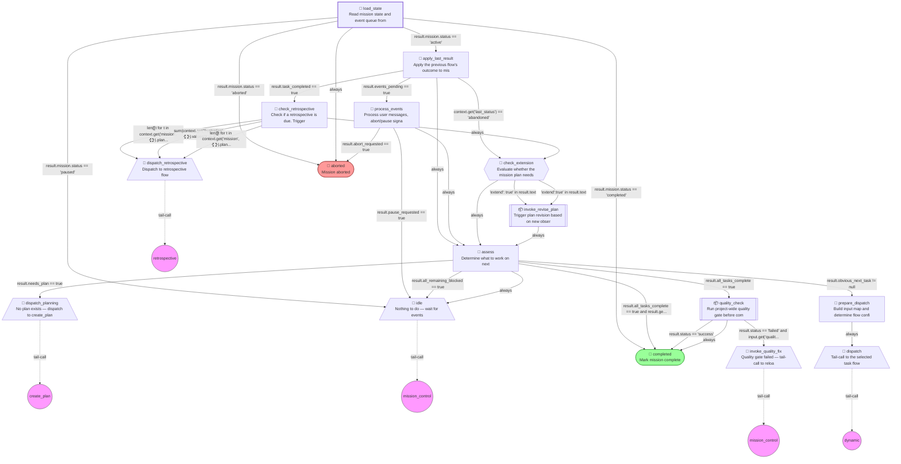

# Ouroboros Flow Diagrams

## mission_control

```mermaid
flowchart TD
    %% Flow: mission_control (v1)
    %% Top-level agent routing flow. Loads mission state, processes events, assesses pr

    load_state["🔵 load_state\nRead mission state and event queue from "]
    apply_last_result["🔵 apply_last_result\nApply the previous flow's outcome to mis"]
    check_retrospective["🔵 check_retrospective\nCheck if a retrospective is due. Trigger"]
    dispatch_retrospective[/"🚀 dispatch_retrospective\nDispatch to retrospective flow"\]
    process_events["🔵 process_events\nProcess user messages, abort/pause signa"]
    check_extension{{"🧠 check_extension\nEvaluate whether the mission plan needs "}}
    invoke_revise_plan[["📦 invoke_revise_plan\nTrigger plan revision based on new obser"]]
    assess["🔵 assess\nDetermine what to work on next"]
    quality_check[["📦 quality_check\nRun project-wide quality gate before com"]]
    invoke_quality_fix[/"🚀 invoke_quality_fix\nQuality gate failed — tail-call to reloa"\]
    prepare_dispatch["🔵 prepare_dispatch\nBuild input map and determine flow confi"]
    dispatch[/"🚀 dispatch\nTail-call to the selected task flow"\]
    dispatch_planning[/"🚀 dispatch_planning\nNo plan exists — dispatch to create_plan"\]
    completed(["🏁 completed\nMark mission complete"])
    idle[/"🚀 idle\nNothing to do — wait for events"\]
    aborted(["🏁 aborted\nMission aborted"])

    style load_state stroke-width:3px

    load_state -->|result.mission.status == 'active'| apply_last_result
    load_state -->|result.mission.status == 'paused'| idle
    load_state -->|result.mission.status == 'completed'| completed
    load_state -->|result.mission.status == 'aborted'| aborted
    load_state -->|always| aborted
    apply_last_result -->|result.events_pending == true| process_events
    apply_last_result -->|result.task_completed == true| check_retrospective
    apply_last_result -->|context.get⟮'last_status'⟯ == 'abandoned'| check_extension
    apply_last_result -->|always| assess
    check_retrospective -->|len⟮⟦t for t in context.get⟮'mission', ⦃⦄⟯.plan...| dispatch_retrospective
    check_retrospective -->|sum⟮context.get⟮'frustration', ⦃⦄⟯.values⟮⟯⟯ ›= 8| dispatch_retrospective
    check_retrospective -->|len⟮⟦t for t in context.get⟮'mission', ⦃⦄⟯.plan...| dispatch_retrospective
    check_retrospective -->|always| check_extension
    tc_dispatch_retrospective(("retrospective"))
    style tc_dispatch_retrospective fill:#f9f,stroke:#333
    dispatch_retrospective -..->|tail-call| tc_dispatch_retrospective
    process_events -->|result.abort_requested == true| aborted
    process_events -->|result.pause_requested == true| idle
    process_events -->|always| assess
    check_extension -->|'extend': true' in result.text| invoke_revise_plan
    check_extension -->|'extend':true' in result.text| invoke_revise_plan
    check_extension -->|always| assess
    invoke_revise_plan -->|always| assess
    assess -->|result.needs_plan == true| dispatch_planning
    assess -->|result.all_tasks_complete == true and result.ge...| completed
    assess -->|result.all_tasks_complete == true| quality_check
    assess -->|result.all_remaining_blocked == true| idle
    assess -->|result.obvious_next_task != null| prepare_dispatch
    assess -->|always| idle
    quality_check -->|result.status == 'success'| completed
    quality_check -->|result.status == 'failed' and input.get⟮'qualit...| invoke_quality_fix
    quality_check -->|always| completed
    tc_invoke_quality_fix(("mission_control"))
    style tc_invoke_quality_fix fill:#f9f,stroke:#333
    invoke_quality_fix -..->|tail-call| tc_invoke_quality_fix
    prepare_dispatch -->|always| dispatch
    tc_dispatch(("dynamic"))
    style tc_dispatch fill:#f9f,stroke:#333
    dispatch -..->|tail-call| tc_dispatch
    tc_dispatch_planning(("create_plan"))
    style tc_dispatch_planning fill:#f9f,stroke:#333
    dispatch_planning -..->|tail-call| tc_dispatch_planning
    tc_idle(("mission_control"))
    style tc_idle fill:#f9f,stroke:#333
    idle -..->|tail-call| tc_idle
    style completed fill:#9f9,stroke:#393
    style aborted fill:#f99,stroke:#933
```
